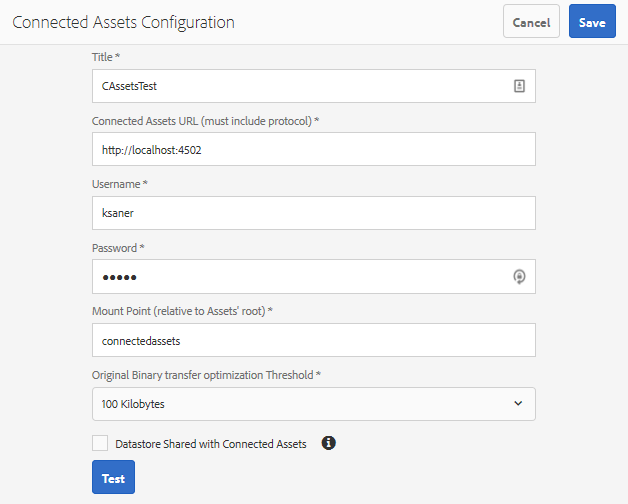

# Aangesloten middelen gebruiken om DAM-middelen te delen in AEM-sites {#use-connected-assets-to-share-dam-assets-in-aem-sites}

In grote ondernemingen kan de infrastructuur die nodig is om websites te maken, worden gedistribueerd. Soms bevinden de mogelijkheden voor het maken van websites en de digitale middelen die worden gebruikt om deze websites te maken zich in verschillende implementaties. Enkele redenen kunnen geografisch gespreide plaatsingen zijn die worden vereist om samen te werken; verwervingen die leiden tot heterogene infrastructuren die de moedermaatschappij wil consolideren; groei die leidt tot een zodanige schaal dat speciale instantie vereist is voor het beheer van bedrijfsmiddelen.

AEM Sites biedt mogelijkheden om webpagina&#39;s te maken en AEM Assets is het Digital Asset Management (DAM)-systeem dat de vereiste middelen voor websites levert. AEM biedt nu ondersteuning voor het bovenstaande gebruiksscenario door de integratie van AEM-sites en AEM-middelen.

## Overzicht van verbonden elementen {#overview-of-connected-assets}

Bij het bewerken van pagina&#39;s in de Pagina-editor kunnen de auteurs naadloos zoeken naar elementen van een andere implementatie van AEM-elementen, door deze elementen bladeren en ze insluiten. Een AEM-beheerder kan een eenmalige integratie uitvoeren van een lokale implementatie van AEM-sites met een andere (externe) implementatie van AEM-middelen.

Voor de Sites-auteurs zijn de externe elementen beschikbaar als alleen-lezen lokale elementen. De functionaliteit ondersteunt naadloos zoeken naar en gebruik van enkele externe middelen tegelijk. Als u veel externe middelen in één keer beschikbaar wilt maken voor lokale implementatie, kunt u overwegen de middelen in bulk te migreren. Zie [migratiegids](/help/assets/assets-migration-guide.md)voor middelen.

### Vereisten en ondersteunde implementaties {#prerequisites}

Zorg voor het volgende voordat u deze functie gebruikt of configureert:

* De gebruikers maken deel uit van aangewezen gebruikersgroepen op elke plaatsing.
* Voor de implementatietypen van Adobe Experience Manager is aan een van de ondersteunde criteria voldaan.

   |  | AEM Sites as a Cloud Service | AEM 6.5-sites op AMS | AEM 6.5-sites op locatie |
   |---|---|---|---|
   | **AEM Assets as a Cloud Service** | Ondersteund | Ondersteund | Ondersteund |
   | **AEM 6.5-activa op AMS** | Niet ondersteund | Ondersteund | Ondersteund |
   | **AEM 6.5 Activa op locatie** | Niet ondersteund | Niet ondersteund | Niet ondersteund |

### Ondersteunde bestandsindelingen {#mimetypes}

Auteurs kunnen naar afbeeldingen en de volgende typen documenten zoeken in de Inhoudszoeker en de gezochte elementen gebruiken in de Pagina-editor. Documenten kunnen aan de `Download` component worden toegevoegd en afbeeldingen kunnen aan de `Image` component worden toegevoegd. Auteurs kunnen ook de externe elementen toevoegen in elke aangepaste AEM-component die de standaard `Download` of `Image` componenten uitbreidt.

De ondersteunde lijst met indelingen is:

* **Afbeeldingsindelingen**: De afbeeldingsindelingen die door de [component](https://docs.adobe.com/content/help/en/experience-manager-core-components/using/components/image.html) Image worden ondersteund, worden ondersteund. Dynamische mediacomponenten worden niet ondersteund.
* **Documentindelingen**: Zie Ondersteunde documentindelingen [voor](file-format-support.md#supported-document-formats)Connected Assets.

### Betrokken gebruikers en groepen {#users-and-groups-involved}

De diverse rollen die betrokken zijn om het vermogen en hun overeenkomstige gebruikersgroepen te vormen en te gebruiken worden hieronder beschreven. Het lokale bereik wordt gebruikt voor het geval waarin een webpagina wordt gemaakt door een auteur. Het externe bereik wordt gebruikt voor de DAM-implementatie die de vereiste middelen host. De auteur van Sites haalt deze externe elementen op.

| Rol | Toepassingsgebied | Gebruikersgroep | Gebruikersnaam in doorloop | Vereiste |
|----------------------------------|--------|------------------------------------------------------------------------------|--------------------------|--------------------------------------------------------------------------------------------------------------------------------------------------------------------------------------------------------------------------------------------------------------|
| AEM-sitebeheerder | Lokaal | AEM-beheerder | `admin` | Stel AEM in en configureer integratie met de implementatie van externe middelen. |
| DAM-gebruiker | Lokaal | Author | `ksaner` | Wordt gebruikt om de opgehaalde elementen te bekijken en te dupliceren bij `/content/DAM/connectedassets/`. |
| AEM Sites-auteur | Lokaal | Auteur (met lees toegang op verre DAM en auteurstoegang op lokale Plaatsen) | `ksaner` | Eindgebruiker is Sites-auteur die deze integratie gebruikt om de snelheid van de inhoud te verbeteren. De auteurs zoeken naar elementen in externe DAM en bladeren deze door middel van Content Finder en gebruiken de vereiste afbeeldingen op lokale webpagina&#39;s. De referenties van de `ksaner` DAM-gebruiker worden gebruikt. |
| AEM-middelenbeheerder | Extern | AEM-beheerder | `admin` op externe AEM | Configureer Resource Sharing (CORS) voor meerdere bronnen. |
| DAM-gebruiker | Extern | Author | `ksaner` op externe AEM | Auteurrol bij de externe AEM-implementatie. Zoek en blader middelen in Verbonden Middelen gebruikend de Vinder van de Inhoud. |
| DAM-distributeur (technische gebruiker) | Extern | pakketontwikkelaars en siteauteurs | `ksaner` op externe AEM | Deze gebruiker die aanwezig is op de externe implementatie, wordt gebruikt door de lokale AEM-server (niet door de rol van de auteur van de site) om de externe middelen op te halen namens de auteur van Sites. Deze rol is niet het zelfde als boven twee `ksaner` rollen en behoort tot een verschillende gebruikersgroep. |

## Een verbinding tussen de plaatsingen van Plaatsen en van Activa vormen {#configure-a-connection-between-sites-and-assets-deployments}

Een AEM-beheerder kan deze integratie maken. Zodra gecreeerd, worden de toestemmingen die worden vereist om het te gebruiken gevestigd via gebruikersgroepen die op de plaatsing van Plaatsen en op de plaatsing DAM worden bepaald.

Voer de volgende stappen uit om Connected Assets en de lokale Sites-connectiviteit te configureren.

1. Heb toegang tot een bestaande plaatsing van Plaatsen AEM of creeer een plaatsing gebruikend het volgende bevel:

   1. Voer in de map van het JAR-bestand de volgende opdracht uit op een terminal om elke AEM-server te maken.
      `java -XX:MaxPermSize=768m -Xmx4096m -jar <quickstart jar filepath> -r samplecontent -p 4502 -nofork -gui -nointeractive &`

   1. Na een paar minuten wordt de AEM-server gestart. U kunt de implementatie van deze AEM-sites beschouwen als de lokale computer voor het ontwerpen van webpagina&#39;s, bijvoorbeeld op `https://[local_sites]:4502`.

1. Ervoor zorgen dat de gebruikers en rollen met lokaal bereik bestaan op de implementatie van AEM-sites en op de implementatie van AEM-middelen op AMS. Creeer een technische gebruiker op de plaatsing van Activa en voeg aan de gebruikersgroep toe die in betrokken gebruikers en groepen wordt vermeld.

1. Heb toegang tot de lokale plaatsing van Plaatsen AEM bij `https://[local_sites]:4502`. Klik op **[!UICONTROL Gereedschappen]** > **[!UICONTROL Middelen]** > Configuratie **** Verbonden elementen en voer de volgende waarden in:

   1. De locatie van AEM-middelen is `https://[assets_servername_ams]:[port]`.
   1. Referenties van een DAM-distributeur (technische gebruiker).
   1. Voer in het veld **[!UICONTROL Onderkoppelpunt]** het lokale AEM-pad in waar AEM de elementen ophaalt. Bijvoorbeeld `remoteassets` map.

   1. Pas de waarden van de **[!UICONTROL Originele Binaire Drempel]** van de overdrachtoptimalisering afhankelijk van uw netwerk aan. Een elementuitvoering met een grootte die groter is dan deze drempel, wordt asynchroon overgedragen.
   1. Selecteer **[!UICONTROL Datastore die met Verbonden activa]** wordt gedeeld, als u een datastore gebruikt om uw activa op te slaan en de Datastore is de gemeenschappelijke opslag tussen beide plaatsingen AEM. In dit geval is de drempelwaarde niet van belang, aangezien de werkelijke binaire activa op de datastore liggen en niet worden overgedragen.
   

   *Afbeelding:Een typische configuratie voor Connected Assets*

1. Als de elementen al zijn verwerkt en de uitvoeringen zijn opgehaald, schakelt u de draagraketten voor de workflow uit. Pas de startconfiguraties op de lokale implementatie (AEM-sites) aan om de `connectedassets` map uit te sluiten waarin de externe middelen worden opgehaald.

   1. Klik op de implementatie van AEM-sites op **[!UICONTROL Gereedschappen]** > **[!UICONTROL Workflow]** > **[!UICONTROL Launchers]**.

   1. Zoeken naar opstarters met workflows als **[!UICONTROL DAM Update Asset]** en **[!UICONTROL DAM Metadata Writeback]**.

   1. Selecteer de werkstroomstartprogramma en klik op **[!UICONTROL Eigenschappen]** op de actiebalk.

   1. Wijzig in de wizard Eigenschappen de velden **[!UICONTROL Pad]** als de volgende toewijzingen om de reguliere expressies bij te werken, zodat de **[!UICONTROL gekoppelde elementen]** voor het koppelingspunt niet worden opgenomen.
   | Voor | Na |
   |---|---|
   | /content/dam(/(?!/subassets).*/)renditions/original | /content/dam(/(?!/subassets)(?!connectedassets).*/)renditions/original |
   | /content/dam(/.*/)renditions/original | /content/dam(/(?!connectedassets).*/)renditions/original |
   | /content/dam(/.*)/jcr:content/metadata | /content/dam(/(?!connectedassets).*/)jcr:content/metadata |

   >[!NOTE]
   >
   >Alle uitvoeringen die beschikbaar zijn op de externe AEM-implementatie worden opgehaald, wanneer auteurs middelen ophalen. Als u meer vertoningen van een opgehaald middel wilt tot stand brengen, sla deze configuratiestap over. De DAM Update Asset-workflow wordt geactiveerd en er worden meer uitvoeringen gemaakt. Deze vertoningen zijn beschikbaar slechts op de lokale plaatsing van Plaatsen en niet op de verre plaatsing DAM.

1. Voeg de instantie AEM-sites toe als een van de **[!UICONTROL toegestane oorsprong]** in de CORS-configuratie van de externe AEM-middelen.

   1. Meld u aan met de beheerdersreferenties. Zoeken naar kruisoorsprong. Ga naar **[!UICONTROL Gereedschappen]** > **[!UICONTROL Bewerkingen]** > **[!UICONTROL Webconsole]**.

   1. Als u een CORS-configuratie voor de instantie AEM Sites wilt maken, klikt u op het pictogram  naast **[!UICONTROL Adobe Granite Cross-Origin Resource Sharing Policy]**.

   1. Voer in het veld Oorsprong **** toegestaan de URL van de lokale sites in, dat wil zeggen `https://[local_sites]:[port]`. Sla de configuratie op.

## Externe elementen gebruiken {#use-remote-assets}

De auteurs van de website maken gebruik van Content Finder om verbinding te maken met de DAM-instantie. De auteurs kunnen de externe elementen in een component zoeken en slepen. Om aan verre DAM voor authentiek te verklaren, houd de geloofsbrieven van de gebruiker DAM die door uw beheerder handig wordt verstrekt.

Auteurs kunnen de middelen die beschikbaar zijn op zowel de lokale DAM-instantie als de externe DAM-instantie, in één webpagina gebruiken. Gebruik de Inhoudszoeker om te schakelen tussen het zoeken van de lokale DAM of het zoeken van de externe DAM.

Alleen de tags met externe elementen worden opgehaald met een exacte corresponderende tag, met dezelfde taxonomihiërarchie, die beschikbaar is in de lokale Sites-instantie. Alle andere tags worden verwijderd. Auteurs kunnen op externe middelen zoeken met alle tags die zich op de externe AEM-implementatie bevinden, aangezien AEM een volledige-tekstzoekopdracht biedt.

### Doorloop van het gebruik {#walk-through-of-usage}

Gebruik bovenstaande instellingen om te proberen te begrijpen hoe de functionaliteit werkt. Gebruik documenten of afbeeldingen van uw keuze op de externe DAM-implementatie.

1. Navigeer naar de interface Middelen op de externe implementatie door **[!UICONTROL Middelen]** > **[!UICONTROL Bestanden]** te openen vanuit de AEM-werkruimte. U kunt ook toegang krijgen `https://[assets_servername_ams]:[port]/assets.html/content/dam` in een browser. Upload de elementen van uw keuze.
1. Voor de instantie van Plaatsen, in de profielactivator in de hoger-juiste hoek, **[!UICONTROL imiteert de klik als]**. Geef `ksaner` de gebruikersnaam op, selecteer de opgegeven optie en klik op **[!UICONTROL OK]**.
1. Open een websitepagina Web.Retail op **[!UICONTROL Sites]** > **[!UICONTROL We.Retail]** > **[!UICONTROL us]** > **[!UICONTROL en]**. Bewerk de pagina. U kunt ook een pagina bewerken `https://[aem_server]:[port]/editor.html/content/we-retail/us/en/men.html` in een browser.

   Klik op Zijpaneel **[!UICONTROL in-/]** uitschakelen in de linkerbovenhoek van de pagina.

1. Open het tabblad Middelen en klik op **[!UICONTROL Aanmelden bij Connected Assets]**.
1. Geef de gegevens op — `ksaner` als gebruikersnaam en `password` als wachtwoord. Deze gebruiker heeft auteurstoestemmingen op beide plaatsingen AEM.
1. Zoek naar de middelen die u aan DAM hebt toegevoegd. De externe elementen worden weergegeven in het linkerdeelvenster. Filter voor afbeeldingen of documenten en filter verder voor typen ondersteunde documenten. Sleep de afbeeldingen naar een `Image` component en documenten naar een `Download` component.

   De opgehaalde elementen zijn alleen-lezen op de lokale implementatie van AEM-sites. U kunt nog steeds de opties gebruiken die door de componenten van uw AEM-sites worden geboden om het opgehaalde element te bewerken. Het bewerken door componenten is niet-destructief.

   

   *Afbeelding: Opties voor het filteren van documenttypen en afbeeldingen bij het zoeken van elementen op externe DAM*

1. De auteur van een site krijgt een melding als een element asynchroon wordt opgehaald en als een haaltaak mislukt. Tijdens het ontwerpen of zelfs na het ontwerpen kunnen de auteurs gedetailleerde informatie zien over het ophalen van taken en fouten in de gebruikersinterface van [asynchrone taken](/help/assets/asynchronous-jobs.md) .

   

   *Afbeelding: Melding van het asynchroon ophalen van elementen die op de achtergrond plaatsvinden.*

1. Bij het publiceren van een pagina wordt in AEM een volledige lijst met elementen weergegeven die in de pagina worden gebruikt. Zorg ervoor dat de externe middelen op het moment van publicatie zijn opgehaald. Als u de status van elk opgehaald element wilt controleren, raadpleegt u de gebruikersinterface voor [asynchrone taken](/help/assets/asynchronous-jobs.md) .

   >[!NOTE]
   >
   >Zelfs als een of meer externe elementen niet worden opgehaald, wordt de pagina gepubliceerd. De component die het externe element gebruikt, is leeg gepubliceerd. In het AEM-systeemvak wordt een melding weergegeven voor fouten die worden weergegeven op de pagina met asynchrone taken.

>[!CAUTION]
>
>Zodra gebruikt in een Web-pagina, zijn de opgehaalde verre activa doorzoekbaar en bruikbaar door iedereen die toestemmingen heeft om tot de lokale omslag toegang te hebben waar de opgehaalde activa (`connectedassets` in de bovengenoemde looppas-door) worden opgeslagen. De middelen zijn ook doorzoekbaar en zichtbaar in de lokale gegevensopslagruimte via [!UICONTROL Content Finder].

De opgehaalde elementen kunnen worden gebruikt als elk ander lokaal element, behalve dat de bijbehorende metagegevens niet kunnen worden bewerkt.

## Beperkingen {#limitations}

**Machtigingen en elementen beheren**

* Lokale elementen worden niet gesynchroniseerd met de oorspronkelijke elementen op de externe implementatie. Eventuele bewerkingen, verwijderingen of intrekkingen van machtigingen voor de DAM-implementatie worden niet verderop in de DAM-implementatie doorgegeven.
* Lokale elementen zijn alleen-lezen kopieën. AEM-componenten bewerken niet-destructieve elementen. Andere bewerkingen zijn niet toegestaan.
* Lokaal opgehaalde elementen zijn alleen beschikbaar voor ontwerpdoeleinden. Workflows voor bijwerken van middelen kunnen niet worden toegepast en metagegevens kunnen niet worden bewerkt.
* Alleen afbeeldingen en de vermelde documentindelingen worden ondersteund. Dynamische media-elementen, Content Fragments en Experience Fragments worden niet ondersteund.
* Metagegevensschema&#39;s worden niet opgehaald.
* Alle Sites-auteurs hebben leesmachtigingen voor de opgehaalde kopieën, zelfs als zij geen toegang hebben tot de externe DAM-implementatie.
* Geen API-ondersteuning om de integratie aan te passen.
* De functionaliteit ondersteunt naadloos zoeken en gebruiken van externe middelen. Als u veel externe middelen in één keer beschikbaar wilt maken voor lokale implementatie, kunt u overwegen om de middelen te migreren. Zie [migratiegids](assets-migration-guide.md)voor middelen.
* U kunt een extern element niet als miniatuur voor een webpagina gebruiken op het tabblad [!UICONTROL Miniatuur] in [!UICONTROL Pagina-eigenschappen] door op Afbeelding selecteren te klikken.

**Instellen en licenties verlenen**

* AEM Assets-implementatie op AMS wordt ondersteund.
* AEM-sites kunnen tegelijk verbinding maken met één AEM-middelenopslagplaats.
* Een licentie voor AEM Assets die werkt als externe opslagruimte.
* Een of meer licenties van AEM-sites die als lokale ontwerpimplementatie werken.

**Gebruik**

* Alleen de ondersteunde functionaliteit zoekt naar externe elementen en sleept de externe elementen op de lokale pagina naar de inhoud van de auteur.
* De gebruikstijden van de vangverrichting uit na 5 seconden. De auteurs kunnen kwesties hebben die activa halen, bijvoorbeeld als er netwerkkwesties zijn. Auteurs kunnen opnieuw proberen door het externe element van de [!UICONTROL Content Finder] naar de [!UICONTROL Page Editor]te slepen.
* Eenvoudige bewerkingen die niet-destructief zijn en de bewerking die wordt ondersteund via de AEM- `Image` component, kunnen worden uitgevoerd op opgehaalde elementen. Elementen zijn alleen-lezen.

## Problemen oplossen {#troubleshoot}

Voer de volgende stappen uit om problemen op te lossen voor de algemene foutscenario&#39;s:

* Als u niet naar externe middelen kunt zoeken in de Inhoudszoeker, controleert u opnieuw of de vereiste rollen en machtigingen aanwezig zijn.
* Middelen die vanaf een afgelegen stuwdam zijn opgehaald, mogen om de volgende redenen niet op een webpagina worden gepubliceerd: het bestaat niet op ver; het ontbreken van de juiste machtigingen om het op te halen; netwerkfout. Zorg ervoor dat het element niet wordt verwijderd van de externe DAM of dat de machtigingen niet worden gewijzigd; ervoor zorgen dat aan passende voorwaarden wordt voldaan; voeg het element opnieuw aan de pagina toe en publiceer het opnieuw. Controleer de [lijst met asynchrone taken](/help/assets/asynchronous-jobs.md) op fouten bij het ophalen van elementen.
