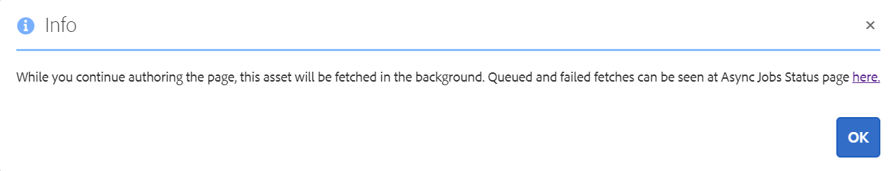

# Aangesloten middelen gebruiken om DAM-elementen te delen in [!DNL Experience Manager Sites] {#use-connected-assets-to-share-dam-assets-in-aem-sites}

In grote ondernemingen is de infrastructuur voor het maken van websites soms gedistribueerd. Soms zijn de functies en de digitale assets voor het maken van websites opgenomen in verschillende implementaties. Één reden kan geografisch verdeeld bestaande plaatsingen zijn die worden vereist om samen te werken. Een andere reden kunnen acquisities zijn die leiden tot heterogene infrastructuren die de moedermaatschappij samen wil gebruiken.

Gebruikers kunnen webpagina&#39;s maken in [!DNL Experience Manager Sites]. [!DNL Experience Manager Assets] is het DAM-systeem (Digital Asset Management) dat de vereiste middelen voor websites levert. [!DNL Experience Manager] ondersteunt nu het bovenstaande gebruiksgeval door integratie  [!DNL Sites] en  [!DNL Assets].

## Overzicht van gekoppelde assets {#overview-of-connected-assets}

Wanneer het uitgeven van pagina&#39;s in [!UICONTROL Page Editor] als doelbestemming, kunnen de auteurs vlot zoeken, doorbladeren, en activa van een verschillende [!DNL Assets] plaatsing inbedden die als bron van activa dienst doet. De beheerders maken een eenmalige integratie van een implementatie van [!DNL Experience Manager] met [!DNL Sites]-mogelijkheid met een andere implementatie van [!DNL Experience Manager] met [!DNL Assets]-mogelijkheid.

Voor de [!DNL Sites] auteurs, zijn de verre activa beschikbaar als read-only lokale activa. Met deze functie kunt u naadloos zoeken naar telkens een klein aantal externe assets voor gebruik. Als u veel externe middelen beschikbaar wilt maken voor een [!DNL Sites]-implementatie in één keer, kunt u overwegen de middelen in bulk te migreren.

### Vereisten en ondersteunde implementaties {#prerequisites}

Controleer de volgende punten voordat u deze functie gebruikt of configureert:

* De gebruikers maken deel uit van de aangewezen gebruikersgroepen op elke plaatsing.
* Voor [!DNL Adobe Experience Manager] implementatietypen wordt aan een van de ondersteunde criteria voldaan. Zie [Verbonden elementen in Experience Manager 6.5 Assets](https://experienceleague.adobe.com/docs/experience-manager-65/assets/using/use-assets-across-connected-assets-instances.html) voor meer informatie over hoe deze functionaliteit werkt in [!DNL Experience Manager] 6.5.

   |  | [!DNL Sites] als  [!DNL Cloud Service] | [!DNL Experience Manager] 6.5  [!DNL Sites] over AMS | [!DNL Experience Manager] 6.5  [!DNL Sites] on-premise |
   |---|---|---|---|
   | **[!DNL Experience Manager Assets]als[!DNL Cloud Service]** | Ondersteund | Ondersteund | Ondersteund |
   | **[!DNL Experience Manager]6.5  [!DNL Assets] over AMS** | Ondersteund | Ondersteund | Ondersteund |
   | **[!DNL Experience Manager]6.5  [!DNL Assets] on-premise** | Niet ondersteund | Niet ondersteund | Niet ondersteund |

### Ondersteunde bestandsindelingen {#mimetypes}

Auteurs zoeken naar afbeeldingen en de volgende typen documenten in de Inhoudszoeker en gebruiken de doorzochte elementen in de Pagina-editor. Documenten worden toegevoegd aan de `Download`-component en afbeeldingen aan de `Image`-component. Auteurs voegen ook de externe elementen toe in een aangepaste [!DNL Experience Manager]-component die de standaardcomponenten `Download` of `Image` uitbreidt. De ondersteunde indelingen zijn:

* **Afbeeldingsindelingen**: De indelingen die de  [component Image ](https://experienceleague.adobe.com/docs/experience-manager-core-components/using/components/image.html) ondersteunt. [!DNL Dynamic Media] afbeeldingen worden niet ondersteund.
* **Documentindelingen**: Zie de  [ondersteunde documentindelingen](file-format-support.md#document-formats).

### Betrokken gebruikers en groepen {#users-and-groups-involved}

Hieronder worden de diverse rollen beschreven voor de configuratie en toepassing van een kenmerk en de overeenkomstige gebruikersgroepen. Het lokale bereik wordt gebruikt voor het geval waarin een auteur een webpagina maakt. De externe scope wordt gebruikt voor de DAM-implementatie die als host fungeert voor de vereiste assets. De auteur [!DNL Sites] haalt deze externe elementen op.

| Rol | Scope | Gebruikersgroep | Gebruikersnaam in voorbeeldprocedure | Vereiste |
|----------------------------------|--------|------------------------------------------------------------------------------|--------------------------|--------------------------------------------------------------------------------------------------------------------------------------------------------------------------------------------------------------------------------------------------------------|
| [!DNL Sites] beheerder | Lokaal | [!DNL Experience Manager] `administrators` | `admin` | Stel [!DNL Experience Manager] in en configureer integratie met de externe [!DNL Assets]-implementatie. |
| DAM-gebruiker | Lokaal | `Authors` | `ksaner` | Wordt gebruikt om de assets die bij `/content/DAM/connectedassets/` zijn opgehaald, weer te geven en te dupliceren. |
| [!DNL Sites] author | Lokaal | `Authors` (met lees toegang op verre DAM en auteurstoegang op lokaal  [!DNL Sites]) | `ksaner` | Eindgebruiker zijn [!DNL Sites] auteurs die deze integratie gebruiken om hun inhoudssnelheid te verbeteren. De auteurs zoeken naar elementen in externe DAM en bladeren door deze bestanden met [!UICONTROL Content Finder] en gebruiken de vereiste afbeeldingen op lokale webpagina&#39;s. De referenties van de `ksaner` DAM-gebruiker worden gebruikt. |
| [!DNL Assets] beheerder | Extern | [!DNL Experience Manager] `administrators` | `admin` op afstand  [!DNL Experience Manager] | Configureer CORS (Cross-Origin Resource Sharing). |
| DAM-gebruiker | Extern | `Authors` | `ksaner` op afstand  [!DNL Experience Manager] | Auteurrol bij de externe [!DNL Experience Manager]-implementatie. Zoek en blader naar assets in gekoppelde assets met de [!UICONTROL Content Finder]. |
| DAM-distributeur (technische gebruiker) | Extern | [!DNL Sites] `Authors` | `ksaner` op afstand  [!DNL Experience Manager] | Deze gebruiker die aanwezig is op de externe implementatie wordt gebruikt door de lokale server [!DNL Experience Manager] (niet de auteur-rol [!DNL Sites]) om de externe middelen op te halen, namens de auteur [!DNL Sites]. Deze rol is anders dan de twee bovenstaande `ksaner`-rollen en hoort bij een andere gebruikersgroep. |

## Een verbinding configureren tussen [!DNL Sites]- en [!DNL Assets]-implementaties {#configure-a-connection-between-sites-and-assets-deployments}

Een [!DNL Experience Manager] beheerder kan deze integratie tot stand brengen. Zodra gecreeerd, worden de toestemmingen die worden vereist om het te gebruiken gevestigd via gebruikersgroepen. De gebruikersgroepen worden gedefinieerd bij de [!DNL Sites]-implementatie en bij de DAM-implementatie.

Voer de volgende stappen uit om Connected Assets en lokale [!DNL Sites]-connectiviteit te configureren:

1. Open een bestaande [!DNL Sites] plaatsing of creeer een plaatsing gebruikend het volgende bevel:

   1. Voer in de map van het JAR-bestand de volgende opdracht uit op een terminal om elke [!DNL Experience Manager]-server te maken.
      `java -XX:MaxPermSize=768m -Xmx4096m -jar <quickstart jar filepath> -r samplecontent -p 4502 -nofork -gui -nointeractive &`

   1. Na een paar minuten wordt de [!DNL Experience Manager]-server gestart. Beschouw deze [!DNL Sites]-implementatie als de lokale computer voor het ontwerpen van webpagina&#39;s, bijvoorbeeld op `https://[local_sites]:4502`.

1. Zorg ervoor dat de gebruikers en rollen met lokaal werkingsgebied op [!DNL Sites] plaatsing en op [!DNL Assets] plaatsing op AMS bestaan. Creeer een technische gebruiker op [!DNL Assets] plaatsing en voeg aan de gebruikersgroep toe die in [betrokken gebruikers en groepen](/help/assets/use-assets-across-connected-assets-instances.md#users-and-groups-involved) wordt vermeld.

1. Open de lokale [!DNL Sites]-implementatie op `https://[local_sites]:4502`. Klik op **[!UICONTROL Tools]** > **[!UICONTROL Assets]** > **[!UICONTROL Connected Assets Configuration]** en geef de volgende waarden op:

   1. [!DNL Assets] locatie is  `https://[assets_servername_ams]:[port]`.
   1. Referenties van een DAM-distributeur (technische gebruiker).
   1. Voer in het veld **[!UICONTROL Mount Point]** het lokale [!DNL Experience Manager]-pad in waar [!DNL Experience Manager] de elementen ophaalt. Bijvoorbeeld de map `remoteassets`.

   1. Pas de waarden van **[!UICONTROL Original Binary transfer optimization Threshold]** aan, afhankelijk van uw netwerk. De weergave van een asset die groter is dan deze drempelwaarde, wordt asynchroon overgedragen.
   1. Selecteer **[!UICONTROL Datastore Shared with Connected Assets]** als u een datastore gebruikt om uw activa op te slaan en de Datastore de gemeenschappelijke opslag tussen beide plaatsingen is. In dat geval is de drempelwaarde niet van belang, aangezien de binaire gegevens van de werkelijke asset in de datastore staan en niet worden overgedragen.

   

   *Afbeelding: Een typische configuratie voor gekoppelde assets.*

1. Als de assets al zijn verwerkt en de weergaven zijn opgehaald, schakelt u de startprogramma&#39;s voor de workflow uit. Pas de startconfiguraties op de lokale ([!DNL Sites]) plaatsing aan om `connectedassets` omslag uit te sluiten, waarin de verre activa worden opgehaald.

   1. Klik bij [!DNL Sites]-implementatie op **[!UICONTROL Tools]** > **[!UICONTROL Workflow]** > **[!UICONTROL Launchers]**.

   1. Zoek naar startprogramma&#39;s met workflows als **[!UICONTROL DAM Update Asset]** en **[!UICONTROL DAM Metadata Writeback]**.

   1. Selecteer het workflowstartprogramma en klik op **[!UICONTROL Properties]** op de actiebalk.

   1. Wijzig in de wizard [!UICONTROL Properties] de velden **[!UICONTROL Path]** als de volgende toewijzingen om de reguliere expressies bij te werken om het koppelingspunt **[!UICONTROL connectedassets]** uit te sluiten.

   | Voor | Na |
   | ------------------------------------------------------- | -------------------------------------------------------------------------- |
   | `/content/dam(/((?!/subassets).)*/)renditions/original` | `/content/dam(/((?!/subassets)(?!connectedassets).)*/)renditions/original` |
   | `/content/dam(/.*/)renditions/original` | `/content/dam(/((?!connectedassets).)*/)renditions/original` |
   | `/content/dam(/.*)/jcr:content/metadata` | `/content/dam(/((?!connectedassets).)*/)jcr:content/metadata` |

   >[!NOTE]
   >
   >Alle uitvoeringen die beschikbaar zijn op de externe implementatie worden opgehaald, wanneer auteurs middelen ophalen. Als u meer weergaven van een opgehaalde asset tot stand wilt brengen, moet u deze configuratiestap overslaan. De [!UICONTROL DAM Update Asset]-workflow wordt geactiveerd en er worden meer uitvoeringen gemaakt. Deze uitvoeringen zijn alleen beschikbaar bij de lokale [!DNL Sites]-implementatie en niet bij de externe DAM-implementatie.

1. Voeg de [!DNL Sites]-implementatie toe als een van de **[!UICONTROL Allowed Origins]** op de externe [!DNL Assets'] CORS-configuratie.

   1. Meld u aan met de beheerdersreferenties. Zoeken naar `Cross-Origin`. Ga naar **[!UICONTROL Tools]** > **[!UICONTROL Operations]** > **[!UICONTROL Web Console]**.

   1. Als u een CORS-configuratie voor [!DNL Sites]-implementatie wilt maken, klikt u op Optie ![Middelen toevoegen naast **[!UICONTROL Adobe Granite Cross-Origin Resource Sharing Policy]**.](assets/do-not-localize/aem_assets_add_icon.png)

   1. Voer in het veld **[!UICONTROL Allowed Origins]** de URL in van de lokale [!DNL Sites], dat wil zeggen `https://[local_sites]:[port]`. Sla de configuratie op.

## Externe assets gebruiken {#use-remote-assets}

De auteurs van de website maken gebruik van Content Finder om verbinding te maken met de DAM-implementatie. Auteurs kunnen externe assets zoeken, doorbladeren en naar een component slepen. Om de externe DAM te verifiëren, moet u de referenties van de DAM-gebruiker die door uw beheerder zijn verstrekt, bij de hand houden.

Auteurs kunnen de middelen die beschikbaar zijn op de lokale DAM en de externe DAM-implementatie, in één webpagina gebruiken. Gebruik de Content Finder om te schakelen tussen het doorzoeken van de lokale of de externe DAM.

Alleen die tags met externe elementen worden opgehaald die een exact overeenkomende tag hebben samen met dezelfde taxonomihiërarchie, die beschikbaar is op de lokale [!DNL Sites]-implementatie. Alle andere tags worden verwijderd. Auteurs kunnen naar externe middelen zoeken met alle tags die zich op de externe [!DNL Experience Manager]-implementatie bevinden, omdat deze functie een full-text zoekopdracht biedt.

### Procedure voor gebruik {#walk-through-of-usage}

Gebruik bovenstaande instellingen om de functionaliteit van een authoring-ervaring beter te begrijpen. Gebruik documenten of afbeeldingen van uw keuze op de externe DAM-implementatie.

1. Navigeer naar de [!DNL Assets]-interface op de externe implementatie door **[!UICONTROL Assets]** > **[!UICONTROL Files]** vanuit [!DNL Experience Manager]-werkruimte te openen. U kunt `https://[assets_servername_ams]:[port]/assets.html/content/dam` ook in een browser openen. Upload de assets van uw keuze.
1. Klik op [!DNL Sites] in de profielactivator rechtsboven in de &lt;a0/>-implementatie. **[!UICONTROL Impersonate as]** Geef `ksaner` op als gebruikersnaam, selecteer de opgegeven optie en klik op **[!UICONTROL OK]**.
1. Open een websitepagina van het type Web.Retail op **[!UICONTROL Sites]** > **[!UICONTROL We.Retail]** > **[!UICONTROL us]** > **[!UICONTROL en]**. Bewerk de pagina. U kunt `https://[aem_server]:[port]/editor.html/content/we-retail/us/en/men.html` ook in een browser openen om een pagina te bewerken.

   Klik op **[!UICONTROL Toggle Side Panel]** in de linkerbovenhoek van de pagina.

1. Open de tab [!UICONTROL Assets] en klik **[!UICONTROL Log in to Connected Assets]**.
1. Geef de referenties op: `ksaner` als gebruikersnaam en `password` als wachtwoord. Deze gebruiker heeft auteurstoestemmingen op zowel [!DNL Experience Manager] plaatsingen.
1. Zoek naar de asset die u aan DAM hebt toegevoegd. De externe assets worden weergegeven in het linkerdeelvenster. Filter op afbeeldingen of documenten en filter verder op de typen ondersteunde documenten. Sleep de afbeeldingen naar een `Image`-component en sleep documenten naar een `Download`-component.

   De opgehaalde middelen zijn alleen-lezen op de lokale [!DNL Sites]-implementatie. U kunt nog steeds de opties gebruiken die door uw [!DNL Sites] componenten worden geboden om het opgehaalde element te bewerken. Het bewerken op basis van componenten is niet-destructief.

   

   *Afbeelding: Opties voor het filteren van documenttypen en afbeeldingen bij het zoeken naar assets op de externe DAM.*

1. De auteur van een site krijgt een melding als een asset asynchroon wordt opgehaald en als het ophalen mislukt. Tijdens (of zelfs na) het ontwerpen kunnen auteurs gedetailleerde informatie zien over het ophalen van taken en fouten in de gebruikersinterface voor [asynchrone taken](/help/operations/asynchronous-jobs.md).

   

   *Afbeelding: Melding van het asynchroon op de achtergrond ophalen van assets.*

1. Bij het publiceren van een pagina wordt [!DNL Experience Manager] weergegeven met een volledige lijst met elementen die op de pagina worden gebruikt. Zorg ervoor dat de externe assets op het moment van publicatie worden opgehaald. Als u de status van elke opgehaalde asset wilt controleren, raadpleegt u de gebruikersinterface voor [asynchrone taken](/help/operations/asynchronous-jobs.md).

   >[!NOTE]
   >
   >Zelfs als een of meer externe assets niet worden opgehaald, wordt de pagina gepubliceerd. De component die gebruikmaakt van de externe asset, wordt leeg (zonder content) gepubliceerd. In het meldingsgebied [!DNL Experience Manager] wordt een melding weergegeven voor fouten die op de pagina met asynchrone taken worden weergegeven.

>[!CAUTION]
>
>Nadat de opgehaalde externe elementen in een webpagina zijn gebruikt, kunnen ze worden doorzocht en kunnen ze worden gebruikt door iedereen die toegangsrechten heeft tot de lokale map. De opgehaalde elementen worden opgeslagen in de lokale map (`connectedassets` in de bovenstaande doorloop). De assets zijn ook doorzoekbaar en zichtbaar in de lokale opslagplaats, en wel via [!UICONTROL Content Finder].

De opgehaalde assets kunnen net als elke andere lokale asset worden gebruikt, alleen kunnen de bijbehorende metadata niet worden bewerkt.

<!-- TBD: Uncomment after verification for Dec release.

### Check use of an asset across other pages {#asset-usage-references}

[!DNL Experience Manager] also lets you check all the incoming references to an asset, that is, the usage of an asset in remote [!DNL Sites] and in compound assets. Authors of webpages on [!DNL Experience Manager Sites] deployment can use an asset on a remote [!DNL Assets] deployment using the Connected Assets functionality. The [!UICONTROL References] tab in an asset's [!UICONTROL Properties] page lists the local and remote references of the asset.

Users can view incoming references of the assets and move or delete the asset.

-->

## Beperkingen en aanbevolen procedures {#tip-and-limitations}

* Om inzicht in activagebruik te krijgen, vorm [de functionaliteit van het Inzicht van Activa](/help/assets/assets-insights.md) op [!DNL Sites] instantie.

### Machtigingen en middelenbeheer {#permissions-and-managing-assets}

* Lokale assets worden niet gesynchroniseerd met de oorspronkelijke assets op de externe implementatie. Eventuele bewerkingen, verwijderingen of intrekkingen van machtigingen voor de DAM-implementatie worden niet verderop in de DAM-implementatie doorgegeven.
* Lokale assets zijn alleen-lezen kopieën. [!DNL Experience Manager] componenten bewerken niet-destructieve elementen in elementen. Andere soorten bewerkingen zijn niet toegestaan.
* Lokaal opgehaalde assets zijn alleen beschikbaar voor authoring. Workflows voor het bijwerken van assets kunnen niet worden toegepast en metadata kunnen niet worden bewerkt.
* Alleen afbeeldingen en de vermelde documentindelingen worden ondersteund. [!DNL Dynamic Media] Elementen, inhoudsfragmenten en ervaringsfragmenten worden niet ondersteund.
* [!DNL Experience Manager] haalt niet de meta-gegevensschema&#39;s. Dit betekent dat mogelijk niet alle opgehaalde metagegevens worden weergegeven. Als het schema afzonderlijk wordt bijgewerkt, worden alle eigenschappen weergegeven.
* Alle [!DNL Sites] auteurs hebben leestemmingen op de opgehaalde exemplaren, zelfs als de auteurs tot de verre plaatsing DAM niet kunnen toegang hebben.
* Geen API-ondersteuning om de integratie aan te passen.
* De functionaliteit ondersteunt naadloos zoeken en gebruiken van externe assets. Als u veel externe assets in één keer beschikbaar wilt maken voor lokale implementatie, kunt u overwegen om de assets te migreren.
* Het is niet mogelijk om een extern middel als paginaminiatuur in [!UICONTROL Page Properties] gebruikersinterface te gebruiken. U kunt een miniatuur van een webpagina instellen in de [!UICONTROL Page Properties]-gebruikersinterface van [!UICONTROL Thumbnail] door op [!UICONTROL Select Image] te klikken.

### Installatie en licenties {#setup-licensing}

* [!DNL Assets] implementatie op  [!DNL Adobe Managed Services] wordt ondersteund.
* [!DNL Sites] kan tegelijkertijd verbinding maken met één  [!DNL Assets] opslagplaats.
* Een licentie van [!DNL Assets] die als externe opslagruimte werkt.
* Een of meer licenties van [!DNL Sites] die als lokale ontwerpimplementatie werken.

### Gebruik {#usage}

* Gebruikers kunnen tijdens het ontwerpen zoeken naar externe elementen en deze naar de lokale pagina slepen. Er wordt geen andere functionaliteit ondersteund.
* Voor ophaalbewerkingen geldt een time-out na 5 seconden. Auteurs kunnen problemen ervaren bij het ophalen van assets, bijvoorbeeld als er netwerkproblemen optreden. Auteurs kunnen opnieuw proberen door het externe element van [!UICONTROL Content Finder] naar [!UICONTROL Page Editor] te slepen.
* Eenvoudige bewerkingen die niet-destructief zijn en bewerkingen die worden ondersteund via de `Image`-component van , kunnen worden uitgevoerd op opgehaalde elementen. Assets zijn alleen-lezen.
* De enige methode om het element opnieuw op te halen is het op een pagina te slepen. Er is geen API-ondersteuning of andere methoden om middelen opnieuw op te halen om deze bij te werken.
* Als de activa van DAM worden ontmanteld, blijven die op [!DNL Sites] pagina&#39;s in gebruik.

## Problemen oplossen {#troubleshoot}

Ga als volgt te werk om problemen op te lossen voor het algemene foutscenario:

* Als u niet naar verre activa van [!UICONTROL Content Finder] kunt zoeken, dan zorg ervoor dat de vereiste rollen en de toestemmingen op zijn plaats zijn.
* Een middel dat van de verre dam wordt gehaald kan niet op een Web-pagina om één of meerdere redenen worden gepubliceerd. Het bestaat niet op verre server, gebrek aan aangewezen toestemmingen om het te halen, of de netwerkmislukking kan de redenen zijn. Zorg ervoor dat het element niet wordt verwijderd van de externe DAM. Zorg ervoor dat de juiste machtigingen zijn ingesteld en dat aan de voorwaarden is voldaan. Voeg het element opnieuw toe aan de pagina en publiceer het opnieuw. Controleer de [lijst met asynchrone taken](/help/operations/asynchronous-jobs.md) op fouten bij het ophalen van assets.
* Als u geen toegang hebt tot de externe DAM-implementatie vanaf de lokale [!DNL Sites]-implementatie, moet u ervoor zorgen dat cookies die naar andere sites verwijzen, zijn toegestaan. Als cookies die naar andere sites verwijzen, worden geblokkeerd, worden de twee implementaties van [!DNL Experience Manager] mogelijk niet geverifieerd. [!DNL Google Chrome] in Incognito-modus kan cookies van derden bijvoorbeeld blokkeren. Als u cookies wilt toestaan in de browser [!DNL Chrome], klikt u op het pictogram &#39;oog&#39; op de adresbalk, navigeert u naar Site werkt niet > Geblokkeerd, selecteert u de externe DAM-URL en staat u aanmeldingstoken toe. U kunt ook de Help-informatie over [het inschakelen van cookies van derden](https://support.google.com/chrome/answer/95647) raadplegen.

   
