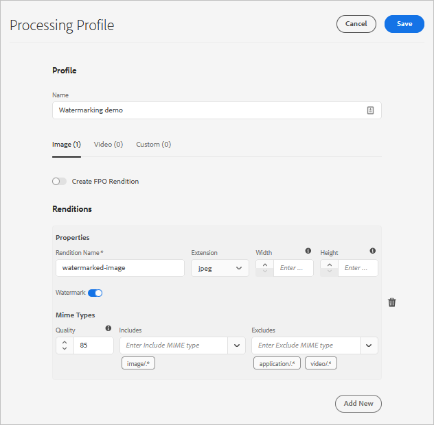

# Watermerk uw elementen {#watermark-assets}

<table>
    <tr>
        <td>
            <i> Nieuwe </i> <a href="/help/assets/dynamic-media/dm-prime-ultimate.md"><b> Dynamische Media Prime en Ultimate </b></a>
        </td>
        <td>
            <i> Nieuwe </i> <a href="/help/assets/assets-ultimate-overview.md"><b> AEM Assets Ultimate </b></a>
        </td>
        <td>
            <i> Nieuwe </i> <a href="/help/assets/integrate-aem-assets-edge-delivery-services.md"><b> integratie van AEM Assets met Edge Delivery Services </b></a>
        </td>
        <td>
            <i> Nieuwe </i> <a href="/help/assets/aem-assets-view-ui-extensibility.md"><b> Uitbreidbaarheid UI </b></a>
        </td>
          <td>
            <i> Nieuw </i> <a href="/help/assets/dynamic-media/enable-dynamic-media-prime-and-ultimate.md"><b> laat Dynamische Media Prime en Ultimate </b></a> toe
        </td>
    </tr>
    <tr>
        <td>
            <a href="/help/assets/search-best-practices.md"><b> Beste praktijken van het Onderzoek </b></a>
        </td>
        <td>
            <a href="/help/assets/metadata-best-practices.md"><b> Beste praktijken van Meta-gegevens </b></a>
        </td>
        <td>
            <a href="/help/assets/product-overview.md"><b> Content Hub </b></a>
        </td>
        <td>
            <a href="/help/assets/dynamic-media-open-apis-overview.md"><b> Dynamische Media met mogelijkheden OpenAPI </b></a>
        </td>
        <td>
            <a href="https://developer.adobe.com/experience-cloud/experience-manager-apis/"><b> de ontwikkelaarsdocumentatie van AEM Assets </b></a>
        </td>
    </tr>
</table>

| Versie | Artikelkoppeling |
| -------- | ---------------------------- |
| AEM 6.5 | [ klik hier ](https://experienceleague.adobe.com/docs/experience-manager-65/assets/administer/watermarking.html?lang=nl-NL) |
| AEM as a Cloud Service | Dit artikel |

Met [!DNL Adobe Experience Manager Assets] kunt u een digitaal watermerk toevoegen aan afbeeldingen en video&#39;s. [!DNL Assets] ondersteunt het toepassen van een afbeelding als watermerk op andere afbeeldingsbestanden. Met watermerken kunnen gebruikers de authenticiteit en de copyrighteigendom van de elementen controleren. Een watermerk kan ook worden gebruikt om de status van een document aan te geven als vertrouwelijk, concept, geldigheid enzovoort.

U configureert [!DNL Experience Manager] als volgt voor watermerkelementen:

1. Een PNG-bestand wordt toegepast als een watermerk. Upload dit bestand naar uw DAM-opslagplaats.

1. Navigeer naar **[!UICONTROL Tools > Assets > Assets Configurations]** .

1. Klik op **[!UICONTROL System Watermarking Profile]**.

1. Geef in het [!UICONTROL System Watermarking Profile page] het afbeeldingspad op dat in stap 1 naar de DAM-opslagplaats is geüpload.

1. Geef in het veld **[!UICONTROL Scale]** een watermerkschaal op tussen 0,0 en 1,0 ten opzichte van de breedte van de vertoning.

1. Klik op **[!UICONTROL Save]**.

   

   >[!NOTE]
   >
   >Als u System Watermarking Profile (Systeemwatermerkprofiel) hebt geconfigureerd met het configuratiebestand van `com.adobe.cq.assetcompute.impl.profile.WatermarkingProfileServiceImpl.cfg.json` (OSGi-configuratie), kunt u dit blijven gebruiken, maar Adobe raadt u aan de nieuwe methode te gebruiken.

1. [ creeer een verwerkingsprofiel ](/help/assets/asset-microservices-configure-and-use.md#create-custom-profile) om activa microservices te gebruiken om het watermerk toe te passen.

    te creëren

   Zorg ervoor dat u de schakeloptie **[!UICONTROL Watermark]** inschakelt tijdens het maken van het verwerkingsprofiel.

1. [ pas de verwerkingsprofielen op een omslag ](/help/assets/asset-microservices-configure-and-use.md#use-profiles) toe om watermerken activa tot stand te brengen.

## Tips en beperkingen {#tips-limitations-bestpractices}

* U kunt één configuratie gebruiken om al uw elementen te voorzien van een watermerk. Er wordt slechts één afbeelding gebruikt voor watermerken en de breedte is vast.
* U kunt het watermerk in het midden plaatsen zonder het watermerk naast elkaar te plaatsen.
* Watermerken op basis van tekst worden niet ondersteund.

**zie ook**

* [Assets vertalen](translate-assets.md)
* [ASSETS HTTP API](mac-api-assets.md)
* [Door Assets ondersteunde bestandsindelingen](file-format-support.md)
* [Zoeken in middelen](search-assets.md)
* [Verbonden elementen](use-assets-across-connected-assets-instances.md)
* [Elementen rapporteren](asset-reports.md)
* [Metagegevensschema&#39;s](metadata-schemas.md)
* [Elementen downloaden](download-assets-from-aem.md)
* [Metagegevens beheren](manage-metadata.md)
* [Zoeken in facetten](search-facets.md)
* [Verzamelingen beheren](manage-collections.md)
* [Bulkmetagegevens importeren](metadata-import-export.md)
* [Assets publiceren naar AEM en Dynamic Media](/help/assets/publish-assets-to-aem-and-dm.md)

>[!MORELIKETHIS]
>
>* [ overzicht van de microdiensten van Activa ](/help/assets/asset-microservices-overview.md).
>* [ de activa microdiensten van het Gebruik met verwerkingsprofielen ](/help/assets/asset-microservices-configure-and-use.md).
