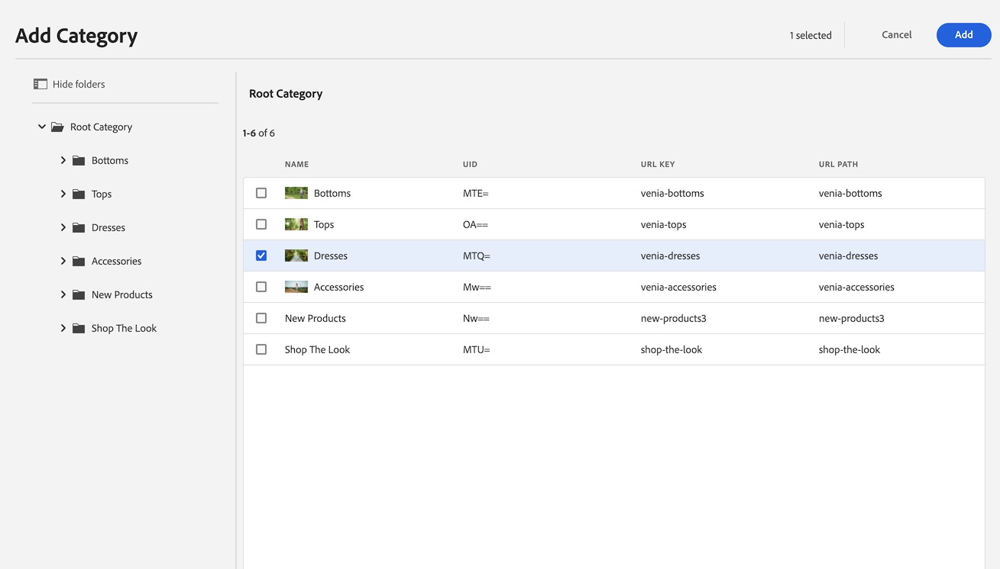
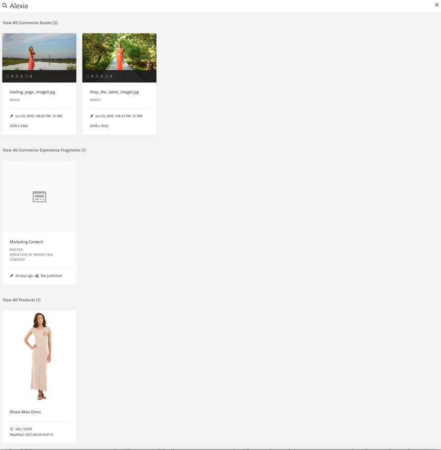

# Commerce Ervaringen ontwerpen {#authoring-commerce-experiences}

## Overzicht {#overview}

De invoegtoepassing CIF breidt AEM-authoring uit met specifieke handelsmogelijkheden. Dit laat auteurs toe om handel-verwante ervaringen efficiënt te bouwen en te beheren door toegang tot productgegevens en inhoud te krijgen zonder de context te verlaten.

## Kaarten {#pickers}

Producten en categoriekiezers zijn modale UI-dialoogvensters die AEM-auteurs een comfortabele manier bieden om producten of categorieën te zoeken en te selecteren wanneer dat nodig is. De Componenten van de kern, inhoudskoppeling en productmalplaatjes zijn de typische gebieden met configuraties die productcatalogusgegevens vereisen. Kiezers ondersteunen diverse configuratieopties, zoals meerkeuzevragen, variatie-selectie en voorselectie van waarden.

### Productkiezer {#product-picker}

Deze kiezer biedt u de mogelijkheid door de catalogusstructuur of de zoekfunctie in volledige tekst te bladeren om het product te zoeken. Producten met variatie bieden een mappictogram in de kolom &#39;Type&#39;. Als u op het mappictogram klikt, worden de variaties van het geselecteerde product geopend.

Als u op de bovenliggende categorie klikt, gaat de auteur terug naar het productniveau.

#### Voorbeeld van productteam {#example-product-teaser}

Het configuratiedialoogvenster van deze component vereist een product. CIF gebruikt de SKU als product-id. Auteurs kunnen de skin handmatig invoeren of op het mappictogram klikken om de productkiezer te openen. Nadat u de kiezer hebt geselecteerd en gesloten, wordt in het dialoogvenster met componenten de naam van het geselecteerde product weergegeven

### Categoriekiezer {#category-picker}

Deze kiezer kan door de catalogusstructuur bladeren om de categorie te zoeken.

#### Voorbeeld van carrousel {#example-carousel}

Het configuratiedialoogvenster van deze component vereist 1 : n-categorieën. CIF gebruikt de UID / ID als de categorie-id. Auteurs kunnen de UID handmatig invoeren of op het mappictogram klikken om de categoriekiezer te openen. Nadat u de kiezer hebt geselecteerd en gesloten, wordt in het dialoogvenster dat de component bevat de naam van de geselecteerde categorie weergegeven.

## Pagina-editor {#page-editor}

De Pagina-editor in AEM is uitgebreid met mogelijkheden voor toegang tot de realtime productgegevens en de bijbehorende productinhoud.

### Toegang tot productgegevens {#access-product-data}

Het tabblad &#39;Assets&#39; in het zijpaneel van de editor biedt toegang tot productgegevens door het type &#39;Producten&#39; te selecteren. De gegevens worden opgehaald levend van het gevormde handelseindpunt. Het filter is een full-text onderzoek op het handelseindpunt om specifieke producten te vinden.

Analoog aan activa, kunnen de producten op een pagina worden toegevoegd (die tot een product teaser component als gebrek) of componenten (momenteel gesteund zijn productschouder en productcarrousel) leidt.

### Koppelingen toevoegen in tekstvelden met RTE {#rte}

CIF-productcataloguspagina&#39;s zijn virtuele pagina&#39;s die direct worden weergegeven. Het is dus niet mogelijk hyperlinks in te sluiten, zoals bij gewone AEM-pagina&#39;s. CIF voegt een nieuwe handeling &quot;Commerce Links&quot; toe aan de RTE (Rich Text Editor). Deze actie werkt precies zoals de gewone &quot;Hyperlink&quot;actie, maar staat auteurs toe om of een product of een categorie te selecteren gebruikend de plukkers.

>[!NOTE]
>
> Als zowel de categorie als het product wordt geselecteerd, wordt het product genomen.

Hierdoor wordt een koppeling voor plaatsaanduidingen gemaakt die wordt vervangen door een echte koppeling wanneer de pagina wordt weergegeven.

### Gekoppelde productinhoud openen {#associated-content}

Als de Editor 1 :n producten op een pagina herkent, wordt in het zijpaneel automatisch het tabblad &quot;Gekoppelde Commerce-inhoud&quot; weergegeven. Dit lusje staat auteurs toe om tot de inhoud van AEM snel toegang te hebben die met het product werd geëtiketteerd (zie [ verrijken productgegevens met de bijbehorende inhoud van AEM ](/help/commerce-cloud/cif-storefront/authoring/enrich-product-associated-content.md) voor meer informatie). Op dit tabblad vindt u vervolgkeuzelijsten waarmee u kunt filteren op inhoudstype en specifieke producten als er meerdere producten op de pagina staan. Het gebruik van de inhoud werkt precies hetzelfde als het gebruik van inhoud op het tabblad &quot;Assets&quot;.

### Voorvertoning nog niet verwerkte productgegevens {#staged-data}

In de modus Timewarp in de editor kunnen auteurs een voorbeeld bekijken van een AEM-ervaring met gefaseerde productcatalogusgegevens en door deze ervaring bladeren op basis van de datum Timewarp.

Componenten geven een visuele indicator weer als de gebruikte datum gefaseerd is.

## Omnissearch {#omnisearch}

Het gebruik van Omnissearch is een gemakkelijke manier voor artsen om AEM-inhoud en productcatalogusgegevens te vinden met behulp van full-text zoekopdrachten. In het kader van Omnissearch worden full-text zoekopdrachten uitgevoerd in AEM en de commerceback om de productcatalogusobjecten te zoeken in de commercial backend en AEM-inhoud. AEM-resultaten bevatten ook inhoud die is gelabeld met product-/categoriegegevens.

Het resultaat wordt gegroepeerd op type.

>[!NOTE]
>
> Bij zoeken in volledige tekst in Omnsearch worden geen bijbehorende inhoudsfragmenten ondersteund. Gebruik SKU of UID om bijbehorende inhoudsfragmenten te zoeken.
