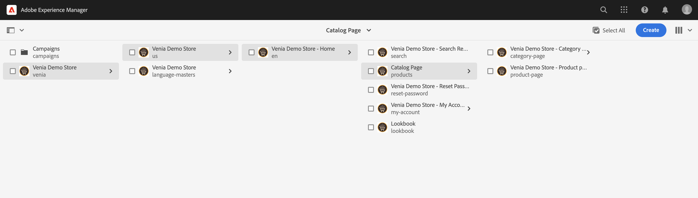
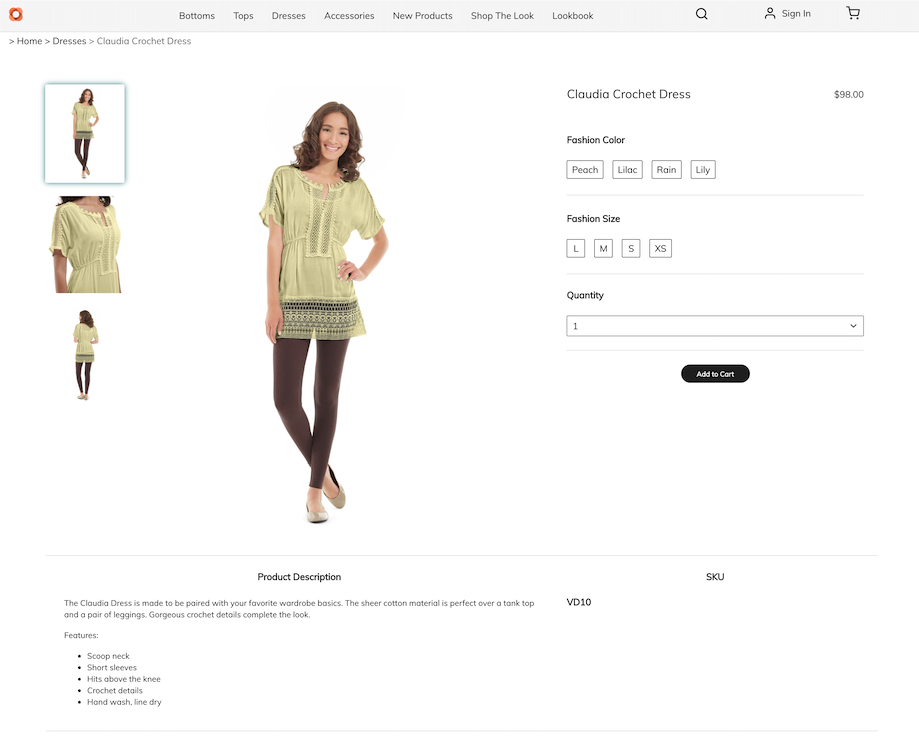
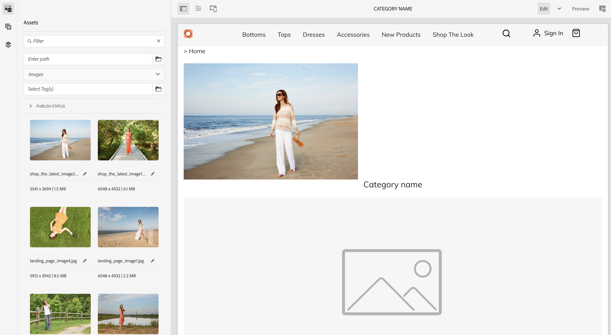

# Pagina&#39;s en sjablonen van productcatalogi beheren {#product-catalog}

Meer weten over het beheren van productcataloguspagina&#39;s en -sjablonen.

## Het verhaal tot nu toe {#story-so-far}

In het vorige document van de de auteursreis van de Inhoud van AEM en van Commerce, [&#x200B; Begonnen het worden met de auteursgrondbeginselen van AEM CIF, &#x200B;](/help/commerce-cloud/cif-storefront/commerce-journeys/aem-commerce-content-author/getting-started.md) u leerde de basis van de creatie van CIF.

Dit artikel bouwt voort op die grondbeginselen.

## Doelstelling {#objective}

Dit document helpt u begrijpen hoe te om de pagina&#39;s en de malplaatjes van de productcatalogus te beheren. Na het lezen moet u:

* begrijpen de concepten van catalogussjablonen
* hoe generieke sjablonen werken
* een afzonderlijke sjabloon hebben gemaakt

## Het basisconcept {#basic-concept}

De Venia-winkel wordt geleverd met een typische ervaring in de productcatalogus met navigatie, landen, categorieën (PLP) en productdetails (PDP).

Cataloguspagina&#39;s worden dynamisch gebouwd gebruikend een de catalogusmalplaatje van AEM CIF en productgegevens in real time die van het handelseindpunt wanneer nodig worden gehaald. Elke catalogus heeft een algemene sjabloon voor product- en categoriepagina&#39;s.

De navigatiecomponent toont inhoud en cataloguspagina&#39;s. Het is mogelijk om de bestemmingspagina van de catalogus of de categorieën van het eerste niveau in de navigatie te tonen. Als u de muisaanwijzer boven een categorie houdt, worden de categorieën op het tweede niveau weergegeven als een tweede regel.

Als u op een categorie klikt, wordt de pagina met categorieën (of de pagina met productlijsten) geopend.

Als u op een product klikt, wordt de pagina met productdetails geopend.

## De sjablonen {#templates}

### Algemene sjablonen {#generic}

De algemene Venia-catalogussjabloon gebruikt de component Product List Core. In dit onderdeel wordt de categorieafbeelding weergegeven, indien beschikbaar, en de producten uit de categorie.

De generieke productsjabloon van Venia gebruikt de component Product Detail Core. Dit onderdeel geeft productinformatie weer voor verschillende producttypen en acties voor invoegtoepassingen.

### Sjablonen bewerken {#edit-templates}

Sjablonen kunnen worden bewerkt door de sjabloonpagina rechtstreeks te openen of door over te schakelen op de bewerkingsmodus terwijl u door een pagina in de productcatalogus bladert. Als u de pagina wijzigt, wordt de sjabloon gewijzigd en niet alleen de specifieke pagina van het product of de categorie.

### Categorie- of productspecifieke sjablonen {#specific}

CIF ondersteunt meerdere sjablonen met slechts een paar klikken. Om een ander malplaatje tot stand te brengen, selecteer het generische malplaatje van de respectieve categorie en creeer een pagina gebruikend **creeer** actie.

Selecteer de desbetreffende product- of categoriesjabloon.

Voer de titel in en maak de pagina.

 binnen

U ziet nu een specifieke sjabloon onder de algemene sjabloon.

Open de sjabloon. Het lijkt precies op de generieke categoriesjabloon.

Voeg een afbeelding toe boven op de pagina.

De sjabloon kan met elke categorie of elk product worden voorvertoond. Open **Informatie van de Pagina** en selecteer dan **Mening met categorie/product**. Selecteer het product/de categorie in de kiezer voor een voorvertoning met dit product/deze categorie. Selecteer **Schaf de categorie van de Kijker** om een voorproef van het bijgewerkte malplaatje te krijgen.

Nu moet u deze sjabloon toewijzen aan de specifieke categorie. Open eigenschappen in het **menu van de Informatie van de Pagina** en schakelaar aan de handel tabel. Klik het omslagpictogram om **te selecteren Shop de categorie van de Kijker** van de categoriekiezer. Het is mogelijk meerdere categorieën aan een sjabloon toe te wijzen en ook subcategorieën op te nemen door het selectievakje in te schakelen.

Ga terug naar de belangrijkste homepage en klik **Shop de categorie van de Kijker** om het specifieke malplaatje te zien. Alle andere categorieën gebruiken nog het generische malplaatje.

Dezelfde workflow kan worden toegepast om afzonderlijke productsjablonen te maken.

## Volgende functies {#what-is-next}

Nu u dit deel van de reis hebt voltooid, moet u:

* begrijpen de concepten van catalogussjablonen
* hoe generieke sjablonen werken
* een afzonderlijke sjabloon hebben gemaakt

Bouw op deze kennis voort en ga uw reis door het document [&#x200B; te herzien voort Geleide ervaringen van de productcatalogus, &#x200B;](/help/commerce-cloud/cif-storefront/commerce-journeys/aem-commerce-content-author/staged-catalog.md) beheren waar u leert hoe te met gefaseerde productgegevens en de Lanceringen van AEM te werken.

## Aanvullende bronnen {#additional-resources}

Terwijl het wordt geadviseerd dat u zich op het volgende deel van de reis door het document [&#x200B; te herzien leidt de looppas van de productcatalogus van het Gelaagde product, &#x200B;](/help/commerce-cloud/cif-storefront/commerce-journeys/aem-commerce-content-author/staged-catalog.md) het volgende zijn enkele extra, facultatieve middelen die een diepere duik op sommige die concepten in dit document worden vermeld doen, maar zij worden niet vereist om op de headless reis verder te gaan:

* [Meerdere categorieën en productpagina&#39;s maken](/help/commerce-cloud/cif-storefront/authoring/multi-template-usage.md)
* [&#x200B; de gids van de Migratie voor Experience Manager Cloud Service &#x200B;](/help/commerce-cloud/cif-storefront/migration.md) - hoe te aan AEM Commerce integration framework (CIF) toe:voegen-binnen van een oude versie migreren
