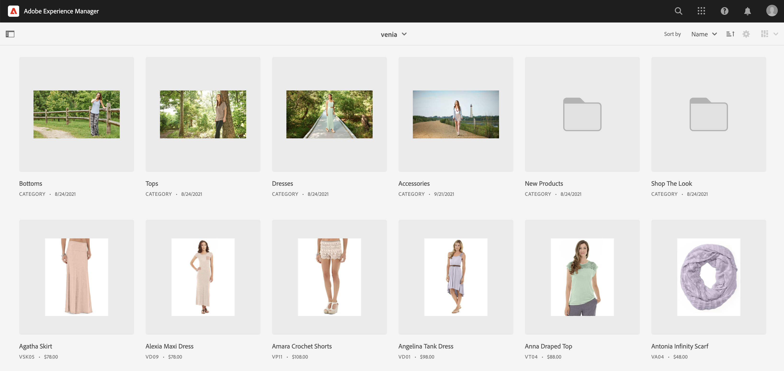

# Aan de slag met AEM CIF Authoring {#getting-started}

Meer informatie over Adobe Experience Manager (AEM) CIF Authoring.

## Het verhaal tot nu toe {#story-so-far}

In het vorige document van deze reis van de Inhoud van AEM en van Commerce, [&#x200B; Leer over de Inhoud en Commerce van AEM, &#x200B;](/help/commerce-cloud/cif-storefront/introduction.md), leerde u de basistheorie en de concepten CMS en AEM Content en Commerce zonder kop.

Dit artikel bouwt voort op die grondbeginselen.

## Doelstelling {#objective}

Dit document helpt u te begrijpen hoe u CIF for Content en Commerce-specifieke authoring kunt gebruiken. Na het lezen moet u:

* Begrijp de concepten van CIF authoring using Page Editor in AEM
* Toegang tot productcatalogusgegevens in AEM met product- en categoriekiezers
* Toegang krijgen tot inhoud en handelsgegevens met de productcockpit en AEM Omnsearch

## CIF Authoring in AEM Page Editor {#cif-authoring}

CIF breidt de Pagina-editor in AEM uit met mogelijkheden om toegang te krijgen tot de realtime productgegevens zonder de context te verlaten:

Open het zijpaneel en selecteer &quot;Producten&quot;van de drop-down lijst.

U kunt door de productcatalogus bladeren of producten zoeken met het volledige tekstzoekveld.

Producten kunnen worden neergezet op componenten die productdruppels (bijvoorbeeld productgummetje, productcarrousel) direct op de pagina ondersteunen, waardoor automatisch een productgumcomponent wordt gemaakt.

## Product- en rubriekkiezers {#pickers}

Als product- en categoriegegevens vereist zijn in commerciële componenten of in AEM-dialoogvensters voor back-office, kunnen AEM-auteurs gebruikmaken van kiezers die UI-elementen zijn voor het eenvoudig zoeken naar en selecteren van productcatalogusgegevens.

### Productkiezer {#product-picker}

Als u op het mappictogram klikt, wordt de modale gebruikersinterface van de kiezer geopend (bijvoorbeeld producttaser).

Producten kunt u vinden door links in de catalogusstructuur te bladeren of door te zoeken. Bij zoeken in volledige tekst wordt rekening gehouden met de geselecteerde categorie en worden de zoekresultaten beperkt tot deze categorie.

Producten met variaties worden gemarkeerd met een mappictogram waarop u kunt klikken om alle variaties weer te geven.

### Categoriekiezer {#category-picker}

Werkt als een productkiezer. Als u op het mappictogram klikt, wordt de modale gebruikersinterface van de kiezer geopend (bijvoorbeeld carrousel voor categorieën).

Blader naar de catalogusstructuur aan de linkerkant en selecteer de categorie.

## Product Cockpit {#cockpit}

De cockpit van het product is een centrale plaats om snel tot de productcatalogus met al zijn verrijkte inhoud toegang te hebben. In een van de volgende modules leert u hoe u productgegevens kunt verrijken met inhoud. Laten we ons nu concentreren op de toegang tot productgegevens.

Klik in het hoofdmenu op Handel om een lijst met alle gekoppelde productcatalogi weer te geven.

Hier wordt een lijst met alle verbonden productcatalogi weergegeven.

In de productcatalogus worden standaard alle categorieën op het eerste niveau met alle producten weergegeven. Als u op een categorie klikt, wordt die categorie geopend met alle verwante producten en subcategorieën, inclusief de bijbehorende producten.

U kunt de eigenschappen van het product openen door op het eigenschapspictogram te klikken. Het pictogram wordt weergegeven door de muisaanwijzer op een productegel te plaatsen.

Alle producteigenschappen zijn alleen-lezen omdat de gegevens in real-time worden geladen vanaf de verbonden backend. Het veranderen van producteigenschappen moet in het achterste systeem worden gedaan dat het systeem van verslag is. De lusje **Varianten** verschijnen slechts als het product variaties heeft. Wanneer u op het tabblad klikt, worden alle variaties met de bijbehorende kenmerken weergegeven.

Op de resterende tabbladen ziet u alle AEM-inhoud die aan het product is gekoppeld. Deze lusjes worden besproken in één van de volgende modules.

## AEM Omnissearch {#omnisearch}

Het gebruik van Omnissearch is een eenvoudige manier om AEM-inhoud te zoeken met behulp van full-text zoekopdrachten. CIF breidt Omnissearch uit met full-text zoekopdrachten van productcatalogi met de bijbehorende AEM-inhoud.

Omnissearch voert een full-text zoekopdracht uit in de commerceback om alle verwante producten te zoeken. Het resultaat wordt vermeld onder **Mening Alle Producten**. Het onderzoek van Omnissearch zoekt ook AEM naar inhoud die met het gezochte product wordt geassocieerd. De resultaten worden vermeld in de respectieve categorieën van AEM. In dit voorbeeld is één inhoudsfragment gerelateerd aan het product.

## Volgende functies {#what-is-next}

Nu u dit deel van de reis hebt voltooid, moet u:

* Begrijp de concepten van CIF authoring gebruikend de Redacteur van de Pagina
* Toegang krijgen tot productcatalogus in AEM met product- en rubriekkiezers
* Toegang krijgen tot inhoud en handelsgegevens met de productcockpit en AEM Omnsearch

Bouw op deze kennis voort en zet uw reis door het document [&#x200B; te herzien leiden de Pagina&#39;s en de Malplaatjes van de Catalogus van het Product, &#x200B;](/help/commerce-cloud/cif-storefront/commerce-journeys/aem-commerce-content-author/catalog-templates.md) waar u leert om uw eerste ervaring van de productcatalogus te bouwen en aan te passen.

## Aanvullende bronnen {#additional-resources}

Terwijl het wordt geadviseerd dat u zich op het volgende deel van de reis beweegt - [&#x200B; de Pagina&#39;s en de Malplaatjes van de Catalogus van het Product van het Beheren &#x200B;](/help/commerce-cloud/cif-storefront/commerce-journeys/aem-commerce-content-author/catalog-templates.md) - het volgende zijn sommige facultatieve middelen die een diepere duik op sommige hier genoemde concepten doen. Deze facultatieve middelen zijn echter niet nodig om op de reis door te gaan.

* [Opslag en catalogi configureren](/help/commerce-cloud/cif-storefront/getting-started.md#catalog)
