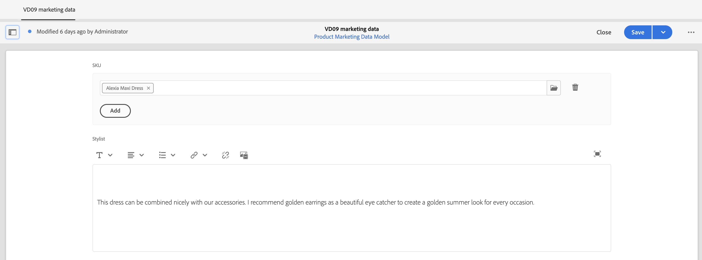

# Ervaringen maken met producten {#building-experiences}

Leer hoe u productervaringen kunt beheren.

## Het verhaal tot nu toe {#story-so-far}

In het vorige document van de reis van de Inhoud van Adobe Experience Manager (AEM) en van Commerce, [ beheert gestage ervaringen van de productcatalogus ](staged-catalog.md), leerde u hoe te om de ervaringen van de gefaseerde productcatalogus te beheren.

## Doelstelling {#objective}

Dit document helpt u te begrijpen hoe u productinhoud en ervaringen kunt opbouwen.

## Beheer van productervaring {#management}

Het Beheer van de Ervaring van het product is de discipline om productgegevens (die door een PIM of handelsoplossing wordt bezeten) met marketing inhoud in AEM te versieren. Deze verrijkte productgegevens met inhoud kunnen vervolgens op verschillende manieren worden gebruikt om een meeslepende boodschappenervaring te creëren.

In AEM kunt u verschillende typen inhoud maken en deze koppelen aan de productcatalogus. De bijbehorende inhoud kan gemakkelijk worden ontdekt en worden gebruikt die tot een hoge productiviteit leidt.

### Assets {#assets}

Op een hoog niveau zijn er twee soorten activa verbonden aan producten: product &amp; marketing. De activa van het product worden beheerd door handelaren en concentreren zich op het tonen van het product (hoofdzakelijk voor een neutrale achtergrond). De activa worden ofwel beheerd in de handelsoplossing, ofwel in AEM Assets (met een Assets-integratie in de handel-/prijsoplossing).

Marketingsmiddelen houden verband met het promoten en gebruiken van het product dat eigendom is van marketing. De voorbeelden tonen veelvoudige producten (&quot;shop de blik&quot;), in een specifieke context (&quot;buitenvalinzameling&quot;), of hoe te pdfs. CIF biedt een eenvoudige manier om AEM elementen te koppelen aan een productcatalogusobject.

Open de activa eigenschappen en schakelaar aan **Commerce** tabel. Op dit tabblad kunt u de koppeling met producten beheren. De tabel onder de kiezer bevat aanvullende informatie voor de gekoppelde objecten (alleen zichtbaar met een selectie). Klik op het detailpictogram zodat u de volledige weergave in de productcockpit kunt bekijken. Als u een nieuw object wilt koppelen, klikt u op het pictogram van de productkiezer (mappictogram), selecteert u een object en sluit u de kiezer.

### Ervaar fragmenten {#experience-fragments}

Met Experience Fragments kunt u op grote schaal herbruikbare of afzonderlijke productinhoud maken. De koppeling werkt op dezelfde manier als een middel. Open eigenschappen en schakelaar aan **Commerce** tabel. Op dit tabblad kunt u de koppeling met producten en categorieën beheren. De tabellen onder de kiezers bevatten aanvullende informatie over de gekoppelde objecten (alleen zichtbaar met een selectie). Klik op het detailpictogram zodat u de volledige weergave in de productcockpit kunt bekijken. Als u een nieuw object wilt koppelen, klikt u op het pictogram van de productkiezer (mappictogram), selecteert u een object en sluit u de kiezer.

### Inhoudsfragmenten {#content-fragments}

Inhoudsfragmenten zijn het beste inhoudstype voor alle gestructureerde inhoud. Dit kan worden gebruikt om externe productgegevens te verhogen met extra marketinggegevens of om inhoud zonder kop te maken. De koppeling van een inhoudsfragment aan een productcatalogusobject gebeurt aan de hand van de product- of categorietypen in de Content Fragment Model Editor. U sleept gewoon het juiste referentietype naar het model en configureert het veld. Deze typen bieden ondersteuning voor enkelvoudige of meervoudige selectie.

Als u een inhoudsfragment maakt op basis van dit model, bieden deze referentietypen u met de desbetreffende kiezer een eenvoudige manier om het juiste object te selecteren.

### Product Cockpit {#product-cockpit}

U werd geïntroduceerd in de productcockpit (of console) in één van de vorige modules. De cockpit is een eenvoudige manier om niet alleen door de productcatalogus te bladeren, maar ook om alle bijbehorende AEM inhoud op één plaats te zien. Ga naar de productconsole en open de eigenschappen van een product dat bijbehorende inhoud heeft. Schakel over naar het desbetreffende tabblad om de bijbehorende inhoud weer te geven.

Als u op het actiepictogram klikt, wordt dat stuk inhoud geopend in een nieuw browsertabblad.

## Afzonderlijke product- en rubriekpagina&#39;s verrijken {#enrich}

In de vorige modules, hebt u geleerd hoe te met veelvoudige malplaatjes van de productcatalogus te werken. Meerdere sjablonen zijn een goede manier om verschillende sjablonen te maken, maar zijn vaak niet nodig. Vaak kan dezelfde sjabloon worden gebruikt met plaatsaanduidingen voor afzonderlijke inhoud. CIF ondersteunt plaatsaanduidingen voor inhoudsfragmenten en ervaringsfragmenten.

Laten we beginnen met de tijdelijke aanduiding voor het ervaringsfragment. Open een productsjabloon in de AEM Editor. De belemmering en laat vallen de **component van het Fragment van de Ervaring 0} Commerce op het malplaatje, dan opent de config dialoog.**

Open het dialoogvenster van de component en voer een naam voor deze tijdelijke aanduiding in. Een naam voor een plaatsaanduiding is vereist en u kunt zoveel plaatsaanduidingen toevoegen als u nodig hebt.

Open het ervaringsfragment dat u in de vorige stap aan een product hebt gekoppeld. Open eigenschappen en schakel over naar het tabblad Handel. Ga de zelfde placeholder naam onder de **placeholder plaats van de Catalogus** in.

Nu belemmering en laat vallen de **component van het Fragment van de Inhoud 0} Commerce op het malplaatje en open de config dialoog.**

In dit dialoogvenster wordt het dialoogvenster Inhoud van kerncomponent-fragment opnieuw gebruikt. Meer informatie vindt u onder extra bronnen. Het enige verschil is het **bezit van het Element van de Verbinding** dat het herkenningstekengebied (product SKU of categorie UID) in het model van het Fragment van de Inhoud vormt.

Bekijk nu een productpagina met een bijbehorend inhoudsfragment en/of ervaringsfragment. Wanneer AEM een pagina rendert, wordt er gezocht naar elke plaatsaanduiding op basis van het type (Content or Experience Fragment), de id en de plaatsaanduidingsnaam voor Experience Fragments. AEM gebruikt een URL-oplosser om de id op te halen (SKU voor producten, UID voor categorieën). Als een Experience of Content Fragment wordt geretourneerd, wordt het gerenderd naar de plaatsaanduidingslocatie, anders wordt de plaatsaanduiding genegeerd.

## Inhoud overzichtelijk maken {#making-shoppable}

Het is ook mogelijk om een regelmatige AEM pagina uit elkaar te zetten door commerciële componenten toe te voegen. Maak een inhoudspagina in AEM en open de lege pagina in de editor.

Sleep eerst een productdetailcomponent naar de pagina. Schakel vervolgens over naar de zijbalk van Assets, schakel over naar producten en selecteer een product. Sleep het product naar de productcomponent. Dit toont een regelmatige productcomponent op een inhoudspagina.

Als u bijbehorende inhoud voor dat product hebt gecreeerd, schakelaar in Assets sidebar aan **Geassocieerde Inhoud van Commerce**. Op dit tabblad ziet u alle AEM inhoud die aan dit product is gekoppeld. Hierdoor kunt u de pagina&#39;s nu snel verfraaien met gekoppelde inhoud.

## Einde van de reis? {#end-of-journey}

Gefeliciteerd! U hebt de AEM Content and Commerce Developer trip voltooid! Nu moet u:

* begrijpen hoe u elke AEM inhoud aan productcatalogusobjecten kunt koppelen
* gebruik plaatsaanduidingen om producten en categoriepagina&#39;s afzonderlijk te verrijken
* weten hoe u inhoud overzichtelijk kunt maken en het bijbehorende tabblad Inhoud kunt gebruiken

U bent nu klaar om productervaringen te beheren met AEM Content en Commerce. Voor AEM Content en Commerce zijn echter veel extra opties beschikbaar. Controle uit enkele extra middelen beschikbaar in de [ Extra sectie van Middelen ](#additional-resources) waar u meer over de eigenschappen kunt leren u in deze reis zag.

## Aanvullende bronnen {#additional-resources}

* [Commerce Ervaringen ontwerpen](/help/commerce-cloud/authoring/authoring-commerce-experiences.md)
* [Product Cockpit](/help/commerce-cloud/authoring/product-cockpit.md)
* [ component van het Fragment van de Inhoud ](https://experienceleague.adobe.com/docs/experience-manager-core-components/using/wcm-components/content-fragment-component.html?lang=en)
