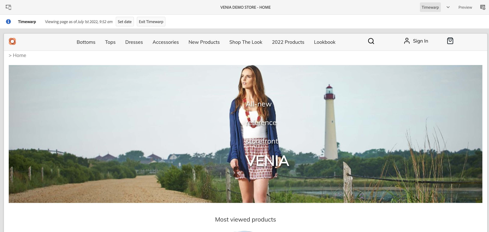

# Werken met nog niet voltooide productcataloguservaringen {#building-experiences}

Leer hoe u ervaringen met gefaseerde productcatalogi beheert.

## Het verhaal tot nu toe {#story-so-far}

In het vorige document van de reis van de Inhoud van AEM en van Commerce, [ leiden de Pagina&#39;s en de Malplaatjes van de Catalogus van het Product ](catalog-templates.md), leerde u hoe te om de ervaringen van de productcatalogus te beheren en te bouwen die op malplaatjes worden gebaseerd.

Dit artikel bouwt voort op die grondbeginselen.

## Doelstelling {#objective}

Dit document helpt u te begrijpen hoe u de ervaring van de productcatalogus kunt beheren op basis van gefaseerde productgegevens en AEM Launches. Vaak moeten auteurs zich tegelijkertijd voorbereiden op een volgende productintroductie (bijvoorbeeld een nieuwe kledingcollectie). Dit vereist toegang tot gefaseerde productgegevens (nog niet live) en de mogelijkheid om de inhoud voor te bereiden. Deze nieuwe inhoud wordt live weergegeven met de introductie van het product.

>[!NOTE]
>
>Deze functie is alleen beschikbaar bij Adobe Commerce of Cloud Edition en connectors van derden die tokenverificatie ondersteunen. Zie [ Begonnen het Worden ](https://experienceleague.adobe.com/docs/experience-manager-cloud-service/content-and-commerce/storefront/getting-started.html) voor extra informatie.

Eerst, zien wij hoe de auteurs tot gefaseerde productgegevens met CIF kunnen toegang hebben.

## Werken met gefaseerde productgegevens {#staged-product-data}

Een manier om gefaseerde productgegevens te openen is het gebruik van de productcockpit. Open de productcatalogus door op het Commerce-pictogram in het AEM-hoofdmenu te klikken. Hierdoor hebt u toegang tot live productgegevens. Open het filterlusje op de linkerzijde en breid **STAGED CATALOG** uit. Met de voorvertoningsgegevens hebt u nu toegang tot de gefaseerde productgegevens voor elk gewenst moment. De gefaseerde gegevens omvatten nieuwe categorieën, producten, of bijgewerkte gebieden zoals prijs.

Het is mogelijk om een voorvertoning van een opslagruimte met gefaseerde gegevens weer te geven met de tijdverdraaiingsweergave. Open de editor en schakel over naar de modus voor tijdverdraaiing. Selecteer een toekomstige datum. U ziet de informatie boven op de editor dat u de pagina voor een bepaalde datum bekijkt.

U kunt nu door de catalogus bladeren met de gegevens in het werkgebied. Als u een gefaseerde categorie of productpagina opent, zal de redacteur een visuele indicator tonen.

>[!NOTE]
>
>Omnissearch heeft geen context en retourneert dus alleen live productcatalogusgegevens

## AEM Launches {#launches}

Met AEM Launches kunt u inhoud maken voor gefaseerde productgegevens. Als u niet vertrouwd met Lanceren bent, volg de documentatieverbinding onder de [ Extra sectie van Middelen ](#additional-resources). De datum van de Lancering wordt dan gebruikt om tot gefaseerde productgegevens toegang te hebben.

De kiezers respecteren de startdatum met de gefaseerde indicator aan de rechterkant.

## Volgende functies {#what-is-next}

Nu u dit deel van de reis hebt voltooid, moet u:

* begrijpen de concepten van een gefaseerde productcatalogus en inhoud met Launches
* toegang hebben tot gegevens uit de gefaseerde productcatalogus via productcockpit en editor

U bent nu klaar om [ productervaringen ](product-experience-management.md) te beheren. Voor AEM Content en Commerce zijn echter veel extra opties beschikbaar. Controle uit enkele extra middelen beschikbaar in de [ Extra sectie van Middelen ](#additional-resources) om meer over de eigenschappen te leren u in deze reis zag.

## Aanvullende bronnen {#additional-resources}

* [Product Cockpit](/help/commerce-cloud/authoring/product-cockpit.md)
* [Aan de slag](/help/commerce-cloud/getting-started.md)
* [Lanceringen](/help/sites-cloud/authoring/launches/overview.md)
