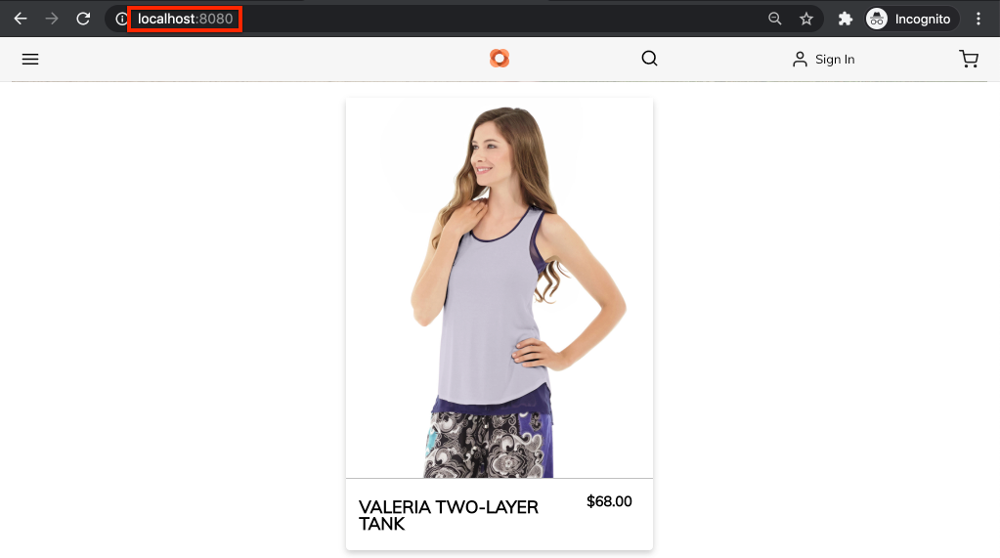

# Stijl AEM CIF Core Components {#style-aem-cif-core-components}

Het [CIF Venia Project](https://github.com/adobe/aem-cif-guides-venia) is een referentiecode-basis voor het gebruik van [CIF Core Components](https://github.com/adobe/aem-core-cif-components). In deze zelfstudie inspecteert u het Venia-referentieproject en begrijpt u hoe CSS en JavaScript die door AEM CIF Core-componenten worden gebruikt, zijn geordend. U maakt ook een nieuwe stijl met CSS om de standaardstijl van de component **Product Teaser** bij te werken.

>[!TIP]
>
> Gebruik [AEM archetype van het Project](https://github.com/adobe/aem-project-archetype) wanneer het beginnen van uw eigen handelsimplementatie.

## Wat u gaat maken

In deze zelfstudie wordt een nieuwe stijl geïmplementeerd voor de component Product Teaser die op een kaart lijkt. De lessen die in het leerprogramma worden geleerd kunnen op andere Componenten van de Kern worden toegepast CIF.


## Vereisten {#prerequisites}

U hebt een lokale ontwikkelomgeving nodig om deze zelfstudie te voltooien. Dit omvat een lopende instantie van AEM die wordt gevormd en met een instantie van Magento verbonden. Herzie de vereisten en de stappen voor [vestiging een lokale ontwikkeling met AEM als Cloud Service SDK](../develop.md).

## Het Venia-project klonen {#clone-venia-project}

Wij zullen het [Project van Venia ](https://github.com/adobe/aem-cif-guides-venia) klonen en dan de standaardstijlen met voeten treden.

>[!NOTE]
>
> **Voel u vrij om een bestaand project**  te gebruiken (gebaseerd op het AEM Projectarchetype met CIF inbegrepen) en deze sectie over te slaan.

1. Voer de volgende git-opdracht uit om het project te klonen:

   ```shell
   $ git clone git@github.com:adobe/aem-cif-guides-venia.git
   ```

1. Bouw en stel het project aan een lokaal geval van AEM op:

   ```shell
   $ cd aem-cif-guides-venia/
   $ mvn clean install -PautoInstallPackage,cloud
   ```

1. Voeg de noodzakelijke configuraties OSGi toe om uw AEM instantie met een instantie van de Magento te verbinden of de configuraties aan het onlangs gecreeerd project toe te voegen.

1. Op dit punt zou u een werkende versie van een storefront moeten hebben die met een instantie van Magento wordt verbonden. Navigeer naar de pagina `US` > `Home` op: [http://localhost:4502/editor.html/content/venia/us/en.html](http://localhost:4502/editor.html/content/venia/us/en.html).

   Je moet zien dat de winkel het thema Venia gebruikt. Als u het hoofdmenu van de storefront uitbreidt, ziet u verschillende categorieën die aangeven dat de Magento van de verbinding werkt.

   

## Client Libraries and ui.frontend Module {#introduction-to-client-libraries}

De CSS en JavaScript die verantwoordelijk zijn voor het renderen van het thema/de stijlen van de storefront worden in AEM beheerd door een [Clientbibliotheek](/help/implementing/developing/introduction/clientlibs.md) of clientlibs voor kort. Clientbibliotheken bieden een mechanisme voor het indelen van CSS en Javascript in de code van een project en leveren vervolgens op de pagina.

Brand-specifieke stijlen kunnen worden toegepast op AEM CIF Core-componenten door de CSS die door deze clientbibliotheken wordt beheerd, toe te voegen en te overschrijven. Inzicht in de structuur van clientbibliotheken en de inhoud van deze bibliotheken op de pagina is van essentieel belang.

Het [ui.frontend](https://docs.adobe.com/content/help/en/experience-manager-core-components/using/developing/archetype/uifrontend.html) is een speciaal [webpack](https://webpack.js.org/)-project om alle front-end elementen voor een project te beheren. Hierdoor kunnen front-end ontwikkelaars een willekeurig aantal talen en technologieën gebruiken, zoals [TypeScript](https://www.typescriptlang.org/), [Sass](https://sass-lang.com/) en nog veel meer.

De `ui.frontend` module is ook een Maven module en geïntegreerd met het grotere project door het gebruik van een module NPM [aem-clientlib-generator](https://github.com/wcm-io-frontend/aem-clientlib-generator). Tijdens een build kopieert de `aem-clientlib-generator` de gecompileerde CSS- en JavaScript-bestanden naar een clientbibliotheek in de module `ui.apps`.


*Gecompileerde CSS en Javascript worden gekopieerd van de  `ui.frontend` module naar de  `ui.apps` module als bibliotheek van de Cliënt tijdens een Maven bouwt*

## De laserstijl {#ui-frontend-module} bijwerken

Breng vervolgens een kleine wijziging aan in de stijl Taser om te zien hoe de module `ui.frontend` en de clientbibliotheken werken. Gebruik [IDE van uw keus](https://docs.adobe.com/content/help/en/experience-manager-learn/cloud-service/local-development-environment-set-up/development-tools.html#set-up-the-development-ide) om het project van Venia in te voeren. De gebruikte schermafbeeldingen zijn van [Code IDE van Visual Studio](https://docs.adobe.com/content/help/en/experience-manager-learn/cloud-service/local-development-environment-set-up/development-tools.html#microsoft-visual-studio-code).

1. Navigeer en breid **ui.frontend** module uit en breid de omslaghiërarchie uit aan: `ui.frontend/src/main/styles/commerce`:

   

   U ziet dat er meerdere bestanden voor de klasse (`.scss`) onder de map staan. Dit zijn de specifieke stijlen van de Handel voor elk van de componenten van de Handel.

1. Open het bestand `_productteaser.scss`.

1. Werk de `.item__image` regel bij en wijzig de grensregel:

   ```scss
   .item__image {
       border: #ea00ff 8px solid; /* <-- modify this rule */
       display: block;
       grid-area: main;
       height: auto;
       opacity: 1;
       transition-duration: 512ms;
       transition-property: opacity, visibility;
       transition-timing-function: ease-out;
       visibility: visible;
       width: 100%;
   }
   ```

   De bovenstaande regel moet een zeer vette, roze rand toevoegen aan de Product Teaser Component.

1. Open een nieuw terminalvenster en navigeer naar de map `ui.frontend`:

   ```shell
   $ cd <project-location>/aem-cif-guides-venia/ui.frontend
   ```

1. Voer de volgende Maven-opdracht uit:

   ```shell
   $ mvn clean install
   ...
   [INFO] ------------------------------------------------------------------------
   [INFO] BUILD SUCCESS
   [INFO] ------------------------------------------------------------------------
   [INFO] Total time:  29.497 s
   [INFO] Finished at: 2020-08-25T14:30:44-07:00
   [INFO] ------------------------------------------------------------------------
   ```

   Inspect de einduitvoer. U zult zien dat het Geweven bevel verscheidene manuscripten NPM met inbegrip van `npm run build` uitvoerde. De opdracht `npm run build` wordt gedefinieerd in het bestand `package.json` en heeft als gevolg dat het webpack-project wordt gecompileerd en dat de clientbibliotheek wordt gegenereerd.

1. Inspect het bestand `ui.frontend/dist/clientlib-site/site.css`:

   

   Het dossier is de gecompileerde en geminificeerde versie van alle dossiers van de Klasse in het project.

   >[!NOTE]
   >
   > Bestanden als deze worden genegeerd vanuit de broncontrole omdat deze tijdens de ontwikkeltijd moeten worden gegenereerd.

1. Inspect het bestand `ui.frontend/clientlib.config.js`.

   ```js
   /* clientlib.config.js*/
   ...
   // Config for `aem-clientlib-generator`
   module.exports = {
       context: BUILD_DIR,
       clientLibRoot: CLIENTLIB_DIR,
       libs: [
           {
               ...libsBaseConfig,
               name: 'clientlib-site',
               categories: ['venia.site'],
               dependencies: ['venia.dependencies', 'aem-core-cif-react-components'],
               assets: {
   ...
   ```

   Dit is het configuratiedossier voor [aem-clientlib-generator](https://github.com/wcm-io-frontend/aem-clientlib-generator) en bepaalt waar en hoe gecompileerde CSS en JavaScript in een AEM cliëntbibliotheek zal omzetten.

1. Controleer het bestand in de module `ui.apps`: `ui.apps/src/main/content/jcr_root/apps/venia/clientlibs/clientlib-site/css/site.css`:

   

   Dit het gekopieerde `site.css` dossier in het `ui.apps` project. Het maakt nu deel uit van een clientbibliotheek met de naam `clientlib-site` met een categorie van `venia.site`. Zodra het dossier deel van `ui.apps` module uitmaakt kan het aan AEM worden opgesteld.

   >[!NOTE]
   >
   > Bestanden als deze worden ook genegeerd vanuit de broncontrole omdat deze tijdens de ontwikkeltijd moeten worden gegenereerd.

1. Inspecteer dan de andere cliëntbibliotheken die door het project worden geproduceerd:

   

   Deze clientbibliotheken worden niet beheerd door de module `ui.frontend`. In plaats daarvan bevatten deze clientbibliotheken CSS- en JavaScript-afhankelijkheden die door Adobe worden verschaft. De definitie voor deze clientbibliotheken vindt u in het `.content.xml`-bestand onder elke map.

   **clientlib-base**  - Dit is een lege clientbibliotheek die eenvoudig de noodzakelijke afhankelijkheden van  [AEM Core Components](https://docs.adobe.com/content/help/en/experience-manager-core-components/using/introduction.html) insluit. De categorie is `venia.base`.

   **ClientLib-cif**  - Dit is ook een lege cliëntbibliotheek die eenvoudig de noodzakelijke gebiedsdelen van  [AEM](https://github.com/adobe/aem-core-cif-components) van de Kern van CIF inbedt. De categorie is `venia.cif`.

   **clientlib-grid** : dit omvat de CSS die nodig is om AEM functie Responsief raster in te schakelen. Door het AEM raster te gebruiken, schakelt u [Lay-outmodus](/help/sites-cloud/authoring/features/responsive-layout.md) in de AEM-editor in en stelt u de auteur van de inhoud in staat om de grootte van componenten te wijzigen. De categorie is `venia.grid` en is ingebed in `venia.base` bibliotheek.

1. Inspect de bestanden `customheaderlibs.html` en `customfooterlibs.html` onder `ui.apps/src/main/content/jcr_root/apps/venia/components/page`:

   

   Deze scripts bevatten **venia.base** en **venia.cif** bibliotheken als onderdeel van alle pagina&#39;s.

   >[!NOTE]
   >
   > Alleen de basisbibliotheken zijn &#39;hard-coded&#39; als onderdeel van de paginascripts. `venia.site` is niet opgenomen in deze bestanden en wordt in plaats daarvan opgenomen als onderdeel van de paginasjabloon voor meer flexibiliteit. Dit wordt later geïnspecteerd.

1. Van de terminal, bouw en stel het volledige project aan een lokaal geval van AEM op:

   ```shell
   $ cd aem-cif-guides-venia/
   $ mvn clean install -PautoInstallPackage,cloud
   ```

## Auteur een Taser {#author-product-teaser}

Nu de codeupdates zijn opgesteld, voeg een nieuw geval van de component van de Teaser van het Product aan de homepage van de plaats toe gebruikend de AEM auteurshulpmiddelen. Hierdoor kunnen we de bijgewerkte stijlen bekijken.

1. Open een nieuw browsertabblad en navigeer naar de **startpagina** van de site: [http://localhost:4502/editor.html/content/venia/us/en.html](http://localhost:4502/editor.html/content/venia/us/en.html).

1. Breid de Finder van Activa (de zijspoor) op **Edit** wijze uit. Schakel het elementfilter in **Producten**.

   

1. Sleep een nieuw product naar de startpagina in de container van de hoofdlay-out:

   

   Het productteam heeft nu een helderroze rand die is gebaseerd op de eerder gemaakte CSS-regelwijziging.

## Clientbibliotheken op de pagina controleren {#verify-client-libraries}

Controleer vervolgens de opname van de clientbibliotheken op de pagina.

1. Navigeer naar de **startpagina** van de site: [http://localhost:4502/editor.html/content/venia/us/en.html](http://localhost:4502/editor.html/content/venia/us/en.html).

1. Selecteer het menu **Pagina-informatie** en klik op **Weergeven als gepubliceerd**:

   

   Hierdoor wordt de pagina geopend zonder dat de AEM auteur javascript is geladen, zoals deze op de gepubliceerde site wordt weergegeven. De URL heeft de queryparameter `?wcmmode=disabled` toegevoegd. Bij het ontwikkelen van CSS en Javascript is het een goede praktijk om deze parameter te gebruiken om de pagina met om het even wat van AEM auteur te vereenvoudigen.

1. Bekijk de paginabron en u zou verscheidene cliëntbibliotheken moeten kunnen identificeren inbegrepen zijn:

   ```html
   <!DOCTYPE html>
   <html lang="en-US">
   <head>
       ...
       <link rel="stylesheet" href="/etc.clientlibs/venia/clientlibs/clientlib-base.min.css" type="text/css">
       <link rel="stylesheet" href="/etc.clientlibs/venia/clientlibs/clientlib-site.min.css" type="text/css">
   </head>
   ...
       <script type="text/javascript" src="/etc.clientlibs/venia/clientlibs/clientlib-site.min.js"></script>
       <script type="text/javascript" src="/etc.clientlibs/core/wcm/components/commons/site/clientlibs/container.min.js"></script>
       <script type="text/javascript" src="/etc.clientlibs/venia/clientlibs/clientlib-base.min.js"></script>
   <script type="text/javascript" src="/etc.clientlibs/core/cif/clientlibs/common.min.js"></script>
   <script type="text/javascript" src="/etc.clientlibs/venia/clientlibs/clientlib-cif.min.js"></script>
   </body>
   </html>
   ```

   Clientbibliotheken die bij levering aan de pagina worden geleverd, worden vooraf voorzien van `/etc.clientlibs` en worden via een [proxy](/help/implementing/developing/introduction/clientlibs.md) aangeboden om te voorkomen dat er iets wordt belicht dat gevoelig is in `/apps` of `/libs`.

   Opmerking `venia/clientlibs/clientlib-site.min.css` en `venia/clientlibs/clientlib-site.min.js`. Dit zijn de gecompileerde CSS en Javascript dossiers die uit `ui.frontend` module worden afgeleid.

## Opname clientbibliotheek met paginasjablonen {#client-library-inclusion-pagetemplates}

Er zijn verschillende opties voor het opnemen van een bibliotheek aan de clientzijde. Controleer vervolgens hoe het gegenereerde project de `clientlib-site`-bibliotheken bevat via [Paginasjablonen](/help/implementing/developing/components/templates.md).

1. Navigeer naar de **startpagina** van de site in de AEM Editor: [http://localhost:4502/editor.html/content/venia/us/en.html](http://localhost:4502/editor.html/content/venia/us/en.html).

1. Selecteer het menu **Pagina-informatie** en klik op **Sjabloon bewerken**:

   

   Hiermee wordt de sjabloon **Landing Page** geopend waarop de pagina **Home** is gebaseerd.

   >[!NOTE]
   >
   > Navigeer naar **Extra** > **Algemeen** > **Sjablonen** om alle beschikbare sjablonen vanuit het AEM Startscherm weer te geven.

1. Selecteer in de linkerbovenhoek het pictogram **Pagina-informatie** en klik op **Paginabeleid**.

   

1. Hiermee wordt het paginabeleid voor de sjabloon Openingspagina geopend:

   

   Rechts ziet u een lijst met clientbibliotheken **categorieën** die worden opgenomen op alle pagina&#39;s die deze sjabloon gebruiken.

   * `venia.dependencies` - Biedt leveranciersbibliotheken die  `venia.site` afhankelijk zijn van
   * `venia.site` - Dit is de categorie  `clientlib-site` die de  `ui.frontend` module genereert.

   Andere sjablonen gebruiken hetzelfde beleid, **Inhoudspagina**, **Landing Page**, enz. Door hetzelfde beleid opnieuw te gebruiken, kunnen we ervoor zorgen dat dezelfde clientbibliotheken op alle pagina&#39;s worden opgenomen.

   Het voordeel van het gebruiken van Malplaatjes en het beleid van de Pagina om de opneming van cliëntbibliotheken te beheren is dat u het beleid per malplaatje kunt veranderen. U beheert bijvoorbeeld twee verschillende merken binnen dezelfde AEM. Elk merk zal zijn eigen unieke stijl of *theme* maar de basisbibliotheken en de code zullen het zelfde zijn. Een ander voorbeeld: als u een grotere clientbibliotheek had die u alleen op bepaalde pagina&#39;s wilde weergeven, kon u een uniek paginabeleid maken, alleen voor die sjabloon.

## Ontwikkeling van lokale webpack {#local-webpack-development}

In de vorige oefening, werd een update gemaakt aan een dossiers van de Klasse in `ui.frontend` module en dan na het uitvoeren van een Maven bouwt de veranderingen aan AEM worden opgesteld. Vervolgens bekijken we hoe we een webpack-dev-server kunnen gebruiken om de front-end stijlen snel te ontwikkelen.

Met de webpack-dev-server worden afbeeldingen en sommige van de CSS/JavaScript-code uit de lokale versie van AEM beschikbaar gemaakt, maar kan de ontwikkelaar de stijlen en JavaScript in de module `ui.frontend` wijzigen.

1. Navigeer in de browser naar de pagina **Home** en **View as Published**: [http://localhost:4502/content/venia/us/en.html?wcmmode=disabled](http://localhost:4502/content/venia/us/en.html?wcmmode=disabled).

1. Geef de bron van de pagina weer en de onbewerkte HTML van de pagina **kopie**.

1. Keer op winde van uw keus onder `ui.frontend` module terug open het dossier: `ui.frontend/src/main/static/index.html`

   

1. Overschrijf de inhoud van `index.html` en **paste** HTML die in de vorige stap wordt gekopieerd.

1. Zoek de include-bestanden voor `clientlib-site.min.css`, `clientlib-site.min.js` en **remove**.

   ```html
   <head>
       <!-- remove this link -->
       <link rel="stylesheet" href="/etc.clientlibs/venia/clientlibs/clientlib-base.min.css" type="text/css">
       ...
   </head>
   <body>
       ...
        <!-- remove this link -->
       <script type="text/javascript" src="/etc.clientlibs/venia/clientlibs/clientlib-site.min.js"></script>
   </body>
   ```

   Deze worden verwijderd omdat ze de gecompileerde versie vertegenwoordigen van de CSS en JavaScript die zijn gegenereerd door de module `ui.frontend`. Laat de andere clientbibliotheken ongewijzigd, omdat ze van de actieve AEM worden proxy&#39;s.

1. Open een nieuw terminalvenster en navigeer naar de map `ui.frontend`. Voer de opdracht `npm start` uit:

   ```shell
   $ cd ui.frontend
   $ npm start
   ```

   Hiermee wordt de webpack-dev-server gestart op [http://localhost:8080/](http://localhost:8080/)

   >[!CAUTION]
   >
   > Als er een fout met betrekking tot Volgen optreedt, stopt u de server en voert u de opdracht `npm rebuild node-sass` uit en herhaalt u de bovenstaande stappen. Dit kan voorkomen als een verschillende versie van `npm` en `node` dan in het project `aem-cif-guides-venia/pom.xml` wordt gespecificeerd.

1. Navigeer naar [http://localhost:8080/](http://localhost:8080/) in een nieuw lusje met zelfde browser zoals het het programma geopende geval van AEM. U moet de startpagina van Venia zien via de webpack-dev-server:

   

   Laat de webpack-dev-server actief. Het zal in de volgende oefening worden gebruikt.

## Kaartstijl voor producttaser {#update-css-product-teaser} implementeren

Wijzig vervolgens de Sass-bestanden in de module `ui.frontend` om een kaartachtige stijl voor de producttaser te implementeren. De webpack-dev-server wordt gebruikt om de wijzigingen snel te zien.

Terugkeer aan winde en het geproduceerde project.

1. Open in de module **ui.frontend** het bestand `_productteaser.scss` om `ui.frontend/src/main/styles/commerce/_productteaser.scss` opnieuw.

1. Breng de volgende wijzigingen aan in de rand Product Teaser:

   ```diff
       .item__image {
   -       border: #ea00ff 8px solid;
   +       border-bottom: 1px solid #c0c0c0;
           display: block;
           grid-area: main;
           height: auto;
           opacity: 1;
           transition-duration: 512ms;
           transition-property: opacity, visibility;
           transition-timing-function: ease-out;
           visibility: visible;
           width: 100%;
       }
   ```

   Sla de wijzigingen op en de webpack-dev-server moet automatisch vernieuwen met de nieuwe stijlen.

1. Voeg een slagschaduw toe en neem afgeronde hoeken op in de producttaser.

   ```scss
    .item__root {
        position: relative;
        box-shadow: 0 4px 8px 0 rgba(0,0,0,0.2);
        transition: 0.3s;
        border-radius: 5px;
        float: left;
        margin-left: 12px;
        margin-right: 12px;
   }
   
   .item__root:hover {
      box-shadow: 0 8px 16px 0 rgba(0,0,0,0.2);
   }
   ```

1. Werk de naam van het product bij zodat deze onder aan het gummetje wordt weergegeven en wijzig de tekstkleur.

   ```css
   .item__name {
       color: #000;
       display: block;
       float: left;
       font-size: 22px;
       font-weight: 900;
       line-height: 1em;
       padding: 0.75em;
       text-transform: uppercase;
       width: 75%;
   }
   ```

1. Werk de prijs van het product bij zodat deze ook onder aan het gummetje wordt weergegeven en wijzig de tekstkleur.

   ```css
   .price {
       color: #000;
       display: block;
       float: left;
       font-size: 18px;
       font-weight: 900;
       padding: 0.75em;
       padding-bottom: 2em;
       width: 25%;
   
       ...
   ```

1. Werk de mediaquery onderaan bij om de naam en de prijs te stapelen in schermen kleiner dan **992px**.

   ```css
   @media (max-width: 992px) {
       .productteaser .item__name {
           font-size: 18px;
           width: 100%;
       }
       .productteaser .item__price {
           font-size: 14px;
           width: 100%;
       }
   }
   ```

   De kaartstijl wordt nu weerspiegeld in de webpack-dev-server:

   

   De wijzigingen zijn echter nog niet AEM. U kunt het [oplossingsdossier hier ](../assets/style-cif-component/_productteaser.scss) downloaden.

1. Implementeer de updates om uw Maven-vaardigheden te AEM gebruiken via een opdrachtregelterminal:

   ```shell
   $ cd aem-cif-guides-venia/
   $ mvn clean install -PautoInstallPackage,cloud
   ```

   >[!NOTE]
   >Er zijn extra [de Opstelling van winde en Hulpmiddelen](https://docs.adobe.com/content/help/en/experience-manager-learn/foundation/development/set-up-a-local-aem-development-environment.html#set-up-an-integrated-development-environment) die projectdossiers aan een lokale AEM instantie kunnen direct synchroniseren zonder het moeten een volledige Gemaakt bouwstijl uitvoeren.

## Bijgewerkt productteam {#view-updated-product-teaser} weergeven

Nadat de code voor het project aan AEM is opgesteld, zouden wij nu de veranderingen in de Teaser van het Product moeten kunnen zien.

1. Ga terug naar uw browser en vernieuw de startpagina: [http://localhost:4502/editor.html/content/venia/us/en.html](http://localhost:4502/editor.html/content/venia/us/en.html). De bijgewerkte stijlen voor productgummeters moeten worden toegepast.

   

1. Experimenteer door extra Product teasers toe te voegen. Gebruik de modus Lay-out om de breedte en verschuiving van de componenten te wijzigen en meerdere trappen in een rij weer te geven.

   

## Problemen oplossen {#troubleshooting}

U kunt in [CRXDE-Lite](http://localhost:4502/crx/de/index.jsp) verifiëren dat het bijgewerkte CSS dossier is opgesteld: [http://localhost:4502/crx/de/index.jsp#/apps/venia/clientlibs/clientlib-site/css/site.css](http://localhost:4502/crx/de/index.jsp#/apps/venia/clientlibs/clientlib-site/css/site.css)

Bij het implementeren van nieuwe CSS- en/of JavaScript-bestanden is het ook belangrijk ervoor te zorgen dat de browser geen schaalbestanden aanbiedt. U kunt dit voorkomen door de browsercache te wissen of een nieuwe browsersessie te starten.

AEM probeert ook clientbibliotheken in cache te plaatsen voor prestaties. Af en toe, na een codeplaatsing worden de oudere dossiers gediend. U kunt AEM cache van de clientbibliotheek handmatig ongeldig maken met het gereedschap [Client-bibliotheken opnieuw samenstellen](http://localhost:4502/libs/granite/ui/content/dumplibs.rebuild.html). *Schakel de voorkeursmethode Caches ongeldig maken in als u vermoedt dat AEM een oude versie van een clientbibliotheek in het cachegeheugen heeft opgeslagen. Bibliotheken opnieuw samenstellen is inefficiënt en tijdrovend.*

## Gefeliciteerd {#congratulations}

U hebt zojuist uw eerste AEM CIF Core-component vormgegeven en u hebt een webpack-ontwikkelserver gebruikt!

## Uitdaging {#bonus-challenge}

Met het Stijlsysteem [AEM](/help/sites-cloud/authoring/features/style-system.md) kunt u twee stijlen maken die door de auteur van de inhoud in- en uitgeschakeld kunnen worden. [Het ontwikkelen met het Stijlsysteem ](https://docs.adobe.com/content/help/en/experience-manager-learn/getting-started-wknd-tutorial-develop/style-system.html) omvat gedetailleerde stappen en informatie over hoe te om dit te verwezenlijken.


## Aanvullende bronnen {#additional-resources}

* [Projectarchetype AEM](https://github.com/adobe/aem-project-archetype)
* [AEM CIF Core-componenten](https://github.com/adobe/aem-core-cif-components)
* [Een lokale AEM ontwikkelomgeving instellen](https://docs.adobe.com/content/help/en/experience-manager-learn/cloud-service/local-development-environment-set-up/overview.html)
* [Client-Side bibliotheken](/help/implementing/developing/introduction/clientlibs.md)
* [Aan de slag met AEM Sites](https://docs.adobe.com/content/help/en/experience-manager-learn/getting-started-wknd-tutorial-develop/overview.html)
* [Ontwikkelen met het Stijlsysteem](https://docs.adobe.com/content/help/en/experience-manager-learn/getting-started-wknd-tutorial-develop/style-system.html)
