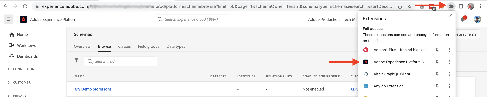

# AEM-CIF kerncomponenten en Adobe Experience Platform-integratie {#aem-cif-aep-integration}

De [Commerce integration framework (CIF)](https://github.com/adobe/aem-core-cif-components) kerncomponenten bieden naadloze integratie met [Adobe Experience Platform](https://experienceleague.adobe.com/docs/experience-platform/landing/platform-overview.html?lang=en) om storefront gebeurtenissen en hun gegevens van cliënt-zijinteractie zoals door:sturen __toevoegen aan winkelwagentje__.

De [AEM CIF Core-componenten](https://github.com/adobe/aem-core-cif-components) project bevat een JavaScript-bibliotheek met de naam [Adobe Experience Platform-connector voor Adobe Commerce](https://github.com/adobe/aem-core-cif-components/tree/master/extensions/experience-platform-connector) om gebeurtenisgegevens te verzamelen van uw Opslag van de Handel. Deze gebeurtenisgegevens worden naar het Experience Platform verzonden waar ze worden gebruikt in andere Adobe Experience Cloud-producten, zoals Adobe Analytics en Adobe Target, om een profiel van 360 graden te maken dat een klantentraject bestrijkt. Door de gegevens van de Handel met andere producten in Adobe Experience Cloud te verbinden, kunt u taken uitvoeren zoals gebruikersgedrag op uw plaats analyseren, het testen van AB uitvoeren, en gepersonaliseerde campagnes creëren.

Meer informatie over de [Gegevensverzameling Experience Platform](https://experienceleague.adobe.com/docs/experience-platform/collection/home.html) reeks technologieën waarmee u gegevens van de klantenervaring van cliënt-zijbronnen kunt verzamelen.

## Verzenden `addToCart` gebeurtenisgegevens naar Experience Platform {#send-addtocart-to-aep}

In de volgende stappen wordt getoond hoe u de `addToCart` gebeurtenisgegevens van AEM-teruggegeven productpagina&#39;s aan het Experience Platform gebruiken CIF - de Schakelaar van het Experience Platform. Met de browserextensie van het Adobe Experience Platform Debugger kunt u de verzonden gegevens testen en bekijken.


## Vereisten {#prerequisites}

U moet een lokale ontwikkelomgeving gebruiken om deze demo te voltooien. Dit omvat een lopende instantie van AEM die wordt gevormd en met een instantie van Adobe Commerce verbonden. De vereisten en stappen voor [lokale ontwikkeling instellen met AEM as a Cloud Service SDK](../develop.md).

U hebt ook toegang nodig tot [Adobe Experience Platform](https://experienceleague.adobe.com/docs/experience-platform/landing/platform-ui/ui-guide.html) en toestemmingen om het schema, de dataset, en de gegevensstromen voor gegevensinzameling tot stand te brengen. Zie voor meer informatie [Machtigingsbeheer](https://experienceleague.adobe.com/docs/experience-platform/collection/permissions.html).

## as a Cloud Service instelling AEM Commerce {#aem-setup}

Om een werkende te hebben __AEM Commerce as a Cloud Service__ de lokale omgeving met de noodzakelijke code en config, voltooi de volgende stappen.

### Lokale instellingen

Volg de [Lokale instelling](https://experienceleague.adobe.com/docs/experience-manager-cloud-service/content/content-and-commerce/storefront/developing/develop.html?#local-setup) stappen om te komen tot een werkende AEM as a Cloud Service handelsomgeving.

### Projectinstelling

Volg de [Projectarchetype AEM](https://experienceleague.adobe.com/docs/experience-manager-cloud-service/content/content-and-commerce/storefront/developing/develop.html?#project) stappen om een gloednieuw project AEM Commerce (CIF) te creëren.

>[!TIP]
>
>In het volgende voorbeeld krijgt het project AEM Commerce de naam: `My Demo Storefront`U kunt echter uw eigen projectnaam kiezen.


Bouw en stel het gecreeerde AEM project van de Handel aan lokale AEM SDK op door het volgende bevel van de wortelfolder van het project in werking te stellen.

```bash
$ mvn clean install -PautoInstallSinglePackage
```

De lokale implementatie `My Demo StoreFront` de handelsplaats met standaardcode en inhoud kijkt als volgt:


### Peregrine- en CIF-AEP-connectorafhankelijkheden installeren

Om de gebeurtenisgegevens van de categorie en productpagina&#39;s van deze AEM Commerce-site te verzamelen en te verzenden, moet u de sleutel installeren `npm` in de `ui.frontend` module van het AEM Commerce-project.

Ga naar de `ui.frontend` en installeer de vereiste pakketten door de volgende bevelen van de bevellijn in werking te stellen.

```bash
npm i --save lodash.get@^4.4.2 lodash.set@^4.3.2
npm i --save apollo-cache-persist@^0.1.1
npm i --save redux-thunk@~2.3.0
npm i --save @adobe/apollo-link-mutation-queue@~1.1.0
npm i --save @magento/peregrine@~12.5.0
npm i --save @adobe/aem-core-cif-react-components --force
npm i --save-dev @magento/babel-preset-peregrine@~1.2.1
npm i --save @adobe/aem-core-cif-experience-platform-connector --force
```

>[!IMPORTANT]
>
>De `--force` argument is soms vereist zoals [PWA Studio](https://developer.adobe.com/commerce/pwa-studio/) is beperkt met de ondersteunde peer-afhankelijkheden. Gewoonlijk zou dit geen problemen mogen veroorzaken.


### Maven configureren voor gebruik `--force` argument

Als onderdeel van het Maven-buildproces wordt de npm schoon geïnstalleerd (met `npm ci`) wordt geactiveerd. Dit vereist ook `--force` argument.

Navigeer naar het hoofd-POM-bestand van het project `pom.xml` en zoek de `<id>npm ci</id>` uitvoeringsblok. Werk het blok bij zodat het er als volgt uitziet:

```xml
<execution>
    <id>npm ci</id>
    <goals>
    <goal>npm</goal>
    </goals>
    <configuration>
    <arguments>ci --force</arguments>
    </configuration>
</execution>
```

### Babel-configuratieopmaak wijzigen

Van de standaard overschakelen `.babelrc` bestands-relatieve indeling van configuratiebestand `babel.config.js` gebruiken. Dit is een configuratieformaat voor het hele project en laat de plugins en de voorinstellingen toe om op worden toegepast `node_module` met meer controle.

1. Ga naar de `ui.frontend` en de bestaande `.babelrc` bestand.

1. Een `babel.config.js` bestand dat het `peregrine` voorinstelling.

   ```javascript
   const peregrine = require('@magento/babel-preset-peregrine');
   
   module.exports = (api, opts = {}) => {
       const config = {
           ...peregrine(api, opts),
           sourceType: 'unambiguous'
       } 
   
       config.plugins = config.plugins.filter(plugin => plugin !== 'react-refresh/babel');
   
       return config;
   }
   ```

### Webpack configureren voor gebruik van Babel

JavaScript-bestanden omzetten met behulp van BabelLoader (`babel-loader`) en webpack, moet u de `webpack.common.js` bestand.

Ga naar de `ui.frontend` en de `webpack.common.js` bestand om de volgende regel in het `module` eigenschapswaarde:

```javascript
{
    test: /\.jsx?$/,
    exclude: /node_modules\/(?!@magento\/)/,
    loader: 'babel-loader'
}
```

### Apollo-client configureren

De [Apollo-client](https://www.apollographql.com/docs/react/) wordt gebruikt voor het beheer van lokale en externe gegevens met GraphQL. De resultaten van GraphQL-query&#39;s worden ook opgeslagen in een lokale, genormaliseerde cache in het geheugen.

Voor [`InMemoryCache`](https://www.apollographql.com/docs/react/caching/cache-configuration/) om effectief te kunnen werken hebt u een `possibleTypes.js` bestand. Als u dit bestand wilt genereren, raadpleegt u [Mogelijke typen automatisch genereren](https://www.apollographql.com/docs/react/data/fragments/#generating-possibletypes-automatically). Zie ook de [Referentie-implementatie van PWA Studio](https://github.com/magento/pwa-studio/blob/1977f38305ff6c0e2b23a9da7beb0b2f69758bed/packages/pwa-buildpack/lib/Utilities/graphQL.js#L106-L120) en een voorbeeld van [`possibleTypes.js`](../assets/aep-integration/possibleTypes.js) bestand.


1. Ga naar de `ui.frontend` en sla het bestand op als `./src/main/possibleTypes.js`

1. Werk de `webpack.common.js` bestand `DefinePlugin` sectie om de vereiste statische variabelen tijdens bouwstijltijd te vervangen.

   ```javascript
   const { DefinePlugin } = require('webpack');
   const { POSSIBLE_TYPES } = require('./src/main/possibleTypes');
   
   ...
   
   plugins: [
       ...
       new DefinePlugin({
           'process.env.USE_STORE_CODE_IN_URL': false,
           POSSIBLE_TYPES
       })
   ]
   ```

### Peregrine en CIF basiscomponenten initialiseren

Om React-based Peregrine en CIF kerncomponenten te initialiseren, creeer de vereiste configuratie en dossiers JavaScript.

1. Ga naar de `ui.frontend` en maak de volgende map: `src/main/webpack/components/commerce/App`

1. Een `config.js` bestand met de volgende inhoud:

   ```javascript
   // get and parse the CIF store configuration from the <head>
   const storeConfigEl = document.querySelector('meta[name="store-config"]');
   const storeConfig = storeConfigEl ? JSON.parse(storeConfigEl.content) : {};
   
   // the following global variables are needed for some of the peregrine features
   window.STORE_VIEW_CODE = storeConfig.storeView || 'default';
   window.AVAILABLE_STORE_VIEWS = [
       {
           code: window.STORE_VIEW_CODE,
           base_currency_code: 'USD',
           default_display_currency_code: 'USD',
           id: 1,
           locale: 'en',
           secure_base_media_url: '',
           store_name: 'My Demo StoreFront'
       }
   ];
   window.STORE_NAME = window.STORE_VIEW_CODE;
   window.DEFAULT_COUNTRY_CODE = 'en';
   
   export default {
       storeView: window.STORE_VIEW_CODE,
       graphqlEndpoint: storeConfig.graphqlEndpoint,
       // Can be GET or POST. When selecting GET, this applies to cache-able GraphQL query requests only.
       // Mutations will always be executed as POST requests.
       graphqlMethod: storeConfig.graphqlMethod,
       headers: storeConfig.headers,
   
       mountingPoints: {
           // TODO: define the application specific mount points as they may be used by <Portal> and <PortalPlacer>
       },
       pagePaths: {
           // TODO: define the application specific paths/urls as they may be used by the components
           baseUrl: storeConfig.storeRootUrl
       },
       eventsCollector: {
           // Enable the Experience Platform Connector and define the org and datastream to use
           aep: {
               orgId: // TODO: add your orgId
               datastreamId: // TODO: add your datastreamId
           }
       }
   };
   ```

   >[!IMPORTANT]
   >
   >Terwijl u reeds vertrouwd met zou kunnen zijn [`config.js`](https://github.com/adobe/aem-cif-guides-venia/blob/main/ui.frontend/src/main/components/App/config.js) bestand van __AEM - CIF Venia-project__ Er zijn enkele wijzigingen die u in dit bestand moet aanbrengen. Eerst alle __TODO__ opmerkingen. Dan, binnen `eventsCollector` eigenschap, zoek de `eventsCollector > aed` object en werk de `orgId` en `datastreamId` eigenschappen voor de juiste waarden. [Meer informatie](./aep.md#add-aep-values-to-aem).

1. Een `App.js` bestand met de volgende inhoud. Dit bestand lijkt op een typisch React-startpuntbestand en bevat React en aangepaste haken en React-contextgebruik om de integratie van het Experience Platform te vergemakkelijken.

   ```javascript
   import config from './config';
   
   import React, { useEffect } from 'react';
   import ReactDOM from 'react-dom';
   import { IntlProvider } from 'react-intl';
   import { BrowserRouter as Router } from 'react-router-dom';
   import { combineReducers, createStore } from 'redux';
   import { Provider as ReduxProvider } from 'react-redux';
   import { createHttpLink, ApolloProvider } from '@apollo/client';
   import { ConfigContextProvider, useCustomUrlEvent, useReferrerEvent, usePageEvent, useDataLayerEvents, useAddToCartEvent } from '@adobe/aem-core-cif-react-components';
   import { EventCollectorContextProvider, useEventCollectorContext } from '@adobe/aem-core-cif-experience-platform-connector';
   import { useAdapter } from '@magento/peregrine/lib/talons/Adapter/useAdapter';
   import { customFetchToShrinkQuery } from '@magento/peregrine/lib/Apollo/links';
   import { BrowserPersistence } from '@magento/peregrine/lib/util';
   import { default as PeregrineContextProvider } from '@magento/peregrine/lib/PeregrineContextProvider';
   import { enhancer, reducers } from '@magento/peregrine/lib/store';
   
   const storage = new BrowserPersistence();
   const store = createStore(combineReducers(reducers), enhancer);
   
   storage.setItem('store_view_code', config.storeView);
   
   const App = () => {
       const [{ sdk: mse }] = useEventCollectorContext();
   
       // trigger page-level events
       useCustomUrlEvent({ mse });
       useReferrerEvent({ mse });
       usePageEvent({ mse });
       // listen for add-to-cart events and enable forwarding to the magento storefront events sdk
       useAddToCartEvent(({ mse }));
       // enable CIF specific event forwarding to the Adobe Client Data Layer
       useDataLayerEvents();
   
       useEffect(() => {
           // implement a proper marketing opt-in, for demo purpose you hard-set the consent cookie
           if (document.cookie.indexOf('mg_dnt') < 0) {
               document.cookie += '; mg_dnt=track';
           }
       }, []);
   
       // TODO: use the App to create Portals and PortalPlaceholders to mount the CIF / Peregrine components to the server side rendered markup
       return <></>;
   };
   
   const AppContext = ({ children }) => {
       const { storeView, graphqlEndpoint, graphqlMethod = 'POST', headers = {}, eventsCollector } = config;
       const { apolloProps } = useAdapter({
           apiUrl: new URL(graphqlEndpoint, window.location.origin).toString(),
           configureLinks: (links, apiBase) =>
               // reconfigure the HTTP link to use the configured graphqlEndpoint, graphqlMethod and storeView header
   
               links.set('HTTP', createHttpLink({
                   fetch: customFetchToShrinkQuery,
                   useGETForQueries: graphqlMethod !== 'POST',
                   uri: apiBase,
                   headers: { ...headers, 'Store': storeView }
               }))
       });
   
       return (
           <ApolloProvider {...apolloProps}>
               <IntlProvider locale='en' messages={{}}>
                   <ConfigContextProvider config={config}>
                       <ReduxProvider store={store}>
                           <PeregrineContextProvider>
                               <EventCollectorContextProvider {...eventsCollector}>
                                   {children}
                               </EventCollectorContextProvider>
                           </PeregrineContextProvider>
                       </ReduxProvider>
                   </ConfigContextProvider>
               </IntlProvider>
           </ApolloProvider>
       );
   };
   
   window.onload = async () => {
       const root = document.createElement('div');
       document.body.appendChild(root);
   
       ReactDOM.render(
           <Router>
               <AppContext>
                   <App />
               </AppContext>
           </Router>,
           root
       );
   };
   ```

   De `EventCollectorContext` Hiermee exporteert u de reactiecontext die:

   - laadt de bibliotheek commerce-events-sdk en commerce-events-collector;
   - initialiseert hen met een bepaalde configuratie voor Experience Platform en/of ACDS
   - zich te abonneren op alle gebeurtenissen vanuit Peregrine en deze door te sturen naar de evenementen SDK

   U kunt de implementatiedetails van bekijken `EventCollectorContext` [hier](https://github.com/adobe/aem-core-cif-components/blob/3d4e44d81fff2f398fd2376d24f7b7019f20b31b/extensions/experience-platform-connector/src/events-collector/EventCollectorContext.js).

### Het bijgewerkte AEM-project samenstellen en implementeren

Om ervoor te zorgen de bovengenoemde pakketinstallatie, de code, en config veranderingen correct zijn, herbouwt, en stelt het bijgewerkte AEM project van de Handel op gebruikend het volgende Gemaakt bevel: `$ mvn clean install -PautoInstallSinglePackage`.

## Experience Platform instellen {#aep-setup}

Voer de volgende stappen uit om de gebeurtenisgegevens die afkomstig zijn van de pagina&#39;s AEM Handel, zoals categorie en product, te ontvangen en op te slaan:

>[!AVAILABILITY]
>
>Zorg ervoor dat u deel uitmaakt van het juiste __Productprofielen__ krachtens __Adobe Experience Platform__ en __Adobe Experience Platform-gegevensverzameling__. Werk zo nodig samen met de systeembeheerder om bestanden te maken, bij te werken of toe te wijzen __Productprofielen__ onder de [Admin Console](https://adminconsole.adobe.com/).

### Schema maken met de veldgroep Handel

Om de structuur voor de gegevens van de handelsgebeurtenis te bepalen, moet u een schema van de Gegevens van de Ervaring van het Model (XDM) tot stand brengen. Een schema is een set regels die de structuur en indeling van gegevens vertegenwoordigen en valideren.

1. Navigeer in de browser naar de knop __Adobe Experience Platform__ startpagina product. Bijvoorbeeld: <https://experience.adobe.com/#/@YOUR-ORG-NAME/sname:prod/platform/home>.

1. Zoek de __Schemas__ in de linkernavigatiesectie klikt u op de knop __Schema maken__ in de rechterbovensectie en selecteert u __XDM ExperienceEvent__.

   

1. Geef uw schema een naam met de __Schema-eigenschappen > Weergavenaam__ veld- en veldgroepen toevoegen met de opdracht  __Compositie > Veldgroepen > Toevoegen__ knop.

   

1. In de __Veldgroepen toevoegen__ dialoogvenster, zoeken naar `Commerce`, selecteert u de __Handelsgegevens__ selectievakje en klik op __Veldgroepen toevoegen__.

   


>[!TIP]
>
>Zie de [Basisbeginselen van de schemacompositie](https://experienceleague.adobe.com/docs/experience-platform/xdm/schema/composition.html) voor meer informatie .

### Gegevensset maken

Om de gebeurtenisgegevens op te slaan, moet u een Dataset tot stand brengen die aan de schemadefinitie voldoet. Een dataset is een opslag en beheersconstructie voor een inzameling van gegevens, typisch een lijst, die een schema (kolommen) en gebieden (rijen) bevat.

1. Navigeer in de browser naar de knop __Adobe Experience Platform__ startpagina product. Bijvoorbeeld: <https://experience.adobe.com/#/@YOUR-ORG-NAME/sname:prod/platform/home>.

1. Zoek de __Gegevenssets__ in de linkernavigatiesectie en klik op de knop __Gegevensset maken__ in de rechterbovensectie.

   

1. Selecteer op de nieuwe pagina de optie __Gegevensset maken van schema__ kaart.

   

- Op de nieuwe pagina: __zoeken en selecteren__ het schema u in de vorige stap creeerde, en klik __Volgende__ knop.

  

1. Geef uw gegevensset een naam met de __Gegevensset configureren > Naam__ en klik op de knop __Voltooien__ knop.

   

>[!TIP]
>
>Zie de [Overzicht van gegevenssets](https://experienceleague.adobe.com/docs/experience-platform/catalog/datasets/overview.html) voor meer informatie .


### DataStream maken

Voer de volgende stappen uit om een DataStream in het Experience Platform te maken.

1. Navigeer in de browser naar de knop __Adobe Experience Platform__ startpagina product. Bijvoorbeeld: <https://experience.adobe.com/#/@YOUR-ORG-NAME/sname:prod/platform/home>.

1. Zoek de __Gegevensstromen__ in de linkernavigatiesectie en klik op de knop __Nieuwe DataStream__ in de rechterbovensectie.

   

1. Geef uw DataStream een naam met de __Naam__ vereist veld. Onder de __Gebeurtenisschema__ veld, selecteer het gemaakte schema en klik op __Opslaan__.

   

1. Open de gemaakte DataStream en klik op __Service toevoegen__.

   

1. Onder de __Service__ veld selecteert u de __Adobe Experience Platform__ -optie. Onder __Gebeurtenisgegevens__ veld, selecteer de naam van de gegevensset uit de vorige stap en klik op __Opslaan__.

   

>[!TIP]
>
>Zie de [Overzicht van DataStream](https://experienceleague.adobe.com/docs/experience-platform/edge/datastreams/overview.html) voor meer informatie .

## Gegevensstroomwaarde toevoegen aan AEM Commerce-configuratie {#add-aep-values-to-aem}

Nadat u de bovenstaande installatie van het Experience Platform hebt voltooid, hebt u `datastreamId` in de linkerspoorlijn van de DataStream-gegevens en `orgId` in de rechterbovenhoek van het __Profielafbeelding > Accountgegevens > Gebruikersgegevens__ modal.


1. In het AEM Commerce-project `ui.frontend` -module, de `config.js` en met name de `eventsCollector > aep` objecteigenschappen.

1. Het bijgewerkte AEM Commerce-project samenstellen en implementeren


## Trigger `addToCart` gebeurtenis en verifieer gegevensverzameling {#event-trigger-verify}

De bovenstaande stappen voltooien de installatie van AEM Commerce en Experience Platform. U kunt nu een `addToCart` gebeurtenis en verifieer gegevensinzameling gebruikend debugger en dataset van het Experience Platform __Statistieken en grafieken__ schakelen in de gebruikersinterface van het product.

Als u de gebeurtenis wilt activeren, kunt u AEM auteur of de publicatieservice gebruiken vanuit uw lokale instellingen. In dit voorbeeld gebruikt u AEM auteur door u aan te melden bij uw account.

1. Selecteer op de pagina Sites de optie __My Demo StoreFront > us > nl__ pagina en klik op __Bewerken__ in de bovenste actiebalk.

1. Klik in de bovenste actiebalk op __Weergeven als gepubliceerd__ en klikt u vervolgens op de gewenste categorie in de navigatie van de winkel.

1. Klik op de gewenste productkaart in het dialoogvenster __Productpagina__ selecteert u vervolgens __kleur, grootte__ de __Toevoegen aan winkelwagentje__ knop.


1. Open de __Adobe Experience Platform Debugger__ in het extensiepaneel van de browser en selecteert u __Experience Platform Wed SDK__ in het linkerspoor.

   


1. Terugkeren naar de __Productpagina__ en klik op __Toevoegen aan winkelwagentje__ knop. Hiermee worden gegevens naar het Experience Platform verzonden. De __Adobe Experience Platform Debugger__ De extensie geeft de gebeurtenisdetails weer.

   


1. Navigeer in de gebruikersinterface van het product Experience Platform naar de __Datasets > My Demo StoreFront__, onder de __Gegevensactiviteit__ tab. Als de __Statistieken en grafieken__ schakeloptie is ingeschakeld, worden de status van de gebeurtenisgegevens weergegeven.

   


## Implementatiedetails {#implementation-details}

De [CIF Experience Platform-aansluiting](https://github.com/adobe/aem-core-cif-components/tree/master/extensions/experience-platform-connector) is op de bovenkant van [Experience Platform Connector voor Adobe Commerce](https://marketplace.magento.com/magento-experience-platform-connector.html), die deel uitmaakt van het [PWA Studio](https://developer.adobe.com/commerce/pwa-studio/) project.

Het project van de PWA Studio laat u Progressive Web Application (PWA) opslagplaatsen tot stand brengen die door Adobe Commerce of Magento Open Source worden aangedreven. Het project bevat ook een componentenbibliotheek genoemd [Peregrin](https://developer.adobe.com/commerce/pwa-studio/api/peregrine/) voor het toevoegen van logica aan visuele componenten. De [Peregrin-bibliotheek](https://developer.adobe.com/commerce/pwa-studio/api/peregrine/) biedt ook de aangepaste React-haken die worden gebruikt door [Experience Platform Connector](https://github.com/adobe/aem-core-cif-components/tree/master/extensions/experience-platform-connector) naadloos met Experience Platform te integreren.


## Ondersteunde gebeurtenissen {#supported-events}

Vanaf nu worden de volgende gebeurtenissen ondersteund:

__XDM-gebeurtenissen ervaren:__

1. Toevoegen aan winkelwagentje (AEM)
1. Pagina weergeven (AEM)
1. Product weergeven (AEM)
1. Zoekaanvraag verzonden (AEM)
1. Respons zoekopdracht ontvangen (AEM)

Wanneer [Peregrine-onderdelen](https://developer.adobe.com/commerce/pwa-studio/guides/packages/peregrine/) worden opnieuw gebruikt in het AEM Commerce-project:

__XDM-gebeurtenissen ervaren:__

1. Verwijderen uit winkelwagen
1. Winkelwagentje openen
1. Winkelwagentje bekijken
1. Direct aanschaffen
1. Afhandeling starten
1. Uitchecken voltooien

__XDM-profielgebeurtenissen:__

1. Aanmelden
1. Account maken
1. Account bewerken


## Aanvullende bronnen {#additional-resources}

Zie de volgende bronnen voor meer informatie:

- [PWA Studio](https://developer.adobe.com/commerce/pwa-studio/)
- [[!DNL Data Connection] overzicht](https://experienceleague.adobe.com/docs/commerce-merchant-services/data-connection/overview.html)
- [[!DNL Data Connection] Gebeurtenissen](https://experienceleague.adobe.com/docs/commerce-merchant-services/data-connection/event-forwarding/events.html)
- [Adobe Experience Platform-overzicht](https://experienceleague.adobe.com/docs/experience-platform/landing/home.html)
