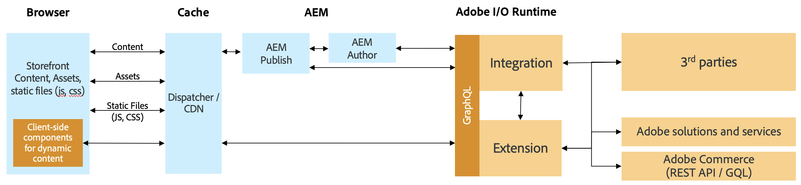

# AEM en integratie van de Handel van de derde partij die het Kader van de Integratie van de Handel gebruiken {#aem-third-party}

De integratie van een niet-Adobe Commerce-oplossing is een gemeenschappelijk scenario voor CIF. Oplossingen van derden met verschillende API&#39;s en schema&#39;s worden verbonden via een integratielaag.

## Architectuur {#architecture}

De architectuur ziet er als volgt uit:

Het doel van deze integratielaag is derde-partij APIs en schema&#39;s tegen gesteunde Adobe Commerce GraphQL APIs en schema&#39;s buiten de Experience Manager in kaart te brengen. Dankzij deze inkapseling kunnen de integratielogica en -systemen worden bijgewerkt zonder code in de Experience Manager te wijzigen.

## Oplossingsvereisten voor integratie

Als de Experience Manager op aanvraag gegevens ophaalt, zijn realtime API&#39;s voor de productcatalogus vereist.

>[!TIP]
>
>Als er geen real-time API&#39;s beschikbaar zijn, moet een externe productcache met API&#39;s worden gebruikt voor de integratie. Voorbeeld [Magento open-source](https://magento.com/products/magento-open-source).

Het is niet nodig om het volledige schema GraphQL uit te voeren, enkel de voorwerpen van het schema om de gewenste gebruik-gevallen toe te laten.

## Gebruiksscenario&#39;s voor backend

CIF breidt de Experience Manager met de hulpmiddelen van het de productcatalogustoegang in real time en van het de ervaringsbeheer van het product uit. Deze naadloze integratie laat auteurs toe om tot handelsgegevens toegang te hebben gebruikend ingebedde UIs wanneer nodig zonder de inhoudscontext te verlaten.

De integratie van de productcatalogus-API&#39;s is vereist om deze gebruiksgevallen te ontgrendelen.

## Voorlopige gebruiksgevallen

[AEM CIF Core-](https://github.com/adobe/aem-core-cif-components) componenten halen gegevens op en wisselen deze uit via de door CIF ondersteunde Adobe Commerce-API&#39;s. Om componenten te hergebruiken, moeten de respectieve APIs worden uitgevoerd.

De aanbeveling voor prestaties kritieke cliënt-zijcomponenten moet direct met de derdeoplossing communiceren om latentie te vermijden.

## Een integratie ontwikkelen {#develop-integration}

Wij adviseren om [Adobe I/O Runtime](https://www.adobe.io/apis/experienceplatform/runtime.html) voor de integratielaag te gebruiken. Het is opgenomen in de cif-invoegtoepassing voor derden. Aangezien het met een microdienst-als benadering werkt, is het geschikt om gemakkelijk veelvoudige oplossingen te integreren.

De [verwijzingsimplementatie](https://github.com/adobe/commerce-cif-graphql-integration-reference) is een groot uitgangspunt om de integratie aan uw handelsoplossing te bouwen. Hoewel GraphQL wordt ondersteund, kan deze ook worden geïntegreerd met elk ander type API, zoals REST.

Deze integratielaag is niet vereist als er een laag van derden beschikbaar is (bijvoorbeeld Mulesoft) of als de integratie op de oplossing van derden wordt gebouwd.
