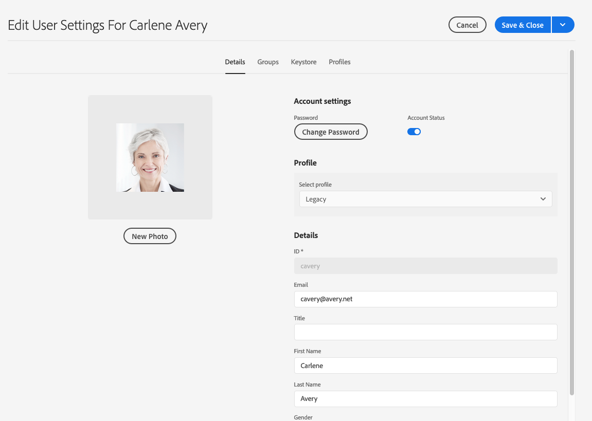

# Adobe Experience Manager as a Cloud Service Foundation Readiness for Data Protection and Data Privacy Regulations {#aem-foundation-readiness-for-data-protection-and-data-privacy-regulations}

>[!WARNING]
>
>De inhoud van dit document is geen juridisch advies en is niet bedoeld als vervanging van juridisch advies.
>
>Raadpleeg de juridische afdeling van uw bedrijf voor advies over regelgeving inzake gegevensbescherming en gegevensbescherming.

>[!NOTE]
>
>Voor meer informatie over de reactie van Adobe op privacykwesties, en wat het voor u als klant van Adobe betekent, zie [&#x200B; het Centrum van de Privacy van Adobe &#x200B;](https://www.adobe.com/privacy.html).

## AEM Foundation - ondersteuning voor gegevensbescherming en -bescherming {#aem-foundation-data-privacy-and-protection-support}

Op het niveau van de Stichting van AEM, worden de Persoonlijke Gegevens die wordt opgeslagen gehouden in het Profiel van de Gebruiker. Daarom richt de informatie in dit artikel hoofdzakelijk hoe te om tot gebruikersprofielen toegang te hebben en te schrappen, zodat kunt u de toegang richten, en verzoeken schrappen, respectievelijk.

## Een gebruikersprofiel openen {#accessing-a-user-profile}

### Handmatige stappen {#manual-steps}

1. Open de gebruikersbeheerconsole door naar **[!UICONTROL Tools - Security - Users]** te bladeren of door rechtstreeks naar `https://<serveraddress>:<serverport>/security/users.html` te bladeren

<!--
   
-->

1. Zoek vervolgens naar de desbetreffende gebruiker door de naam in de zoekbalk boven aan de pagina te typen:

   

1. Open ten slotte het gebruikersprofiel door erop te klikken en controleer het vervolgens onder de tab **[!UICONTROL Details]** .

   

### HTTP-API {#http-api}

Zoals vermeld, verstrekt Adobe APIs voor de toegang tot van gebruikersgegevens, om automatisering te vergemakkelijken. Er zijn verschillende typen API&#39;s die u kunt gebruiken:

**UserProperties API**

```shell
curl -u user:password http://localhost:4502/libs/granite/security/search/profile.userproperties.json\?authId\=cavery
```

**het Verdelen API**

**het ontdekken van het gebruikershuis:**

```xml
curl -g -u user:password 'http://localhost:4502/libs/granite/security/search/authorizables.json?query={"condition":[{"named":"cavery"}]}'
     {"authorizables":[{"type":"user","authorizableId_xss":"cavery","authorizableId":"cavery","name_xss":"Carlene Avery","name":"Carlene Avery","home":"/home/users/we-retail/DSCP-athB1NYLBXvdTuN"}],"total":1}
```

**het Terugwinnen van gebruikersgegevens:**

Gebruikend de knoopweg van het huisbezit van de nuttige lading JSON die van het bovengenoemde bevel is teruggekeerd:

```shell
curl -u user:password  'http://localhost:4502/home/users/we-retail/DSCP-athB1NYLBXvdTuN/profile.-1.json'
```

```shell
curl -u user:password  'http://localhost:4502/home/users/we-retail/DSCP-athB1NYLBXvdTuN/profiles.-1.json'
```

## Een gebruiker uitschakelen en de bijbehorende profielen verwijderen {#disabling-a-user-and-deleting-the-associated-profiles}

### Gebruiker uitschakelen {#disable-user}

1. Open de console van het Beleid van de Gebruiker en onderzoek naar de gebruiker in kwestie, zoals hierboven beschreven.
2. Houd de muisaanwijzer boven de gebruiker en klik op het pictogram Selecteren. Het profiel wordt grijs weergegeven om aan te geven dat het is geselecteerd.

3. In het hogere menu, klik **onbruikbaar maken** om (draai weg) de gebruiker onbruikbaar te maken:

    onbruikbaar

4. Ten slotte, bevestig de actie.

   De gebruikersinterface geeft aan dat de gebruikersaccount is gedeactiveerd door uit te schakelen en een vergrendeling toe te voegen aan de profielkaart:

   

### Gebruikersprofielgegevens verwijderen {#delete-user-profile-information}

>[!NOTE]
>
>Voor AEM as a Cloud Service is er geen handmatige procedure beschikbaar in de UI voor het verwijderen van een gebruikersprofiel, aangezien CRXDE niet toegankelijk is.

### HTTP-API {#http-api-1}

In de volgende procedures wordt het opdrachtregelprogramma `curl` gebruikt om aan te geven hoe u de gebruiker kunt uitschakelen met het gereedschap **[!UICONTROL cavery]** `userId` en hoe u de gebruikersprofielen kunt verwijderen die beschikbaar zijn op de standaardlocatie.

**het ontdekken van het gebruikershuis:**

```shell
curl -g -u user:password 'http://localhost:4502/libs/granite/security/search/authorizables.json?query={"condition":[{"named":"cavery"}]}'
     {"authorizables":[{"type":"user","authorizableId_xss":"cavery","authorizableId":"cavery","name_xss":"Carlene Avery","name":"Carlene Avery","home":"/home/users/we-retail/DSCP-athB1NYLBXvdTuN"}],"total":1}
```

**onbruikbaar makend de gebruiker:**

Gebruikend de knoopweg van het huisbezit van de nuttige lading JSON die van het bovengenoemde bevel is teruggekeerd:

```shell
curl -X POST -u user:password -FdisableUser="describe the reasons for disabling this user (Data Privacy in this case)" 'http://localhost:4502/home/users/we-retail/DSCP-athB1NYLBXvdTuN.rw.userprops.html'
```

**het Schrappen van gebruikersprofielen**

Het gebruiken van de knoopweg van het huisbezit van de nuttige lading JSON die van het bevel van de rekeningsontdekking en het gekende uit de knoopplaatsen van het kaderprofiel is teruggekeerd:

```shell
curl -X POST -u user:password -H "Accept: application/json,**/**;q=0.9" -d ':operation=delete' 'http://localhost:4502/home/users/we-retail/DSCP-athB1NYLBXvdTuN/profile'
```

```shell
curl -X POST -u user:password -H "Accept: application/json,**/**;q=0.9" -d ':operation=delete' 'http://localhost:4502/home/users/we-retail/DSCP-athB1NYLBXvdTuN/profile'
```
