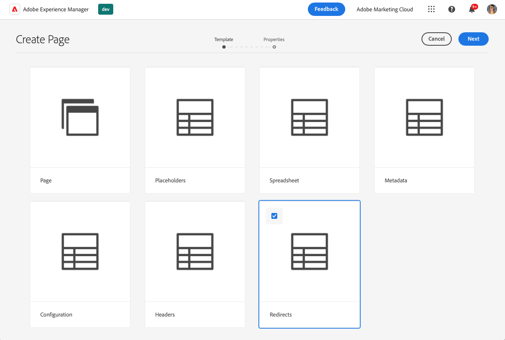
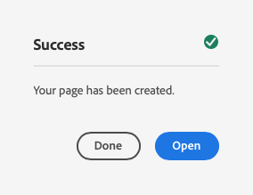
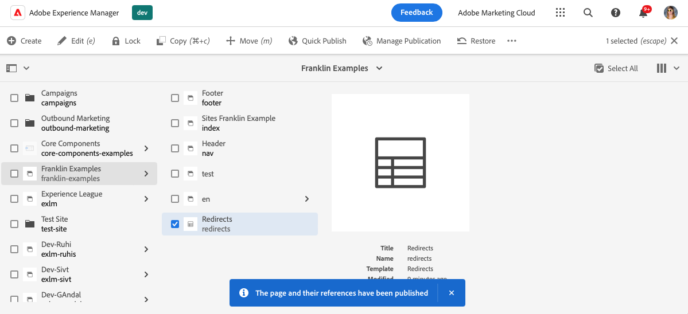

# Werkbladen gebruiken om tabelgegevens te beheren {#tabular-data}

Leer hoe u met werkbladen tabelgegevens kunt beheren voor verschillende waarden, zoals metagegevens en omleidingen voor uw AEM naar de site Edge Delivery Services.

## Gevallen gebruiken {#use-cases}

Voor om het even welke AEM met de plaats van Edge Delivery Services, is er een behoefte om lijsten van tabelgegevens zoals voor sleutel-waarde afbeeldingen te handhaven. Dit kunnen lijsten van vele verschillende waarden zoals meta-gegevens en omleiding zijn. Met Edge Deliver Services kunt u dergelijke tabellijsten bijhouden met behulp van een intuïtief gereedschap: het werkblad. AEM zet deze spreadsheets om in JSON-bestanden die eenvoudig door uw website of webtoepassing kunnen worden gebruikt.

Vaak voorkomende gevallen van gebruik zijn:

* [Plaatsaanduidingen](/help/edge/docs/placeholders.md)
* [Metagegevens](/help/edge/docs/bulk-metadata.md)
* [Kopteksten](/help/edge/docs/custom-headers.md)
* [Omleiding](/help/edge/docs/redirects.md)
* [Configuraties](/help/edge/docs/setup-byo-cdn-push-invalidation.md) zoals voor CND-instellingen

Bovendien kunt u [spreadsheets maken](#own-spreadsheet) van elke structuur om toewijzingen voor eigen doeleinden op te slaan.

Dit document gebruikt het voorbeeld van omleidingen om te illustreren hoe u dergelijke spreadsheets kunt maken. Zie de eerder-verbonden onderwerpen in de documentatie van Edge Delivery Services voor details van elk gebruiksgeval.

>[!TIP]
>
>Raadpleeg het document voor meer informatie over hoe spreadsheets in het algemeen werken met Edge Delivery Services [Spreadsheets en JSON.](/help/edge/developer/spreadsheets.md)

>[!TIP]
>
>Spreadsheets mogen alleen worden gebruikt om tabelgegevens te onderhouden. voor de opslag van gestructureerde gegevens, [bekijk AEM functies zonder kop.](/help/headless/introduction.md)

## Vereisten {#prerequisites}

Als u toewijzingen wilt maken met behulp van spreadsheets in uw AEM met Edge Delivery Services-project, moet u uw site hebben gemaakt met de nieuwste sitesjabloon.

Zie het document [Aan de slag-handleiding voor ontwikkelaars voor AEM ontwerpen met Edge Delivery Services](/help/edge/aem-authoring/edge-dev-getting-started.md) voor meer informatie .

## Een werkblad maken {#spreadsheet}

In dit voorbeeld maakt u een spreadsheet voor het beheren van omleidingen voor uw AEM met de site Edge Delivery Services. Dezelfde stappen gelden voor [andere spreadsheettypen](#other) die u wilt maken.

1. Meld u aan bij uw AEM as a Cloud Service ontwerpinstantie en ga naar de **Sites** en navigeer naar de hoofdmap van de site waarvoor een spreadsheet nodig is. Tik of klik op **Maken** -> **Pagina**.

   

1. Op de **Sjabloon** tikt of klikt u op de knop **Omleiding** sjabloon om het te selecteren en vervolgens te tikken of te klikken **Volgende**.

   

1. De **Eigenschappen** tabblad van de wizard geeft de standaardwaarden voor het spreadsheet voor omleidingen weer. Tik of klik op **Maken**.

   * **Titel** - Laat deze waarde ongewijzigd.
   * **Kolommen** - De minimale kolommen die nodig zijn voor omleidingen zijn vooraf ingevuld.
      * **bron** - De pagina die opnieuw moet worden omgeleid
      * **doel** - De pagina waarnaar moet worden omgeleid

   

1. In de **Succes** openen, tikken of klikken **Openen**.

   

1. Er wordt een nieuw tabblad geopend met de spreadsheet die in een editor is geladen met de vooraf gedefinieerde **bron** en **doel** kolommen. Tik of klik op de lege rij van de **bron** kolom. Wijzigingen worden automatisch opgeslagen wanneer u het werkblad bewerkt.

   

   * De **bron** is relatief ten opzichte van het domein van uw website, zodat het alleen het relatieve pad bevat.
   * De **doel** Dit kan een volledig gekwalificeerde URL zijn als u een andere website wilt gebruiken of een relatief pad als u een andere website wilt gebruiken.
   * Gebruik de Tab-toets om de focus naar de volgende cel te verplaatsen.
   * De redacteur voegt nieuwe rijen aan spreadsheet toe zonodig.
   * Als u een rij wilt verwijderen of verplaatsen, gebruikt u de opdracht **Verwijderen** aan het einde van elke rij en de sleepgrepen aan het begin van elke rij.

## Een spreadsheetpad.json publiceren {#paths-json}

Als AEM de gegevens in uw spreadsheet wilt publiceren, moet u bovendien de `paths.json` bestand van uw project.

1. Open de wortel van uw project in GitHub.

1. Tik of klik op de knop `paths.json` om de details te openen en vervolgens de **Bewerken** pictogram.

   

1. Voeg een lijn toe om uw nieuwe spreadsheet aan een `redirects.json` resource.

   ```json
   {
     "mappings": [
      "/content/<site-name>/:/",
      "/content/<site-name>/redirects:/redirects.json"
     ]
   }
   ```

1. Klikken **Wijzigingen vastleggen...** om de wijzigingen op te slaan in `main`.

   * Vastleggen aan `main` of maak een pull-aanvraag volgens uw proces.

1. Wanneer u klaar bent met het definiëren van de omleidingen en u de padtoewijzing hebt bijgewerkt, gaat u terug naar de **Sites** console.

1. Tik of klik om het werkblad voor omleiding te selecteren dat u in de console hebt gemaakt en tik of klik op **Snel publiceren** in de actiebalk om het werkblad te publiceren.

   

1. In de **Snel publiceren** openen, tikken of klikken **Publiceren**.

   

1. Een banner bevestigt de publicatie.

   

Het spreadsheet voor omleiding wordt nu gepubliceerd en openbaar gemaakt.

## Andere spreadsheettypen {#other}

Nu u weet hoe u een spreadsheet voor omleidingen kunt maken, kunt u elk ander standaardspreadsheettype maken:

* Plaatsaanduidingen
* Metagegevens
* Kopteksten
* Configuratie

Voer gewoon dezelfde stappen uit in de secties [Werkblad maken](#spreadsheet) en [Paden.json bijwerken](#paths-json) en kiest u de juiste sjabloon en werkt u de `paths.json` bestand naar behoren.

Voor [Configuratie](https://www.aem.live/docs/configuration), [Kopteksten](https://www.aem.live/docs/custom-headers) en [Metagegevens](https://www.aem.live/docs/bulk-metadata) zorg ervoor dat u een toewijzing toevoegt om deze naar de standaardlocaties te publiceren:

* Configuratie: `/.helix/config.json`
* Kopteksten: `/.helix/headers.json`
* Metagegevens: `/metadata.json`

Bovendien kunt u [uw eigen spreadsheet maken](#own-spreadsheet) met willekeurige kolommen voor eigen gebruik.

>[!NOTE]
>
>U te hoeven om geen spreadsheet tot stand te brengen om het indexeren voor AEM as a Cloud Service met de projecten van Edge Delivery Services te beheren.
>
>Als u uw eigen indexen wilt maken, [volg deze documentatie](https://www.aem.live/developer/indexing#setting-up-more-index-configurations) om uw eigen `helix-query.yaml` bestand.

## Uw eigen spreadsheet maken {#own-spreadsheet}

1. Voer dezelfde stappen uit in de sectie [Werkblad maken.](#spreadsheet)

1. Als u de sjabloon selecteert, kiest u **Werkblad**.

1. In de **Eigenschappen** kunt u uw eigen kolommen toevoegen.

   

   * In de **Kolommen** sectie, tikken of klikken **Toevoegen** een nieuwe kolom toevoegen.
   * Geef een naam op voor de kolom.
   * De kolommen verwijderen of opnieuw ordenen met de opdracht **Verwijderen** en sleep handvatpictogrammen, respectievelijk.

1. Maak het spreadsheet en publiceer dit volgens de instructies voor het spreadsheet omleiden.

1. Een toewijzing toevoegen aan de `paths.json` gebruiken volgens de instructies voor het spreadsheet omleiden.

