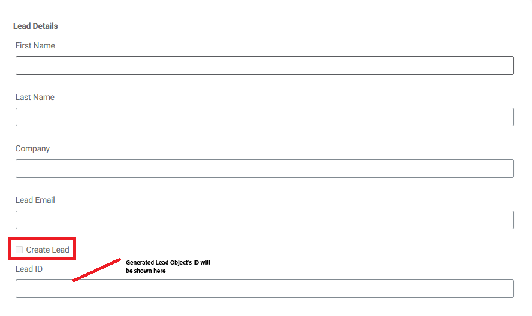

# Salesforce Lead-object maken met API-integratie

In dit geval wordt uitgelegd hoe u een lead in Salesforce kunt maken met behulp van de API-integratie. Aan het einde van het proces kunt u het volgende doen:

Opstelling a [ Verbonden App in Salesforce ](https://help.salesforce.com/s/articleView?id=platform.ev_relay_create_connected_app.htm&type=5) om veilige API toegang toe te laten.

Configureer CORS (Cross-Origin Resource Sharing) om code (zoals JavaScript) die in een webbrowser wordt uitgevoerd, toe te staan te communiceren met Salesforce vanaf een bepaalde oorsprong, de oorsprong toe te voegen aan de lijst van gewenste personen, zoals hieronder wordt weergegeven


## Aangesloten toepassingsinstellingen

De volgende instellingen worden gebruikt in de verbonden app. U kunt het bereik OAuth toewijzen afhankelijk van uw vereisten.


## API-integratie maken

| Naam | Waarde |
|--------------------------------|------------------|
| API-URL | https://`<your-domain>` d.my.salesforce.com/services/data/v32.0/sobjects/Lead |
| Client-id | Specifiek voor uw verbonden app |
| Clientgeheim | Specifiek voor uw verbonden app |
| OAuth URL | https://login.salesforce.com/services/oauth2/authorize |
| Toegang tot token-URL | https://`<your-domain>`/services/oauth2/token |
| Token-URL vernieuwen | https://`<your-domain>`/services/oauth2/token |
| Autorisatiebereik | api chatter_api full id openid refresh_token visualforce web |
| Autorisatieheader | Vergunninghouder |


## Invoer- en uitvoerparameters

Definieer de invoerparameters voor de API-aanroep en wijs de uitvoerparameters toe met behulp van de volgende json

```json
{
    "id": "00QKY000001LyJR2A0",
    "success": true
}
```


## Een formulier maken

Een eenvoudig adaptief formulier maken met de Universal Editor om de details van het object Lead vast te leggen, zoals hieronder wordt weergegeven


Verwerk de klikgebeurtenis op Create leidt checkbox gebruikend de regelredacteur. Wijs de invoerparameters toe aan de waarden van de desbetreffende formulierobjecten, zoals hieronder wordt weergegeven. Geef de id van het nieuwe object Lead weer in het `leadid` object TextField


## Integratie testen

- Een voorbeeld van het formulier bekijken
- Geef betekenisvolle waarden op
- Schakel het selectievakje `Create Lead` in om de API-aanroep te activeren
- De lood-id van het nieuwe object Lead wordt weergegeven in het tekstveld `Lead ID` .
