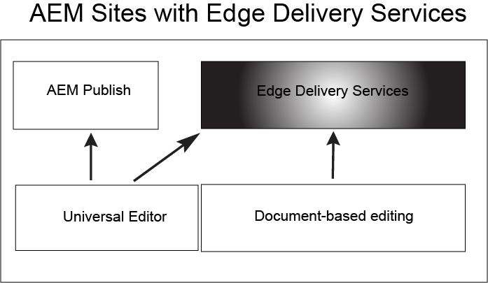

# Aan de slag met Edge Delivery Services {#getstart-edge}

Met Edge Delivery Services biedt AEM buitengewone ervaringen die de betrokkenheid en conversies stimuleren. AEM doet dit door het bieden van ervaringen met grote impact die snel bij de auteur en de ontwikkeling zijn. Het is een samenstellbare reeks diensten die een snelle ontwikkelomgeving toelaat waar de auteurs kunnen bijwerken en publiceren snel, en de nieuwe plaatsen worden gelanceerd snel. Als zodanig kunt u met Edge Delivery Services de conversie verbeteren, de kosten verlagen en de snelheid van de inhoud extreem verhogen.

Door gebruik te maken van Edge Delivery kunt u:

* Maak snelle sites met een perfecte Lighthouse Score en controleer de prestaties van uw site voortdurend via RUM (real user monitoring).
* Verhoog de efficiëntie bij het ontwerpen door inhoudsbronnen te ontkoppelen. U kunt zowel AEM ontwerpen als op documenten gebaseerd schrijven. Als zodanig kunt u met meerdere inhoudsbronnen werken op dezelfde website.
* Gebruik een ingebouwd raamwerk voor experimenteren dat het mogelijk maakt snel tests te maken, uit te voeren zonder invloed op de prestaties en snel vrij te maken voor de productie van een testwinnaar.

## Hoe Edge Delivery werkt {#edge-works}

In het volgende diagram ziet u hoe u inhoud in Microsoft Word (op documenten gebaseerde bewerking) kunt bewerken en naar Edge Delivery kunt publiceren. Ook wordt met de verschillende editors de traditionele AEM-publicatiemethode weergegeven.

De levering van de rand is een composable reeks diensten die voor een hoge graad van flexibiliteit in toestaat hoe u inhoud op uw website ontwerpt. Zoals eerder vermeld, kunt u beide [AEM maken](https://experienceleague.adobe.com/docs/experience-manager-cloud-service/content/sites/authoring/getting-started/concepts.html) en [op documenten gebaseerd schrijven](https://www.hlx.live/docs/authoring).

U kunt inhoud bijvoorbeeld rechtstreeks vanuit Microsoft Word of Google Docs gebruiken. Dit betekent dat documenten uit deze bronnen pagina&#39;s op uw website kunnen worden. Daarnaast kunnen koppen, lijsten, afbeeldingen en lettertype-elementen allemaal van de oorspronkelijke bron naar de website worden overgebracht. De nieuwe inhoud wordt direct toegevoegd zonder een herbouwingsproces.

De hefboomwerkingen van de Levering van de rand GitHub zodat kunnen de klanten code van hun bewaarplaats direct beheren en opstellen GitHub. U kunt bijvoorbeeld inhoud schrijven in Google Docs of Microsoft Word en de functionaliteit van uw site kan worden ontwikkeld met CSS en JavaScript in GitHub. Wanneer u klaar bent, kunt u de browser van de Sidekick extensie gebruiken om inhoudsupdates voor te vertonen en te publiceren.

Verdere lezing:

* Ga voor meer informatie over hoe u aan de slag kunt met Edge Delivery naar de [Opbouwen](https://www.hlx.live/docs/#build) in de leveringsdocumentatie van Edge.
* Als u wilt weten hoe u inhoud ontwerpt en publiceert met Edge Delivery, raadpleegt u de [Sectie Publiceren](https://www.hlx.live/docs/authoring).
* Als u wilt weten hoe u uw websiteproject correct kunt starten, raadpleegt u de [Sectie starten](https://www.hlx.live/docs/#launch).

## Edge Delivery Services en andere producten van Adobe Experience Cloud {#edge-other-products}

Edge Delivery Services maken deel uit van Adobe Experience Manager en als zodanig kunnen Edge Delivery- en AEM-sites op hetzelfde domein naast elkaar bestaan. Dit is een veelvoorkomend geval voor het gebruik van grotere websites. Bovendien kan inhoud van Edge Delivery eenvoudig worden verbruikt in uw AEM Sites-pagina&#39;s en omgekeerd.

U kunt Edge Delivery Services ook gebruiken in combinatie met Adobe Target, Analytics en Launch.

## Toegang tot Edge Delivery Services krijgen {#getting-access}

Het is eenvoudig om aan de slag te gaan met Edge Delivery Services. Ga aan de slag met het volgende [Aan de slag - Zelfstudie voor ontwikkelaars](https://www.hlx.live/developer/tutorial).

## Help van Adobe ophalen {#adobe-gethelp}

U kunt met de productteams van de Adobe via uw leverings productsamenwerkingskanaal (zie hieronder voor toegangsdetails) in gesprek gaan om vragen over productgebruik of beste praktijken te beantwoorden. Houd er rekening mee dat er geen SLT (Service Level Terms) aan de gesprekken via het kanaal voor productsamenwerking zijn gekoppeld. Als een productkwestie extra onderzoek en het oplossen van problemen vereist, en reactie SLTs moet ontmoeten, kunt u een steunkaartje na indienen [supportproces](https://experienceleague.adobe.com/?lang=en&amp;support-tab=home#support).

Adobe biedt drie kanalen om u te helpen met Edge Delivery Services:

* Betrokkenheid met gemeenschapsmiddelen voor algemene onderzoeken
* Open het samenwerkingskanaal voor producten voor specifieke vragen
* Logeen steunkaartje om belangrijke en kritieke kwesties op te lossen

### Toegang tot communautaire bronnen {#community-resource}

Adobe beschikt over twee Community Resources om u te helpen met Edge Delivery, [Gemeenschap Experience League](https://adobe.ly/3Q6kTKl) en [Disorder channel](https://discord.gg/aem-live).

### Toegang tot het kanaal voor samenwerking met producten {#collab-channel}

Gezien de waarde van direct communicatiekanaal met klanten, zullen alle AEM klanten bij lancering een kanaal van de Slack voor snelheid, kritieke updates, en geschaalde rapportering over ervaringskwaliteit vestigen. U zult een uitnodiging van Adobe ontvangen om zich bij een kanaal van de Slack aan te sluiten specifiek voor uw organisatie.

Zie voor meer informatie [De Slack Bot gebruiken](https://www.hlx.live/docs/slack) voor meer informatie.

### Een ondersteuningsticket aanmelden {#support-ticket}

Stappen om een steunkaartje via de Admin Console te registreren:

1. Toevoegen **Edge Delivery** in de titel van het ticket.
2. Geef in de beschrijving de volgende gegevens op:

   * URL van de live website. Bijvoorbeeld: [www.mydomain.com].
   * URL van de oorspronkelijke website (.hlx URL).

## Volgende functies {#whats-next}

Ga aan de slag door het volgende artikel te bekijken: [Edge Delivery Services gebruiken](/help/edge/using.md).

## Nuttige bronnen {#useful-resources}

Voor meer informatie over Edge Delivery Services raadpleegt u de [Documentatie Edge Delivery Services](https://www.hlx.live/docs/).
