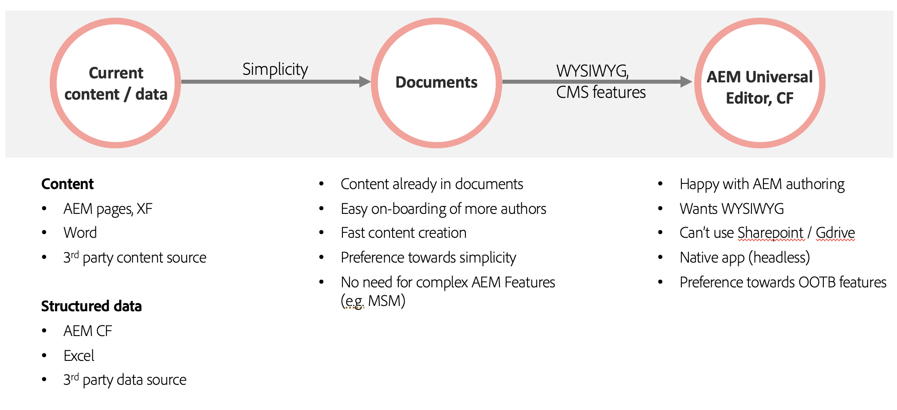

# Edge Delivery Services met AEM gebruiken {#using-edge}

Edge Delivery Services worden losgekoppeld van de inhoudsbron en kunnen inhoud van verschillende inhoudsbronnen innemen. Dit betekent dat u met meerdere inhoudsbronnen op dezelfde website kunt werken met naadloze en gestroomlijnde publicatie, ongeacht de gekozen bron.

Met Edge Delivery Services kunt u snelle ontwikkelomgevingen maken waarin auteurs inhoud snel kunnen bijwerken en publiceren en nieuwe sites snel kunnen worden gestart. Het duurt slechts een paar seconden om van bewerken naar live op internet te gaan.

Het gebruik van meerdere inhoudsbronnen biedt maximale flexibiliteit voor de gebruiker. De Adobe biedt begeleiding om u te helpen kiezen welke inhoudsbronnen het beste geschikt voor uw project zijn.

Er zijn gevallen waarin de inhoudsbron vooraf is gedefinieerd of anderszins niet flexibel is (het project kan bijvoorbeeld geen gebruik maken van Sharepoint of Google Drive). Maar in veel gevallen is het gereedschap niet vooraf gedefinieerd en is de keuze van het gereedschap niet zwart-wit.

Eenvoudigheid is het leidend beginsel van de Adobe. Begin met op documenten gebaseerde ontwerpen en voeg waar nodig complexiteit toe. Als een hulpprogramma moet worden gewijzigd, heeft AEM integratie van Edge Delivery Services betrekking op de migratie van inhoud.

## Authoring {#authoring-edge}

Met Edge Delivery Services is ontwerpen eenvoudig, snel en flexibel. U kunt de auteur kiezen met behulp van op documenten gebaseerde ontwerpen of met behulp van WYSIWYG-authoring met behulp van de Universal Editor.

Gelieve te zien het document [ Authoring Inhoud voor Edge Delivery Services ](/help/edge/wysiwyg-authoring/authoring.md) voor meer informatie.

## Publiceren {#publishing-edge}

Bij Edge Delivery Services verloopt het publiceren van inhoud naadloos, ongeacht de inhoudsbron.

Gelieve te zien het document [ het Publiceren Inhoud voor Edge Delivery Services ](/help/edge/wysiwyg-authoring/publishing.md) voor meer informatie.

## Ontwikkelen {#developing-edge}

Edge Delivery Services zijn gebaseerd op het concept van blokken. AEM wordt geleverd met een uitgebreide bibliotheek met vooraf gedefinieerde blokken, die kan worden uitgebreid om aan uw projectbehoeften te voldoen. De code voor de projecten van Edge Delivery Services wordt beheerd in GitHub.

Gelieve te zien de document [ Begonnen Gids van de Ontwikkelaar Begonnen voor het Authoring van WYSIWYG met Edge Delivery Services ](/help/edge/wysiwyg-authoring/edge-dev-getting-started.md) voor meer informatie.
