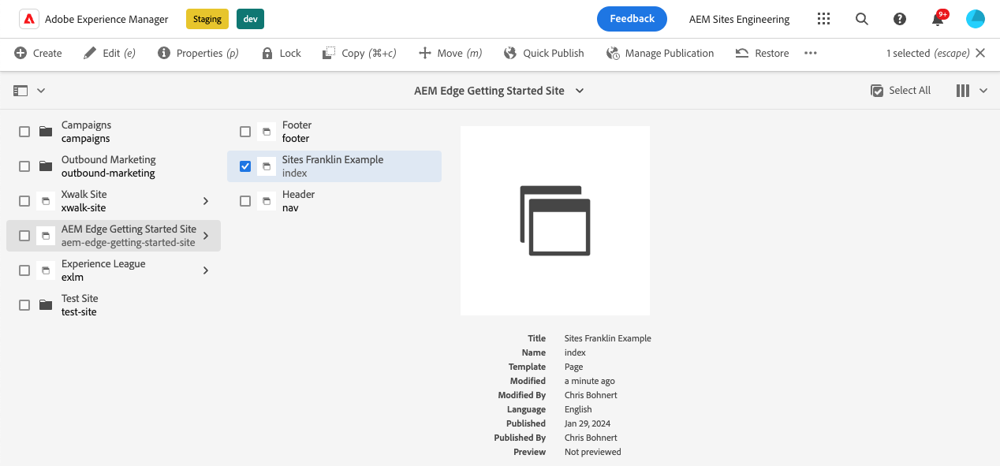

# Blokken maken met een instrument voor gebruik met de universele editor {#create-block}

Leer hoe te om blokken tot stand te brengen van instrumenten voor gebruik met de Universele Redacteur in WYSIWYG creatie met Edge Delivery Services projecten.

## Vereisten {#prerequisites}

Deze gids verstrekt geleidelijke instructies voor hoe te om blokken tot stand te brengen van instrumenten voor de Universele Redacteur in het schrijven WYSIWYG met Edge Delivery Services projecten. Het omvat het toevoegen van componenten, het laden van componentendefinities in de Universele Redacteur, het publiceren pagina&#39;s, het uitvoeren van blokdecoratie en stijlen, het brengen van de veranderingen in productie, en het verifiëren van hen. Op de voltooiing van deze gids, kunt u een nieuw blok voor uw eigen project tot stand brengen en opstellen.

Deze gids vereist noodzakelijk bestaande kennis van het schrijven WYSIWYG met Edge Delivery Services projecten evenals de Universele Redacteur. Voordat u met deze handleiding begint, moet u al toegang hebben tot Edge Delivery Services en vertrouwd zijn met de basisbeginselen, zoals:

* U hebt de [ zelfstudie van de Dienst van Edge Delivery voltooid.](/help/edge/developer/tutorial.md)
* U hebt toegang tot een [ zandbak van AEM Cloud Service.](/help/implementing/cloud-manager/getting-access-to-aem-in-cloud/introduction-sandbox-programs.md)
* U hebt [ de Universele Redacteur op het zelfde zandbakmilieu toegelaten.](/help/implementing/universal-editor/getting-started.md)
* U hebt de [ Begonnen Gids van de Ontwikkelaar die voor het schrijven WYSIWYG met Edge Delivery Services ](/help/edge/wysiwyg-authoring/edge-dev-getting-started.md) gids wordt voltooid.

Deze gids bouwt op het werk voort dat in de [ Begonnen Gids van de Ontwikkelaar wordt gedaan Begonnen voor het schrijven WYSIWYG met Edge Delivery Services ](/help/edge/wysiwyg-authoring/edge-dev-getting-started.md) gids.

## Een nieuw blok toevoegen aan uw project {#add-block}

In deze handleiding gaat u een blok maken om een gedenkwaardig citaat op uw pagina weer te geven.

Om dit voorbeeld te vereenvoudigen, worden alle wijzigingen aangebracht in de `main` -vertakking van de projectopslagplaats. Natuurlijk voor uw daadwerkelijke project, [ zou u ontwikkeling beste praktijken ](https://www.aem.live/docs/dev-collab-and-good-practices) moeten volgen door zich op een verschillende tak te ontwikkelen en alle veranderingen te herzien via trekkingsverzoek alvorens aan `main` samen te voegen.

De Adobe beveelt aan dat u blokken in een driefasenaanpak ontwikkelt:

1. Maak de definitie en het model voor het blok, herzie het, en breng het aan productie.
1. Maak inhoud met het nieuwe blok.
1. Implementeer de decoratie en stijlen voor het nieuwe blok.

Het volgende citaatblokvoorbeeld volgt deze benadering.

### Blokdefinitie en -model maken {#create-block-model}

1&amp;periode; Kloon het project GitHub plaatselijk dat u in de [ Begonnen Gids van de Ontwikkelaar die voor WYSIWYG creeerde creeert auteursrecht met Edge Delivery Services ](/help/edge/wysiwyg-authoring/edge-dev-getting-started.md) gids en open het in een redacteur van uw keus.

* Microsoft-code wordt hier gebruikt ter illustratie.


2&amp;punt; geef het `component-definition.json` dossier bij de wortel van het project uit en voeg de volgende definitie voor uw nieuw citaatblok toe en bewaar het dossier.

>[!BEGINTABS]

>[!TAB  JSON Voorbeeld ]

```json
{
  "title": "Quote",
  "id": "quote",
  "plugins": {
    "xwalk": {
      "page": {
        "resourceType": "core/franklin/components/block/v1/block",
        "template": {
          "name": "Quote",
          "model": "quote",
          "quote": "<p>Think, McFly! Think!</p>",
          "author": "Biff Tannen"
        }
      }
    }
  }
}
```

>[!TAB  Screenshot ]

 te bepalen

>[!ENDTABS]

3&amp;punt; geef het `component-models.json` dossier bij de wortel van het project uit en voeg de volgende [ modeldefinitie ](/help/implementing/universal-editor/field-types.md#model-structure) voor uw nieuw citaatblok toe en bewaar het dossier.

* Gelieve te zien de document [ Modellering van de Inhoud voor WYSIWYG creërend met de Projecten van Edge Delivery Services ](/help/edge/wysiwyg-authoring/content-modeling.md) voor meer informatie over wat belangrijk is om te overwegen wanneer het creëren van inhoudsmodellen.

>[!BEGINTABS]

>[!TAB  JSON Voorbeeld ]

```json
{
  "id": "quote",
  "fields": [
     {
       "component": "text-area",
       "name": "quote",
       "value": "",
       "label": "Quote",
       "valueType": "string"
     },
     {
       "component": "text-input",
       "valueType": "string",
       "name": "author",
       "label": "Author",
       "value": ""
     }
   ]
}
```

>[!TAB  Screenshot ]

 te bepalen

>[!ENDTABS]

4&amp;punt; geef het `component-filters.json` dossier bij de wortel van het project uit en voeg het citaatblok aan de [ filterdefinitie ](/help/implementing/universal-editor/customizing.md#filtering-components) toe om het blok toe te staan om aan om het even welke sectie worden toegevoegd en het dossier te bewaren.

>[!BEGINTABS]

>[!TAB  JSON Voorbeeld ]

```json
{
  "id": "section",
  "components": [
    "text",
    "image",
    "button",
    "title",
    "hero",
    "cards",
    "columns",
    "quote"
   ]
}
```

>[!TAB  Screenshot ]

 te bepalen

>[!ENDTABS]

5&amp;period; met git past u deze wijzigingen toe op uw `main` -vertakking.

* Het toewijzen aan `main` is alleen ter illustratie. [ volg beste praktijken ](https://www.aem.live/docs/dev-collab-and-good-practices) en gebruik een trekkingsverzoek voor werkelijk projectwerk.

### Inhoud maken met het blok {#create-content}

Nu uw basiscitaatblok wordt bepaald en aan het steekproefproject geëngageerd, kunt u een citaatblok aan een bestaande pagina toevoegen.

1. Meld u aan bij AEM as a Cloud Service in een browser. [ Gebruikend de console van Plaatsen, ](/help/sites-cloud/authoring/basic-handling.md) navigeer aan de plaats die u in de [ Begonnen Gids van de Ontwikkelaar die voor het schrijven WYSIWYG met Edge Delivery Services ](/help/edge/wysiwyg-authoring/edge-dev-getting-started.md) creeerde en een pagina selecteert.

   * In dit geval wordt `index` gebruikt voor illustratieve doeleinden.

   

1. Tik of klik **uitgeven** in de toolbar van de console en de Universele Redacteur opent.

   * Om de pagina te laden, kunt u **Teken binnen met Adobe** moeten tikken of klikken om aan AEM in de Universele Redacteur voor authentiek te verklaren.

1. Selecteer een sectie in de Universal Editor. In de eigenschappen spoorstaaf, tik of klik **voeg** pictogram toe en selecteer dan uw nieuw **Citaat** blok van het menu.

   * Het **voegt** pictogram toe is een plus symbool.
   * U weet dat u een sectie hebt geselecteerd als het blauwe overzicht van het geselecteerde voorwerp een lusje genoemd **Sectie** heeft.
   * In dit voorbeeld, selecteert het tikken of het klikken lichtjes boven de **rubriek 0} Lorem Ipsum een sectie die de rubriek en lorem ipsum tekst bevat.**

   

1. De pagina wordt opnieuw geladen en het aanhalingsteken wordt onder aan de geselecteerde sectie toegevoegd met de standaardinhoud die in het `component-definitions.json` -bestand is opgegeven.

   * Het aanhalingsteken kan worden geselecteerd en bewerkt zoals elk ander blok op zijn plaats of in de eigenschappenrails.
   * Stijlen wordt in een volgende stap toegepast.

   

1. Zodra u met de inhoud van uw citaat wordt tevredengesteld, kunt u de pagina publiceren door te tikken of de **knoop van Publish** in de toolbar van de Universele Redacteur te klikken.

1. Controleer of de inhoud is gepubliceerd door naar de gepubliceerde pagina te navigeren. De koppeling is vergelijkbaar met `https://<branch>--<repo>--<owner>.hlx.page`

   

### Het blok opmaken {#style-block}

Nu u een werkend citaatblok hebt kunt u het stileren toepassen.

1&amp;period; Ga terug naar de editor voor uw project.

2&amp;punt; maak een map `quote` onder de map `blocks` .


3&amp;punt; in de nieuwe `quote` map voegt u een `quote.js` -bestand toe om blokdecoratie te implementeren door de volgende JavaScript toe te voegen en het bestand op te slaan.

>[!BEGINTABS]

>[!TAB  Voorbeeld van JavaScript ]

```javascript
export default function decorate(block) {
  const [quoteWrapper] = block.children;
 
  const blockquote = document.createElement('blockquote');
  blockquote.textContent = quoteWrapper.textContent.trim();
  quoteWrapper.replaceChildren(blockquote);
}
```

>[!TAB  Screenshot ]

 te versieren

>[!ENDTABS]

4&amp;punt; voeg in de map `quote` een `quote.css` -bestand toe om de opmaak voor het blok te definiëren door de volgende CSS-code toe te voegen en het bestand op te slaan.

>[!BEGINTABS]

>[!TAB  CSS Voorbeeld ]

```css
.block.quote {
    background-color: #ccc;
    padding: 0 0 24px;
    display: flex;
    flex-direction: column;
    margin: 1rem 0;
}
 
.block.quote blockquote {
    margin: 16px;
    text-indent: 0;
}
 
.block.quote > div:last-child > div {
    margin: 0 16px;
    font-size: small;
    font-style: italic;
    position: relative;
}
 
.block.quote > div:last-child > div::after {
    content: "";
    display: block;
    position: absolute;
    left: 0;
    bottom: -8px;
    height: 5px;
    width: 30px;
    background-color: darkgray;
}
```

>[!TAB  Screenshot ]


>[!ENDTABS]

5&amp;period; met git past u deze wijzigingen toe op uw `main` -vertakking.

* Het toewijzen aan `main` is alleen ter illustratie. [ volg beste praktijken ](https://www.aem.live/docs/dev-collab-and-good-practices) en gebruik een trekkingsverzoek voor werkelijk projectwerk.

6&amp;punt; Keer terug naar uw browser lusje van de Universele Redacteur waar u de pagina van uw project uitgeeft en herlaadt de pagina om uw gestileerde blok te bekijken.

7&amp;punt; Zie het nu gestileerde citaatblok op de pagina.


8&amp;punt; controleer of de wijzigingen zijn doorgevoerd in de productie door naar de gepubliceerde pagina te navigeren. De koppeling is vergelijkbaar met `https://<branch>--<repo>--<owner>.hlx.page`


Gefeliciteerd! U hebt nu een volledig werkend en gestileerd citaatblok. U kunt dit voorbeeld gebruiken als basis voor het ontwerpen van uw eigen projectspecifieke blokken.

### Blokopties {#block-options}

Als u een blok nodig hebt om te kijken of zich lichtjes verschillend gedraagt gebaseerd op bepaalde omstandigheden, maar niet verschillend genoeg om een nieuw blok op zich te worden, kunt u auteurs van [ blokopties laten kiezen.](content-modeling.md#type-inference)

Door een eigenschap `classes` aan het blok toe te voegen, wordt de eigenschap weergegeven in de tabelkop voor eenvoudige blokken of als een lijst met waarden voor items in een containerblok.

```json
{
  "id": "simpleMarquee",
  "fields": [
    {
      "component": "text",
      "valueType": "string",
      "name": "marqueeText",
      "value": "",
      "label": "Marquee text",
      "description": "The text you want shown in your marquee"
    },
    {
      "component": "select",
      "name": "classes",
      "value": "",
      "label": "Background Color",
      "description": "The marquee background color",
      "valueType": "string",
      "options": [
        {
          "name": "Red",
          "value": "bg-red"
        },
        {
          "name": "Green",
          "value": "bg-green"
        },
        {
          "name": "Blue",
          "value": "bg-blue"
        }
      ]
    }
  ]
}
```

## Andere werktakken gebruiken {#other-branches}

In deze handleiding hebt u zich voor de eenvoud rechtstreeks vastgelegd op de `main` -vertakking. Voor experimenteren in een voorbeeldopslagplaats, is dit gewoonlijk geen kwestie. Voor werkelijk projectwerk, [ zou u ontwikkeling beste praktijken ](https://www.aem.live/docs/dev-collab-and-good-practices) moeten volgen door zich op een verschillende tak te ontwikkelen en alle veranderingen te herzien via trekkingsverzoek alvorens aan `main` samen te voegen.

Wanneer u zich niet ontwikkelt op de `main` -vertakking, kunt u `?ref=<branch>` toevoegen in de locatiebalk van de universele editor om de pagina vanuit uw vertakking te laden. `<branch>` is de vertakkingsnaam zoals deze zou worden gebruikt voor de voorvertoning van uw project of voor live URL&#39;s, bijvoorbeeld `https://<branch>--<repo>--<owner>.hlx.page` .

Het publiceren van inhoud met een nieuw model wordt slechts gesteund wanneer het model aan de `main` tak wordt samengevoegd.

## Volgende stappen {#next-steps}

Nu u weet hoe u blokken kunt maken, is het van essentieel belang dat u begrijpt hoe u inhoud op semantische wijze modelleert om een slanke ontwikkelaarservaring te bereiken.

Gelieve te zien het document [ Modelleren van de Inhoud voor WYSIWYG creatie met de Projecten van Edge Delivery Services ](/help/edge/wysiwyg-authoring/content-modeling.md) om te leren hoe de inhoud modellering voor WYSIWYG creatie met de projecten van Edge Delivery Services werkt.

>[!TIP]
>
>Voor een analyse van begin tot eind van het creëren van een nieuw project van Edge Delivery Services dat voor het schrijven WYSIWYG met AEM as a Cloud Service als inhoudsbron wordt toegelaten, gelieve te bekijken [ dit AEM webinar GEMs.](https://experienceleague.adobe.com/en/docs/events/experience-manager-gems-recordings/gems2024/aem-authoring-and-edge-delivery)

