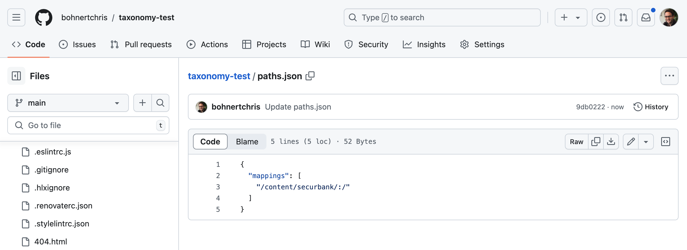

# Taxonomiegegevens beheren {#managing-taxonomy-data}

Leer hoe u taxonomiegegevens beheert voor het gebruik van tags bij uw AEM met Edge Delivery Services-sites.

## Inleiding {#introduction}

Tags zijn een belangrijke functie waarmee u uw pagina&#39;s kunt ordenen en beheren. [ de het Etiketteren Console ](/help/sites-cloud/administering/tags.md#tagging-console) in AEM staat u toe om een rijke taxonomie van markeringen tot stand te brengen om uw pagina&#39;s te organiseren.

Deze tags zijn niet alleen handig voor u en uw auteurs bij het ordenen van uw inhoud, maar kunnen ook voor uw lezers worden gebruikt. Tags en de bijbehorende taxonomie kunnen in componenten op de pagina worden gebruikt om uw lezers te helpen door de inhoud te navigeren.

De Universal Editor werkt alleen met de id&#39;s van uw tags. Door een taxonomipagina voor uw inhoud te maken, stelt u de beschrijvingen van deze labels in alle talen beschikbaar aan de Universele Redacteur zodat kan het die informatie gebruiken wanneer het teruggeven van inhoud.

>[!TIP]
>
>Gelieve te zien het document [ ModelDefinities, Gebieden, en de Types van Component ](/help/implementing/universal-editor/field-types.md) voor meer informatie over het gebied van de Markering van AEM beschikbaar aan de Universele Redacteur, die met uw taxonomie kan werken.

## Een taxonomipagina maken {#creating}

Een taxonomie wordt gecreeerd als [ een andere pagina in AEM ](/help/sites-cloud/authoring/sites-console/creating-pages.md).

1. Navigeer aan de [**console van Plaatsen** ](/help/sites-cloud/authoring/sites-console/introduction.md).

1. Selecteer de locatie waar u de taxonomie wilt maken.

1. Tik of klik **creeer** -> **Pagina**.

   

1. Op het **Malplaatje** lusje van **creeer de tovenaar van de Pagina**, selecteer het **malplaatje van de Taxonomie** en ontvang of klik **daarna**.

   

1. Op het **lusje van Eigenschappen** van **creeer de tovenaar van de Pagina**, verstrek een zinvolle **Titel** voor de pagina en op het **gebied van Markeringen**, [ gebruik de markeringsplukker ](/help/sites-cloud/authoring/sites-console/tags.md) om de markering(s) of namespace(s) te selecteren u in uw taxonomie wenst te omvatten.

   

1. Tik of klik **creeer**.

De taxonomipagina wordt gemaakt. In de **dialoog van het Succes**, kunt u tikken of **klikken Gedaan** dialoog om het bericht te sluiten of **Open** om de pagina in de [ Redacteur van de Pagina uit te geven ](/help/sites-cloud/authoring/page-editor/introduction.md).

Neem nota van de resulterende paginanaam van de taxonomipagina voor gebruik in de volgende stappen.

## Een taxonomipagina bewerken {#editing}

U begint een taxonomipagina te bewerken, net als elke andere pagina in AEM.

1. Navigeer aan de [**console van Plaatsen** ](/help/sites-cloud/authoring/sites-console/introduction.md).

1. Selecteer de taxonomie die u wilt bewerken.

1. Tik of klik **uitgeven** in de actiebar.

1. De Pagina-editor wordt geopend en de taxonomie wordt weergegeven.

   * De taxonomipagina is alleen-lezen in de Pagina-editor.

    uit

1. Tik of klik het **pictogram van de Informatie van de Pagina** in de toolbar en selecteer **Open Eigenschappen**.

   

1. In het **venster van de Eigenschappen van de Pagina**, kunt u de naam van de pagina bijwerken en de markeringsselecteur gebruiken om de markering(en) en namespace(s) bij te werken inbegrepen in uw taxonomie.

    uit

1. Tik of klik **sparen &amp; sluit**.

De pagina die wordt weergegeven in de Pagina-editor is alleen-lezen omdat de inhoud van de taxonomie automatisch wordt gegenereerd op basis van de geselecteerde tag(s) en naamruimte(n). Ze fungeren als een soort filter voor het automatisch genereren van de inhoud van de taxonomie. Daarom is er geen reden om de pagina in de redacteur direct uit te geven.

AEM werkt automatisch de inhoud van de taxonomipagina bij wanneer u de onderliggende tag(s) en naamruimte(n) bijwerkt. Nochtans moet u [ taxonomie ](#publishing) na om het even welke verandering opnieuw publiceren om die veranderingen ter beschikking van uw gebruikers te stellen.

## Paden.json bijwerken voor publicatie Taxonomy {#paths-json}

Als wanneer [ het leiden en het publiceren van tabelgegevens voor uw plaats van Edge Delivery Services ](/help/edge/wysiwyg-authoring/tabular-data.md), moet u uw `paths.json` dossier van uw project bijwerken om publicatie van uw taxonomiegegevens toe te staan.

1. Open de wortel van uw project in GitHub.

1. Tik of klik het `paths.json` dossier om zijn details te openen en dan **geef** pictogram uit.

   

1. Voeg een lijn toe om uw nieuwe taxonomipagina aan een `.json` middel in kaart te brengen.

   ```json
   {
     "mappings": [
      "/content/<site-name>/:/",
      "/content/<site-name>/<taxonomy-page-name>:/<taxonomy-json-name>.json"
     ]
   }
   ```

   * `<taxonomy-page-name>` moet de naam van de [ taxonomie pagina aanpassen u ](#creating) creeerde.
   * `<taxonomy-json-name>` kan elke geldige naam zijn die u kiest.

1. Klik **Veranderingen vastleggen...** om de veranderingen in `main` te bewaren.

   * Leg dit vast aan `main` of maak een pull-aanvraag volgens uw proces.

Dit proces hoeft maar één keer per taxonomipagina te worden uitgevoerd. Als u klaar bent, kunt u uw taxonomie publiceren.

>[!TIP]
>
>Voor meer informatie over wegafbeeldingen, te zien gelieve het document [ Toewijzing van de Weg voor Edge Delivery Services ](/help/edge/wysiwyg-authoring/path-mapping.md).

## Een taxonomie publiceren {#publishing}

Een taxonomie is pas beschikbaar voor de Universal Editor of uw gebruikers als deze is gepubliceerd.

De pagina&#39;s van de taxonomie worden gepubliceerd als een andere pagina door [ gebruikend **Snelle publiceer** of **leidt de pictogrammen van de Publicatie** in de toolbar ](/help/sites-cloud/authoring/sites-console/publishing-pages.md).

U moet uw taxonomipagina telkens opnieuw publiceren:

* Bewerk de taxonomipagina.
* Bewerk de tag(s) en naamruimte(n) in de taxonomipagina of voeg deze toe.

Als u een nieuwe taxonomipagina creeert moet u eerst [ een afbeelding aan het aan het `paths.json` dossier in uw project ](#paths-json) toevoegen.

## Toegang tot taxonomie-informatie {#accessing}

Zodra uw taxonomie wordt gepubliceerd, kan zijn informatie door de Universele Redacteur worden gebruikt en aan uw gebruikers zichtbaar gemaakt.

U kunt tot de taxonomie als gegevens JSON bij het volgende adres toegang hebben.

`https://<branch>--<repository>--<owner>.aem.page/<taxonomy-json-name>.json`

Gebruik `<taxonomy-json-name>` dat u bepaalde toen [ afbeelding uw taxonomie aan het `paths.json` dossier in uw project ](#paths-json). De taxonomiegegevens worden geretourneerd als JSON-gegevens, zoals in het volgende voorbeeld.

```json
{
  "total": 3,
  "offset": 0,
  "limit": 3,
  "data": [
    {
      "tag": "default:",
      "title": "Standard Tags"
    },
    {
      "tag": "do-not-translate",
      "title": "Do Not Translate"
    },
    {
      "tag": "translate",
      "title": "Translate"
    }
  ],
  "columns": [
    "tag",
    "title"
  ],
  ":type": "sheet"
}
```

Deze JSON-gegevens worden automatisch bijgewerkt wanneer u de taxonomie bijwerkt en opnieuw publiceert. Uw app heeft via programmacode toegang tot deze gegevens voor uw gebruikers.

[ als u markeringen in veelvoudige talen ](/help/sites-cloud/administering/tags.md#managing-tags-in-different-languages) handhaaft, kunt u tot die talen toegang hebben door in de ISO2 taalcode als waarde van a `sheet=` parameter over te gaan.

## Extra tageigenschappen beschikbaar maken {#additional-properties}

Door gebrek, zal uw taxonomie `tag` en `title` waarden bevatten zoals die [ in het vorige voorbeeld ](#accessing) worden gezien. U kunt uw taxonomie vormen om extra markeringseigenschappen bloot te stellen. In dit voorbeeld wordt de tagbeschrijving weergegeven.

1. Gebruik de console van Plaatsen om de taxonomie te selecteren u creeerde.
1. Tik of klik het **pictogram van Eigenschappen** in de toolbar.
1. In de **Extra sectie van Eigenschappen**, tikt of klikt **** toevoegt om een gebied toe te voegen.
1. Voer in het nieuwe veld de naam in van de JRC-eigenschap die u wilt weergeven. Voer in dit geval `jcr:description` in voor de tagbeschrijving.
1. Tik of klik **sparen &amp; sluit**.
1. Met nog geselecteerde taxonomie, tik of klik **Snel publiceren** in de toolbar.

Nu [ wanneer u tot uw taxonomie ](#accessing) toegang hebt, is de markeringsbeschrijving (of welk bezit u verkoos om bloot te stellen) inbegrepen in JSON.

```json
{
  "total": 3,
  "offset": 0,
  "limit": 3,
  "data": [
    {
      "tag": "default:",
      "title": "Standard Tags",
      "jcr:description": "These are the standard tags"
    },
    {
      "tag": "do-not-translate",
      "title": "Do Not Translate",
      "jcr:description": "Tag to mark pages that should not be translated"
    },
    {
      "tag": "translate",
      "title": "Translate",
      "jcr:description": "Tag to mark pages that should be translated"
    }
  ],
  "columns": [
    "tag",
    "title",
    "jcr:description"
  ],
  ":type": "sheet"
}
```
