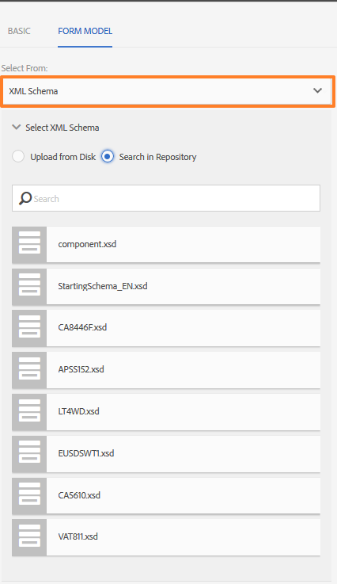
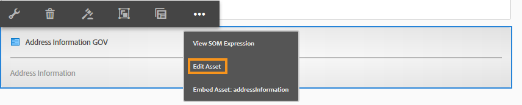

# Aangepaste Forms-fragmenten maken en gebruiken in een adaptief formulier  {#adaptive-form-fragments}

| Versie | Artikelkoppeling |
| -------- | ---------------------------- |
| AEM as a Cloud Service (Foundation Components) | Dit artikel |
| AEM as a Cloud Service (Core Components) | [ klik hier ](/help/forms/adaptive-form-fragments-core-components.md) |
| AEM 6,5 | [Klik hier](https://experienceleague.adobe.com/docs/experience-manager-65/forms/adaptive-forms-basic-authoring/adaptive-form-fragments.html?lang=en) |

Hoewel elk formulier is ontworpen voor een specifiek doel, zijn er in de meeste vormen enkele algemene segmenten, zoals het verstrekken van persoonlijke gegevens zoals naam en adres, familiegegevens, inkomensgegevens, enzovoort. Formulierontwikkelaars moeten deze gemeenschappelijke segmenten telkens maken wanneer een nieuw formulier wordt gemaakt. Adaptieve formulieren biedt een handig mechanisme om formuliersegmenten zoals een deelvenster of een groep velden slechts eenmaal te maken en deze opnieuw te gebruiken in verschillende adaptieve formulieren. Deze herbruikbare en zelfstandige segmenten worden Adaptieve formulierfragmenten genoemd.

## Een fragment maken {#create-a-fragment}

U kunt een adaptief formulierfragment helemaal opnieuw maken of een deelvenster in een bestaand adaptief formulier opslaan als fragment.

### Geheel fragment maken {#create-fragment-from-scratch}

1. Logboek in [!DNL AEM Forms] auteursinstantie in https:// [*hostname*]:[*haven*] /aem/forms.html.
1. Klik **creëren > het AanpassingsFragment van de Vorm**.
1. Geef een titel, naam, beschrijving en tags voor het fragment op.

   >[!NOTE]
   >
   >Zorg ervoor dat u een unieke naam voor het fragment opgeeft. Als er al een ander fragment met dezelfde naam bestaat, kan het fragment niet worden gemaakt.

1. Klik om het **Model van de Vorm** lusje te openen, en van **Uitgezocht van** drop-down menu, selecteer één van de volgende modellen voor het fragment:

   * **niets**: Specificeert om het fragment van kras tot stand te brengen zonder enig vormmodel te gebruiken.

     >[!NOTE]
     >
     > In Adaptive Forms kunt u één formulierfragment (op basis van kerncomponenten) meerdere keren gebruiken in een formulier. Deze ondersteunt zowel op geen gebaseerde als op schema gebaseerde formulierfragmenten.

   * **Malplaatje van de Vorm**: Specificeert om het fragment tot stand te brengen gebruikend een malplaatje XDP dat aan [!DNL AEM Forms] wordt geupload. Selecteer de juiste XDP-sjabloon als het formuliermodel voor het fragment.

   

   De subformulieren die als fragmenten zijn gemarkeerd in de geselecteerde formuliersjabloon, worden ook weergegeven. U kunt een subformulier voor Adaptief formulierfragment selecteren in de vervolgkeuzelijst.

   

   Daarnaast kunt u een adaptief formulierfragment maken met subformulieren die niet zijn gemarkeerd als fragmenten in de formuliersjabloon door de SOM-expressie voor het subformulier op te geven in de vervolgkeuzelijst.

   * **Schema van XML**: Specificeert om het fragment tot stand te brengen gebruikend een schema van XML dat aan [!DNL AEM Forms] wordt geupload. U kunt een van de beschikbare XML-schema&#39;s uploaden of selecteren als het formuliermodel voor het fragment.

   

   U kunt ook een adaptief formulierfragment maken door in de vervolgkeuzelijst een complexType te selecteren dat aanwezig is in het geselecteerde schema.

   

1. Klik **creëren** en klik dan **Open** om het fragment, met een standaardmalplaatje, op uit te geven wijze te openen.

In de bewerkingsmodus kunt u elke adaptieve formuliercomponent van de AEM naar het fragment slepen en neerzetten. <!-- For information about Adaptive Form components, see Introduction to authoring Adaptive Forms. -->

Als u bovendien een XML-schema of XDP-formuliersjabloon hebt geselecteerd als het formuliermodel voor uw fragment, wordt een nieuw tabblad met de hiërarchie van het formuliermodel weergegeven in de zoeker naar inhoud. Hiermee kunt u formuliermodelelementen naar het fragment slepen en neerzetten. De toegevoegde formuliermodelelementen worden geconverteerd naar formuliercomponenten, terwijl de oorspronkelijke eigenschappen van de gekoppelde XDP of XSD behouden blijven.

### Deelvenster opslaan als een fragment {#save-panel-as-a-fragment}

1. Open een adaptief formulier dat het deelvenster bevat dat u wilt opslaan als adaptief formulierfragment.
1. Klik op **[!UICONTROL Save as Fragment]** op de werkbalk van het deelvenster. Het dialoogvenster Opslaan als fragment wordt geopend.

   >[!NOTE]
   >
   >Als het deelvenster dat u opslaat als fragment een onderliggend deelvenster bevat, worden deze opgenomen in het resulterende fragment.

1. Geef in het dialoogvenster Fragment maken de volgende informatie op:

   * **Naam**: Naam van het fragment. De standaardwaarde is de elementnaam van het deelvenster. Het is een verplicht veld.

     >[!NOTE]
     >
     >Zorg ervoor dat u een unieke naam voor het fragment opgeeft. Als er al een ander fragment met dezelfde naam bestaat, kan het fragment niet worden gemaakt.

   * **Titel**: Titel van het fragment. De standaardwaarde is de titel van het deelvenster.

   * **Beschrijving**: Beschrijving van het fragment.

   * **Markeringen**: De meta-gegevens van markeringen voor het fragment.

   * **Weg van het Doel**: De weg van de Bewaarplaats waar het fragment wordt bewaard. Als u geen pad opgeeft, wordt een knooppunt met dezelfde naam als het fragment gemaakt naast het knooppunt dat het adaptieve formulier bevat. Het fragment wordt opgeslagen in dit knooppunt.

   * **Model van de Vorm**: Afhankelijk van het vormmodel voor de Aangepaste Vorm, toont dit gebied het **Schema van XML**, **Malplaatje van de Vorm**, of **niets**. Het is een niet-bewerkbaar veld.

   * **Basis van het Model van het Fragment**: Verschijnt slechts in op XSD-Gebaseerde Aangepaste Forms. Hiermee geeft u de basis voor het fragmentmodel op. U kunt **kiezen/** of het complexe type XSD van drop-down. U kunt het fragment alleen opnieuw gebruiken in een ander adaptief formulier als u het complexe type selecteert als hoofdknooppunt van het fragmentmodel.
Als u **** als hoofdmap van het fragmentmodel kiest, is de volledige XSD-structuur van het basismodel zichtbaar op het tabblad Adaptief gegevensmodel van formulier. Voor een complexe hoofdmap van een fragmentmodel zijn alleen de onderliggende elementen van het geselecteerde complexe type zichtbaar op het tabblad Adaptief formuliergegevensmodel.

   * **XSD Ref**: Verschijnt slechts in op XSD-Gebaseerde Aanpassings Forms. De locatie van het XML-schema wordt weergegeven.

   * **XDP Ref**: Verschijnt slechts in op XDP-Gebaseerde Aanpassings Forms. De locatie van de XDP-formuliersjabloon wordt weergegeven.

   

   Dialoogvenster Opslaan als fragment

1. Klik **OK**.

   Het deelvenster wordt opgeslagen op de opgegeven of standaardlocatie in de opslagplaats. In het adaptieve formulier wordt het deelvenster vervangen door een opname van het fragment. Zoals hieronder wordt weergegeven, worden het deelvenster Algemene informatie en de onderliggende deelvensters Persoonlijke gegevens en Adres als een fragment opgeslagen.

   Als u het fragment wilt bewerken, klikt u op **[!UICONTROL Edit Asset]** op de werkbalk van het deelvenster. Het fragment wordt in de bewerkingsmodus op een nieuw tabblad of in een nieuw venster geopend.

   

## Werken met fragmenten {#working-with-fragments}

### De weergave van fragmenten configureren {#configure-fragment-appearance}

Elk fragment dat u in Adaptieve formulieren invoegt, wordt weergegeven als een tijdelijke aanduiding. De plaatsaanduiding geeft titels weer van maximaal tien onderliggende deelvensters in het fragment. U kunt zo configureren [!DNL AEM Forms] dat het volledige fragment wordt weergegeven in plaats van de tijdelijke aanduiding.

Voer de volgende stappen uit om volledige fragmenten in formulieren weer te geven:

1. Ga naar de configuratiepagina van de AEM-webconsole op https:[*host*]:[*port*]/system/console/configMgr.

1. Zoek en klik op **[!UICONTROL Adaptive Form Configuration Service]** om het te openen in de bewerkingsmodus.
1. Schakel het selectievakje **[!UICONTROL Enable Placeholder in place of Fragment]** uit om volledige fragmenten weer te geven in plaats van de voorlopige afbeelding.

### Een fragment invoegen in een adaptief formulier {#insert-a-fragment-in-an-adaptive-form}

De adaptieve formulierfragmenten die u maakt, worden weergegeven op het tabblad Adaptieve formulierfragmenten van de zoeker AEM inhoud. Een adaptief formulierfragment invoegen in een adaptief formulier:

1. Open het adaptieve formulier in de bewerkingsmodus waarin u een adaptief formulierfragment wilt invoegen.
1. Klik **Assets**  in sidebar. In activa browser, uitgezochte **Adaptieve Fragmenten van de Vorm** van drop-down.

   U kunt er ook voor kiezen om alle adaptieve formulierfragmenten of filters weer te geven op basis van het formuliermodel (Formuliersjabloon, XML-schema of Standaard).

1. Sleep een adaptief formulierfragment naar het adaptieve formulier.

   >[!NOTE]
   >
   >Het adaptieve formulierfragment is niet ingeschakeld voor ontwerpen vanuit het adaptieve formulier. Bovendien kunt u een XSD-fragment niet gebruiken in een op JSON gebaseerde adaptieve vorm en omgekeerd.

Het adaptieve formulierfragment wordt ter referentie ingevoegd in het adaptieve formulier en wordt gesynchroniseerd met het standalone adaptieve formulierfragment. Dit betekent dat wanneer u het adaptieve formulierfragment bijwerkt, de wijzigingen worden doorgevoerd in alle adaptieve Forms waar het fragment wordt gebruikt.

### Een fragment insluiten in adaptieve vorm {#embed-a-fragment-in-adaptive-form}

U kunt verkiezen om een Adaptief Fragment van de Vorm in een AanpassingsVorm in te bedden door **te klikken bedt Activa: &lt;*fragmentName*>** knoop op de paneeltoolbar van het toegevoegde fragment, zoals aangetoond in het volgende voorbeeldbeeld.

 in

>[!NOTE]
>
>Het ingesloten fragment is niet meer gekoppeld aan het zelfstandige fragment. U kunt de componenten in het ingesloten fragment bewerken vanuit het adaptieve formulier.

### Fragmenten in fragmenten gebruiken {#using-fragments-within-fragments}

U kunt geneste adaptieve formulierfragmenten maken, wat betekent dat u een fragment naar een ander fragment kunt slepen en neerzetten en dat u een geneste fragmentstructuur kunt hebben.

### Fragmenten wijzigen {#change-fragments}

U kunt een Adaptief Fragment van de Vorm vervangen of veranderen door een ander fragment door het **Uitgezochte bezit van de Activa van het Fragment** in de Edit componentendialoog voor een Adaptief paneel van het Fragment van de Vorm te gebruiken.

### Een formulierfragment meerdere keren gebruiken in een adaptief formulier {#using-form-fragment-mutiple-times-in-af}

U kunt een formulierfragment op basis van een schema meerdere keren gebruiken in een adaptief formulier om gegevens uniek op te slaan voor elk formulierfragmentveld. U kunt bijvoorbeeld een fragment van een adresformulier gebruiken om adresgegevens te verzamelen voor permanente communicatie en het weergeven van levende adressen in een aanvraagformulier voor een lening.

>[!NOTE]
>
> Als u op geen gebaseerde formulierfragmenten meerdere keren gebruikt in een adaptief formulier, treedt er een probleem op met de gegevenssynchronisatie tussen de velden van de fragmenten. U kunt a [ kerncomponent gebaseerd vormfragment ](/help/forms/adaptive-form-fragments-core-components.md) gebruiken dat niet aan om het even welk model van vormgegevens (FDM) gebonden is, veelvoudige tijden in een vorm zonder de kwesties van de gegevenssynchronisatie te ervaren.

## Automatische toewijzing van fragmenten voor gegevensbinding {#auto-mapping-of-fragments-for-data-binding}

Wanneer u een adaptief formulierfragment maakt met een XFA-formuliersjabloon of een XSD-complex type en het fragment naar een adaptief formulier sleept, wordt het XFA-fragment of het XSD-complexe type automatisch vervangen door het corresponderende adaptieve formulierfragment waarvan de hoofdmap van het fragmentmodel is toegewezen aan het XFA-fragment of het XSD-complexe type.

U kunt het fragmentelement en de bijbehorende bindingen wijzigen in het dialoogvenster Component bewerken.

>[!NOTE]
>
>U kunt een gebonden adaptief formulierfragment ook slepen en neerzetten vanuit de bibliotheek met adaptief formulierfragment in AEM inhoudzoeker en de juiste bindingsverwijzing opgeven in het dialoogvenster Component bewerken van het deelvenster Adaptief formulierfragment.

## Fragmenten beheren {#manage-fragments}

U kunt verschillende bewerkingen uitvoeren op adaptieve formulierfragmenten met de gebruikersinterface van [!DNL AEM Forms] .

1. Ga naar `https://[hostname]:'port'/aem/forms.html` .

1. Klik **Uitgezocht** in de [!DNL AEM Forms] toolbar UI en selecteer een Adaptief Fragment van de Vorm. De werkbalk bevat de volgende bewerkingen die u kunt uitvoeren op het geselecteerde adaptieve formulierfragment.

<table>
 <tbody>
  <tr>
   <td>
<strong>Bewerking</strong>
 </td>
   <td>
<strong>Beschrijving</strong>
 </td>
  </tr>
  <tr>
   <td>
Openen
 </td>
   <td>
Hiermee opent u het geselecteerde adaptieve formulierfragment in de bewerkingsmodus.     
 </td>
  </tr>
  <tr>
   <td>
Eigenschappen weergeven
 </td>
   <td>
Hiermee opent u het deelvenster Eigenschappen. In het deelvenster Eigenschappen kunt u eigenschappen weergeven en bewerken, een voorvertoning genereren en een miniatuurafbeelding voor het geselecteerde fragment uploaden. Voor meer informatie, zie <a href="manage-form-metadata.md" target="_blank"> het Leiden meta-gegevens </a>.    
 </td>
  </tr>
  <tr>
   <td>
Kopiëren
 </td>
   <td>
Hiermee kopieert u het geselecteerde fragment. De knop Plakken wordt weergegeven op de werkbalk.     
 </td>
  </tr>
  <tr>
   <td>
Downloaden
 </td>
   <td>
Hiermee downloadt u het geselecteerde fragment.     
 </td>
  </tr>
  <tr>
   <td>
Voorvertoning
 </td>
   <td>
Hiermee kunt u een voorbeeld van het fragment weergeven als een HTML of aangepaste voorvertoning door gegevens uit een XML-bestand samen te voegen met het fragment. <!-- For more information, see <a href="previewing-forms.md" target="_blank">Previewing a form</a>.    -->
 </td>
  </tr>
  <tr>
   <td>
Revisie starten/Revisie beheren
 </td>
   <td>
Hiermee kunt u een revisie van het geselecteerde fragment starten en beheren. <!-- For more information, see <a href="create-reviews-forms.md" target="_blank">Creating and managing reviews</a>.    
 --> </td>
  </tr>
  <tr>
   <td>
Woordenboek maken
 </td>
   <td>
Genereert een woordenboek voor het lokaliseren van het geselecteerde fragment. <!-- For more information, see <a href="lazy-loading-adaptive-forms.md" target="_blank">Localizing Adaptive Forms</a>.    --> 
 </td>
  </tr>
  <tr>
   <td>
Publish / Unpublish
 </td>
   <td>
Hiermee publiceert u het geselecteerde fragment of maakt u de publicatie ervan ongedaan.     
 </td>
  </tr>
  <tr>
   <td>
Verwijderen
 </td>
   <td>
Hiermee verwijdert u het geselecteerde fragment.    
 </td>
  </tr>
 </tbody>
</table>

## Adaptief formulier met fragmenten lokaliseren {#localizing-adaptive-form-containing-fragments}

Als u een adaptief formulier wilt lokaliseren dat Adaptieve formulierfragmenten bevat, moet u het fragment en het formulier afzonderlijk lokaliseren. Het is de bedoeling om een fragment eenmaal te lokaliseren en opnieuw te gebruiken in meerdere adaptieve vormen.

>[!NOTE]
>
>De lokalisatiesleutels in het fragment worden niet weergegeven in het XLIFF-bestand voor een adaptief formulier.

## Belangrijke punten om te onthouden wanneer u met fragmenten werkt {#key-points-to-remember-when-working-with-fragments}

* Zorg ervoor dat de fragmentnaam uniek is. Het fragment kan niet worden gemaakt als er een bestaand fragment met dezelfde naam bestaat.
* Als u in een op XDP gebaseerd adaptief formulier een deelvenster opslaat als fragment dat een ander XDP-fragment bevat, wordt het resulterende fragment automatisch gebonden aan het onderliggende XDP-fragment. In het geval van een op XSD gebaseerde adaptieve vorm, wordt het resulterende fragment gebonden aan de schemawortel.
* Wanneer u een adaptief formulierfragment maakt, wordt in CRXDe Lite een fragmentknooppunt gemaakt, dat vergelijkbaar is met het knooppunt guideContainer voor een adaptief formulier.
* Een fragment in een adaptief formulier dat een ander formuliergegevensmodel (FDM) gebruikt, wordt niet ondersteund. Een fragment op basis van XDP wordt bijvoorbeeld niet ondersteund in een op XSD gebaseerde adaptieve vorm en omgekeerd.
* Adaptieve formulierfragmenten zijn beschikbaar voor gebruik via het tabblad Adaptieve formulierfragmenten in AEM zoekfunctie.
* Expressies, scripts of stijlen in een zelfstandig adaptief formulierfragment blijven behouden wanneer deze via verwijzing worden ingevoegd of in een adaptief formulier worden ingesloten.
* U kunt een adaptief formulierfragment, dat via verwijzing wordt ingevoegd, niet bewerken vanuit een adaptief formulier. Als u het fragment wilt bewerken, bewerkt u het zelfstandige adaptieve formulierfragment of sluit u het fragment in het adaptieve formulier in.
* Wanneer u een adaptief formulier publiceert, moet u de stand-alone adaptieve formulierfragmenten publiceren die door verwijzing zijn ingevoegd in het adaptieve formulier.
* Wanneer u een bijgewerkt adaptief formulierfragment opnieuw publiceert, worden de wijzigingen doorgevoerd in de gepubliceerde exemplaren van het adaptieve formulier waarin het fragment wordt gebruikt.
* Het adaptieve formulier met de component Verify ondersteunt geen anonieme gebruikers. Het wordt ook niet aangeraden de component Verify te gebruiken in een adaptief formulierfragment.
* (**Alleen** Mac) Voeg het volgende item toe aan het bestand /private/etc/hosts om ervoor te zorgen dat de functionaliteit van formulierfragmenten in alle scenario&#39;s perfect werkt:
  `127.0.0.1 <Host machine>`**Hostcomputer**: de Apple Mac-computer waarop [!DNL AEM Forms] is gedistribueerd.

<!--
## Reference Fragments {#reference-fragments}

Reference Adaptive Form Fragments that you can use to create your form are available. For more information, see [Reference Fragments](reference-adaptive-form-fragments.md).
-->

>[!MORELIKETHIS]
>
>* [Fragmenten van adaptieve vormen in kerncomponenten](/help/forms/adaptive-form-fragments-core-components.md)
