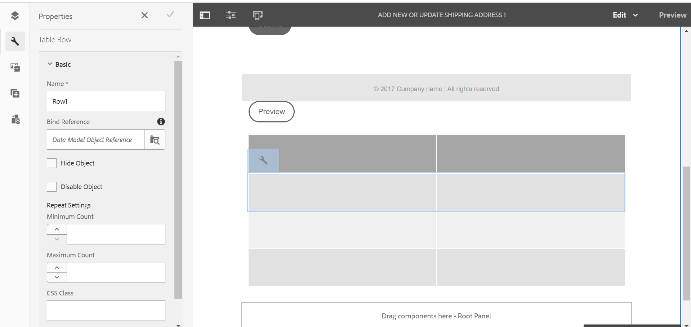

# Tabellen in adaptieve vorm {#tables-in-adaptive-forms}

>[!NOTE]
>
> De Adobe adviseert het gebruiken van de moderne en verlengbare gegevens vangt [ Componenten van de Kern ](https://experienceleague.adobe.com/docs/experience-manager-core-components/using/adaptive-forms/introduction.html?lang=nl-NL) voor [ het creëren van nieuwe Aangepaste Forms ](/help/forms/creating-adaptive-form-core-components.md) of [ het toevoegen van Aangepaste Forms aan de pagina&#39;s van AEM Sites ](/help/forms/create-or-add-an-adaptive-form-to-aem-sites-page.md). Deze componenten betekenen een aanzienlijke vooruitgang in de aanmaak van Adaptive Forms en zorgen voor indrukwekkende gebruikerservaring. In dit artikel wordt een oudere aanpak beschreven voor de auteur Adaptive Forms die gebruikmaakt van stichtingscomponenten.


| Versie | Artikelkoppeling |
| -------- | ---------------------------- |
| AEM 6,5 | [ klik hier ](https://experienceleague.adobe.com/docs/experience-manager-65/forms/adaptive-forms-basic-authoring/adaptive-forms-tables.html?lang=nl-NL) |
| AEM as a Cloud Service | Dit artikel |


Het gebruik van tabellen is een effectieve, vereenvoudigde en georganiseerde manier om complexe gegevens weer te geven. Het helpt gebruikers bij het gemakkelijk identificeren van informatie en het verstrekken van input in een geordende regeling van rijen en kolommen. De meeste vormen van financiële diensten en overheidsorganisaties vereisen grote gegevenslijsten om aantallen te zetten en berekeningen uit te voeren.

AEM Forms biedt een component Tabel in de deelvensterbrowser op het zijpaneel waarmee u tabellen kunt maken in adaptieve formulieren. Enkele belangrijke mogelijkheden die het verstrekt zijn:

* Responsieve lay-out op mobiele apparaten
* Configureerbare rijen en kolommen
* Dynamische toevoeging en verwijdering van rijen bij uitvoering
* Cellen combineren of samenvoegen en splitsen
* Toegankelijk voor schermlezers
* Aangepaste indeling met CSS
* Compatibel met en toegewezen aan XDP-tabelcomponent
* Ondersteuning voor het toevoegen van rijen of cellen met XSD-elementen van complexe typen
* Gegevens uit een XML-bestand samenvoegen

## Een tabel maken {#create-a-table}

Als u een tabel wilt maken, sleept u de component Tabel uit de componentbrowser in het hulpwerkgebied naar het aangepaste formulier. Standaard bevat de tabel twee kolommen en drie rijen, inclusief de koptekstrij.


### Over kop- en lichaamscellen {#about-header-and-body-cells}

De koptekstcellen zijn tekstvelden. Om het etiket voor een kopbal te veranderen, klik de kopbalcel met de rechtermuisknop aan en klik **geef** uit. In de Edit dialoog, werk het etiket op het **gebied van de Waarde** bij en klik **O.K.**.

De lichaamscellen zijn tekstvakjes, door gebrek. U kunt een hoofdcel vervangen door elke andere adaptieve formuliercomponent die beschikbaar is in het hulpgedeelte, zoals een numeriek vak, een datumkiezer of een vervolgkeuzelijst.

De eerste tekstrij in de volgende tabel bevat bijvoorbeeld tekstvak, datumkiezer en vervolgkeuzelijstcomponenten als cellen.


U kunt twee of meer lichaamscellen samenvoegen door de cellen te selecteren u wilt samenvoegen, met de rechtermuisknop aanklikken, en **selecteren samenvoegen**. Ook, kunt u een samengevoegde cel verdelen door het met de rechtermuisknop aan te klikken en **Gesplitste Cellen** te selecteren.

### Rijen en kolommen toevoegen, verwijderen, verplaatsen {#add-delete-move-rows-and-columns}

U kunt een rij of kolom toevoegen en verwijderen en een rij omhoog en omlaag verplaatsen in een tabel.

#### Een rij toevoegen, verwijderen of verplaatsen

Als u de rij wilt toevoegen, verwijderen of verplaatsen, klikt u op een cel van de rij. open de browser van de inhouds  en selecteer de overeenkomstige rij, benadrukt het de geselecteerde rij met de toolbaroptie van waar u, de rij omhoog of omlaag kunt toevoegen schrappen of bewegen.

* Met de bewerking **[!UICONTROL Move Up]** en **[!UICONTROL Move Down]** verplaatst u de geselecteerde rij omhoog en omlaag.

* Met de bewerking **[!UICONTROL Add Column]** voegt u een rij toe onder de geselecteerde rij.

* Met de bewerking **[!UICONTROL Delete Column]** verwijdert u de geselecteerde rij.


Dubbelklik op de rij om de eigenschappen van een rij te configureren, zoals Naam, Verwijzing binden, Instellingen herhalen en CSS-klasse.



#### Een kolom toevoegen of verwijderen

Als u een kolom wilt toevoegen of verwijderen, klikt u op de tekstcel in de koptekstsectie. Er wordt een werkbalk geopend met opties voor het toevoegen of verwijderen van een kolom:


>[!NOTE]
>
>U kunt wel een willekeurig aantal rijen in een tabel toevoegen, maar u kunt maximaal zes kolommen toevoegen. Bovendien kunt u de koptekstrij niet uit de tabel verwijderen.

### Tabelbeschrijving toevoegen {#add-table-description}

U kunt een beschrijving van de tabel toevoegen om uit te leggen hoe de informatie is ingedeeld die schermlezers kunnen interpreteren en lezen. De beschrijving toevoegen:

1. Selecteer de lijst en selecteer  om zijn eigenschappen in sidebar te zien.
1. Geef een overzicht op op het tabblad Toegankelijkheid.
1. Klik **Gedaan**.

### Kolommen in een tabel sorteren {#sortcolumnstable}

U kunt gegevens sorteren op elke kolom in een tabel in het adaptieve formulier. De waarden in de kolom kunnen in oplopende of aflopende volgorde worden gesorteerd.

Sorteren kan worden toegepast op tabelkolommen met:

* Statische tekst
* Objecteigenschappen gegevensmodel
* Combinatie van statische tekst en eigenschappen van gegevensmodelobjecten

Als u sortering wilt toepassen op tabelkolommen, moeten de cellen in de tabelkolom een van de volgende componenten bevatten: Numeriek vak, Numerieke stap, Datuminvoerveld, Datumkiezer, Tekst of Tekstvak.

Sorteren inschakelen:

1. Selecteer de lijst en selecteer  (vorm). U kunt de lijst ook selecteren gebruikend **inhoud** browser in het hulpje van de Interactieve Mededeling.
1. Selecteer **het Sorteren** toelaten.
1. Selecteer  om de lijsteigenschappen te bewaren. De sorteerpictogrammen, pijlen omhoog en omlaag, in kolomkoppen geven aan dat het sorteren is ingeschakeld.

    toe

1. Schakelaar aan de **wijze van de Voorproef** om de output te bekijken. De tabel wordt automatisch gesorteerd op basis van de eerste kolom van de tabel.
1. Klik op de kolomkop om de waarden te sorteren op basis van de kolom.

   Een kolomkop met een pijl-omhoog geeft aan dat de tabel is gesorteerd op basis van die kolom. Bovendien worden de waarden in de kolom in oplopende volgorde weergegeven.

   

   Op dezelfde manier vertegenwoordigt een kolomkopbal met een benedenpijl dat de waarden in de kolom in dalende orde worden getoond.

   U kunt veranderingen in de lijst op de **wijze van de Voorproef** ook aanbrengen en de kolomkopbal klikken opnieuw om de kolomwaarden te sorteren.

## Kolombreedte instellen voor een tabel {#set-column-width}

Voer de volgende stappen uit om de kolombreedte voor een tabel in te stellen:

1. In het **[!UICONTROL Content]** lusje, selecteer de **[!UICONTROL Table]** component en selecteer vormen () pictogram.

1.Voer in het veld **[!UICONTROL Column Width]** de lijst met door komma&#39;s gescheiden waarden in om de proportionele breedte van elke kolom in de tabel op te geven. Als u bijvoorbeeld voor een tabel met 3 kolommen 2,4,6 opgeeft als waarde in het veld **[!UICONTROL Column Width]** , wordt de breedte van de kolommen voor de eerste kolom ingesteld op 2/12, voor de tweede kolom op 4/12 en voor de derde kolom op 6/12. 2/12, aangezien de breedte voor de eerste kolom verwijst naar een zesde van de tabelbreedte. Zo stelt 4/12 de tweede kolombreedte in als een derde van de tabelbreedte en 6/12 stelt de derde kolombreedte in als de helft van de tabelbreedte.

## Tabelstijl configureren {#configure}

U kunt de stijl voor een tabel definiëren met de modus Stijl op de paginaboolbalk. Ga als volgt te werk om over te schakelen op de stijlmodus en de tabelopmaak te bewerken

1. In de paginatoolbar, vóór Voorproef, selecteer  > **Stijl**.

1. In sidebar uitgezochte lijst en uitgeeft knoop .
De opmaakeigenschappen worden weergegeven in het zijpaneel.


>[!NOTE]
>
>U kunt het kleurenthema voor kopbal en lichaamstrijen veranderen door de waarden van [ LESS variabelen ](https://lesscss.org//) te veranderen. Voor meer informatie, zie [ Thema&#39;s in AEM Forms ](/help/forms/themes.md).

## Een rij dynamisch toevoegen of verwijderen {#add-or-delete-a-row-dynamically}

Tabellen bieden ondersteuning voor het dynamisch toevoegen of verwijderen van rijen tijdens runtime.

1. Selecteer een lijstrij en selecteer .
1. Geef op het tabblad Herhalingsinstellingen het minimale en maximale aantal rijen op om het aantal rijen in de tabel te beperken.
1. Klik **Gedaan**.

Bij runtime of voorproef, ziet u **+** en  knopen om een rij toe te voegen of te schrappen.


>[!NOTE]
>
>Het dynamisch toevoegen of verwijderen van een rij wordt niet ondersteund in kopteksten in de mobiele lay-out links van tabellen.

## Expressies in een tabel {#expressions-in-a-table}

Met tabellen in adaptieve formulieren kunt u expressies schrijven in JavaScript om gedrag te induceren, zoals een tabel of rij tonen of verbergen, alle getallen optellen en het totaal in een cel weergeven, een cel in- of uitschakelen, gebruikersinvoer valideren enzovoort. Deze expressies gebruiken API&#39;s van het adaptieve formulierscriptmodel.

Tabellen en rijen bieden alleen ondersteuning voor zichtbaarheidsexpressies om de zichtbaarheid ervan te bepalen op basis van de waarde die door een expressie wordt geretourneerd, terwijl cellen de volgende expressies ondersteunen:

* **Manuscript van de Initialisatie:** om een actie op initialisering van een gebied uit te voeren.
* **de Waarde verbindt Manuscript:** om de componenten van een vorm te veranderen nadat de waarde van een gebied wordt veranderd.

>[!NOTE]
>
>Als het XFA change/exit-script ook op hetzelfde veld wordt toegepast, wordt het XFA change/exit-script uitgevoerd vóór het Value Commit-script.

* **berekent uitdrukkingen**: aan auto-compute waarde van een gebied.
* **uitdrukkingen van de Bevestiging**: om een gebied te bevestigen.
* **de uitdrukkingen van de Toegang**: om een gebied toe te laten/onbruikbaar te maken.
* **de uitdrukking van het Zichtbaarheid**: om zicht van een gebied en een paneel te controleren.

De zichtbaarheidsexpressie voor een tabel of rij kan worden gedefinieerd op het tabblad Eigenschappen van deelvenster van het corresponderende dialoogvenster van de component Bewerken. De expressies voor een cel kunnen worden gedefinieerd op het tabblad Script van het dialoogvenster dat de component Edit bevat.

Voor de volledige lijst van adaptieve vormklassen, gebeurtenissen, voorwerpen, en openbare APIs, zie [ API van de Bibliotheek van JavaScript verwijzing voor adaptieve vormen ](https://helpx.adobe.com/nl/experience-manager/6-5/forms/javascript-api/index.html).

## Mobiele lay-outs {#mobile-layouts}

Tabellen in adaptieve formulieren bieden ongeëvenaarde beleving van mobiele apparaten vanwege hun dynamische en responsieve lay-outs. AEM Forms biedt twee typen mobiele lay-outs voor tabellen: kopteksten aan de linkerkant en Inklapbare kolommen.

U kunt een mobiele lay-out voor een lijst van het Stijllusje van het Edit componentendialoogvenster voor een lijst vormen.

### Kopteksten links {#headers-on-left}

In de kopteksten op linkerlay-out, wordt de kopbal in de lijst omgezet op de linkerzijde met slechts één cel die op een kopbal verschijnt. Elke rij in deze lay-out wordt weergegeven als een afzonderlijke sectie. In de volgende afbeeldingen wordt een tabel op een desktopcomputer vergeleken met die op een mobiel apparaat.


Bureaubladweergave van een tabel met Koptekst in linkerindeling


De mobiele mening van een lijst met Kopbal op linkerlay-out

### Inklapbare kolomindeling {#collapsible-columns-layout}

In de Inklapbare kolomlay-out, de kolommen in de lijst doen ineenstorten om één of twee kolommen, afhankelijk van de apparatengrootte te tonen, terwijl andere kolommen worden doen ineenstorten. U kunt op het pictogram samenvouwen/uitvouwen klikken om andere kolommen in de tabel weer te geven.

>[!NOTE]
>
>Hoewel de Inklapbare kolomlay-out is geoptimaliseerd voor mobiele apparaten, werkt deze ook op het bureaublad als de beschikbare breedte niet voldoende is om alle kolommen in een tabel weer te geven.

De volgende afbeeldingen vergelijken hoe een tabel eruitziet op een apparaat met samengevouwen en uitgevouwen kolommen.


Samengevouwen kolommen van een tabel waarvan slechts twee kolommen worden weergegeven op een mobiel apparaat


Uitgebreide kolom van een tabel op een mobiel apparaat

## Gegevens in een tabel samenvoegen {#merge-data-in-a-table}

Met tabellen in adaptieve formulieren kunt u de tabel tijdens runtime vullen met gegevens uit een XML-bestand. Het XML-bestand met gegevens kan zich bevinden in het lokale bestandssysteem van de computer waarop de AEM Forms-server wordt uitgevoerd of in de CRX-opslagplaats.

Neem bijvoorbeeld de volgende overzichtstabel voor banktransacties die we willen vullen met gegevens uit een XML-bestand.


In dit voorbeeld is de eigenschap Element name for:

* de rij is **Row1**
* de lichaamscel onder de datum van de Transactie is **tableItem1**
* de lichaamscel onder Beschrijving is **tableItem2**
* de lichaamscel onder het type van Transactie is **type**
* de lichaamscel onder Bedrag in USD is **tableItem3**

Het XML-bestand dat gegevens in de volgende indeling bevat:

```xml
<?xml version="1.0" encoding="UTF-8"?><afData>
  <afUnboundData>
    <data>
 <typeSelect>0</typeSelect>
 <Row1>
      <tableItem1>2015-01-08</tableItem1>
      <tableItem2>Purchase laptop</tableItem2>
      <type>0</type>
      <tableItem3>12000</tableItem3>
 </Row1>
 <Row1>
      <tableItem1>2015-01-05</tableItem1>
      <tableItem2>Transport expense</tableItem2>
      <type>0</type>
      <tableItem3>120</tableItem3>
 </Row1>
 <Row1>
      <tableItem1>2014-01-08</tableItem1>
      <tableItem2>Laser printer</tableItem2>
      <type>0</type>
      <tableItem3>500</tableItem3>
 </Row1>
 <Row1>
      <tableItem1>2014-12-08</tableItem1>
      <tableItem2>Credit card payment</tableItem2>
      <type>0</type>
      <tableItem3>300</tableItem3>
 </Row1>
 <Row1>
      <tableItem1>2015-01-06</tableItem1>
      <tableItem2>Interest earnings</tableItem2>
      <type>1</type>
      <tableItem3>12000</tableItem3>
 </Row1>
 <Row1>
      <tableItem1>2015-01-05</tableItem1>
      <tableItem2>Payment from a client</tableItem2>
      <type>1</type>
      <tableItem3>500</tableItem3>
 </Row1>
 <Row1>
      <tableItem1>2015-01-08</tableItem1>
      <tableItem2>Food expense</tableItem2>
      <type>0</type>
      <tableItem3>120</tableItem3>
 </Row1>
 </data>
  </afUnboundData>
  <afBoundData>
    <data/>
  </afBoundData>
  <afBoundData/>
</afData>
```

In de voorbeeld-XML worden de gegevens voor een rij gedefinieerd door de `<Row1>` -tags. Dit is de elementnaam voor de rij in de tabel. Binnen de tag `<Row1>` worden de gegevens voor elke cel binnen de tag gedefinieerd voor de elementnaam, zoals `<tableItem1>` , `<tableItem2>` , `<tableItem3>` en `<type>` .

Als u deze gegevens tijdens runtime wilt samenvoegen met de tabel, moet u het aangepaste formulier met de tabel verwijzen naar de absolute XML-locatie met Wcmmode uitgeschakeld. Bijvoorbeeld, als de adaptieve vorm in *https://localhost:4502/myForms/bankTransaction.html* is en het dossier van gegevensXML in *C wordt bewaard:/myTransactions/bankSummary.xml*, kunt u de lijst met gegevens bij volgende URL bekijken:

*https://localhost:4502/myForms/bankTransaction.html?dataRef=file:/// C:/myTransactions/bankSummary.xml&amp;wcmmode=disabled*


## XDP-componenten en XSD-complexe typen gebruiken {#use-xdp-components-and-xsd-complex-types}

Als u een adaptief formulier hebt gemaakt op basis van een XFA-formuliersjabloon, zijn de XFA-elementen beschikbaar op het tabblad Gegevensmodel van AEM Content Finder. U kunt deze XFA-elementen, inclusief tabellen, naar het aangepaste formulier slepen.

Het XFA-tabelelement wordt toegewezen aan de component Tabel en werkt in adaptieve formulieren buiten de box. Alle eigenschappen en functies van XDP-tabellen blijven behouden wanneer u deze verplaatst naar een adaptief formulier. U kunt er elke bewerking op uitvoeren, net als bij een native adaptieve formuliertabel. Als een rij in een XDP-tabel bijvoorbeeld herhaalbaar is, wordt deze herhaald wanneer deze ook in adaptieve formulieren wordt neergezet.

Daarnaast kunt u XDP-subformulier slepen en neerzetten om een nieuwe rij toe te voegen aan de tabel. Het neerzetten van een genest subformulier werkt echter niet.

>[!NOTE]
>
>Een XDP-tabel zonder koptekstrij wordt niet toegewezen aan de adaptieve component Form Table. In plaats daarvan wordt het element toegewezen aan de adaptieve component van het deelvenster Formulier met vloeiende layout. Wanneer u een geneste tabel toevoegt van een XDP naar een adaptief formulier, wordt de buitenste tabel geconverteerd naar een deelvenster met behoud van de binnenste tabel.

Bovendien kunt u een groep XSD-complexe tekstelementen slepen en neerzetten om een tabelrij te maken. Er wordt een nieuwe rij gemaakt net onder de rij waarop u de elementen hebt neergezet. De cellen die zijn gemaakt met de XSD-elementen voor complexe typen behouden een bindingsverwijzing naar de XSD. U kunt een lichaamscel met een XSD complex typeelement ook vervangen door het element op de cel te laten vallen.

>[!NOTE]
>
>Het aantal elementen in een XDP-tabelcomponent, een subformulier of een XSD-complex type kan het aantal cellen in een rij niet overschrijden. U kunt bijvoorbeeld geen vier elementen neerzetten op een rij met slechts drie cellen. Er treedt een fout op.
>
>Als het aantal elementen kleiner is dan het aantal cellen in een rij, voegt de nieuwe rij eerst cellen toe die op de elementen worden gebaseerd, en dan worden de standaardcellen toegevoegd om de resterende cellen in de rij te vullen. Als u bijvoorbeeld een groep van drie elementen in een rij met vier cellen neerzet, zijn de eerste drie cellen gebaseerd op de elementen die u hebt neergezet en is de resterende één cel de standaardtabelcel.

## Belangrijkste overwegingen {#key-considerations}

* Als u rijen omhoog en omlaag verplaatst tijdens het ontwerpen van een op XSD gebaseerde tabel, wordt enig gegevensverlies uit tabelrijen gezien in de gegevens-XML die bij het verzenden van het formulier worden gegenereerd.
* Aan elke hoofdcel in een standaardtabel is een vooraf gedefinieerde elementnaam gekoppeld. Als u een andere tabel in het aangepaste formulier toevoegt, hebben de standaardhoofdtekstcellen in de nieuwe tabel dezelfde elementnaam als in de eerste tabel. In dat geval bevatten de gegevens die bij het verzenden van het formulier worden gegenereerd, gegevens in de standaardhoofdtekstcellen van slechts een van de tabellen. Zorg er daarom voor dat u de elementnamen voor standaardlichaamscellen hernoemt om ze uniek te houden in verschillende tabellen en gegevensverlies te voorkomen.

  Alleen van toepassing op de standaardlichaamscellen. Als u meer rijen of kolommen aan een tabel toevoegt, worden automatisch unieke elementnamen voor niet-standaardlichaamscellen gegenereerd.

## Zie ook {#see-also}

{{see-also}}

