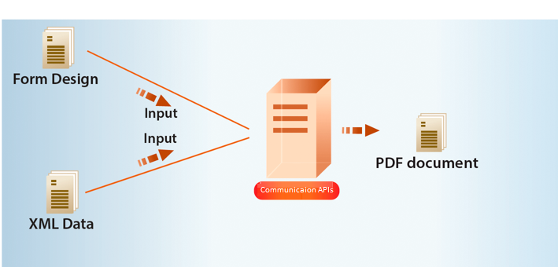

# AEM Forms as a Cloud Service Communication-API&#39;s {#communications-apis-overview}

> **Beschikbaarheid van de Versie**
>
> * **AEM 6.5**: [&#x200B; Overzicht van de Diensten van het Document van AEM &#x200B;](https://experienceleague.adobe.com/docs/experience-manager-65/forms/use-document-services/overview-aem-document-services.html)
> * **AEM as a Cloud Service**: Dit artikel

## Inleiding

Via communicatie-API&#39;s in AEM Forms as a Cloud Service kunt u door uw merk goedgekeurde, gepersonaliseerde en gestandaardiseerde documenten maken voor uw zakelijke behoeften. Met deze krachtige API&#39;s kunt u documenten programmatisch genereren, manipuleren en beveiligen, op aanvraag of in batchprocessen op grote volumes.

### Belangrijkste voordelen

* **Gestroomlijnde documentgeneratie** - creeer gepersonaliseerde documenten door malplaatjes met klantengegevens samen te voegen
* **Krachtige documentmanipulatie** - combineer, herschik, en bevestig de documenten van PDF programmatically
* **Flexibele plaatsingsopties** - Gebruik op bestelling APIs voor lage latentiebehoeften of batch-APIs voor high-productietaken
* **Verbeterde veiligheid** - pas digitale handtekeningen, certificatie, en encryptie toe om gevoelige documenten te beschermen
* **Cloud-inheemse architectuur** - hefboomwerking scalable, veilige wolkeninfrastructuur zonder onderhoudsoverheadkosten

## Overzicht van API-mogelijkheden

Communicatie-API&#39;s bieden een uitgebreide set mogelijkheden voor documentverwerking die zijn ingedeeld in de volgende functionele gebieden:

| Document genereren | Documentmanipulatie | Document uitnemen | Documentconversie | Document Assurance |
|---------------------|----------------------|---------------------|---------------------|-------------------|
| Genereer gepersonaliseerde documenten door sjablonen samen te voegen met gegevens in verschillende indelingen, waaronder PDF en afdrukindelingen. | U kunt PDF-documenten programmatisch combineren, herschikken en valideren om nieuwe documentpakketten te maken. | Eigenschappen, metagegevens en inhoud uit PDF-documenten extraheren voor verdere verwerking. | Documenten converteren naar andere indelingen, waaronder PDF/A-compatibiliteitsvalidatie voor archiveringsbehoeften. | Digitale handtekeningen, certificering en versleuteling toepassen om documenten te beveiligen en te beveiligen. |

De [&#x200B; API verwijzingsdocumentatie &#x200B;](https://developer.adobe.com/experience-cloud/experience-manager-apis/api/experimental/document/) verstrekt gedetailleerde informatie over alle parameters, authentificatiemethodes, en diverse diensten die door APIs worden verleend. De API-naslagdocumentatie is ook beschikbaar in de indeling .yaml. U kunt de .yaml downloaden en uploaden naar Postman om de functionaliteit van de API&#39;s te controleren.

## Toepassings- en gebruiksgevallen

### Verzekeringen

## Kan AEM Forms documenten met verzekeringspolissen genereren?

Ja. AEM Forms kan beleidsdocumenten genereren met behulp van sjablonen en gestructureerde gegevens die zijn vastgelegd via formulieren.

## Kan AEM Forms de verzekeringsactiviteiten op grote schaal afhandelen?

Ja. Als AEM Forms wordt geïmplementeerd met aanbevolen architecturen op Adobe Managed Services of in de privécloud, ondersteunt het bedrijf grootschalige verzending van formulieren en werklasten op bedrijfsniveau.

## Document genereren

Via API&#39;s voor het genereren van communicatiedocumenten kunt u een sjabloon (XFA of PDF) combineren met klantgegevens (XML) om documenten te genereren in de indelingen PDF, AFP (Advanced Function Presentation) en Afdrukformaten zoals PS, PCL, DPL, IPL en ZPL. Deze APIs gebruiken PDF en de malplaatjes XFA met [&#x200B; gegevens van XML &#x200B;](communications-known-issues-limitations.md#form-data) om één enkel document op bestelling of veelvoudige documenten te produceren die een partijbaan gebruiken.

Typisch, creeert u een malplaatje gebruikend [&#x200B; Designer &#x200B;](use-forms-designer.md) en gebruikt Mededelingen APIs om gegevens met het malplaatje samen te voegen. Uw toepassing kan het uitvoerdocument naar een netwerkprinter, een lokale printer of een opslagsysteem verzenden voor archivering. Een typisch uit de doos en de douanewerkschema&#39;s kijken als het volgende:

Afhankelijk van het gebruiksgeval kunt u deze documenten ook beschikbaar stellen voor downloaden via uw website of een opslagserver.

### Belangrijke mogelijkheden voor het genereren van documenten

#### Documenten maken in de elektronische indeling PDF/AFP

Met de API&#39;s voor het genereren van documenten kunt u een document maken in PDF- of AFP-indeling die is gebaseerd op een formulierontwerp en XML-formuliergegevens. De uitvoer is een niet-interactief document. Met andere woorden, gebruikers kunnen de formuliergegevens niet invoeren of wijzigen. Een basisworkflow is het samenvoegen van XML-formuliergegevens met een formulierontwerp om een document te maken. In de volgende afbeelding ziet u hoe een formulierontwerp en XML-formuliergegevens worden samengevoegd om een PDF-document te maken.

Afbeelding: Standaardworkflow voor het maken van een document

In de onderstaande tabel ziet u het verschil tussen de AFP- en PDF-indelingen:

| **Eigenschap** | **AFP (de Geavanceerde Presentatie van de Functie)** | **PDF (Portable Document Format)** |
|---------------------------|--------------------------------------------------------------------|-------------------------------------------------------------|
| **Doel** | Afdrukken op grote schaal en productie van transactiedocumenten | Documenten delen en weergeven voor algemeen gebruik |
| **Geval van het Gebruik** | Bankafschriften, rekeningen, facturen, verzekeringsdocumenten | E-boeken, formulieren, rapporten, hervatten, handleidingen |
| **Oorsprong van het Platform** | Ontwikkeld door IBM | Ontwikkeld door Adobe |
| **Structuur** | Paginageoriënteerde indeling met gestructureerde velden en objecten | Paginageoriënteerd maar met vaste indeling |
| **Editability** | Ontworpen voor afdrukken in productie en zelden bewerkt | Kan worden bewerkt met verschillende gereedschappen, bijvoorbeeld Adobe Acrobat |
| **Grootte &amp; Prestaties van het Dossier** | Geoptimaliseerd voor prestaties in een omgeving met hoge snelheden | Kan groter en minder geoptimaliseerd zijn voor bulkuitvoer |
| **Interactiviteit** | Minimaal tot nul; statische pagina&#39;s | Ondersteunt interactieve elementen zoals formulieren, koppelingen, JavaScript |
| **Controle van de Output** | Fijne controle over de lay-out van printers | Visuele lay-out geoptimaliseerd voor scherm en afdrukken |
| **Doopvonten en Grafieken** | Gebruikt font- en bronverwijzingen; vereist dat renderers deze interpreteren | Hiermee worden lettertypen en afbeeldingen rechtstreeks in het bestand ingesloten |

De API voor het genereren van documenten retourneert het gegenereerde PDF-document of AFP-document. U kunt de gegenereerde PDF&#39;s optioneel ook uploaden naar Azure Blob Storage.

 Het uploaden van geproduceerde PDFs die de generatie API van het document aan het vermogen van de Opslag van Azure Blob gebruiken is onder [&#x200B; Vroege Programma van de Aannemer &#x200B;](/help/forms/early-access-ea-features.md). U kunt vanaf uw officiële e-mailadres naar aem-forms-ea@adobe.com schrijven om deel te nemen aan het programma voor vroege adoptie en toegang tot de functie te vragen. 

>
>
> De Generatie APIs van het document omvat partij en synchrone eindpunten van de outputgeneratie. Deze APIs steunen server-aan-server authentificatie gebruikend JWT of OAuth, afhankelijk van het eindpunt. Om meer over de Generatie APIs van het Document te weten, [&#x200B; klik hier &#x200B;](/help/forms/aem-forms-communication-api-overview.md#document-generation-apis).

#### PostScript (PS), Printer Command Language (PCL), Zebra Printing Language (ZPL)-document maken {#create-PS-PCL-ZPL-documents}

U kunt API&#39;s voor het genereren van documenten gebruiken om een PostScript-document (PS), een PCL-document (Printer Command Language) en een ZPL-document (Zebra Printing Language) te maken dat is gebaseerd op een XDP-formulierontwerp of PDF-document. Deze API&#39;s helpen u bij het samenvoegen van een formulierontwerp met formuliergegevens om een document te genereren. U kunt het document opslaan in een bestand en een aangepast proces ontwikkelen om het naar een printer te verzenden.

#### Batchgegevens verwerken om meerdere documenten te maken {#processing-batch-data-to-create-multiple-documents}

Met API&#39;s voor het genereren van documenten kunt u afzonderlijke documenten maken voor elke record in een XML-batchgegevensbron. U kunt documenten bulksgewijs en asynchroon genereren. U kunt diverse parameters voor de omzetting vormen en dan het partijproces beginnen.

## Documentmanipulatie

Met API&#39;s voor het manipuleren van communicatiedocumenten (Document Transformation) kunt u PDF-documenten combineren en opnieuw rangschikken. Doorgaans maakt u een DDX en verzendt u deze naar API&#39;s voor documentmanipulatie om een document samen te stellen of opnieuw te rangschikken. Het [&#x200B; DDX- document &#x200B;](https://helpx.adobe.com/content/dam/help/en/experience-manager/forms-cloud-service/ddxRef.pdf) verstrekt instructies op hoe te om de brondocumenten te gebruiken om een reeks vereiste documenten te veroorzaken. De DDX-referentiedocumentatie biedt gedetailleerde informatie over alle ondersteunde bewerkingen.

>
>
> Document Manipulation APIs steunt server-aan-server authentificatie gebruikend JWT. Om meer over de Manipulatie APIs van het Document te weten, [&#x200B; klik hier &#x200B;](/help/forms/aem-forms-communication-api-overview.md#document-manipulation-apis).

### Belangrijkste mogelijkheden voor documentmanipulatie

#### PDF-documenten samenstellen

U kunt de API&#39;s voor documentmanipulatie gebruiken om twee of meer PDF- of XDP-documenten samen te voegen tot één PDF-document of PDF Portfolio. Hier volgen enkele voorbeelden van manieren waarop u PDF-documenten kunt samenstellen:

* Een eenvoudig PDF-document samenstellen
* Een PDF Portfolio maken
* Gecodeerde documenten samenstellen
* Documenten samenstellen met Bates-nummering
* Documenten samenvoegen en samenvoegen

Afbeelding: Een eenvoudig PDF-document samenstellen op basis van meerdere PDF-documenten

#### PDF-documenten demonteren

U kunt de API&#39;s voor documentmanipulatie gebruiken om een PDF-document te demonteren. De API&#39;s kunnen pagina&#39;s uitnemen uit het brondocument of een brondocument splitsen op basis van bladwijzers. Doorgaans is deze taak handig als het PDF-document oorspronkelijk is gemaakt op basis van veel afzonderlijke documenten, zoals een verzameling instructies.

* Pagina&#39;s uit een brondocument extraheren
* Een brondocument splitsen op basis van bladwijzers

Afbeelding: Een brondocument dat is gebaseerd op bladwijzers, opsplitsen in meerdere documenten

>[!NOTE]
>
> AEM Forms biedt diverse ingebouwde lettertypen die naadloos kunnen worden geïntegreerd met PDF-bestanden. Om de lijst van gesteunde doopvonten te zien, [&#x200B; klik hier &#x200B;](/help/forms/supported-out-of-the-box-fonts.md).

## Document uitnemen

 De functie voor het uitnemen van documenten valt onder het programma voor vroegtijdige adoptie. U kunt vanaf uw officiële e-mailadres naar aem-forms-ea@adobe.com schrijven om deel te nemen aan het programma voor vroege adoptie en toegang tot de functie te vragen. 

Met de service Documentextractie kunt u de eigenschappen van een PDF-document ophalen, zoals gebruiksrechten, PDF-eigenschappen en metagegevens. De mogelijkheden voor het uitnemen van documenten zijn:

* Hiermee worden de eigenschappen van een PDF-document opgehaald, bijvoorbeeld als de PDF bijlagen, opmerkingen, de Acrobat-versie en nog veel meer bevat.
* Haal de gebruiksrechten uit die in een PDF-document zijn ingeschakeld, gebruikers halen de gebruiksrechten op die voor Adobe Acrobat Reader-uitbreidbaarheid zijn in- of uitgeschakeld.
* Haal de metagegevens op die aanwezig zijn in een PDF-document. De metagegevens zijn informatie over het document (zoals die wordt onderscheiden van de inhoud van het document, zoals tekst en afbeeldingen). Het Adobe Extensible Metadata Platform (XMP) is een standaard voor de verwerking van metagegevens van documenten. De XMP Utilities-service kan XMP-metagegevens ophalen uit PDF-documenten en XMP-metagegevens exporteren naar PDF-documenten.

>
>
> API&#39;s voor het uitpakken van documenten ondersteunen server-naar-server verificatie met OAuth. Om meer over de Extractie APIs van het Document te weten, [&#x200B; klik hier &#x200B;](/help/forms/aem-forms-communication-api-overview.md#document-extraction-apis).
>

## Documentconversie

### Converteren naar en valideren van documenten die voldoen aan PDF/A

Met API&#39;s voor documentconversie via communicatie kunt u een PDF-document converteren naar PDF/A. U kunt de API&#39;s gebruiken om een PDF-document te converteren naar een PDF/A-compatibel document en ook om te bepalen of een PDF-document voldoet aan PDF/A. PDF/A is een archiefindeling die bedoeld is voor het op lange termijn bewaren van de inhoud van het document. De lettertypen worden ingesloten in het document en het bestand wordt niet gecomprimeerd. Een PDF/A-document is daarom doorgaans groter dan een standaard PDF-document. Een PDF/A-document bevat ook geen audio- en video-inhoud. Tot de ondersteunde PDF/A-compatibiliteitsnormen behoren PDF/A-1a, 1b, 2a, 2b, 3a en 3b.

### PDF converteren naar XDP {#convert-pdf-to-xdp}

 De functie PDF converteren naar XDP valt onder het programma Vroege adopter. U kunt vanaf uw officiële e-mailadres naar aem-forms-ea@adobe.com schrijven om deel te nemen aan het programma voor vroege adoptie en toegang tot de functie te vragen. 

Converteert een PDF-document naar een XDP-bestand. Een PDF-document kan alleen succesvol worden geconverteerd naar een XDP-bestand als het PDF-document een XFA-stroom bevat in het woordenboek.

>
>
> API&#39;s voor documentconversie ondersteunen server-naar-server verificatie met OAuth. Om meer over de Omzetting APIs van het Document te weten, [&#x200B; klik hier &#x200B;](/help/forms/aem-forms-communication-api-overview.md#document-conversion-apiss).

## Document Assurance {#doc-assurance}

De DocAssurance-service bevat de API&#39;s voor handtekening en versleuteling:

### Handtekening-API&#39;s

Met de handtekening-API&#39;s kunt u de beveiliging en privacy van Adobe PDF-documenten die door uw organisatie worden gedistribueerd en ontvangen, beschermen. <!--This service uses digital signatures and certification to ensure that only intended recipients can alter documents. --> De beveiligingsfuncties worden toegepast op het document zelf. Het document blijft gedurende de gehele levenscyclus beveiligd en beheerd. Het document blijft beveiligd buiten de firewall, wanneer het offline wordt gedownload en wanneer het wordt teruggestuurd naar uw organisatie. U kunt de volgende taken uitvoeren met de handtekening-API&#39;s:

* Voeg een zichtbaar handtekeningveld toe aan een PDF-document.
* Voeg een onzichtbaar handtekeningveld toe aan een PDF-document.
* Onderteken het opgegeven handtekeningveld in een PDF-document.
* PDF-documenten certificeren
* De handtekening verwijderen uit het opgegeven handtekeningveld in een PDF-document
* Het opgegeven handtekeningveld uit een PDF-document verwijderen

 Verwijder de handtekening uit het opgegeven handtekeningveld en verwijder het opgegeven handtekeningveld uit een PDF-document dat beschikbaar is onder het programma voor vroege adoptie. U kunt vanaf uw officiële e-mailadres naar aem-forms-ea@adobe.com schrijven om deel te nemen aan het programma voor vroege adoptie en toegang tot de functie te vragen. 

>
>
> Assurance API&#39;s van Document ondersteunen server-naar-server verificatie met OAuth. Meer over Document Assurance APIs, [&#x200B; klik hier &#x200B;](/help/forms/aem-forms-communication-api-overview.md#document-assurance-apis).

### Coderings-API&#39;s

Met de API&#39;s voor versleuteling kunt u documenten versleutelen en ontsleutelen. Wanneer een document wordt versleuteld, wordt de inhoud ervan onleesbaar. Een geautoriseerde gebruiker kan het document decoderen om toegang tot de inhoud te krijgen. Als een PDF-document is versleuteld met een wachtwoord, moet de gebruiker het wachtwoord voor openen opgeven voordat het document kan worden weergegeven in Adobe Reader of Adobe Acrobat. <!-- Likewise, if a PDF document is encrypted with a certificate, the user must decrypt the PDF document with the public key that corresponds to the certificate (private key) that was used to encrypt the PDF document.-->

U kunt deze taken uitvoeren met de API&#39;s voor codering:

* Codeer een PDF-document met een wachtwoord.
* Verwijder op wachtwoord gebaseerde versleuteling uit een PDF-document.
* Haal het type beveiliging op dat op een PDF-document is toegepast.
* Retourneer het beveiligingstype dat op een PDF-document is toegepast.

Zowel handtekening APIs als encryptie APIs zijn [&#x200B; Synchrone APIs &#x200B;](#types-of-communications-apis-types).

### Documenthulpprogramma {#doc-utility}

Documenthulpprogramma&#39;s met synchrone API&#39;s helpen u bij het converteren van documenten tussen PDF- en XDP-bestandsindelingen. Pas gebruiksrechten toe op een document en extraheer de ingeschakelde gebruiksrechten uit een document. Vraag informatie over een PDF-document. <!-- determines whether a PDF document contains comments or attachments and more, and use document transformation services for XMP utilities--> Meer informatie over de gebruiksrechten-API&#39;s vindt u hieronder:

#### Gebruiksrechten-API&#39;s (Reader-extensie)

 De mogelijkheden voor gebruiksrechten (Reader Extension) vallen onder het programma Vroege adopter. U kunt vanaf uw officiële e-mailadres naar aem-forms-ea@adobe.com schrijven om deel te nemen aan het programma voor vroege adoptie en toegang tot de functie te vragen. 

Met de functie Gebruiksrechten kan uw organisatie eenvoudig interactieve PDF-documenten delen door de functionaliteit van Adobe Reader uit te breiden met extra gebruiksrechten. De service werkt met Adobe Reader 7.0 of hoger en voegt gebruiksrechten toe aan een PDF-document. Met deze actie activeert u functies die gewoonlijk niet beschikbaar zijn wanneer een PDF-document wordt geopend met Adobe Reader, zoals het toevoegen van opmerkingen aan een document, het invullen van formulieren en het opslaan van het document.

Wanneer de juiste gebruiksrechten zijn toegevoegd aan PDF-documenten, kunnen ontvangers de volgende activiteiten uitvoeren vanuit Adobe Reader:

* Voltooi PDF-documenten en -formulieren online of offline, zodat ontvangers kopieën lokaal kunnen opslaan voor hun records en de toegevoegde gegevens intact kunnen houden.
* Sla PDF-documenten op een lokale vaste schijf op om het originele document en eventuele aanvullende opmerkingen, gegevens of bijlagen te behouden.
* Bestanden en mediaclips aan PDF-documenten koppelen.
* Onderteken, certificeer en authenticeer PDF-documenten door digitale handtekeningen toe te passen met PKI-technologieën (Public Key Infrastructure) die industriestandaard zijn.
* Ingevulde of geannoteerde PDF-documenten elektronisch verzenden.
* Gebruik PDF-documenten en -formulieren als intuïtieve ontwikkelfront-end voor interne databases en webservices.
* Deel PDF-documenten met anderen, zodat revisoren opmerkingen kunnen toevoegen met intuïtieve opmaakgereedschappen. Deze gereedschappen zijn onder andere elektronische notities, stempels, hooglichten en doorhalen van tekst. Dezelfde functies zijn beschikbaar in Acrobat.
* Ondersteuning voor gestreepte Forms-decodering.

Deze speciale gebruiksrechtenfuncties worden automatisch geactiveerd wanneer een PDF-document met ingeschakelde rechten wordt geopend in Adobe Reader. Wanneer de gebruiker klaar is met het werken met een document waarvoor rechten zijn ingeschakeld, worden deze functies weer uitgeschakeld in Adobe Reader. Ze blijven uitgeschakeld totdat de gebruiker een ander PDF-document met ingeschakelde rechten ontvangt.

#### Gebruiksrechten in- of uitschakelen

De verschillende gebruiksrechtenmogelijkheden voor de uitbreiding van PDF Reader-services zijn:

* **Decodering van Streepjescodes**: Om streepjescodes binnen het document van PDF te decoderen.

* **Commentaren**: Om off-line op het document van PDF opmerkingen te maken.

* **Online Commentaren**: Om online op het document van PDF commentaar te geven.

* **Digitale Handtekening**: Om digitale handtekeningen aan een document van PDF toe te voegen.

* **Dynamische Gebieden van de Vorm**: Om vormgebieden aan een document van PDF toe te voegen.

* **Dynamische Pagina&#39;s van de Vorm**: Om vormpagina&#39;s aan een document van PDF toe te voegen.

* **Ingebedde Dossiers**: Om dossiers binnen een document van PDF in te bedden.

* **de Invoer van de Gegevens van de Vorm**: Om vormgegevens in een document van PDF in te voeren.

* **de Uitvoer van de Gegevens van de Vorm**: Om vormgegevens in een document van PDF in te voeren.

* **Vulling van de Vorm**: Om vormgebieden binnen een document van PDF te vullen.

* **Online Forms**: Om tot een Webdienst of gegevensbestand van een document van PDF toegang te hebben.

* **legt Zelfstandig** voor: Om formuliergegevens off-line van een document van PDF voor te leggen.

#### Andere mogelijkheden

* **Bericht**: Het bericht dat binnen Adobe Acrobat Reader op het openen van een document van PDF met één of meerdere toegepaste gebruiksrechten wordt getoond.
* **Wachtwoord van de Ontgrendeling**: Het wachtwoord dat voor het openen van een gecodeerd document van PDF wordt vereist. Dit is doorgaans het wachtwoord voor het openen van het document, maar als het PDF-document extra wordt beveiligd door een wachtwoord voor machtigingen, kunt u het ook openen.

## Typen communicatie-API&#39;s {#types}

Communicatie biedt HTTP-API&#39;s voor het genereren van documenten op aanvraag en in batches:

* **[Synchrone APIs &#x200B;](https://developer.adobe.com/experience-manager-forms-cloud-service-developer-reference/)** zijn geschikt voor op bestelling, lage latentie, en enige scenario&#39;s van de verslagdocumentgeneratie. Deze API&#39;s zijn geschikter voor gebruiksgevallen die zijn gebaseerd op handelingen van gebruikers. Als u bijvoorbeeld een document genereert nadat een gebruiker een formulier heeft ingevuld.

* **[Partij APIs (Asynchrone APIs) &#x200B;](https://developer.adobe.com/experience-manager-forms-cloud-service-developer-reference/)** is geschikt voor geplande, hoge productie, en veelvoudige scenario&#39;s van de documentgeneratie. Met deze API&#39;s worden documenten batchgewijs gegenereerd. Zo worden telefoonrekeningen, creditcardafschriften en uitkeringsafschriften elke maand gegenereerd.

## Onboarding

Communicatiecapaciteit is beschikbaar als zelfstandige en add-on module voor Forms as a Cloud Service-gebruikers. Je kunt contact opnemen met het Adobe Sales-team of je Adobe-vertegenwoordiger om toegang aan te vragen. Adobe maakt toegang voor uw organisatie mogelijk en biedt de vereiste rechten aan de persoon die is aangewezen als beheerder in uw organisatie. De beheerder kan toegang verlenen aan uw Forms as a Cloud Service-ontwikkelaars (gebruikers) van uw organisatie voor het gebruik van de API&#39;s.

Na het instappen, om Communicatie vermogen voor uw milieu van Forms as a Cloud Service toe te laten:

1. Meld u aan bij Cloud Manager en open AEM Forms as a Cloud Service Instance.

1. Open de optie Programma bewerken, ga naar het tabblad Oplossingen en invoegtoepassingen en selecteer de optie **[!UICONTROL Forms - Communications]** .

   

   Als u de optie **[!UICONTROL Forms - Digital Enrollment]** al hebt ingeschakeld, selecteert u de optie **[!UICONTROL Forms - Communications Add-On]** .

   

1. Klik op **[!UICONTROL Update]**.

1. Stel de bouwstijlpijpleiding in werking. Nadat de bouwstijlpijpleiding slaagt, Communicatie APIs wordt toegelaten voor uw milieu.

>[!NOTE]
>
> Om documentmanipulatie APIs toe te laten en te vormen, voeg de volgende regel aan de [&#x200B; configuratie van Dispatcher &#x200B;](setup-local-development-environment.md#forms-specific-rules-to-dispatcher) toe:
>
> `# Allow Forms Doc Generation requests`
> `/0062 { /type "allow" /method "POST" /url "/adobe/forms/assembler/*" }`

## Aanvullende bronnen {#see-also}

* [Communicatieverwerking - synchrone API&#39;s](/help/forms/aem-forms-cloud-service-communications.md)
* [Communicatieverwerking - Batch-API&#39;s](/help/forms/aem-forms-cloud-service-communications-batch-processing.md)
* [AEM Forms as a Cloud Service-architectuur](/help/forms/aem-forms-cloud-service-architecture.md)
* [&#x200B; API de Documentatie van de Verwijzing &#x200B;](https://developer.adobe.com/experience-cloud/experience-manager-apis/api/experimental/document/)
* [Functies van programma voor vroege adoptie](/help/forms/early-access-ea-features.md)
