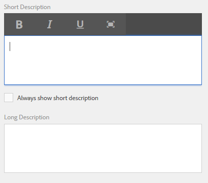

# Contextassistentie voor het ontwerpen van formuliervelden{#authoring-in-context-help-for-form-fields}

## Inleiding {#introduction}

In bepaalde situaties weten eindgebruikers die een formulier invullen niet zeker hoe ze details in een bepaald formulierveld moeten invullen. Om dergelijke problemen aan te pakken, biedt Adaptive Forms ondersteuning voor het toevoegen van tekst of uitgebreide contexthulp aan een formulierveld. Hiermee verbetert u de ervaring bij het invullen van formulieren en voorkomt u dubbelzinnigheid voor eindgebruikers.

In dit artikel wordt besproken hoe formulierauteurs in-context Help kunnen toevoegen tijdens het ontwerpen van Adaptive Forms.

## In-context-Help toevoegen {#add-in-context-help}

U kunt in-context hulp specificeren gebruikend de volgende opties in de sectie van de Inhoud van de Hulp van het eigenschappen lusje in sidebar.

* [Korte beschrijving](authoring-in-field-help.md#p-short-description-p)
* [Lange beschrijving](authoring-in-field-help.md#p-long-description-p)

>[!NOTE]
>
>Lange beschrijving heeft voorrang op de korte beschrijving. Als u beide hebt opgegeven, wordt alleen de beschrijving Lang weergegeven.

### Korte beschrijving {#short-description}

Het veld Korte beschrijving bevat snelle en korte aanwijzingen over het invullen van een formulierveld. De tekst die in het veld Korte beschrijving is opgegeven, wordt als knopinfo weergegeven wanneer u de muis boven het veld houdt.

>[!NOTE]
>
>Selecteren **Altijd korte beschrijving tonen** om de Help-tekst permanent onder het veld weer te geven.

### Lange beschrijving {#long-description}

U kunt het lange beschrijvingsgebied gebruiken om lange teksten te specificeren of rijke media inhoud, met inbegrip van video&#39;s in te bedden, als in-context hulp. In de volgende afbeelding ziet u bijvoorbeeld hoe u een video kunt insluiten als in-context-Help.

Als u een lange beschrijving toevoegt, wordt een **?** naast het veld. Als u op het pictogram klikt, wordt de inhoud weergegeven die is toegevoegd in de lange beschrijving.

### Help op deelvensterniveau {#panel-level-help}

Naast de contextHelp voor formuliervelden kunt u op deelvensterniveau Help opgeven op het tabblad Help-inhoud van het dialoogvenster Bewerken van het deelvenster.

Wanneer u Help voor een deelvenster toevoegt, wordt een **?** naast de beschrijving van het deelvenster. Als u op het pictogram klikt, wordt de inhoud weergegeven die is toegevoegd in de sectie Help-inhoud van het dialoogvenster voor het bewerken van deelvensters.

