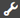

# reCAPTCHA gebruiken in Adaptive Forms {#using-reCAPTCHA-in-adaptive-forms}

>[!NOTE]
>
> De Adobe adviseert het gebruiken van de moderne en verlengbare gegevens vangt [&#x200B; Componenten van de Kern &#x200B;](https://experienceleague.adobe.com/docs/experience-manager-core-components/using/adaptive-forms/introduction.html?lang=nl-NL) voor [&#x200B; het creëren van nieuwe Aangepaste Forms &#x200B;](/help/forms/creating-adaptive-form-core-components.md) of [&#x200B; het toevoegen van Aangepaste Forms aan de pagina&#39;s van AEM Sites &#x200B;](/help/forms/create-or-add-an-adaptive-form-to-aem-sites-page.md). Deze componenten betekenen een aanzienlijke vooruitgang in de aanmaak van Adaptive Forms en zorgen voor indrukwekkende gebruikerservaring. In dit artikel wordt een oudere aanpak beschreven voor de auteur Adaptive Forms die gebruikmaakt van stichtingscomponenten.


| Versie | Artikelkoppeling |
| -------- | ---------------------------- |
| AEM 6,5 | [&#x200B; klik hier &#x200B;](https://experienceleague.adobe.com/docs/experience-manager-65/forms/adaptive-forms-basic-authoring/captcha-adaptive-forms.html?lang=nl-NL) |
| AEM as a Cloud Service | Dit artikel |
| Van toepassing op | Adaptief formulier op basis van Foundation Components. <br> voor Aangepaste Vorm die op de Componenten van de Kern wordt gebaseerd, [&#x200B; klik hier &#x200B;](/help/forms/captcha-adaptive-forms-core-components.md). |


CAPTCHA (Complete Automated Public Turing test to tell Computers and Humans Apart) is een programma dat vaak wordt gebruikt bij online transacties om onderscheid te maken tussen mensen en geautomatiseerde programma&#39;s of bots. Het stelt een uitdaging en evalueert de reactie van de gebruiker om te bepalen of het een mens of bot is die met de site communiceert. Het verhindert de gebruiker om te werk te gaan als de test ontbreekt en de hulp maakt online transacties veilig door bots te houden spam of kwaadwillige doeleinden posten.

AEM Forms as a Cloud Service ondersteunt de volgende CAPTCHA-oplossingen:

* [Google reCAPTCHA](#configure-recaptcha-service-by-google)
* [Cloudflare Turnstile](/help/forms/integrate-adaptive-forms-turnstile.md)
* [&#x200B; hCaptcha &#x200B;](/help/forms/integrate-adaptive-forms-hcaptcha.md)

## De reCAPTCHA-service van Google configureren {#google-reCAPTCHA}

Auteurs van formulieren kunnen de reCAPTCHA-service van Google gebruiken om reCAPTCHA te implementeren in Adaptive Forms. Het biedt geavanceerde CAPTCHA-mogelijkheden om uw site te beschermen. Voor meer informatie over hoe reCAPTCHA werkt, zie [&#x200B; Google reCAPTCHA &#x200B;](https://developers.google.com/recaptcha/). AEM Forms ondersteunt [!DNL reCAPTCHA v2] en [!DNL reCAPTCHA Enterprise] . Andere versies worden niet ondersteund. ReCAPTCHA in Adaptive Forms wordt niet ondersteund in de offlinemodus van de app [!DNL AEM Forms] . Gebaseerd op uw vereiste kunt u de dienst vormen reCAPTCHA om toe te laten:


* [reCAPTCHA Enterprise in AEM Forms](#steps-to-implement-reCAPTCHA-enterprise-in-forms)
* [reCAPTCHA v2 in AEM Forms](#steps-to-implement-reCAPTCHA-v2-in-forms)


### reCAPTCHA Enterprise configureren  {#steps-to-implement-reCAPTCHA-enterprise-in-forms}

1. Creeer of selecteer a [&#x200B; het project van de Wolk van Google &#x200B;](https://cloud.google.com/recaptcha-enterprise/docs/set-up-non-google-cloud-environments-api-keys#before-you-begin) en laat [&#x200B; reCAPTCHA Onderneming API &#x200B;](https://cloud.google.com/recaptcha-enterprise/docs/set-up-non-google-cloud-environments-api-keys#enable-the-recaptcha-enterprise-api) toe.
1. Verkrijg [&#x200B; identiteitskaart van het Project &#x200B;](https://support.google.com/googleapi/answer/7014113?hl=en#:~:text=To%20locate%20your%20project%20ID,a%20member%20of%20are%20displayed) en creeer een [&#x200B; API sleutel &#x200B;](https://cloud.google.com/recaptcha-enterprise/docs/set-up-non-google-cloud-environments-api-keys#create_an_api_key) en de sleutel van de a [&#x200B; plaats voor websites &#x200B;](https://cloud.google.com/recaptcha-enterprise/docs/create-key#create-key).
1. Configuratiecontainer maken voor cloudservices.

   1. Ga naar **[!UICONTROL Tools > General > Configuration Browser]** .
   1. Selecteer een map of maak een map en schakel de map in voor cloudconfiguraties met behulp van de volgende stappen:
      1. Selecteer de map in de Configuration Browser en selecteer **[!UICONTROL Properties]** .
      1. Schakel in het dialoogvenster Configuration Properties **[!UICONTROL Cloud Configurations]** in.
      1. Selecteer **[!UICONTROL Save & Close]** om de configuratie op te slaan en het dialoogvenster af te sluiten.

1. Configureer de cloudservice voor [!DNL reCAPTCHA Enterprise] .

   1. Op uw de auteursinstantie van de Experience Manager, ga  > **[!UICONTROL Cloud Services]**.
   1. Selecteer **[!UICONTROL reCAPTCHA]**. De pagina Configurations wordt geopend. Selecteer de configuratiecontainer die u hebt gemaakt en selecteer **[!UICONTROL Create]** .
   1. Selecteer versie als [!DNL reCAPTCHA Enterprise] en geef Naam, Project-id, Sitecode en API-sleutel (verkregen in stap 2) op voor de reCAPTCHA Enterprise-service.
   1. Selecteer zeer belangrijk type, zou het zeer belangrijke type als plaatstoets moeten zijn die u in het [&#x200B; project van de Wolk van Google &#x200B;](https://cloud.google.com/recaptcha-enterprise/docs/set-up-non-google-cloud-environments-api-keys#before-you-begin) vormde, bijvoorbeeld, **de plaatskaart van Checkbox** of **Score-based plaatstoets**.
   1. Specificeer a [&#x200B; drempelscore in waaier 0 tot 1 &#x200B;](https://cloud.google.com/recaptcha-enterprise/docs/interpret-assessment#interpret_scores). Scores groter dan of gelijk aan de drempelscores identificeren menselijke interactie, anders beschouwd als beide interactie.
   1. Selecteer **[!UICONTROL Create]** om de configuratie van de cloudservice te maken.

<!--
    1. In the Edit Component dialog, specify the name, project ID, site key, API key (obtained in steps 2 and 3), select the key type, and enter the threshold score. Select **[!UICONTROL Save Settings]** and then select **[!UICONTROL OK]** to complete the configuration.
-->

Zodra de reCAPTCHA Enterprise-service is ingeschakeld, is deze beschikbaar voor gebruik in adaptieve formulieren. Zie [&#x200B; gebruikend CAPTCHA in adaptieve vormen &#x200B;](#using-reCAPTCHA).

<!--

-->

### Google reCAPTCHA v2 configureren {#steps-to-implement-reCAPTCHA-v2-in-forms}

1. Verkrijg [&#x200B; reCAPTCHA API zeer belangrijk paar &#x200B;](https://www.google.com/recaptcha/admin) van Google. Het omvat a **plaats sleutel** en a **geheime sleutel**.
1. Configuratiecontainer maken voor cloudservices.
   1. Ga naar **[!UICONTROL Tools > General > Configuration Browser]** .
   1. Selecteer een map of maak een map en schakel de map in voor cloudconfiguraties met behulp van de volgende stappen:
      1. Selecteer de map in de Configuration Browser en selecteer **[!UICONTROL Properties]** .
      1. Schakel in het dialoogvenster Configuration Properties **[!UICONTROL Cloud Configurations]** in.
      1. Selecteer **[!UICONTROL Save & Close]** om de configuratie op te slaan en het dialoogvenster af te sluiten.

1. Configureer de cloudservice voor reCAPTCHA v2.

   1. Op uw AEM auteursinstantie, ga  > **Cloud Servicen**.
   1. Selecteer **[!UICONTROL reCAPTCHA]**. De pagina Configurations wordt geopend. Selecteer de configuratiecontainer die u hebt gemaakt en selecteer **[!UICONTROL Create]** .
   1. Selecteer versie als [!DNL reCAPTCHA v2] , geef Naam, Sitetoets en Geheime sleutel voor de service reCAPTCHA op (verkregen in stap 1) en selecteer **[!UICONTROL Create]** om de configuratie van de cloudservice te maken.
   1. Geef in het dialoogvenster Component bewerken de site en de geheime sleutels op die in stap 1 zijn verkregen. Selecteer **[!UICONTROL Save Settings]** en selecteer dan **O.K.** om de configuratie te voltooien.

   Zodra de reCAPTCHA-service is geconfigureerd, is deze beschikbaar voor gebruik in adaptieve formulieren. Voor meer informatie, zie [&#x200B; gebruikend CAPTCHA in adaptieve vormen &#x200B;](#using-reCAPTCHA).

<!---->


## Google reCAPTCHA gebruiken in adaptieve formulieren {#using-reCAPTCHA}

Google reCAPTCHA in een adaptieve vorm gebruiken:

1. Open een adaptief formulier in de bewerkingsmodus.

   >[!NOTE]
   >
   >Zorg ervoor dat de configuratiecontainer die is geselecteerd bij het maken van het adaptieve formulier, de reCAPTCHA-cloudservice bevat. U kunt ook adaptieve formuliereigenschappen bewerken om de configuratiecontainer te wijzigen die aan het formulier is gekoppeld.

1. Van componentenbrowser, sleep-daling de **component Captcha** op de adaptieve vorm.

   >[!NOTE]
   >
   >* Het gebruik van meer dan één Captcha-component in een adaptieve vorm wordt niet ondersteund. Het wordt ook afgeraden om CAPTCHA te gebruiken in een deelvenster dat is gemarkeerd voor wazig laden of in een fragment.
   >* reCaptcha is tijdgevoelig en verloopt over een paar minuten. Daarom wordt aangeraden de component Captcha vlak voor de knop Verzenden in het aangepaste formulier te plaatsen.

1. Selecteer de component Captcha die u toevoegde en  selecteert om zijn eigenschappen uit te geven.
1. Geef een titel op voor de CAPTCHA-widget. De standaardwaarde is **Captcha**. Selecteer **titel van de Verbergen** als u geen titel wilt verschijnen.
1. Van de **dienst Captcha** drop-down, uitgezochte **reCAPTCHA** om de dienst reCAPTCHA toe te laten als u het zoals die in [&#x200B; wordt beschreven reCAPTCHA dienst door Google &#x200B;](#google-reCAPTCHA) vormde.
1. Selecteer een configuratie van de drop-down Montages voor **reCAPTCHA Onderneming** of **reCAPTCHA v2**
   1. Als u **versie 0&rbrace; reCAPTCHA van de Onderneming &lbrace;selecteert, kan het zeer belangrijke type van** checkbox **of** gebaseerde score **zijn, is het gebaseerd op uw selectie wanneer u [&#x200B; plaats sleutel voor websites &#x200B;](https://cloud.google.com/recaptcha-enterprise/docs/create-key#create-key) vormt:**

   >[!NOTE]
   >
   >* In de wolkenconfiguratie met **zeer belangrijk type** als **checkbox**, verschijnt het aangepaste foutenbericht als gealigneerd bericht als de bevestiging captcha ontbreekt.
   >* In de wolkenconfiguratie met **zeer belangrijk type** als **gebaseerde score**, toont het aangepaste foutenbericht als pop-up bericht als de bevestiging captcha ontbreekt.

   1. U kunt grootte selecteren als **[!UICONTROL Normal]** en **[!UICONTROL Compact]** .
   1. U kunt een **[!UICONTROL Bind Reference]** selecteren. In **[!UICONTROL Bind Reference]** zijn de verzonden gegevens gebonden, anders zijn het niet-gebonden gegevens. Hieronder volgen XML-voorbeelden van niet-gebonden gegevens en gebonden gegevens (met bind verwijzing als SSN), wanneer een formulier wordt verzonden.

   ```xml
           <?xml version="1.0" encoding="UTF-8" standalone="no"?>
           <afData>
           <afUnboundData>
               <data>
                   <captcha16820607953761>
                       <captchaType>reCaptchaEnterprise</captchaType>
                       <captchaScore>0.9</captchaScore>
                   </captcha16820607953761>
               </data>
           </afUnboundData>
           <afBoundData>
               <Root
                   xmlns:xfa="http://www.xfa.org/schema/xfa-data/1.0/"
                   xmlns:xsi="http://www.w3.org/2001/XMLSchema-instance">
                   <PersonalDetails>
                       <SSN>371237912</SSN>
                       <FirstName>Sarah </FirstName>
                       <LastName>Smith</LastName>
                   </PersonalDetails>
                   <OtherInfo>
                       <City>California</City>
                       <Address>54 Residency</Address>
                       <State>USA</State>
                       <Zip>123112</Zip>
                   </OtherInfo>
               </Root>
           </afBoundData>
           <afSubmissionInfo>
               <stateOverrides/>
               <signers/>
               <afPath>/content/dam/formsanddocuments/captcha-form</afPath>
               <afSubmissionTime>20230608034928</afSubmissionTime>
           </afSubmissionInfo>
           </afData>
   ```

   ```xml
           <?xml version="1.0" encoding="UTF-8" standalone="no"?>
           <afData>
           <afUnboundData>
               <data/>
           </afUnboundData>
           <afBoundData>
               <Root
                   xmlns:xfa="http://www.xfa.org/schema/xfa-data/1.0/"
                   xmlns:xsi="http://www.w3.org/2001/XMLSchema-instance">
                   <PersonalDetails>
                       <SSN>
                           <captchaType>reCaptchaEnterprise</captchaType>
                           <captchaScore>0.9</captchaScore>
                       </SSN>
                       <FirstName>Sarah</FirstName>
                       <LastName>Smith</LastName>
                   </PersonalDetails>
                   <OtherInfo>
                       <City>California</City>
                       <Address>54 Residency</Address>
                       <State>USA</State>
                       <Zip>123112</Zip>
                   </OtherInfo>
               </Root>
           </afBoundData>
           <afSubmissionInfo>
               <stateOverrides/>
               <signers/>
               <afPath>/content/dam/formsanddocuments/captcha-form</afPath>
               <afSubmissionTime>20230608035111</afSubmissionTime>
           </afSubmissionInfo>
           </afData>
   ```

   Als u **reCAPTCHA v2** versie selecteert:
   1. U kunt de grootte selecteren als **[!UICONTROL Normal]** of **[!UICONTROL Compact]** voor de reCAPTCHA-widget.
   1. U kunt de optie **[!UICONTROL Invisible]** selecteren om de CAPTCHA-uitdaging alleen te tonen in het geval van een verdachte activiteit.

   De reCAPTCHA-service is ingeschakeld op het adaptieve formulier. U kunt een voorbeeld van het formulier bekijken en de CAPTCHA bekijken. **die door reCAPTCHA** wordt beschermd badge, hieronder wordt getoond, wordt getoond op de beschermde vormen.
    wordt beschermd

1. Sla de eigenschappen op.

>[!NOTE]
> 
> Selecteer **[!UICONTROL Default]** niet in het vervolgkeuzemenu Captcha-service omdat de standaard AEM CAPTCHA-service is vervangen.

>[!VIDEO](https://video.tv.adobe.com/v/3422641/recaptcha-google-adaptive-forms/?quality=12&learn=on)

### CAPTCHA-component tonen of verbergen op basis van regels {#show-hide-captcha}

U kunt de component CAPTCHA weergeven of verbergen op basis van de regels die u toepast op een component in een adaptief formulier. Selecteer de component, uitgezocht  uit, en selecteer **[!UICONTROL Create]** om een regel tot stand te brengen. Voor meer informatie bij het creëren van regels, zie [&#x200B; Redacteur van de Regel &#x200B;](rule-editor.md).

De component CAPTCHA moet bijvoorbeeld alleen in een adaptief formulier worden weergegeven als het veld Waarde valuta in het formulier een waarde heeft van meer dan 25000.

Selecteer het veld **[!UICONTROL Currency Value]** in het formulier en stel de volgende regels in:


>[!NOTE]
>
> Wanneer u een reCAPTCHA v2-configuratie selecteert en de grootte is ingesteld op [!UICONTROL Invisible] , blijft de optie voor weergeven/verbergen uitgeschakeld.

### CAPTCHA valideren {#validate-captcha}

U kunt CAPTCHA valideren in een adaptief formulier wanneer u het formulier verzendt of de CAPTCHA-validatie baseert op gebruikersacties en -voorwaarden.

#### CAPTCHA valideren bij het verzenden van formulieren {#validation-form-submission}

Een CAPTCHA automatisch valideren wanneer u een adaptief formulier verzendt:

1. Selecteer de component CAPTCHA en selecteer  om de componenteneigenschappen te bekijken.
1. Selecteer **[!UICONTROL Validate CAPTCHA at form submission]** in de sectie **[!UICONTROL Validate CAPTCHA]** .
1. Selecteer  om de componenteneigenschappen te bewaren.

#### CAPTCHA bij gebruikershandelingen en -voorwaarden valideren {#validate-captcha-user-action}

Een CAPTCHA valideren op basis van voorwaarden en gebruikersacties:

1. Selecteer de component CAPTCHA en selecteer  om de componenteneigenschappen te bekijken.
1. Selecteer **[!UICONTROL Validate CAPTCHA on a user action]** in de sectie **[!UICONTROL Validate CAPTCHA]** .
1. Selecteer  om de componenteneigenschappen te bewaren.

[!DNL Experience Manager Forms] biedt `ValidateCAPTCHA` API om CAPTCHA te valideren met behulp van vooraf gedefinieerde voorwaarden. U kunt de API aanroepen met behulp van een aangepaste verzendactie of door regels voor componenten in een adaptief formulier te definiëren.

Hieronder ziet u een voorbeeld van een API van het type `ValidateCAPTCHA` voor het valideren van CAPTCHA met behulp van vooraf gedefinieerde voorwaarden:

```javascript
if (slingRequest.getParameter("numericbox1614079614831").length() >= 5) {
     GuideCaptchaValidatorProvider apiProvider = sling.getService(GuideCaptchaValidatorProvider.class);
        String formPath = slingRequest.getResource().getPath();
        String captchaData = slingRequest.getParameter(GuideConstants.GUIDE_CAPTCHA_DATA);
        if (!apiProvider.validateCAPTCHA(formPath, captchaData).isCaptchaValid()){
            response.setStatus(400);
            return;
        }
    }
```

In het voorbeeld wordt aangegeven dat de API van `ValidateCAPTCHA` de CAPTCHA alleen in het formulier valideert als het aantal cijfers in het numerieke vak dat de gebruiker heeft opgegeven tijdens het invullen van het formulier groter is dan 5.

**Optie 1: Gebruik [!DNL Experience Manager Forms] ValidateCAPTCHA API om CAPTCHA te bevestigen gebruikend een douane verzendt Actie**

Voer de volgende stappen uit om de API `ValidateCAPTCHA` te gebruiken om CAPTCHA te valideren met behulp van een aangepaste handeling Verzenden:

1. Voeg het script dat de `ValidateCAPTCHA` API bevat toe aan de aangepaste verzendactie. Voor meer op douane verzend Acties, zie [&#x200B; een douane creëren legt Actie voor Aanpassings Forms &#x200B;](custom-submit-action-form.md) voor.
1. Selecteer de naam van de aangepaste handeling Verzenden in de vervolgkeuzelijst **[!UICONTROL Submit Action]** in de **[!UICONTROL Submission]** -eigenschappen van een adaptief formulier.
1. Selecteer **[!UICONTROL Submit]**. De CAPTCHA wordt gevalideerd op basis van de voorwaarden die zijn gedefinieerd in de `ValidateCAPTCHA` API van de aangepaste verzendactie.

**Optie 2: Gebruik [!DNL Experience Manager Forms] ValidateCAPTCHA API om CAPTCHA op een gebruikersactie te bevestigen alvorens de vorm** voor te leggen

U kunt de `ValidateCAPTCHA` API ook aanroepen door regels toe te passen op een component in een adaptief formulier.

U voegt bijvoorbeeld een knop **[!UICONTROL Validate CAPTCHA]** toe aan een adaptief formulier en maakt een regel om een service aan te roepen bij het klikken op een knop.

In de volgende afbeelding ziet u hoe u een service kunt aanroepen wanneer u op een knop **[!UICONTROL Validate CAPTCHA]** klikt:


U kunt de aangepaste servlet die `ValidateCAPTCHA` API omvat aanroepen gebruikend de regelredacteur en de verzendknoop van het Aangepaste Vorm toelaten of onbruikbaar maken die op het bevestigingsresultaat wordt gebaseerd.

Op dezelfde manier kunt u regeleditor gebruiken om een aangepaste methode op te nemen om CAPTCHA in een adaptief formulier te valideren.

<!--

### Add custom CAPTCHA services {#add-custom-captcha-service}

[!DNL Experience Manager Forms] provides reCAPTCHA as the CAPTCHA service. However, you can add a custom service to display in the **[!UICONTROL CAPTCHA Service]** drop-down list.  

The following is a sample implementation of the interface to add additional CAPTCHA service to your Adaptive Form:

```javascript
package com.adobe.aemds.guide.service;

import org.osgi.annotation.versioning.ConsumerType;

/**
 * An interface to provide captcha validation at server side in Adaptive Form
 * This interface can be used to provide custom implementation for different captcha services.
 */
@ConsumerType
public interface GuideCaptchaValidator {
    /**
     * This method should define the actual validation logic of the captcha
     * @param captchaPropertyNodePath path to the node with CAPTCHA configurations inside form container
     * @param userResponseToken  The user response token provided by the CAPTCHA from client-side
     *
     * @return  {@link GuideCaptchaValidationResult} validation result of the captcha
     */
     GuideCaptchaValidationResult validateCaptcha(String captchaPropertyNodePath, String userResponseToken);

    /**
     * Returns the name of the captcha validator. This should be unique among the different implementations
     * @return  name of the captcha validator
     */
     String getCaptchaValidatorName();
}
```

`captchaPropertyNodePath` refers to the resource path of the CAPTCHA component in the Sling repository. Use this property to include details specific to the CAPTCHA component. For example, `captchaPropertyNodePath` includes information for the reCAPTCHA cloud configuration configured on the CAPTCHA component. The cloud configuration information provides **[!UICONTROL Site Key]** and **[!UICONTROL Secret Key]** settings for implementing the reCAPTCHA service.

`userResponseToken` refers to the `g_recaptcha_response` that gets generated after solving a CAPTCHA in a form. -->

### reCAPTCHA-servicedomein bewerken {#reCAPTCHA-service-domain}

reCAPTCHA-service gebruikt `https://www.recaptcha.net/` als het standaarddomein. U kunt de instellingen wijzigen om `https://www.google.com/` in te stellen of een aangepaste domeinnaam voor het laden, renderen en valideren van de reCAPTCHA-service.

Stel de eigenschap **[!UICONTROL af.cloudservices.recaptcha.domain]** van de **[!UICONTROL Adaptive Form and Interactive Communication Web Channel Configuration]** configuratie in om `https://www.google.com/` of een andere aangepaste domeinnaam op te geven. In het volgende JSON-bestand wordt een voorbeeld weergegeven:

```json
{
  "af.cloudservices.recaptcha.domain": "https://www.google.com/"
}
```

Om waarden van een configuratie te plaatsen, [&#x200B; produceer OSGi Configuraties gebruikend de AEM SDK &#x200B;](https://experienceleague.adobe.com/docs/experience-manager-cloud-service/implementing/deploying/configuring-osgi.html?lang=nl-NL#generating-osgi-configurations-using-the-aem-sdk-quickstart), en [&#x200B; stel de configuratie &#x200B;](https://experienceleague.adobe.com/docs/experience-manager-cloud-service/implementing/using-cloud-manager/deploy-code.html?lang=nl-NL#deployment-process) aan uw instantie van de Cloud Service op.

## Zie ook {#see-also}

{{see-also}}

<!--

>[!MORELIKETHIS]
>
>* [Reference Themes, Templates, and Form Data models for Adaptive Forms](/help/forms/reference-themes-templates-data-models.md)

-->
