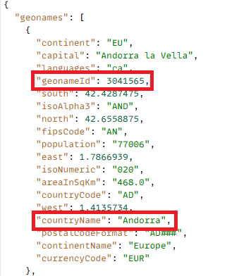

# API-integratie maken

In deze zelfstudie worden 2 API-integratie gemaakt

- GetAllCountries geeft een lijst met landen weer
- GetChildren - Geeft direct kinderen van het land of de staat terug die door geonameId wordt vertegenwoordigd

## GetAllCountries - Configuratie API-integratie

- Configuratie API-integratie

   - Weergavenaam: GetAllCountries → a label for this API in your system.

   - API URL: `https://secure.geonames.org/countryInfoJSON` - het eindpunt dat u aanroept.

   - HTTP-methode: GET - je doet een eenvoudige GET-aanvraag.

   - Inhoudstype: JSON - reactie wordt verwacht in JSON-indeling.

- Opties:

   - Versleuteling vereist uitgeschakeld - geen versleutelingslaag groter dan HTTPS.

   - Uitvoeren bij gecontroleerde Cliënt - de vraag wordt uitgevoerd van de cliënt/browser, niet server-kant.
- Type verificatie
   - Geen - aangezien de GeoNames API geen OAuth of API sleutels in kopballen vereist
- Invoer:
   - De invoersectie definieert wat er naar de API wordt verzonden
   - **gebruikersbenaming** → type: Koord, die in de Vraag wordt verzonden, gebrek: gbedekar.
   - Elke aanvraag voegt ?username=gbedekar aan URL toe
- Uitvoer
   - Output definieert welke velden uit de JSON-reactie moeten worden geëxtraheerd en gebruikt.
De reactie GeoNames ziet er als volgt uit:

  
   - Twee velden toegewezen vanuit de array geonames:

     geonames [*].geonameId → as a Number

     geonames [*] .countryName → as a String

     [ * ] betekent het voor elk land in de serie herhaalt.

## GetChildren

Het vraagt GeoNames voor de directe kinderen van de plaats waarvan geonamesId als vraagparameter wordt overgegaan

- Configuratie API-integratie

   - Weergavenaam: GetAllCountries → a label for this API in your system.

   - API URL: `https://secure.geonames.org/children` → het eindpunt u roept.

   - HTTP-methode: GET → je doet een eenvoudig GET-verzoek.

   - Inhoudstype: JSON → reactie wordt verwacht in JSON-indeling.

- Opties:

   - Versleuteling vereist uitgeschakeld → geen versleutelingslaag groter dan HTTPS.

   - Uitvoeren bij gecontroleerde Client → de vraag wordt uitgevoerd van de cliënt/browser, niet server-kant.
- Type verificatie
   - Geen - aangezien de GeoNames API geen OAuth of API sleutels in kopballen vereist
- Invoer:
   - Hiermee wordt gedefinieerd wat naar de API wordt verzonden
   - **gebruikersbenaming** → type: Koord, die in de Vraag wordt verzonden, gebrek: gbedekar.
   - Elke aanvraag voegt ?username=gbedekar aan URL toe
   - **geonameId** -> type: Koord. Hiermee worden de onderliggende items van het land/de staat geretourneerd die worden vertegenwoordigd door de geonameId
   - **type** =>Koord. Als u de waarde json instelt, wordt de reactie geretourneerd in de JSON-indeling.
- Uitvoer
   - Hiermee definieert u welke velden uit de JSON-reactie moeten worden geëxtraheerd en gebruikt.
De reactie GeoNames ziet er als volgt uit:

  
   - Twee velden toegewezen vanuit de array geonames:

     geonames [*].geonameId → as a Number

     geonames [*] .name → as a String

     [ * ] betekent het voor elk land in de serie herhaalt.

