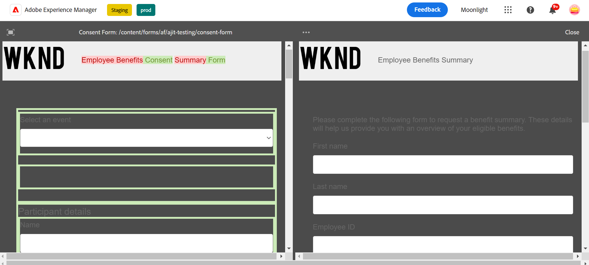

# Adaptieve Forms vergelijken {#compare-two-forms}

 Dit is een pre-release functie die toegankelijk is via onze [pre-releasekanaal](https://experienceleague.adobe.com/docs/experience-manager-cloud-service/content/release-notes/prerelease.html#new-features). 

Wanneer formulierauteurs twee verschillende formulieren moeten vergelijken op basis van de velden, inhoud en formuliercomponenten, vergelijken ze de twee formulieren. De auteur van het formulier moet ervoor zorgen dat de twee formulieren zich in dezelfde map of map bevinden om ze te kunnen vergelijken. Voer de volgende stappen uit om twee verschillende adaptieve formulieren te vergelijken:

1. Selecteer aangepaste formulieren en klik op **[!UICONTROL Compare]**.

   

1. Als u klikt, ziet u twee formulieren in de voorbeeldmodus. Het eerste formulier wordt geselecteerd als het basisformulier dat moet worden vergeleken met het tweede formulier, en de inhoud wordt vergeleken tussen de twee formulieren, die vergelijkbaar en gedifferentieerd zijn. De gedifferentieerde inhoud van het eerste formulier wordt als groen gemarkeerd, zoals in de afbeelding wordt getoond.

   

## Zie ook {#see-also}

{{see-also}}

