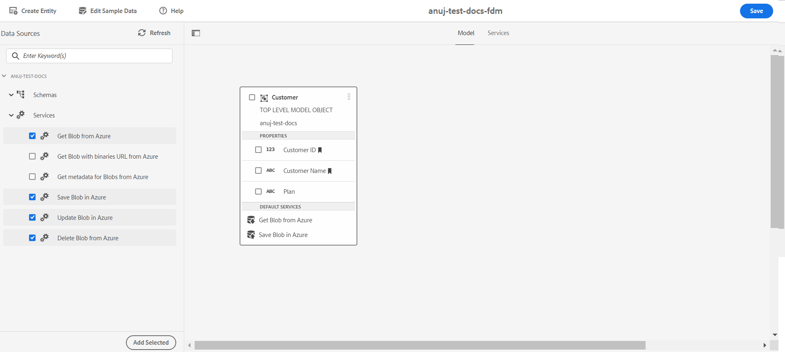

# [!DNL Azure] opslag configureren {#configure-azure-storage}

[[!DNL Experience Manager Forms]  de Integratie van Gegevens &#x200B;](data-integration.md) verstrekt een [!DNL Azure] opslagconfiguratie om vormen met [!DNL Azure] opslagdiensten te integreren. Met FDM (Form Data Model) kunt u Adaptive Forms maken dat met [!DNL Azure] Server werkt om bedrijfsworkflows in te schakelen. Bijvoorbeeld:

* Schrijf gegevens naar [!DNL Azure] bij het verzenden van een adaptief formulier.
* Schrijf gegevens in [!DNL Azure] via aangepaste entiteiten die zijn gedefinieerd in het formuliergegevensmodel (FDM) en omgekeerd.
* Vraag [!DNL Azure] -server om gegevens en vul Adaptief Forms vooraf in.
* Gegevens van de [!DNL Azure] -server lezen.

## [!DNL Azure] opslagconfiguratie maken {#create-azure-storage-configuration}

Controleer voordat u deze stappen uitvoert of u een [!DNL Azure] opslagaccount en een toegangstoets hebt om de toegang tot de [!DNL Azure] -opslagaccount te autoriseren.

1. Navigeer naar **[!UICONTROL Tools]** > **[!UICONTROL Cloud Services]** > **[!UICONTROL Azure Storage]** .
1. Selecteer een map om de configuratie te maken en selecteer **[!UICONTROL Create]** .
1. Geef een titel voor de configuratie op in het veld **[!UICONTROL Title]** .
1. Geef de naam van de [!DNL Azure] -opslagaccount op in het veld **[!UICONTROL Azure Storage Account]** .
1. Geef in het veld **[!UICONTROL Azure Access Key]** de sleutel op voor toegang tot Azure-opslagaccount en selecteer **[!UICONTROL Save]** .

## Formuliergegevensmodel maken {#create-azure-form-data-model}

Na het creëren van de [!DNL Azure] opslagconfiguratie, kunt u [&#x200B; tot het Model van de Gegevens van de Vorm &#x200B;](create-form-data-models.md) leiden. Geef de map op die de [!DNL Azure] -configuratie bevat in het veld **[!UICONTROL Data Source Configuration]** terwijl u het FDM (Form Data Model) maakt. Vervolgens kunt u de configuratie selecteren in de lijst met configuraties in de opgegeven mapnaam.

### [!DNL Azure] -services toevoegen aan het formuliergegevensmodel {#add-azure-services}

Nadat u de objecten Form Data Model (FDM) en Data Model hebt gemaakt, kunt u [!DNL Azure] -services toevoegen aan het Form Data Model (FDM).

[!DNL Azure] services toevoegen:

1. Selecteer in de modus Bewerken de services in het gedeelte **[!UICONTROL Services]** in het linkervenster en selecteer **[!UICONTROL Add Selected]** . De geselecteerde services worden weergegeven op het tabblad **[!UICONTROL Services]** van het FDM (Form Data Model).

    toe

1. Selecteer op het tabblad **[!UICONTROL Services]** de service en **[!UICONTROL Edit Properties]** . Definieer op basis van de service de invoer- of uitvoermodelobjecten voor de service.

1. Selecteer **[!UICONTROL Save]** om het formuliergegevensmodel (FDM) op te slaan.

   In de volgende tabel worden de beschikbare [!DNL Azure] -services beschreven:

   <table>
    <tbody>
     <tr>
      <th><strong>Servicenaam</strong></th>
      <th><strong>Beschrijving</strong></th>
     </tr>
     <tr>
      <td>Get Blob from Azure</td>
      <td>Gegevens ophalen die zijn opgeslagen als een klob in Azure-opslag met een id of naam</td>
     </tr>
     <tr>
      <td>Get Blob met binaries URL van Azure</td>
      <td>Gegevens ophalen die zijn opgeslagen als een blob met URL voor binaire bestanden in Azure-opslag met een id of naam</td>
     </tr>
     <tr>
      <td>Blob opslaan in Azure</td>
      <td>Gebruik een blob-id om gegevens in Azure-opslag op te slaan</td>
     </tr>
     <tr>
      <td>Blob bijwerken in Azure</td>
      <td>Gebruik een blob-id om gegevens in Azure-opslag bij te werken</td>
     </tr>
     <tr>
      <td>Lijst met blob-id's ophalen uit Azure</td>
      <td>Haal een lijst met blob-id's uit Azure op basis van het nummer dat in de invoeraanvraag is gedefinieerd.</td>
     </tr>
     <tr>
      <td>SAS-URL's voor Blobs ophalen uit Azure</td>
      <td>Haal SAS-URL's voor Blobs op van Azure op basis van Blob-id's in de invoeraanvraag.</td>
     </tr>
     <tr>
      <td>Blob verwijderen uit Azure</td>
      <td>Gebruik een blob-id om gegevens uit Azure-opslag te verwijderen</td>
     </tr>
    </tbody>
   </table>

### Een objecteigenschap van een gegevensmodel definiëren als een zoeksleutel {#define-data-model-object-as-metadata}

Een objecteigenschap van een gegevensmodel definiëren als een zoeksleutel:

1. Selecteer op het tabblad **[!UICONTROL Model]** de eigenschap van het gegevensmodelobject en selecteer **[!UICONTROL Edit Properties]** .
1. Schakel de schakeloptie **[!UICONTROL Search Key]** in op de status ON. Deze optie is alleen beschikbaar voor primaire gegevenstypen.
1. Selecteer **[!UICONTROL Done]** en selecteer vervolgens **[!UICONTROL Save]** om het formuliergegevensmodel (FDM) op te slaan.

Nadat u objecteigenschappen van gegevensmodellen hebt gedefinieerd als zoeksleutels, worden de hashwaarden opgeslagen in Azure-indextags en in Base64-gecodeerde waarden worden opgeslagen in de Azure-metagegevens.

>[!NOTE]
>
>Per Azure-entiteit zijn slechts 10 zoeksleutels toegestaan, omdat Azure alleen 10 tags per Blob toestaat en de waarde van eigenschappen die is gemarkeerd als zoeksleutels na hashing wordt opgeslagen in Azure-indextags.

<!--

>[!MORELIKETHIS]
>
>* [Configure data sources for AEM Forms](/help/forms/configure-data-sources.md)
>* [Integrate Microsoft Dynamics 365 and Salesforce with Adaptive Forms](/help/forms/configure-msdynamics-salesforce.md)
>  [Add Forms Portal to an AEM Sites page](/help/forms/configure-forms-portal.md)

-->