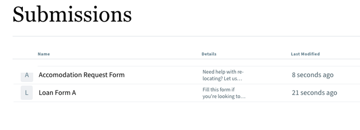

# Forms Portal toevoegen aan een AEM Sites-pagina {#publish-forms-on-portal}

<span class="preview"> Adobe beveelt aan moderne en uitbreidbare gegevensvastlegging te gebruiken [Kernonderdelen](https://experienceleague.adobe.com/docs/experience-manager-core-components/using/adaptive-forms/introduction.html) for [nieuwe Adaptieve Forms maken](/help/forms/creating-adaptive-form-core-components.md) of [Aangepaste Forms toevoegen aan AEM Sites-pagina&#39;s](/help/forms/create-or-add-an-adaptive-form-to-aem-sites-page.md). Deze componenten betekenen een aanzienlijke vooruitgang in de aanmaak van Adaptive Forms en zorgen voor indrukwekkende gebruikerservaring. In dit artikel wordt een oudere aanpak beschreven voor de auteur Adaptive Forms die gebruikmaakt van stichtingscomponenten. </span>

| Versie | Artikelkoppeling |
| -------- | ---------------------------- |
| AEM 6,5 | [Klik hier](https://experienceleague.adobe.com/docs/experience-manager-65/forms/publish-process-aem-forms/introduction-publishing-forms.html) |
| AEM as a Cloud Service | Dit artikel |

In een typisch vorm-centric portaalplaatsingsscenario, vormen ontwikkeling en portaalontwikkeling zijn twee gescheiden activiteiten. Terwijl formulierontwerpers formulieren ontwerpen en opslaan in een gegevensopslagruimte, maken webontwikkelaars een webtoepassing om formulieren weer te geven en de verzending van formulieren af te handelen. Forms wordt naar de weblaag gekopieerd omdat er geen communicatie is tussen de formulieropslagplaats en de webtoepassing.

Dergelijke scenario&#39;s leiden vaak tot beheerproblemen en productievertragingen. Als er bijvoorbeeld een nieuwere versie van een formulier beschikbaar is in de gegevensopslagruimte, moet u het formulier op de weblaag vervangen, de webtoepassing wijzigen en het formulier opnieuw distribueren op de openbare site. Als u de webtoepassing opnieuw implementeert, kan dit leiden tot serverdowntime. Doorgaans is de serverdowntime een geplande activiteit en daarom kunnen de wijzigingen niet onmiddellijk naar de openbare site worden doorgevoerd.

AEM Forms biedt portalcomponenten die de beheerkosten en productievertragingen verminderen. Met deze componenten kunnen webontwikkelaars een Forms Portal maken en aanpassen op websites die zijn gemaakt met Adobe Experience Manager (AEM).

Met de componenten Form Portal kunt u de volgende functionaliteit toevoegen:

* Formulieren weergeven in aangepaste indelingen. De lay-outs Lijstweergave en Kaart zijn beschikbaar in het vak. U kunt uw eigen aangepaste lay-outs maken.
* Hiermee kunt u aangepaste metagegevens en aangepaste handelingen weergeven terwijl u deze weergeeft.
* Formulieren weergeven die door de gebruikersinterface van AEM Forms zijn gepubliceerd op de publicatie-instantie waar Forms Portal-componenten worden gebruikt.
* Eindgebruikers toestaan formulieren te genereren in de indeling HTML en PDF.
* U kunt zoeken op formulieren op basis van titel en beschrijving inschakelen.
* Gebruik aangepaste CSS om het uiterlijk van de portal aan te passen.
* Koppelingen naar formulieren maken.
* Hier worden concepten en verzendingen weergegeven die betrekking hebben op Adaptive Forms die door de gebruiker zijn gemaakt.

## Componenten van een Forms Portal-pagina {#forms-portal-components}

AEM Forms biedt de volgende poortcomponenten uit de verpakking:

* Zoeken en registreren: met deze component kunt u formulieren uit de formulieropslagplaats op uw portalpagina weergeven en configuratieopties voor het weergeven van formulieren op basis van opgegeven criteria.

* Concepten en verzenden: terwijl in de component Zoeken en opslaan formulieren worden weergegeven die door de auteur van Forms openbaar zijn gemaakt, worden in de component Concepten en verzendingen formulieren weergegeven die zijn opgeslagen als concept voor het later invullen en verzonden formulieren. Deze component verstrekt gepersonaliseerde ervaring aan om het even welke aangemelde gebruiker.

* Koppeling: met deze component kunt u overal op de pagina een koppeling naar een formulier maken.

U kunt [de uit-van-de-doos Forms Portal-componenten importeren](#import-forms-portal-components-aem-archetype) van het AEM Project Archetype. Voer na het importeren de volgende configuraties uit:

* [Een externe opslag configureren](#configure-azure-storage-adaptive-forms)

* [De Forms Portal-componenten inschakelen](#enable-forms-portal-components)

* [De Forms Portal-componenten configureren](#configure-forms-portal-components)

## Forms Portal-componenten importeren {#import-forms-portal-components-aem-archetype}

Ga als volgt te werk om Forms Portal-componenten die zich niet in de verpakking bevinden, te importeren op AEM Forms as a Cloud Service:

1. **Clone Cloud Manager Git-opslagplaats op uw lokale ontwikkelingsinstantie:**  Uw Cloud Manager Git-opslagplaats bevat een standaard AEM project. Het is gebaseerd op [AEM Archetype](https://github.com/adobe/aem-project-archetype/). Clone your Cloud Manager Git Repository using Self-Service Git Account Management from Cloud Manager UI to bring the project on your local development environment. Zie voor meer informatie over toegang tot de gegevensopslagruimte [Toegang tot opslagplaatsen](https://experienceleague.adobe.com/docs/experience-manager-cloud-manager/using/managing-code/accessing-repos.html).

1. **Maken [!DNL Experience Manager Forms] als [Cloud Service] project:** Maken [!DNL Experience Manager Forms] als [Cloud Service] project gebaseerd op [AEM Archetype 27](https://github.com/adobe/aem-project-archetype/releases/tag/aem-project-archetype-27) of hoger. De archetype Help-ontwikkelaars beginnen gemakkelijk te ontwikkelen voor [!DNL AEM Forms] as a Cloud Service. Het bevat ook enkele voorbeeldthema&#39;s en sjablonen waarmee u snel aan de slag kunt gaan.

   Om te creëren [!DNL Experience Manager Forms] as a Cloud Service project, open de bevelherinnering en stel het hieronder bevel in werking. Opnemen [!DNL Forms] specifieke configuraties, thema&#39;s en sjablonen, instellen `includeForms=y`.

   ```shell
   mvn -B archetype:generate -DarchetypeGroupId=com.adobe.aem -DarchetypeArtifactId=aem-project-archetype -DarchetypeVersion=30 -DaemVersion="cloud" -DappTitle="My Site" -DappId="mysite" -DgroupId="com.mysite" -DincludeForms="y"
   ```

   Ook wijzigen `appTitle`, `appId`, en `groupId`in de bovenstaande opdracht om uw omgeving te weerspiegelen.

   Wanneer het project gereed is, werkt u de `<core.forms.components.version>x.y.z</core.forms.components.version>` eigenschap op hoofdniveau `pom.xml` van het project Archetype om de nieuwste versie van [core-forms-components](https://github.com/adobe/aem-core-forms-components) in uw `AEM Archetype` project.

1. **Implementeer het project in uw lokale ontwikkelomgeving:** U kunt het volgende bevel gebruiken om aan uw lokale ontwikkelomgeving op te stellen

   `mvn -PautoInstallPackage clean install`

   Zie voor de volledige lijst met opdrachten [Samenstellen en installeren](https://experienceleague.adobe.com/docs/experience-manager-core-components/using/developing/archetype/using.html?lang=en#building-and-installing)

1. [De code implementeren op uw [!DNL AEM Forms] as a Cloud Service omgeving](https://experienceleague.adobe.com/docs/experience-manager-cloud-service/content/implementing/developing/aem-project-content-package-structure.html#embeddeds).


## Azure-opslag voor adaptieve Forms configureren {#configure-azure-storage-adaptive-forms}

[[!DNL Experience Manager Forms] Gegevensintegratie](data-integration.md) verstrekt [!DNL Azure] opslagconfiguratie om formulieren te integreren met [!DNL Azure] opslagservices. Met FDM (Form Data Model) kunt u Adaptive Forms maken die interactief werkt met [!DNL Azure] server om bedrijfswerkstromen toe te laten.

### Azure Storage Configuration maken {#create-azure-storage-configuration}

Voordat u deze stappen uitvoert, moet u controleren of u beschikt over een Azure-opslagaccount en een toegangstoets om toegang tot de [!DNL Azure] opslagaccount.

1. Navigeren naar **[!UICONTROL Tools]** > **[!UICONTROL Cloud Services]** > **[!UICONTROL Azure Storage]**.
1. Selecteer een map om de configuratie te maken en selecteer **[!UICONTROL Create]**.
1. Geef een titel voor de configuratie op in het dialoogvenster **[!UICONTROL Title]** veld.
1. Geef de naam van de [!DNL Azure] opslagaccount in de **[!UICONTROL Azure Storage Account]** veld.

### Unified Storage-connector configureren voor Forms Portal {#configure-usc-forms-portal}

Voer de volgende stappen uit om de Verenigde Verbinding van de Opslag voor AEM Workflows te vormen:

1. Navigeren naar **[!UICONTROL Tools]** > **[!UICONTROL Forms]** > **[!UICONTROL Unified Storage Connector]**.
1. In de **[!UICONTROL Forms Portal]** sectie, selecteert u **[!UICONTROL Azure]** van de **[!UICONTROL Storage]** vervolgkeuzelijst.
1. Geef de [configuratiepad voor de Azure-opslagconfiguratie](#create-azure-storage-configuration) in de **[!UICONTROL Storage Configuration Path]** veld.
1. Selecteren **[!UICONTROL Publish]** en selecteer vervolgens **[!UICONTROL Save]** om de configuratie op te slaan.

## Forms Portal-componenten inschakelen {#enable-forms-portal-components}

Als u een kerncomponent (inclusief de onderdelen van de out-of-the-box portal) op een Adobe Experience Manager-site (AEM) wilt gebruiken, moet u een proxycomponent maken en deze inschakelen voor uw site. Voor het creëren van een volmachtscomponent en het toelaten van poortcomponenten, zie [Basiscomponenten gebruiken](https://experienceleague.adobe.com/docs/experience-manager-core-components/using/get-started/using.html?lang=en#create-proxy-components).

Zodra een poortcomponent wordt toegelaten, kunt u het in de auteursinstantie van uw plaatspagina gebruiken.

## Forms Portal-componenten toevoegen en configureren {#configure-forms-portal-components}

U kunt Forms Portal maken en aanpassen op websites die zijn gemaakt met AEM door de portalcomponenten toe te voegen en te configureren. Zorg ervoor dat de [componenten zijn ingeschakeld](#enable-forms-portal-components) voordat u ze in de Forms Portal gebruikt.

Als u een component wilt toevoegen, sleept u de component van het deelvenster Componenten naar de container voor de layout op de pagina of selecteert u het pictogram Toevoegen op de container voor de layout en voegt u de component toe vanuit het deelvenster [!UICONTROL Insert New Component] in.

### Concepten en verzendingen configureren {#configure-drafts-submissions-component}

In het onderdeel Concepten en verzendingen worden formulieren weergegeven die zijn opgeslagen als concept voor het later invullen van formulieren en die zijn verzonden. Selecteer de component en selecteer vervolgens de . In de [!UICONTROL Drafts and Submissions] geeft u de titel op om de formulierlijst aan te geven als concept of als verzonden formulieren. Selecteer ook of de component concepten of verzonden formulieren in kaart- of lijstindeling moet vermelden.




### Zoekopdracht &amp; listercomponent configureren {#configure-search-lister-component}

Met de component Zoeken en register kunt u adaptieve formulieren op een pagina weergeven en zoeken op de weergegeven formulieren implementeren.


Selecteer de component en selecteer vervolgens de . De [!UICONTROL Search and Lister] wordt geopend.

1. In de [!UICONTROL Display] kunt u het volgende configureren:
   * In **[!UICONTROL Title]**, geeft u de titel op voor de component Zoeken &amp; register. Aan de hand van een indicatieve titel kunnen gebruikers snel zoeken in de formulierlijst.
   * Van de **[!UICONTROL Layout]** Selecteer de indeling die de formulieren in kaart- of lijstindeling moet weergeven.
   * Selecteren **[!UICONTROL Hide Search]** en **[!UICONTROL Hide Sorting]** om de zoekopdracht te verbergen en te sorteren op functies.
   * In **[!UICONTROL Tooltip]**, geeft u de knopinfo op die wordt weergegeven wanneer u de muisaanwijzer op de component plaatst.
1. In de [!UICONTROL Asset Folder] , geeft u de locatie op vanwaar de formulieren worden opgehaald en weergegeven op de pagina. U kunt meerdere maplocaties configureren.
1. In de [!UICONTROL Results] , configureert u het maximale aantal formulieren dat per pagina wordt weergegeven. Standaard zijn dit acht formulieren per pagina.

### Koppelingscomponent configureren {#configure-link-component}

Met de koppelingscomponent kunt u koppelingen naar een adaptief formulier op de pagina maken. Selecteer de component en selecteer vervolgens de . De [!UICONTROL Edit Link Component] wordt geopend.

1. In de [!UICONTROL Display] kunt u het bijschrift en de knopinfo voor de koppeling opgeven, zodat u gemakkelijker kunt zien welke formulieren door de koppeling worden vertegenwoordigd.
1. In de [!UICONTROL Asset Info] , geeft u het opslagpad op waarin het element is opgeslagen.
1. In de [!UICONTROL Query Params] , geeft u de aanvullende parameters op in de notatie sleutelwaardepaar. Wanneer op de koppeling wordt geklikt, worden deze aanvullende parameters doorgegeven en samen met het formulier doorgegeven.

## Asynchrone formulierverzending configureren met Adobe Sign {#configure-asynchronous-form-submission-using-adobe-sign}

U kunt configureren om alleen een adaptief formulier te verzenden wanneer alle ontvangers de ondertekeningsceremonie hebben voltooid. Voer de onderstaande stappen uit om de instelling te configureren met Adobe Sign.

1. Open in de auteur een adaptief formulier in de bewerkingsmodus.
1. Selecteer in het linkerdeelvenster het pictogram Eigenschappen en vouw het pictogram **[!UICONTROL ELECTRONIC SIGNTATURE]** -optie.
1. Selecteer **[!UICONTROL Enable Adobe Sign]**. Verschillende configuratieopties worden weergegeven.
1. In de [!UICONTROL Submit the form] selecteert u de **[!UICONTROL after every recipient completes signing ceremony]** Hiermee configureert u de handeling Formulier verzenden, waarbij het formulier voor het eerst naar alle ontvangers wordt verzonden voor ondertekening. Nadat alle ontvangers het formulier hebben ondertekend, wordt het formulier alleen verzonden.

## Aangepaste Forms opslaan als concepten {#save-adaptive-forms-as-drafts}

U kunt formulieren opslaan als concepten en deze later invullen. Er zijn twee manieren waarop een formulier wordt opgeslagen als concept:

* Maak bijvoorbeeld een regel voor Formulier opslaan op een formuliercomponent. Als u op de knop klikt, wordt de regel geactiveerd en wordt het formulier opgeslagen in een concept.
* Schakel de functie Automatisch opslaan in, die het formulier opslaat volgens de opgegeven gebeurtenis of na een geconfigureerd tijdsinterval.

### Regels maken om een adaptief formulier op te slaan als concept {#rule-to-save-adaptive-form-as-draft}

Als u bijvoorbeeld een knop wilt gebruiken om de regel Formulier opslaan op een formuliercomponent toe te passen, volgt u de onderstaande stappen:

1. Open in de auteur een adaptief formulier in de bewerkingsmodus.
1. Selecteer in het linkerdeelvenster de optie  en sleep de [!UICONTROL Button] aan het formulier.
1. Selecteer de [!UICONTROL Button] en selecteert u vervolgens de .
1. Selecteer de [!UICONTROL Edit Rules] om de Regeleditor te openen.
1. Selecteren **[!UICONTROL Create]** om de regel te vormen en te creëren.
1. In de [!UICONTROL When] selecteert u &quot;klikt op&quot; en in het dialoogvenster [!UICONTROL Then] selecteert u de opties voor Formulier opslaan.
1. Selecteren **[!UICONTROL Done]** om de regel op te slaan.

### Automatisch opslaan inschakelen {#enable-auto-save}

U kunt de functie voor automatisch opslaan als volgt configureren voor een adaptief formulier:

1. Open in de auteur een adaptief formulier in de bewerkingsmodus.
1. Selecteer in het linkerdeelvenster de optie  en breid de [!UICONTROL AUTO-SAVE] -optie.
1. Selecteer de **[!UICONTROL Enable]** schakelt u het automatisch opslaan van het formulier in. U kunt het volgende configureren:
* Standaard worden de [!UICONTROL Adaptive Form Event] is ingesteld op &quot;true&quot;, wat betekent dat het formulier na elke gebeurtenis automatisch wordt opgeslagen.
* In [!UICONTROL Trigger], configureert u voor het activeren van automatisch opslaan op basis van het optreden van een gebeurtenis of na een bepaald tijdsinterval.

## Zie ook {#see-also}

{{see-also}}


<!--

>[!MORELIKETHIS]
>
>* [Configure data sources for AEM Forms](/help/forms/configure-data-sources.md)
>* [Configure Azure storage for AEM Forms](/help/forms/configure-azure-storage.md)
>* [Integrate Microsoft Dynamics 365 and Salesforce with Adaptive Forms](/help/forms/configure-msdynamics-salesforce.md)

-->