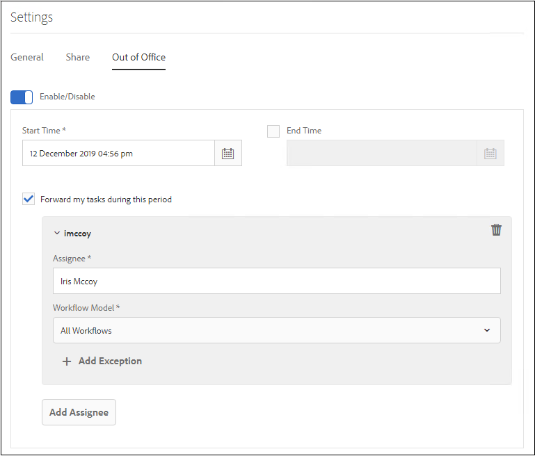

# Vorm uit Bureau het plaatsen {#configure-out-of-office-settings}

Als u van plan bent om uit het bureau te zijn, kunt u specificeren wat aan punten gebeurt die aan u voor die periode worden toegewezen.

U kunt een begindatum en -tijd en een einddatum en -tijd opgeven die van kracht moeten worden als uw instellingen buiten het kantoor zijn. Als u in een verschillende tijdzone van de server wordt gevestigd, is de gebruikte tijdzone die van de cliënt.

U kunt een standaardpersoon instellen waarnaar al uw items worden verzonden. U kunt ook uitzonderingen opgeven voor items van specifieke processen die naar een andere gebruiker moeten worden verzonden of die in uw Postvak IN moeten blijven totdat u terugkeert. Als de aangewezen persoon ook uit het bureau is, gaat het punt naar de gebruiker die zij hebben aangewezen. Als het punt niet aan een gebruiker kan worden toegewezen die niet uit het bureau is, blijft het punt in uw Inbox.

U kunt item-delegatie scheiden op basis van de workflowmodellen. Bijvoorbeeld, kunt u een punt met betrekking tot Werkschema A aan gebruiker A toewijzen en een punt met betrekking tot Werkschema B toewijzen wordt toegewezen aan gebruiker B.

>[!NOTE]
>
>* Wanneer u uit Bureau het plaatsen toelaat, blijven alle punten beschikbaar in uw Inbox, voorafgaand aan het toelaten van het plaatsen in uw inbox. Alleen items die worden ontvangen nadat de instelling is ingeschakeld, worden gedelegeerd.
>* Wanneer u uit het Bureau het plaatsen weg zet, worden de gedelegeerde punten niet automatisch toegewezen terug aan u. U kunt de claimfunctionaliteit gebruiken om items aan u toe te wijzen.
>* Wanneer Gebruiker A punten aan Gebruiker B en Gebruiker B afgevaardigden verder aan Gebruiker C delegeert, dan worden de punten toegewezen slechts aan Gebruiker C en niet Gebruiker B.
>* Wanneer er een lus in taak is, blijven de taken bij de originele gebruiker. Bijvoorbeeld, wanneer Gebruiker A punten aan Gebruiker B van de Gebruiker B afgevaardigden aan Gebruiker C delegeert, delegeert de Gebruiker C aan Gebruiker D, en de afgevaardigden van Gebruiker D aan Gebruiker B, een lijn in gecreeerd. In een dergelijke situatie blijft het item bij de oorspronkelijke gebruiker. Gebruiker A is de oorspronkelijke gebruiker in het bovenstaande voorbeeld.

## De instelling Buiten Office voor uw account inschakelen {#enable-out-of-office}

Voer de volgende stappen uit om de instelling Buiten-Office voor uw account in te schakelen en uw Inbox-items te delegeren aan een andere gebruiker:

1. Meld u aan bij uw AEM. Tik op de knop  pictogram en tik **[!UICONTROL View All]**. Er wordt een lijst met je postvak-items weergegeven.
1. Tik op de knop  of  pictogram naast **[!UICONTROL Create]** knop en tik **[!UICONTROL Settings]**. Het dialoogvenster Instellingen wordt weergegeven.
1. Open de **[!UICONTROL Out of Office]** in het dialoogvenster Instellingen.
1. Tik op de knop **[!UICONTROL Enable/Disable]** knoop om uit Bureau het plaatsen toe te laten.
1. Geef de **[!UICONTROL Start Time]**  en **[!UICONTROL End Time]** voor de instelling. De items worden alleen gedelegeerd tijdens de opgegeven periode. Laat de **[!UICONTROL End Time]** veld leeg om items voor onbepaalde tijd te delegeren.
1. Selecteer **[!UICONTROL Forward my items during this period]** selectievakje. Als je de optie niet selecteert en geen ontvanger opgeeft, worden je objecten niet doorgestuurd naar een gebruiker. Hoewel u weg bent en het plaatsen wordt toegelaten, blijven de punten in uw Inbox.
1. Tik op **[!UICONTROL Add Assignee]**. Geef een gebruiker op in het dialoogvenster **[!UICONTROL Assignee]** veld waarin u de items wilt delegeren. Geef de **[!UICONTROL Workflow Model]** aan afgevaardigde aan de gespecificeerde gebruiker. U kunt meerdere workflowmodellen selecteren.

   Als u bovendien alle items, ongeacht het workflowmodel, aan een bepaalde gebruiker wilt toewijzen, selecteert u **[!UICONTROL All Workflows]** in de vervolgkeuzelijst Werkstroommodel.  

   Als u items wilt toewijzen aan een bepaalde gebruiker voor alle workflowmodellen, behalve een paar, selecteert u **[!UICONTROL All Workflows]** tikken in de vervolgkeuzelijst Werkstroommodel **[!UICONTROL + Add Exceptions]**en geeft u de workflowmodellen op die u wilt uitsluiten.
    

   Herhaal de stap om meer toewijzingen toe te voegen.  

   >[!NOTE]
   >
   >De volgorde van de toewijzingen is belangrijk. Wanneer een punt aan een gebruiker wordt toegewezen die uit bureau het plaatsen hebben toegelaten, wordt het punt geëvalueerd tegen de gespecificeerde toewijzingslijst in de orde worden de wijzers toegevoegd. Wanneer een item voldoet aan de criteria, wordt het toegewezen aan de ontvanger en wordt de volgende ontvanger niet gecontroleerd.

1. Tik op **[!UICONTROL Save]**. De instelling wordt van kracht op de opgegeven begindatum en -tijd. Als u zich aanmeldt terwijl u zich buiten het kantoor bevindt, wordt u pas overwogen op het kantoor wanneer u uw instellingen wijzigt.

Nu, worden de punten die aan u tijdens uit de periode van het Bureau worden toegewezen automatisch toegewezen aan de gespecificeerde ontvanger.

>[!NOTE]
>
>(Alleen voor workflowitems die op Forms zijn gericht) Schakel de optie **[!UICONTROL Allow assignee to delegate using 'Out of Office' settings]** de **[!UICONTROL Assign task]** in de workflow. Alleen items waarvoor de bovenstaande optie is ingeschakeld, worden gedelegeerd aan andere gebruikers.

## Beperkingen {#limitations}

* Het toewijzen van items aan een groep wordt niet ondersteund.
* Het toelaten uit Bureau voor projecttaken wordt momenteel niet gesteund.
