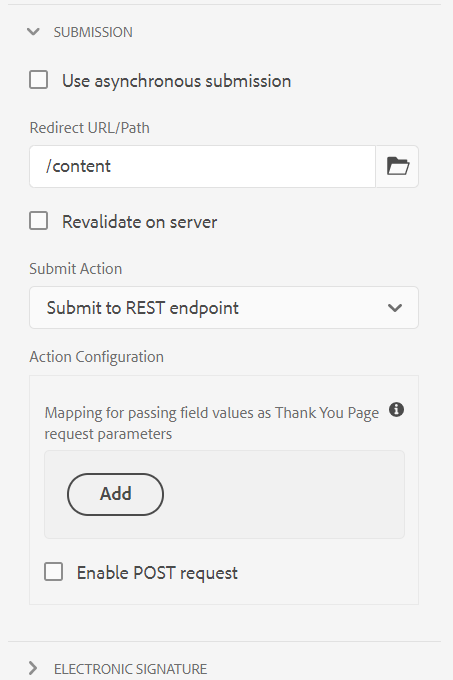

# Omleidingspagina configureren {#configuring-redirect-page}

| Versie | Artikelkoppeling |
| -------- | ---------------------------- |
| AEM 6,5 | [ klik hier ](https://experienceleague.adobe.com/docs/experience-manager-65/forms/adaptive-forms-basic-authoring/configuring-redirect-page.html?lang=nl-NL) |
| AEM as a Cloud Service | Dit artikel |

Formulierauteurs kunnen een pagina configureren voor elk formulier, waarnaar de formuliergebruikers worden omgeleid na het verzenden van een formulier.

1. Op geef wijze uit, selecteer een component, dan klik  > **[!UICONTROL Adaptive Form Container]**, en klik dan .

1. Klik op **[!UICONTROL Submission]** in het zijpaneel.

1. Geef de URL van de omleidingspagina op onder **[!UICONTROL Redirect URL/Path]** in de sectie **[!UICONTROL Submission]** .
1. Naar keuze, onder Verzenden Actie, voor Submit aan de het eindpuntactie van REST, kunt u de parameter vormen die tot de omleidingspagina wordt overgegaan.

    opnieuw

   Pagina-configuratie omleiden

Auteurs van formulieren kunnen de volgende parameters gebruiken die worden doorgegeven aan de pagina Bedankt. Voor alle beschikbare verzendhandelingen worden de parameters `status` en `owner` doorgegeven. Naast deze twee parameters worden enkele aanvullende parameters doorgegeven voor de volgende verzendhandelingen:

* **[!UICONTROL Submit to REST endpoint]**: parameters die voor parametertoewijzing in het veld zijn toegevoegd, worden doorgegeven. `status` - en `owner` -parameters worden niet doorgegeven in deze verzendhandeling. Voor meer informatie, zie [ Vormend voorlegt aan het eindpunt REST Actie ](configuring-submit-actions.md) voor.

>[!MORELIKETHIS]
>
>* [ vorm een Redirect Pagina of dank u bericht ](/help/forms/configure-redirect-page-or-thank-you-message.md)
