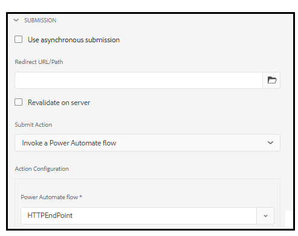
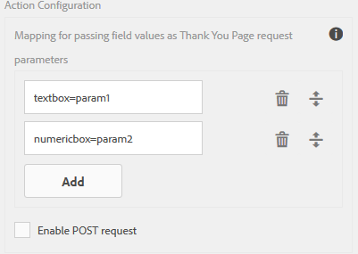

# Handeling Adaptief verzenden van formulier {#configuring-the-submit-action}

| Versie | Artikelkoppeling |
| -------- | ---------------------------- |
| AEM 6.5 | [ klik hier ](https://experienceleague.adobe.com/docs/experience-manager-65/forms/adaptive-forms-basic-authoring/configuring-submit-actions.html) |
| AEM as a Cloud Service (Core Components) | [ klik hier ](/help/forms/configure-submit-actions-core-components.md) |
| AEM as a Cloud Service (Foundation Components) | Dit artikel |

**is op** van toepassing: ✔️ de Aangepaste Componenten van de Stichting van de Vorm. ❌ [ Aangepaste Componenten van de Kern van de Vorm ](/help/forms/configure-submit-actions-core-components.md). Adobe adviseert het gebruiken van de Componenten van de Kern om [ Aangepaste Forms aan een Pagina van AEM Sites ](create-or-add-an-adaptive-form-to-aem-sites-page.md) toe te voegen of [ standalone Aangepaste Forms ](creating-adaptive-form-core-components.md) tot stand te brengen.

Een handeling Verzenden wordt geactiveerd wanneer een gebruiker op de knop **[!UICONTROL Submit]** klikt op een adaptief formulier. Forms as a Cloud Service geeft de volgende verzendhandelingen weer.

* [Verzenden naar REST-eindpunt](#submit-to-rest-endpoint)
* [E-mail verzenden](#send-email)
* [Verzenden met FDM (Form Data Mode)](#submit-using-form-data-model)
* [Een AEM-workflow aanroepen](#invoke-an-aem-workflow)
* [Verzenden naar SharePoint](#submit-to-sharedrive)
* [Verzenden naar OneDrive](#submit-to-onedrive)
* [Verzenden naar Azure Blob Storage](#azure-blob-storage)
* [Verzenden naar Power Automate](#microsoft-power-automate)
* [Verzenden naar Workfront Fusion](#workfront-fusion)
* [Verzenden naar Marketo Engage](/help/forms/integrate-form-to-marketo-engage.md)

U kunt [ ook uitbreiden het gebrek verzendt Acties ](custom-submit-action-form.md) om uw eigen te creëren verzendt Actie.

U kunt een handeling Verzenden configureren in de sectie **[!UICONTROL Submission]** van de eigenschappen van de container van adaptieve formulieren, in de zijbalk.

<!-- [!NOTE]
>
>Send PDF via Email Submit Action is applicable only to Adaptive Forms that use XFA template as form model. 

>[!NOTE]
>
>Ensure that the [AEM_Installation_Directory]\crx-quickstart\temp\datamanager\ASM folder
>exists. The directory is required to temporarily store attachments. If the directory does not exist, create it. -->

<!--

>[!CAUTION]
>
>If you  [prefill](prepopulate-adaptive-form-fields.md) a form template,  a Form Data Model or schema based Adaptive Form with XML or JSON data complaint to a schema (XML schema, JSON schema , form template, or form data model) that is data does not contain &lt;afData&gt;, &lt;afBoundData&gt;, and &lt;/afUnboundData&gt; tags, then the data of unbounded fields (Unbounded fields are Adaptive Form fields without [bindref](prepopulate-adaptive-form-fields.md) property) of the Adaptive Form is lost. 

>[!CAUTION]
>
>If you [prefill](prepopulate-adaptive-form-fields.md) a form template, a Form Data Model or schema based Adaptive Form with XML or JSON data complaint to a schema (XML schema, JSON schema, or form data model) that does not contain &lt;afData&gt;, &lt;afBoundData&gt;, and &lt;/afUnboundData&gt; tags, then the data of unbounded fields (Unbounded fields are Adaptive Form fields without [bindref](prepopulate-adaptive-form-fields.md) property) of the Adaptive Form is lost.
-->

## Verzenden naar REST-eindpunt {#submit-to-rest-endpoint}

Gebruik de handeling **[!UICONTROL Submit to REST Endpoint]** om de verzonden gegevens naar een rest-URL te verzenden. De URL kan van een interne (de server waarop het formulier wordt gegenereerd) of van een externe server zijn.

Om gegevens aan een interne server te posten, verstrek weg van het middel. De gegevens worden gepost de weg van het middel. Bijvoorbeeld /content/restEndPoint. Voor dergelijke postverzoeken wordt de authenticatieinformatie van het verzendverzoek gebruikt.

Geef een URL op om gegevens naar een externe server te posten. De opmaak van de URL is `https://host:port/path_to_rest_end_point` . Zorg ervoor dat u de weg vormt om het POST- verzoek anoniem te behandelen.

In het bovenstaande voorbeeld wordt door de gebruiker ingevoerde informatie in `textbox` vastgelegd met parameter `param1` . De syntaxis voor het posten van gegevens die zijn vastgelegd met `param1` is:

`String data=request.getParameter("param1");`

Op dezelfde manier zijn de parameters die u gebruikt voor het posten van XML-gegevens en -bijlagen `dataXml` en `attachments` .

U gebruikt deze twee parameters in uw script bijvoorbeeld om gegevens te parseren op een eindpunt in de rest. U gebruikt de volgende syntaxis om de gegevens op te slaan en te ontleden:

`String data=request.getParameter("dataXml");`
`String att=request.getParameter("attachments");`

In dit voorbeeld slaat `data` de XML-gegevens op en slaat `att` de gegevens in de bijlage op.

Met de handeling **[!UICONTROL Submit to REST endpoint]** Verzenden worden de gegevens die in het formulier zijn ingevuld, verzonden naar een geconfigureerde bevestigingspagina als onderdeel van de HTTP GET-aanvraag. U kunt de naam toevoegen van de velden die u wilt aanvragen. De indeling van het verzoek is:

`{fieldName}={request parameter name}`

Zoals aangetoond in het beeld hieronder, `param1` en `param2` worden overgegaan als parameters met waarden die van **worden gekopieerd textbox** en **numericbox** gebieden voor de volgende actie.

 voor

U kunt ook **[!UICONTROL Enable POST request]** opgeven en een URL opgeven om de aanvraag te verzenden. Als u gegevens wilt verzenden naar de AEM-server waarop het formulier zich bevindt, gebruikt u een relatief pad dat overeenkomt met het hoofdpad van de AEM-server. Bijvoorbeeld `/content/forms/af/SampleForm.html` . Gebruik absoluut pad om gegevens naar een andere server te verzenden.

>[!NOTE]
>
>Als u de velden als parameters in een REST-URL wilt doorgeven, moeten alle velden verschillende elementnamen hebben, zelfs als de velden op verschillende deelvensters zijn geplaatst.

## E-mail verzenden {#send-email}

Met de handeling **[!UICONTROL Send Email]** Verzenden kunt u een e-mail verzenden naar een of meer ontvangers wanneer het formulier met succes is verzonden. Het gegenereerde e-mailbericht kan formuliergegevens in een vooraf gedefinieerde indeling bevatten. In de volgende sjabloon worden bijvoorbeeld de naam van de klant, het verzendadres, de naam van de staat en de postcode opgehaald uit de ingediende formuliergegevens.

    &quot;
    
     Hi $ {customer_Name}, 
    
     het volgende wordt geplaatst als uw standaard verschepend adres:
     $ {customer_Name}, 
     $ {customer_Shipping_Address}, 
     $ {customer_State}, 
     $ {customer_ZIPCode} 
    
     Regards, 
     WKND 
    
    &quot;

>[!NOTE]
>
> * Alle formuliervelden moeten verschillende elementnamen hebben, zelfs als de velden op verschillende deelvensters van een adaptief formulier zijn geplaatst.
> * AEM as a Cloud Service vereist dat uitgaande post wordt gecodeerd. Standaard is uitgaande e-mail uitgeschakeld. Om het te activeren, leg een steunkaartje voor aan [ het Aanvragen van Toegang ](https://experienceleague.adobe.com/docs/experience-manager-cloud-service/implementing/developing/development-guidelines.html?lang=en#sending-email).

U kunt ook bijlagen en een Document of Record (DoR) aan de e-mail toevoegen. Als u de optie **[!UICONTROL Attach Document of Record]** wilt inschakelen, configureert u het adaptieve formulier om een Document of Record (DoR) te genereren. U kunt de optie inschakelen om een document met records te genereren op basis van de eigenschappen van een adaptief formulier.

<!-- ## Send PDF via Email {#send-pdf-via-email}

The **Send PDF via Email** Submit Action sends an email with a PDF containing form data, to one or more recipients on successful submission of the form.

>[!NOTE]
>
>This Submit Action is available for XFA-based Adaptive Forms and XSD-based adaption forms that have the Document of Record template. -->

<!-- ## Invoke a forms workflow {#invoke-a-forms-workflow}

The **Submit to Forms workflow** submit option sends a data xml and file attachments (if any) to an existing Adobe LiveCycle or [!DNL AEM Forms] on JEE process.

For information about how to configure the Submit to forms workflow Submit Action, see [Submitting and processing your form data using forms workflows](submit-form-data-livecycle-process.md). -->

## Verzenden met gebruik van FDM (Form Data Model) {#submit-using-form-data-model}

Met de handeling **[!UICONTROL Submit using Form Data Model]** Verzenden worden verzonden gegevens van het adaptieve formulier voor het opgegeven gegevensmodelobject in een formuliergegevensmodel (FDM) naar de gegevensbron. Wanneer u de handeling Verzenden configureert, kunt u een gegevensmodelobject kiezen waarvan de verzonden gegevens u naar de gegevensbron wilt schrijven.

Daarnaast kunt u een formulierbijlage verzenden met een formuliergegevensmodel (FDM) en een Document of Record (DoR) naar de gegevensbron. Voor informatie over het model van vormgegevens (FDM), zie [[!DNL AEM Forms]  Integratie van Gegevens ](data-integration.md).

<!--
## Forms Portal Submit Action {#forms-portal-submit-action}

The **Forms Portal Submit Action** option makes form data available through an [!DNL AEM Forms] portal.

For more information about the Forms Portal and Submit Action, see [Drafts and submissions component](draft-submission-component.md). -->

## Een AEM-workflow aanroepen {#invoke-an-aem-workflow}

**[!UICONTROL Invoke an AEM Workflow]** legt Actie associeert een Aangepaste Vorm met een [ Werkschema van AEM ](https://experienceleague.adobe.com/docs/experience-manager-65/developing/extending-aem/extending-workflows/workflows-models.html?lang=en#extending-aem) voor. Wanneer een formulier wordt verzonden, wordt de bijbehorende workflow automatisch gestart bij de instantie Auteur. U kunt het gegevensbestand, de gehechtheid, en Document van Verslag aan de ladingsplaats van het werkschema of aan een variabele opslaan. Als de workflow is gemarkeerd voor externe gegevensopslag en geconfigureerd voor externe gegevensopslag, is alleen de optie Variabele beschikbaar. U kunt uit de lijst van variabelen selecteren beschikbaar voor het werkschemamodel. Als de workflow later wordt gemarkeerd voor externe gegevensopslag en niet op het moment dat de workflow wordt gemaakt, moet u ervoor zorgen dat de vereiste variabele configuraties aanwezig zijn.

Met de handeling Verzenden wordt het volgende geplaatst op de laadlocatie van de werkstroom, of de variabele als de werkstroom is gemarkeerd voor externe gegevensopslag:

* **dossier van Gegevens**: Het bevat gegevens die aan de Aangepaste Vorm worden voorgelegd. Met de optie **[!UICONTROL Data File Path]** kunt u de naam van het bestand en het pad van het bestand ten opzichte van de laadbewerking opgeven. Het pad `/addresschange/data.xml` maakt bijvoorbeeld een map met de naam `addresschange` en plaatst deze relatief ten opzichte van de laadbewerking. U kunt ook alleen `data.xml` opgeven om alleen verzonden gegevens te verzenden zonder een maphiërarchie te maken. Als de workflow is gemarkeerd voor externe gegevensopslag, gebruikt u de optie Variabele en selecteert u de variabele in de lijst met variabelen die beschikbaar zijn voor het workflowmodel.

* **Gehechtheid**: U kunt de **[!UICONTROL Attachment Path]** optie gebruiken om de omslagnaam te specificeren om de gehechtheid op te slaan die aan de Aangepaste Vorm wordt geupload. De map wordt gemaakt ten opzichte van de lading. Als de workflow is gemarkeerd voor externe gegevensopslag, gebruikt u de optie Variabele en selecteert u de variabele in de lijst met variabelen die beschikbaar zijn voor het workflowmodel.

* **Document van Verslag**: Het bevat het Document van Verslag dat voor de Adaptieve Vorm wordt geproduceerd. U kunt de optie **[!UICONTROL Document of Record Path]** gebruiken om de naam van het document van het dossier van het Verslag en weg van dossier met betrekking tot de lading te specificeren. Het pad `/addresschange/DoR.pdf` maakt bijvoorbeeld een map met de naam `addresschange` ten opzichte van de laadbewerking en plaatst de map `DoR.pdf` ten opzichte van de laadbewerking. U kunt ook alleen `DoR.pdf` opgeven om alleen Document of Record op te slaan zonder een maphiërarchie te maken. Als de workflow is gemarkeerd voor externe gegevensopslag, gebruikt u de optie Variabele en selecteert u de variabele in de lijst met variabelen die beschikbaar zijn voor het workflowmodel.

Voordat u **[!UICONTROL Invoke an AEM Workflow]** Handeling verzenden gebruikt, configureert u het volgende voor de **[!UICONTROL AEM DS settings service]** -configuratie:

* **[!UICONTROL Processing Server URL]**: De Verwerkingsserver is de server waarop de Forms- of AEM-workflow wordt geactiveerd. Dit kan gelijk zijn aan de URL van de AEM-auteurinstantie of een andere server.

* **[!UICONTROL Processing Server User Name]**: Gebruikersnaam van workflowgebruiker

* **[!UICONTROL Processing Server Password]**: Wachtwoord van workflowgebruiker

## Verzenden naar SharePoint {#submit-to-sharedrive}

Met de handeling **[!UICONTROL Submit to SharePoint]** Verzenden wordt een adaptief formulier verbonden met een Microsoft® SharePoint-opslag. U kunt het bestand met formuliergegevens, bijlagen of het document met records verzenden naar de aangesloten Microsoft® SharePoint-opslag.

Met Verzenden naar SharePoint kunt u:
* [Een adaptief formulier aansluiten op de SharePoint-documentbibliotheek](#connect-af-sharepoint-doc-library)
* [ verbind een Aangepast Vorm met de Lijst van SharePoint ](#connect-af-sharepoint-list)

### Een adaptief formulier aansluiten op de SharePoint-documentbibliotheek {#connect-af-sharepoint-doc-library}

U kunt als volgt de **[!UICONTROL Submit to SharePoint Document Library]** Handeling verzenden in een adaptieve vorm gebruiken:

1. [ creeer een Configuratie van de Bibliotheek van het Document van SharePoint ](#create-a-sharepoint-configuration-create-sharepoint-configuration): Het verbindt AEM Forms met uw Opslag van SharePoint Microsoft®.
2. [ gebruik Submit aan SharePoint verzendt actie in een AanpassingsVorm ](#use-sharepoint-configuartion-in-af): Het verbindt uw AanpassingsVorm met gevormde SharePoint Microsoft®.

#### Een SharePoint-documentbibliotheekconfiguratie maken {#create-sharepoint-configuration}

AEM Forms verbinden met uw Microsoft® Sharepoint Document Library Storage:

1. Ga naar uw **1&rbrace; instantie van de Auteur van AEM Forms >**&#x200B;[!UICONTROL Tools]&#x200B;**>**&#x200B;[!UICONTROL Cloud Services]&#x200B;**>**&#x200B;[!UICONTROL Microsoft® SharePoint]&#x200B;**.**
1. Nadat u de **[!UICONTROL Microsoft® SharePoint]** hebt geselecteerd, wordt u omgeleid naar **[!UICONTROL SharePoint Browser]** .
1. Selecteer de Container van de a **Configuratie**. De configuratie wordt opgeslagen in de geselecteerde Container van de Configuratie.
1. Klik op **[!UICONTROL Create]** > **[!UICONTROL SharePoint Document Library]** in de vervolgkeuzelijst. De configuratietovenaar van SharePoint verschijnt.

   
1. Geef de waarden **[!UICONTROL Title]** , **[!UICONTROL Client ID]** , **[!UICONTROL Client Secret]** en **[!UICONTROL OAuth URL]** op. Voor informatie over hoe te om identiteitskaart van de Cliënt terug te winnen, Geheime cliënt, identiteitskaart van de Aannemer voor OAuth URL, zie [ Documentatie Microsoft® ](https://learn.microsoft.com/en-us/graph/auth-register-app-v2).
   * U kunt de `Client ID` en `Client Secret` van uw app ophalen via de Microsoft® Azure-portal.
   * Voeg in de Microsoft® Azure-portal de Redirect URI toe als `https://[author-instance]/libs/cq/sharepoint/content/configurations/wizard.html` . Vervang `[author-instance]` door de URL van de instantie Auteur.
   * Voeg de API-machtigingen `offline_access` en `Sites.Manage.All` toe voor lees- en schrijfmachtigingen.
   * Gebruik OAuth URL: `https://login.microsoftonline.com/tenant-id/oauth2/v2.0/authorize`. Vervang `<tenant-id>` door `tenant-id` van uw app via de Microsoft® Azure-portal.

   >[!NOTE]
   >
   > Het **cliënt geheime** gebied is verplicht of facultatief hangt van uw Azure Actieve de toepassingsconfiguratie van de Folder af. Als uw toepassing wordt gevormd om een cliëntgeheim te gebruiken, is het verplicht om het cliëntgeheim te verstrekken.

1. Klik op **[!UICONTROL Connect]**. Bij een geslaagde verbinding wordt het bericht `Connection Successful` weergegeven.

1. Nu, uitgezochte **>** de Bibliotheek van het Document van SharePoint **>** de Omslag van SharePoint **, om de gegevens te bewaren.**

   >[!NOTE]
   >
   >* Standaard is `forms-ootb-storage-adaptive-forms-submission` aanwezig op geselecteerde SharePoint-site.
   >* Creeer een omslag als `forms-ootb-storage-adaptive-forms-submission`, als niet reeds aanwezig in de `Documents` bibliotheek van de geselecteerde Plaats van SharePoint door **te klikken creeer Omslag**.

U kunt deze configuratie voor SharePoint-sites nu gebruiken voor de verzendactie in een adaptief formulier.

#### SharePoint Document Library Configuration gebruiken in een adaptief formulier {#use-sharepoint-configuartion-in-af}

U kunt de gemaakte SharePoint Document Library-configuratie in een adaptief formulier gebruiken om gegevens of gegenereerd Document of Record in een SharePoint-map op te slaan. Voer de volgende stappen uit om een opslagconfiguratie voor SharePoint Document Library in een adaptief formulier te gebruiken als:

1. Creeer een [ Aangepaste Vorm ](/help/forms/creating-adaptive-form.md).

   >[!NOTE]
   >
   > * Selecteer hetzelfde [!UICONTROL Configuration Container] voor een adaptief formulier, waar u de opslagruimte van de SharePoint-documentbibliotheek hebt gemaakt.
   > * Als er geen [!UICONTROL Configuration Container] is geselecteerd, worden de algemene [!UICONTROL Storage Configuration] -mappen weergegeven in het eigenschappenvenster Handeling verzenden.

1. Selecteer **voorleggen Actie** als **[!UICONTROL Submit to SharePoint]**.
   
1. Selecteer **[!UICONTROL Storage Configuration]** waar u de gegevens wilt opslaan.
1. Klik op **[!UICONTROL Save]** om de verzendinstellingen op te slaan.

Wanneer u het formulier verzendt, worden de gegevens opgeslagen in de opgegeven Microsoft® Sharepoint Document Library Storage.
De mapstructuur voor het opslaan van gegevens is `/folder_name/form_name/year/month/date/submission_id/data` .

>[!NOTE]
>
> Bijlagen worden ook opgeslagen in de map `/folder_name/form_name/year/month/date/submission_id/data` . Nochtans, als u **sparen Bijlagen met Oorspronkelijke Naam** selecteert, worden de gehechtheid opgeslagen in de omslag gebruikend hun originele filenames.
> {height=50%,width=50%}

### Een adaptief formulier verbinden met de Microsoft® SharePoint-lijst {#connect-af-sharepoint-list}

>[!VIDEO](https://video.tv.adobe.com/v/3424820/connect-aem-adaptive-form-to-sharepointlist/?quality=12&learn=on)

U kunt als volgt de [!UICONTROL Submit to SharePoint List] Handeling verzenden in een adaptieve vorm gebruiken:

1. [ creeer een Configuratie van de Lijst van SharePoint ](#create-sharepoint-list-configuration): Het verbindt AEM Forms met uw Opslag van de Lijst van SharePoint Microsoft®.
1. [ gebruik Submit gebruikend het Model van de Gegevens van de Vorm (FDM) in een Aangepaste Vorm ](#use-submit-using-fdm): Het verbindt uw AanpassingsVorm met gevormde Microsoft® SharePoint.

#### Een SharePoint List-configuratie maken {#create-sharepoint-list-configuration}

AEM Forms verbinden met uw Microsoft® SharePoint-lijst:

1. Ga naar **[!UICONTROL Tools]** > **[!UICONTROL Cloud Services]** > **[!UICONTROL Microsoft® SharePoint]** .
1. Selecteer de Container van de a **Configuratie**. De configuratie wordt opgeslagen in de geselecteerde Container van de Configuratie.
1. Klik op **[!UICONTROL Create]** > **[!UICONTROL SharePoint List]** in de vervolgkeuzelijst. De configuratietovenaar van SharePoint verschijnt.
1. Geef de waarden **[!UICONTROL Title]** , **[!UICONTROL Client ID]** , **[!UICONTROL Client Secret]** en **[!UICONTROL OAuth URL]** op. Voor informatie over hoe te om identiteitskaart van de Cliënt terug te winnen, Geheime cliënt, identiteitskaart van de Aannemer voor OAuth URL, zie [ Documentatie Microsoft® ](https://learn.microsoft.com/en-us/graph/auth-register-app-v2).
   * U kunt de `Client ID` en `Client Secret` van uw app ophalen via de Microsoft® Azure-portal.
   * Voeg in de Microsoft® Azure-portal de Redirect URI toe als `https://[author-instance]/libs/cq/sharepointlist/content/configurations/wizard.html` . Vervang `[author-instance]` door de URL van de instantie Auteur.
   * Voeg de API toestemmingen `offline_access` en `Sites.Manage.All` in het **Microsoft® Grafiek** lusje toe om lees-schrijftoestemmingen te verstrekken. Voeg `AllSites.Manage` toestemming in het **SharePoint** lusje toe om ver met de gegevens van SharePoint in wisselwerking te staan.
   * Gebruik OAuth URL: `https://login.microsoftonline.com/tenant-id/oauth2/v2.0/authorize`. Vervang `<tenant-id>` door `tenant-id` van uw app via de Microsoft® Azure-portal.

     >[!NOTE]
     >
     > Het **cliënt geheime** gebied is verplicht of facultatief hangt van uw Azure Actieve de toepassingsconfiguratie van de Folder af. Als uw toepassing wordt gevormd om een cliëntgeheim te gebruiken, is het verplicht om het cliëntgeheim te verstrekken.

1. Klik op **[!UICONTROL Connect]**. Bij een geslaagde verbinding wordt het bericht `Connection Successful` weergegeven.
1. Selecteer **[!UICONTROL SharePoint Site]** en **[!UICONTROL SharePoint List]** in de vervolgkeuzelijst.
1. Selecteer **[!UICONTROL Create]** om de wolkenconfiguratie voor Microsoft® SharePointList tot stand te brengen.

#### Verzenden met gebruik van FDM (Form Data Model) in een adaptief formulier {#use-submit-using-fdm}

U kunt de gemaakte SharePoint List-configuratie in een adaptief formulier gebruiken om gegevens of het gegenereerde Document of Record in een SharePoint-lijst op te slaan. Voer de volgende stappen uit om een SharePoint List-opslagconfiguratie in een adaptief formulier te gebruiken als:

1. [Een formuliergegevensmodel (FDM) maken met Microsoft](/help/forms/create-form-data-models.md)
1. [Vorm het Model van de Gegevens van de Vorm (FDM) om gegevens terug te winnen en te verzenden](/help/forms/work-with-form-data-model.md#configure-services)
1. [Een adaptief formulier maken](/help/forms/creating-adaptive-form.md)
1. [Verzendactie configureren met een FDM (Form Data Model)](/help/forms/configuring-submit-actions.md#submit-using-form-data-model)

Wanneer u het formulier verzendt, worden de gegevens opgeslagen in de opgegeven Microsoft® Sharepoint List Storage.

>[!NOTE]
>
> In Microsoft® SharePoint List worden de volgende kolomtypen niet ondersteund:
> * afbeeldingskolom
> * metagegevenskolom
> * persoonlijke kolom
> * kolom externe gegevens

## Verzenden naar OneDrive {#submit-to-onedrive}

Met de handeling **[!UICONTROL Submit to OneDrive]** Verzenden wordt een adaptief formulier verbonden met een Microsoft® OneDrive. U kunt de formuliergegevens, het bestand, de bijlagen of het document met records verzenden naar de aangesloten Microsoft® OneDrive-opslag. U kunt als volgt de [!UICONTROL Submit to OneDrive] Handeling verzenden in een adaptieve vorm gebruiken:

1. [ creeer een Configuratie OneDrive ](#create-a-onedrive-configuration-create-onedrive-configuration): Het verbindt AEM Forms met uw Opslag van Microsoft® OneDrive.
2. [ gebruik Submit aan OneDrive voorlegt actie in een Aangepaste Vorm ](#use-onedrive-configuration-in-an-adaptive-form-use-onedrive-configuartion-in-af): Het verbindt uw AanpassingsVorm met
geconfigureerde Microsoft® OneDrive.

### Een OneDrive-configuratie maken {#create-onedrice-configuration}

AEM Forms aansluiten op uw Microsoft® OneDrive-opslag:

1. Ga naar uw **1&rbrace; instantie van de Auteur van AEM Forms >**&#x200B;[!UICONTROL Tools]&#x200B;**>**&#x200B;[!UICONTROL Cloud Services]&#x200B;**>**&#x200B;[!UICONTROL Microsoft® OneDrive]&#x200B;**.**
1. Nadat u de **[!UICONTROL Microsoft® OneDrive]** hebt geselecteerd, wordt u omgeleid naar **[!UICONTROL OneDrive Browser]** .
1. Selecteer de Container van de a **Configuratie**. De configuratie wordt opgeslagen in de geselecteerde Container van de Configuratie.
1. Klik op **[!UICONTROL Create]**. De OneDrive-configuratietovenaar wordt weergegeven.

   

1. Geef de waarden **[!UICONTROL Title]** , **[!UICONTROL Client ID]** , **[!UICONTROL Client Secret]** en **[!UICONTROL OAuth URL]** op. Voor informatie over hoe te om identiteitskaart van de Cliënt terug te winnen, Geheime cliënt, identiteitskaart van de Aannemer voor OAuth URL, zie [ Documentatie Microsoft® ](https://learn.microsoft.com/en-us/graph/auth-register-app-v2).
   * U kunt de `Client ID` en `Client Secret` van uw app ophalen via de Microsoft® Azure-portal.
   * Voeg in de Microsoft® Azure-portal de Redirect URI toe als `https://[author-instance]/libs/cq/onedrive/content/configurations/wizard.html` . Vervang `[author-instance]` door de URL van de instantie Auteur.
   * Voeg de API-machtigingen `offline_access` en `Files.ReadWrite.All` toe voor lees- en schrijfmachtigingen.
   * Gebruik OAuth URL: `https://login.microsoftonline.com/tenant-id/oauth2/v2.0/authorize`. Vervang `<tenant-id>` door `tenant-id` van uw app via de Microsoft® Azure-portal.

   >[!NOTE]
   >
   > Het **cliënt geheime** gebied is verplicht of facultatief hangt van uw Azure Actieve de toepassingsconfiguratie van de Folder af. Als uw toepassing wordt gevormd om een cliëntgeheim te gebruiken, is het verplicht om het cliëntgeheim te verstrekken.

1. Klik op **[!UICONTROL Connect]**. Bij een geslaagde verbinding wordt het bericht `Connection Successful` weergegeven.

1. Nu, selecteer **[!UICONTROL OneDrive Container]** > **[Omslag OneDrive]** om de gegevens te bewaren.

   >[!NOTE]
   >
   >* Standaard is `forms-ootb-storage-adaptive-forms-submission` aanwezig in OneDrive-container.
   > * Creeer een omslag als `forms-ootb-storage-adaptive-forms-submission`, als niet reeds aanwezig door **te klikken creeer Omslag**.

U kunt deze OneDrive-opslagconfiguratie nu gebruiken voor de verzendactie in een adaptief formulier.

### OneDrive-configuratie gebruiken in een adaptief formulier {#use-onedrive-configuartion-in-af}

U kunt de gemaakte OneDrive-opslagconfiguratie in een adaptief formulier gebruiken om gegevens of gegenereerd document met record op te slaan in een OneDrive-map. Voer de volgende stappen uit om de OneDrive-opslagconfiguratie in een adaptief formulier te gebruiken als:
1. Creeer een [ Aangepaste Vorm ](/help/forms/creating-adaptive-form.md).

   >[!NOTE]
   >
   > * Selecteer hetzelfde [!UICONTROL Configuration Container] voor een adaptief formulier, waar u OneDrive-opslagruimte hebt gemaakt.
   > * Als er geen [!UICONTROL Configuration Container] is geselecteerd, worden de algemene [!UICONTROL Storage Configuration] -mappen weergegeven in het eigenschappenvenster Handeling verzenden.

1. Selecteer **voorleggen Actie** als **[!UICONTROL Submit to OneDrive]**.
   
1. Selecteer **[!UICONTROL Storage Configuration]** waar u de gegevens wilt opslaan.
1. Klik op **[!UICONTROL Save]** om de verzendinstellingen op te slaan.

Wanneer u het formulier verzendt, worden de gegevens opgeslagen in de opgegeven Microsoft® OneDrive-opslag.
De mapstructuur voor het opslaan van gegevens is `/folder_name/form_name/year/month/date/submission_id/data` .

## Verzenden naar Azure Blob Storage {#submit-to-azure-blob-storage}

Met de **[!UICONTROL Submit to Azure Blob Storage]** -actie Verzenden wordt een adaptief formulier verbonden met een Microsoft® Azure-portal. U kunt de formuliergegevens, het bestand, de bijlagen of het document met records verzenden naar de aangesloten Azure Storage-containers. De handeling Verzenden voor Azure Blob Storage gebruiken:

1. [ creeer een Azure BlobContainer van de Opslag ](#create-a-azure-blob-storage-container-create-azure-configuration): Het verbindt AEM Forms met de containers van de Azure Opslag.
2. [ Gebruik de Azure Configuratie van de Opslag in een AanpassingsVorm ](#use-azure-storage-configuration-in-an-adaptive-form-use-azure-storage-configuartion-in-af): Het verbindt uw AanpassingsVorm met gevormde de containers van de Opslag Azure.

### Een Azure Blob Storage Container maken {#create-azure-configuration}

AEM Forms aansluiten op uw Azure Storage-containers:
1. Ga naar uw **1&rbrace; instantie van de Auteur van AEM Forms >**&#x200B;[!UICONTROL Tools]&#x200B;**>**&#x200B;[!UICONTROL Cloud Services]&#x200B;**>**&#x200B;[!UICONTROL Azure Storage]&#x200B;**.**
1. Nadat u de **[!UICONTROL Azure Storage]** hebt geselecteerd, wordt u omgeleid naar **[!UICONTROL Azure Storage Browser]** .
1. Selecteer de Container van de a **Configuratie**. De configuratie wordt opgeslagen in de geselecteerde Container van de Configuratie.
1. Klik op **[!UICONTROL Create]**. De wizard Azure Storage Configuration wordt weergegeven.

   

1. Geef de waarden **[!UICONTROL Title]** , **[!UICONTROL Azure Storage Account]** en **[!UICONTROL Azure Access key]** op.

   * U kunt `Azure Storage Account` name and `Azure Access key` ophalen van Storage Accounts in de Microsoft® Azure-portal.

1. Klik op **[!UICONTROL Save]**.

Nu kunt u deze Azure Storage Container-configuratie gebruiken voor de verzendactie in een adaptief formulier.

### Azure Storage Configuration in een Adaptive Form gebruiken {#use-azure-storage-configuartion-in-af}

U kunt de gemaakte Azure Storage Container-configuratie in een Adaptief formulier gebruiken om gegevens of gegenereerd Document of Record in Azure Storage-container op te slaan. Voer de volgende stappen uit om de configuratie van de Azure Storage container in een Adaptief formulier te gebruiken als:
1. Creeer een [ Aangepaste Vorm ](/help/forms/creating-adaptive-form.md).

   >[!NOTE]
   >
   > * Selecteer hetzelfde [!UICONTROL Configuration Container] voor een adaptief formulier, waar u OneDrive-opslagruimte hebt gemaakt.
   > * Als er geen [!UICONTROL Configuration Container] is geselecteerd, worden de algemene [!UICONTROL Storage Configuration] -mappen weergegeven in het eigenschappenvenster Handeling verzenden.

1. Selecteer **voorleggen Actie** als **[!UICONTROL Submit to Azure Blob Storage]**.
   

1. Selecteer **[!UICONTROL Storage Configuration]** waar u de gegevens wilt opslaan.
1. Klik op **[!UICONTROL Save]** om de verzendinstellingen op te slaan.

Wanneer u het formulier verzendt, worden de gegevens opgeslagen in de opgegeven configuratie van de Azure Storage Container.
De mapstructuur voor het opslaan van gegevens is `/configuration_container/form_name/year/month/date/submission_id/data` .

Om waarden van een configuratie te plaatsen, [ produceer OSGi Configuraties gebruikend AEM SDK ](https://experienceleague.adobe.com/docs/experience-manager-cloud-service/implementing/deploying/configuring-osgi.html?lang=en#generating-osgi-configurations-using-the-aem-sdk-quickstart), en [ stel de configuratie ](https://experienceleague.adobe.com/docs/experience-manager-cloud-service/implementing/using-cloud-manager/deploy-code.html?lang=en#deployment-process) aan uw instantie van Cloud Service op.

## Verzenden naar Power Automate {#microsoft-power-automate}

U kunt een adaptief formulier configureren om een Microsoft® Power Automate Cloud Flow uit te voeren bij verzending. Met het geconfigureerde adaptieve formulier worden vastgelegde gegevens, bijlagen en het document met records naar Power Automate Cloud Flow verzonden voor verwerking. Het helpt u om een aangepaste ervaring op het gebied van gegevensvastlegging op te bouwen en tegelijk de kracht van Microsoft® Power Automate te benutten om bedrijfslogics rond vastgelegde gegevens te bouwen en de workflows van klanten te automatiseren. Hier volgen enkele voorbeelden van wat u kunt doen na de integratie van een adaptief formulier met Microsoft® Power Automate:

* Adaptieve Forms-gegevens gebruiken in een Power Automate-bedrijfsprocessen
* Gebruik Power Automate om vastgelegde gegevens naar meer dan 500 gegevensbronnen of een openbaar beschikbare API te verzenden
* Complexe berekeningen uitvoeren op vastgelegde gegevens
* Adaptieve Forms-gegevens opslaan naar opslagsystemen volgens een vooraf bepaald schema

De adaptieve redacteur van Forms verstrekt **roept een stroom van de Macht Microsoft®** automatisch verzendt actie om adaptieve vormgegevens, gehechtheid, en Document van Verslag te verzenden worden verzonden naar de Stroom van de Wolk van de Macht van de Macht van de Automatisering. Om de Submit actie te gebruiken om gevangen gegevens naar Microsoft® Power Automate te verzenden, [ verbind uw Forms as a Cloud Service instantie met Microsoft® Macht ](forms-microsoft-power-automate-integration.md)

Na een succesvolle configuratie, gebruik [ aanhaalt een Macht Microsoft® stroom ](forms-microsoft-power-automate-integration.md#use-the-invoke-a-microsoft&reg;-power-automate-flow-submit-action-to-send-data-to-a-power-automate-flow-use-the-invoke-microsoft-power-automate-flow-submit-action) verzendt actie om gegevens naar een Macht te verzenden automatisch Stroom.

## Verzenden naar Workfront Fusion {#workfront-fusion}

U kunt een adaptief formulier configureren om gegevens bij verzending naar Workfront Fusion te verzenden. Met Workfront Fusion kunnen processen worden geautomatiseerd, zodat de gebruiker zich kan concentreren op nieuwe taken in plaats van dezelfde taken steeds opnieuw uit te voeren. Het automatiseert zowel eenvoudige als complexe taken, bespaart tijd en verzekert consistente procesuitvoering.

De Adaptieve redacteur van Forms verstrekt **roept een Scenario van de Fusie van Workfront** actie voor om de Adaptieve gegevens of de gehechtheid van Forms naar een scenario van de Fusie van Workfront te verzenden. Om de voorleggingsactie voor het verzenden van gevangen gegevens naar een scenario van de Fusie van Workfront te gebruiken, verwijs naar [ een AanpassingsVorm aan de Fusie van Adobe Workfront ](/help/forms/submit-adaptive-form-to-workfront-fusion.md) voorleggen.

## Synchrone of asynchrone verzending gebruiken {#use-synchronous-or-asynchronous-submission}

Een verzendactie kan synchrone of asynchrone verzending gebruiken.

**Synchrone voorlegging**: Traditioneel, worden de Webvormen gevormd om synchroon voor te leggen. Wanneer gebruikers een formulier verzenden in een synchrone verzending, worden ze omgeleid naar een bevestigingspagina, een pagina om u te bedanken of een pagina om een fout op te lossen. U kunt de optie **[!UICONTROL Use asynchronous submission]** selecteren om de gebruikers om te leiden naar een webpagina of een bericht te tonen bij verzending.

**Asynchrone voorlegging**: De moderne Webervaringen zoals enige paginatoepassingen krijgen populariteit waar de Web-pagina statisch blijft terwijl de cliënt-server interactie op de achtergrond gebeurt. U kunt deze ervaring met Aanpassings Forms nu verstrekken door [ asynchrone voorlegging te vormen ](asynchronous-submissions-adaptive-forms.md).

## Revalidatie op de server in adaptieve vorm {#server-side-revalidation-in-adaptive-form}

In elk onlinesysteem voor gegevensvastlegging plaatsen ontwikkelaars doorgaans bepaalde JavaScript-validaties op de client om een aantal bedrijfsregels af te dwingen. Maar in moderne browsers, moeten de eindgebruikers die bevestigingen omzeilen en manueel bijdragen gebruikend diverse technieken, zoals Browser van het Web DevTools Console indienen. Deze technieken gelden ook voor Adaptive Forms. Een formulierontwikkelaar kan verschillende validatielogboeken maken, maar technisch kunnen eindgebruikers die validatielogboeken omzeilen en ongeldige gegevens naar de server verzenden. Ongeldige gegevens zouden de bedrijfsregels overtreden die een auteur van formulieren heeft afgedwongen.

Met de functie voor validatie aan de serverzijde kunt u ook de validaties uitvoeren die een Adaptive Forms-auteur heeft verstrekt tijdens het ontwerpen van een adaptief formulier op de server. Hierdoor wordt voorkomen dat bij het verzenden van gegevens en bij het valideren van formulieren inbreuk wordt gemaakt op de bedrijfsregels.

### Wat moet u op de server valideren? {#what-to-validate-on-server-br}

Alle OOTB-veldvalidaties (out-of-box) van een adaptief formulier die opnieuw worden uitgevoerd op de server zijn:

* Vereist
* Clausule voor validatie
* Validatie-expressie

### Validatie op de server inschakelen {#enabling-server-side-validation-br}

Gebruik de **[!UICONTROL Revalidate on server]** onder Adaptief formuliercontainer in de zijbalk om validatie op de server in of uit te schakelen voor het huidige formulier.

Validatie op de server inschakelen

Als de eindgebruiker deze validaties overslaat en de formulieren verzendt, wordt de validatie opnieuw uitgevoerd door de server. Als de validatie aan het einde van de server mislukt, wordt de verzendtransactie gestopt. De gebruiker krijgt het oorspronkelijke formulier opnieuw te zien. De vastgelegde gegevens en verzonden gegevens worden als een fout aan de gebruiker gepresenteerd.

>[!NOTE]
>
>Servervalidatie valideert het formuliermodel. U wordt aangeraden een aparte clientbibliotheek voor validaties te maken en deze niet te mengen met andere elementen, zoals HTML styling en DOM manipulation in dezelfde clientbibliotheek.

### Aangepaste functies ondersteunen in validatie-expressies {#supporting-custom-functions-in-validation-expressions-br}

Soms, als er **complexe bevestigingsregels** zijn, verblijft het nauwkeurige bevestigingsmanuscript in douanefuncties en de auteur roept deze douanefuncties van de uitdrukking van de gebiedsbevestiging. Als u deze aangepaste functiebibliotheek bekend en beschikbaar wilt maken tijdens het uitvoeren van validaties op de server, kan de auteur van het formulier de naam van de AEM-clientbibliotheek configureren onder het tabblad **[!UICONTROL Basic]** Adaptief formuliercontainereigenschappen, zoals hieronder wordt weergegeven.

Aangepaste functies ondersteunen in validatie-expressies

Auteurs kunnen de aangepaste JavaScript-bibliotheek configureren per adaptief formulier. Houd in de bibliotheek alleen de herbruikbare functies die afhankelijk zijn van bibliotheken van derden jquery en underscore.js.

## Foutafhandeling bij verzenden van handeling {#error-handling-on-submit-action}

Als onderdeel van de beveiligingsrichtlijnen en de richtlijnen voor het verharden van AEM, configureert u aangepaste foutpagina&#39;s zoals 400.jsp, 404.jsp en 500.jsp. Deze handlers worden aangeroepen wanneer bij het verzenden van een formulier 400, 404 of 500 fouten worden weergegeven. De handlers worden ook geroepen wanneer deze foutencodes op de Publish knoop worden teweeggebracht. U kunt ook JSP-pagina&#39;s maken voor andere HTTP-foutcodes.

Als u een FDM-formulier (Form Data Model) of een op schema gebaseerd adaptief formulier met XML- of JSON-gegevensklacht vooraf instelt op een schema dat bestaat uit gegevens die geen `<afData>` -, `<afBoundData>` - en `</afUnboundData>` -tags bevatten, gaan de gegevens van niet-begrensde velden van het adaptieve formulier verloren. Het schema kan een XML-schema, JSON-schema of een formuliergegevensmodel (FDM) zijn. Niet-begrensde velden zijn adaptieve formuliervelden zonder de eigenschap `bindref` .

<!-- For more information, see [Customizing Pages shown by the Error Handler](/help/sites-developing/customizing-errorhandler-pages.md). -->

>[!MORELIKETHIS]
>
>* [ creeer een douane verzendt Actie voor Aanpassings Forms ](/help/forms/custom-submit-action-form.md)
