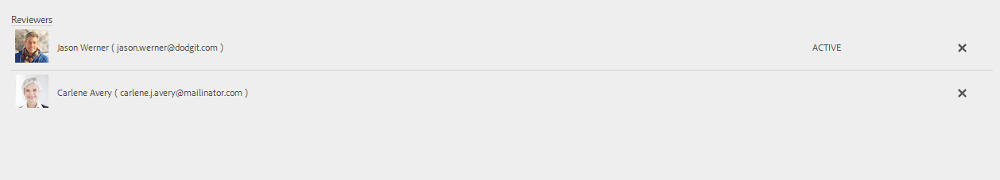

# Revisies maken en beheren op formulieren{#creating-and-managing-reviews-to-forms}

 Adobe beveelt aan moderne en uitbreidbare gegevensvastlegging te gebruiken [Kernonderdelen](https://experienceleague.adobe.com/docs/experience-manager-core-components/using/adaptive-forms/introduction.html) for [nieuwe Adaptieve Forms maken](/help/forms/creating-adaptive-form-core-components.md) of [Aangepaste Forms toevoegen aan AEM Sites-pagina&#39;s](/help/forms/create-or-add-an-adaptive-form-to-aem-sites-page.md). Deze componenten betekenen een aanzienlijke vooruitgang in de aanmaak van Adaptive Forms en zorgen voor indrukwekkende gebruikerservaring. In dit artikel wordt een oudere aanpak beschreven voor auteur Adaptive Forms die gebruik maakt van stichtingscomponenten. 

| Versie | Artikelkoppeling |
| -------- | ---------------------------- |
| AEM 6,5 | [Klik hier](https://experienceleague.adobe.com/docs/experience-manager-65/forms/adaptive-forms-advanced-authoring/create-reviews-forms.html) |
| AEM as a Cloud Service | Dit artikel |

## Controleren {#review}

Een revisie is een mechanisme waarmee een of meer revisoren opmerkingen op formulieren kunnen plaatsen.

## Een revisie instellen {#setting-up-a-review}

1. Navigeer naar de browser met formulieren en selecteer een formulier dat u wilt bekijken.
1. Als het formulier geen revisie heeft, wordt een **Revisie starten**  wordt weergegeven op de actiebalk. Klik op de knop **Revisie starten**  pictogram.
1. Voer de volgende gegevens in:

   * **Titel**: Verplicht, kan alfanumerieke tekens, afbreekstreepje en onderstrepingsteken bevatten.
   * **Beschrijving**: Optioneel, beschrijving van het doel/de inhoud voor revisie.
   * **Deadline**: Optioneel, de datum waarop de revisie wordt beëindigd. Als de deadline is verstreken, wordt de taak weergegeven als &#39;Achterstallig&#39;.
   * **Naam revisor**: Een minimum van één is verplicht. Gebruik het keuzemenu om revisoren toe te voegen en typ een naamlijst met alle overeenkomende namen. Selecteer een naam en klik op **Toevoegen**. In het volgende gedeelte van het dialoogvenster **Revisoren** worden de namen van alle controleurs weergegeven.

1. Klik op de knop **Start** om een revisie te starten.

   >[!NOTE]
   >
   >* Beheerders hebben toegang tot alle groepen die aan de formuliergebruikers zijn gekoppeld.
   >* De gebruikersgroep van de dienst is niet beschikbaar aan selectie voor overzicht.

### Handelingen die worden uitgevoerd wanneer een revisie wordt ingesteld {#actions-that-occur-when-a-review-is-set-up}

In deze sectie wordt beschreven wat er gebeurt wanneer een revisie wordt gemaakt of ingesteld.

1. Er wordt een nieuwe revisietaak gemaakt en toegewezen aan de geselecteerde revisor.
1. Aan alle revisoren wordt een controletaak toegewezen. De taak wordt weergegeven in de sectie Meldingen. Een revisor kan op een melding klikken of naar het Postvak In gaan om de taak te bekijken. Een revisor kan op deze knop klikken om de revisietaak te openen, het formulier weer te geven en opmerkingen toe te voegen.

   

   Waarschuwing revisormelding

1. Het opmerkingenvak is beschikbaar voor de revisoren van het formulier. Anderen kunnen de opmerkingen wel lezen, maar niet hun eigen opmerkingen toevoegen.

## Een revisie beheren {#managing-a-review}

>[!NOTE]
>
>* Alleen lopende revisies kunnen worden gewijzigd.
>* Volledige revisies kunnen niet worden gewijzigd.

1. Navigeer naar het tabblad Formulieren en selecteer een formulier.

1. Als een formulier een revisie heeft die wordt uitgevoerd en u de aanvrager van de revisie bent, kunt u een **Revisie beheren**  wordt weergegeven in de actiebalk. Alleen de aanvrager van de revisie kan de revisie beheren (Bijwerken/beëindigen).

   Klik op de knop **Revisie beheren** pictogram.

   Voor andere gebruikers dan de aanvrager is het pictogram Revisie beheren uitgeschakeld.

1. Nu krijgt u een scherm dat informatie toont:

   * **Revisienaam**: Kan niet worden bewerkt.

   * **Beschrijving bekijken**: Beschikbaar voor bewerken.

   * **Herzieningstermijn**: Beschikbaar voor bewerken. U kunt de deadline wijzigen in elke datum en tijd na de huidige datum en tijd.

   * **Revisoren**: Beschikbaar voor bewerken. U kunt revisoren toevoegen of verwijderen. Als een taak te laat is, kunt u revisoren pas toevoegen nadat de deadline is verlengd na de huidige datum.

1. Klik op **Einde**.

### Handelingen die worden uitgevoerd wanneer een revisie wordt gewijzigd {#actions-that-occur-when-a-review-is-modified}

In deze sectie wordt beschreven wat er gebeurt met **Bijwerken/beëindigen controleren**:

1. Als de revisiebeschrijving wordt gewijzigd, worden de bijbehorende taak van de revisoren en de aanvrager bijgewerkt.
1. Als de deadline van de revisie wordt gewijzigd, wordt de bijbehorende taak voor de revisoren bijgewerkt met de nieuwe datum.

1. Als een revisor wordt verwijderd:

   

   Een revisor verwijderen

   1. Als onvolledig, wordt de toegewezen taak geëindigd.
   1. De revisor kan geen opmerkingen meer toevoegen aan het formulier.

1. Als een controleur wordt toegevoegd:

   

   Een revisor toevoegen

   1. Er wordt een revisietaak gemaakt en toegewezen aan de nieuwe revisor.
   1. De zojuist toegevoegde controleur kan opmerkingen over het formulier toevoegen.

1. Wanneer een revisie wordt beëindigd:

   1. **Revisoren**: Voor elke controleur wordt de onvolledige taak met betrekking tot de revisie beëindigd. De taak wordt niet meer weergegeven als &#39;In behandeling&#39; in de sectie Meldingen van de controleur.
   1. **Initiator**: De taak die is toegewezen aan de aanvrager van de revisie is gemarkeerd als voltooid. De taak wordt verwijderd uit de sectie Melding van de revisieaanvrager.
   1. **Alles**: De revisie wordt weergegeven in de sectie Vorige revisies. Er kunnen geen verdere opmerkingen worden toegevoegd.

   

## Zie ook {#see-also}

{{see-also}}

<!--

>[!MORELIKETHIS]
>
>* [Associating submission reviewers with a form](/help/forms/adding-reviewers-form.md)

-->