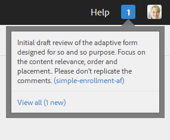

# Revisies voor elementen in formulieren maken en beheren{#creating-and-managing-reviews-for-assets-in-forms}

## Controleren {#review}

Een revisie is een mechanisme waarmee een of meer revisoren opmerkingen kunnen maken over een element dat beschikbaar is in een formulier.

## Een revisie instellen {#setting-up-a-review}

1. Navigeer naar het tabblad Forms en selecteer een formulier.
1. Als voor het element geen revisie wordt uitgevoerd, wordt een revisie starten  wordt weergegeven op de actiebalk. Klik op Revisie starten  pictogram.
1. Voer de volgende gegevens in:

   * Revisienaam: Verplicht, kan alfanumerieke karakters, koppelteken, of onderstrepingsteken bevatten.
   * Beschrijving bekijken: Optioneel, beschrijving van het doel/de inhoud ter controle.
   * deadline revisie: Facultatief, de datum waarop de herbeoordeling beëindigt. Als de deadline is verstreken, wordt de taak weergegeven als &#39;Achterstallig&#39;.
   * Revisoren: Een minimum van één is verplicht. Voeg revisoren toe met de keuzelijst met invoervak. Als u een naam typt, worden alle overeenkomende namen weergegeven. Selecteer een naam en klik op Toevoegen.

1. Vul alle resterende details in en klik op Start.

### Handelingen die worden uitgevoerd wanneer een revisie wordt ingesteld {#actions-that-occur-when-a-review-is-set-up}

In deze sectie wordt beschreven wat er gebeurt wanneer een revisie wordt gemaakt of ingesteld.

1. Er wordt een nieuwe revisietaak gemaakt en toegewezen aan de aanvrager van de revisie.
1. Aan alle revisoren wordt een controletaak toegewezen. De taak wordt weergegeven in de sectie Meldingen. Een revisor kan op een melding klikken of naar het Postvak In gaan om de taak te bekijken. Een revisor kan op deze knop klikken om de revisietaak te openen, het formulier te bekijken en opmerkingen toe te voegen.

   

   Waarschuwing revisormelding

1. Het commentaarvakje is beschikbaar aan de initiatiefnemer en de recensenten van de activa. Anderen kunnen de opmerkingen wel weergeven, maar kunnen geen opmerkingen schrijven.

## Een revisie beheren {#managing-a-review}

>[!NOTE]
>
>Alleen lopende revisies kunnen worden gewijzigd. Volledige revisies kunnen niet worden gewijzigd.

1. Navigeer naar het tabblad Forms en selecteer een formulier.

1. Als een element een revisie in uitvoering heeft en u de aanvrager van de revisie bent, voert u een revisie beheren uit  worden weergegeven in de actiebalk. Alleen revisieaanvrager kan de revisie beheren (bijwerken/beëindigen).

   Klik op Revisie beheren pictogram.

   Voor andere gebruikers dan de aanvrager is het pictogram Revisie beheren uitgeschakeld.

1. U krijgt een scherm dat informatie toont:

   * **Revisienaam**: Kan niet worden bewerkt.

   * **Beschrijving bekijken**: Beschikbaar voor bewerken.

   * **Herzieningstermijn**: Beschikbaar voor bewerken. U kunt de deadline wijzigen in elke datum en tijd na de huidige datum en tijd.

   * **Revisoren**: Beschikbaar voor bewerken. U kunt revisoren toevoegen of verwijderen. Als een taak te laat is, kunt u revisoren pas toevoegen nadat de deadline is verlengd na de huidige datum.

1. Bewerk de benodigde velden en klik op Bijwerken.

   

   Bijgewerkte status controleren in Taakbeheer

1. Klik op Einde om de revisie te beëindigen.

### Handelingen die worden uitgevoerd wanneer een revisie wordt gewijzigd {#actions-that-occur-when-a-review-is-modified}

In deze sectie wordt beschreven wat er gebeurt bij het einde/de wijziging van de revisie:

1. Als de beschrijving van de revisie wordt gewijzigd, worden de overeenkomstige taak van de revisoren en de aanvrager bijgewerkt.
1. Als de deadline van de revisie wordt gewijzigd, wordt de bijbehorende taak voor de revisoren bijgewerkt met de nieuwe datum.

1. Als een revisor wordt verwijderd:

   

   Een revisor verwijderen

   1. Als onvolledig, wordt de toegewezen taak geëindigd.
   1. De controleur kan geen opmerkingen meer maken over het element.

1. Als een controleur wordt toegevoegd:

   

   Een revisor toevoegen

   1. Er wordt een revisietaak gemaakt en toegewezen aan de nieuwe revisor.
   1. De zojuist toegevoegde controleur kan opmerkingen toevoegen voor het element.

1. Wanneer een revisie wordt beëindigd:

   1. **Revisoren**: Voor elke controleur wordt de onvolledige taak met betrekking tot de revisie beëindigd. De taak wordt niet meer weergegeven als &#39;In behandeling&#39; in de sectie Meldingen van de controleur.
   1. **Initiator**: De taak die is toegewezen aan de aanvrager van de revisie is gemarkeerd als voltooid. De taak wordt verwijderd uit de sectie Melding van de revisieaanvrager.
   1. **Alles**: De revisie wordt weergegeven in de sectie Vorige revisies. Er kunnen geen verdere opmerkingen worden toegevoegd.

