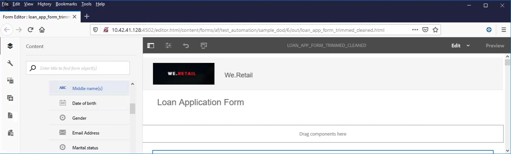

# Toegankelijke adaptieve Forms maken{#creating-accessible-adaptive-forms}

## Inleiding {#introduction}

Een toegankelijk formulier is een formulier dat iedereen kan gebruiken, inclusief gebruikers met speciale behoeften. Adaptieve Forms bevat verschillende functies en mogelijkheden die de bruikbaarheid voor gebruikers met verschillende mogelijkheden verbeteren. Door toegankelijkheid in Adaptive Forms te creëren, is niet alleen een zo breed mogelijk publiek voor inhoud mogelijk, maar is het ook een vereiste bij het verstrekken van documenten in geografische gebieden waar naleving van toegankelijkheidsnormen verplicht is. [!DNL AEM Forms] Help formulierontwikkelaars om aan de toegankelijkheidsstandaarden te voldoen.

Tijdens het ontwerpen van een adaptief formulier moet de auteur de volgende punten in overweging nemen om toegankelijke adaptieve formulieren te maken:

* Controleer het formulier met het hulpprogramma voor toegankelijkheidstests voor de ANDI (Accessible Name and Description Inspector)
* Geef juiste labels voor formulierbesturingselementen
* Verstrek tekstequivalenten voor beelden
* Geef voldoende kleurcontrast op
* Zorg ervoor dat formulierbesturingselementen via het toetsenbord toegankelijk zijn

## Vereiste

U vereist een toegankelijkheidshulpmiddel zoals **Toegankelijke Inspecteur van de Naam en van de Beschrijving (ANDI)** en een **Adaptief thema van de Vorm dat wordt ontwikkeld om toegankelijkheid verwante kwesties** te bevestigen om een toegankelijke Aangepaste Vorm tot stand te brengen.

### Gereedschap voor toegankelijkheidstesten downloaden en installeren

Met het hulpprogramma ANDI (Accessible Name and Description Inspector) kunt u compatibiliteitsproblemen met betrekking tot toegankelijkheid in webinhoud opsporen en verhelpen. Dit is het aanbevolen gereedschap onder de richtlijnen Trusted Tester v5 van het Department of Homeland Security. Het is ontwikkeld door de afdeling Sociale &#x200B; van de Verenigde Staten om te controleren of Section 508 de webinhoud in acht neemt. Het gereedschap:

* Hiermee kunt u toegankelijkheidsproblemen &#x200B; op een webpagina detecteren
* Biedt suggesties om de &#x200B; voor toegankelijkheid te verbeteren
* Detecteert problemen met toetsenbordtoegankelijkheid en kleurcontrast
* Hiermee wordt de inhoud van de schermlezer duidelijk geïdentificeerd in overeenstemming met de normen

ANDI werkt met alle grote internetbrowsers. Zie, {de documentatie van 0} ANDI [&#128279;](https://www.ssa.gov/accessibility/andi/help/install.html) voor gedetailleerde instructies om het hulpmiddel te vormen en te gebruiken.

### Download en installeer het Ultramarine-Toegankelijke thema

Het Ultramarijn-Toegankelijke thema is een verwijzingsthema. Hiermee kunt u demonstreren hoe u kleurcontrast en andere toegankelijkheidsgerelateerde problemen in een adaptief formulier kunt oplossen. Adobe raadt u aan een aangepast thema voor de productieomgeving te maken op basis van de stijlen die door uw organisatie zijn goedgekeurd. Voer de volgende stappen uit om het thema naar uw AEM-exemplaar te uploaden:

1. Download het themapakket.
1. Navigeer aan **[!UICONTROL Experience Manager]** > **[!UICONTROL Navigation]**  > **[!UICONTROL Forms]** op uw AEM instantie.
1. Selecteer **[!UICONTROL Create]** > **[!UICONTROL File Upload]** . Selecteer en upload het bestand x Ultramarine-Accessible-Theme.zip. Het thema wordt geüpload naar uw AEM.

## Een adaptief formulier toegankelijk maken

U moet de nadruk leggen op vier belangrijke aspecten: toetsenbordnavigatie, kleurcontrast, betekenisvolle alternatieve tekst voor afbeeldingen en geschikte labels voor formulierbesturingselementen om een adaptief formulier toegankelijk te maken. Voer de volgende stappen uit om uw bestaande Adaptive Forms toegankelijk te maken:

### 1. Pas een toegankelijk thema toe en voer aanvullende oplossingen uit

Pas het Ultramarijn-Toegankelijke thema op uw bestaande AanpassingsVorm toe. Het thema toepassen:

1. Open het adaptieve formulier voor bewerking.
1. Selecteer een component en selecteer het bovenliggende pictogram. Selecteer **[!UICONTROL Adaptive Form Container]** in het contextmenu en selecteer vervolgens het pictogram voor configureren.
1. Selecteer het thema Ultramarijn-Toegankelijk in de eigenschappenbrowser en selecteer **[!UICONTROL Save]** pictogram.
1. Vernieuw het browservenster. Het thema wordt toegepast op het adaptieve formulier.

Nadat u een toegankelijk thema hebt toegepast, voert u de onderstaande aanvullende oplossingen uit. De oplossingen zijn naast toegankelijkheidsoplossingen die in het toegankelijke thema worden behandeld:

1. Voeg een betekenisvolle alternatieve tekst voor de logoafbeelding toe in het adaptieve formulier.

   Geef een betekenisvolle alternatieve tekst op voor afbeeldingen in kop- en voettekstcomponenten van de sjabloon Adaptief formulier. Wanneer u de sjabloon herstelt en gebruikt om een adaptief formulier te maken, neemt de Adaptief Forms alle correcties over die betrekking hebben op toegankelijkheid en die worden toegepast op de kop- en voettekst van de sjabloon.  Breng voor een bestaand adaptief formulier wijzigingen aan op het niveau van het adaptieve formulier. Wijzigingen die u aanbrengt in een adaptief formuliersjabloon, worden niet automatisch doorgevoerd in een bestaand adaptief formulier.

1. Voeg een koptekstcomponent met formuliernaam toe aan het adaptieve formulier. Als in uw formulierontwerp een bedrijfsnaam is opgegeven, voegt u ook een aparte kopcomponent voor de bedrijfsnaam toe.

   De meeste toegankelijkheidsfuncties informeren gebruikers over de hiërarchie van de inhoud, zodat ze de structuur van de webpagina beter kunnen begrijpen. Stel verschillende kopniveaus in voor de naam van de organisatie en de tekst voor de naam van het formulier in het adaptieve formulier om deze tekst een hiërarchische structuur te geven. Gebruik bovendien een tekstcomponent voor elk deelvenster en elke sectie met een geschikt kopniveau om een hiërarchie te maken.

   

1. Wijzig de achtergrondkleur van de voettekst om het juiste contrast te gebruiken in overeenstemming met de toegankelijkheidsnormen om de zichtbaarheid en leesbaarheid van de tekst te verbeteren. U kunt ANDI gebruiken om problemen met kleurcontrast in uw formulier te zoeken. Gebruik ook geen erg klein lettertype. Kleine lettertypen zijn moeilijk leesbaar.

1. Vervang de onderdelen switch en imagekeuze in het bestaande adaptieve formulier door keuzeselectie (radio).

1. Vervang de numerieke stapfunctie in het bestaande adaptieve formulier door een numerieke box-component.

1. Datuminvoerveld vervangen door datumkiezerveld.

1. Stel de weergave-, validatie- en bewerkingspatronen in voor de component met de datumkiezer. Stel ook een aangepast foutbericht voor validatie in. U hebt bijvoorbeeld een ongeldige datum opgegeven. De juiste notatie voor de datum is YYYY-MM-DD.

1. Stel aangepaste toegankelijkheidstekst in voor de component met de datumkiezer. Voer bijvoorbeeld uw geboortedatum in. Schermlezers lezen deze aangepaste toegankelijkheidsteksten.

1. Gebruik een korte beschrijving in plaats van een lange beschrijving voor componenten van een adaptieve vorm. Een lange beschrijving voegt hulpknoop toe. Controleer of het adaptieve formulier geen knop Help heeft.

1. Voeg aangepaste toegankelijkheidstekst toe aan alle alleen-lezen cellen in tabellen. Schakel ook alle alleen-lezen cellen van tabellen uit.

1. Verwijder eventuele scripthandtekeningvelden uit het adaptieve formulier. Configureer het adaptieve formulier zodat u [!DNL Adobe Sign] kunt gebruiken voor een naadloze digitale ondertekeningservaring.

### 2. Geef juiste labels voor formulierbesturingselementen {#provide-proper-labels-for-form-controls}

Met het label of de titel van een component wordt aangegeven wat de formuliercomponent vertegenwoordigt. De tekst Voornaam geeft bijvoorbeeld aan dat gebruikers hun voornaam in een tekstveld moeten invoeren. Om door schermlezers toegankelijk te zijn, wordt het label programmatisch gekoppeld aan een formuliercomponent. Alternatief, wordt de vormcontrole gevormd met extra toegankelijkheidsinformatie.

Het label dat door schermlezers wordt waargenomen, hoeft niet noodzakelijkerwijs hetzelfde te zijn als het visuele bijschrift. In sommige gevallen, kunt u specifieker over het doel van de controle willen zijn. Voor elk veldobject in een formulier kunnen de toegankelijkheidsopties worden gebruikt om op te geven wat de schermlezer aankondigt om het specifieke formulierveld te identificeren.

Voer de volgende stappen uit om de optie Toegankelijkheid te gebruiken:

1. Selecteer een component en selecteer .
1. Klik op **[!UICONTROL Accessibility]** in het zijpaneel om de gewenste toegankelijkheidsoptie te kiezen.

### Toegankelijkheidsopties in formuliercomponenten {#accessibility-options-in-form-components}

**de auteurs van de Vorm van de Tekst van 0&rbrace; de Douane van de Tekst van de Tekst van de Tekst van de Tekst van de Aangepast van de 0&rbrace; &lbrace;.** De ondersteunende hulpmiddelen, zoals schermlezers, gebruiken deze aangepaste tekst. Het gebruiken van het plaatsen van de Titel is de beste optie in een meerderheid van de scenario&#39;s. U kunt bijvoorbeeld alleen aangepaste schermtekst maken als Titel of korte beschrijving niet mogelijk is.

**Korte beschrijving** voor een meerderheid van de componenten, verschijnt de korte beschrijving bij runtime wanneer de gebruiker de wijzer over de component beweegt. U kunt deze optie instellen in het veld Korte beschrijving onder de optie Help-inhoud.

**Titel** Gebruik deze optie om [!DNL AEM Forms] het visuele etiket te laten gebruiken verbonden aan het vormgebied als het schermlezertekst.

**Naam** U kunt een waarde op het gebied van de Naam van het Bindende lusje specificeren. De naam mag geen spaties bevatten.

**niets** het Selecteren van niets veroorzaakt het vormvoorwerp om geen naam in de gepubliceerde vorm te hebben. Geen is een aanbevolen instelling voor formulierbesturingselementen.

>[!NOTE]
>
>* Keuzerondje en selectievakje kunnen slechts twee toegankelijkheidsopties hebben, namelijk Aangepaste tekst en Titel.
>* Voor op XFA gebaseerde Adaptieve Forms wordt de toegankelijkheidsoptie overgenomen van de toegankelijkheidsopties die zijn ingesteld in de XDP. Knopinfo van XDP wordt toegewezen aan Korte beschrijving en Bijschrift wordt toegewezen aan Titel. De andere opties werken zoals is.

### 3. Verstrek tekstequivalenten voor afbeeldingen {#provide-text-equivalents-for-images}

Afbeeldingen kunnen sommige gebruikers helpen het begrip te verbeteren. Voor gebruikers die schermlezers gebruiken, verminderen afbeeldingen echter de toegankelijkheid van het formulier. Als u ervoor kiest om afbeeldingen te gebruiken, geef dan tekstbeschrijvingen op voor alle afbeeldingen.

Zorg ervoor dat in de tekst het object en het doel ervan in het formulier worden beschreven. Een schermlezer leest deze alternatieve tekst wanneer een afbeelding wordt aangetroffen. Voor een afbeelding moet altijd een alternatieve tekst worden opgegeven.

Selecteer een beeldcomponent en selecteer . Geef in het zijpaneel onder Eigenschappen alternatieve tekst op voor een afbeelding.

### 4. Geef voldoende kleurcontrast op {#provide-sufficient-color-contrast}

Bij het ontwerpen van toegankelijkheid moet u rekening houden met aanvullende richtlijnen voor kleurgebruik. Auteurs van formulieren kunnen kleuren gebruiken om de weergave van formulieren te verbeteren door verschillende formuliercomponenten te markeren. Onjuist gebruik van kleur kan een formulier echter moeilijk of onmogelijk leesbaar maken voor mensen met verschillende mogelijkheden.

Gebruikers met een visuele handicap vertrouwen op een hoog contrast tussen tekst en de achtergrond voor het lezen van digitale inhoud. Zonder voldoende contrast kan een formulier moeilijk, zo niet onmogelijk, leesbaar worden voor sommige gebruikers.

U wordt aangeraden het standaardfont en de standaardachtergrondkleuren te gebruiken, namelijk de zwarte inhoud op een witte achtergrond. Als u de standaardkleuren wijzigt, kiest u een donkere voorgrondkleur op een lichte achtergrondkleur of omgekeerd.

<!-- See [Creating custom themes for Adaptive Forms](creating-custom-adaptive-form-themes.md), for more information about changing the color contrast and theme for the Adaptive Forms. -->

### 5. Zorg ervoor dat formulierbesturingselementen via het toetsenbord toegankelijk zijn {#ensure-that-form-controls-are-keyboard-accessible}

Een toegankelijk formulier kan volledig worden ingevuld met alleen het toetsenbord of een vergelijkbaar invoerapparaat. Gebruikers met een beperkte mobiliteit of een visuele handicap hebben wellicht geen andere keuze dan het toetsenbord te gebruiken en veel gebruikers die een muis kunnen gebruiken, geven de voorkeur aan invoer via het toetsenbord. Door de verschillende invoermethoden toe te staan, maakt u niet alleen toegankelijke formulieren, maar ook formulieren die beter zijn afgestemd op de voorkeuren van alle gebruikers.

De volgende sneltoetsen zijn beschikbaar in [!DNL AEM Forms] .

| Handeling | Sneltoets |
|---|---|
| De cursor door een formulier verplaatsen | Tab |
| De cursor achterwaarts door een formulier verplaatsen | Shift+Tab |
| Naar volgend deelvenster gaan | Alt+Pijl-rechts |
| Naar het vorige deelvenster gaan | Alt+Pijl-links |
| De gevulde gegevens in een formulier opnieuw instellen | Alt+R |
| Een formulier verzenden | Alt+S |

Daarnaast zijn er verschillende sneltoetsen beschikbaar voor de component **[!UICONTROL Date Picker]** in Adaptief Forms. Om de kortere wegsleutels toe te laten, selecteer de **[!UICONTROL Date Picker]** component en selecteer  om de eigenschappen te openen. Selecteer in de sectie **[!UICONTROL Patterns]** een weergavepatroon met de vervolgkeuzelijsten **[!UICONTROL Type]** en **[!UICONTROL Pattern]** . Sla de eigenschappen op om het gebruik van sneltoetsen voor de component **[!UICONTROL Date Picker]** in te schakelen.

De volgende sneltoetsen zijn beschikbaar voor de component Date Picker in Adaptive Forms:

| Handeling | Sneltoets |
|---|---|
| <ul><li>De opties van de component Date Picker weergeven wanneer de tabfocus het kalenderpictogram markeert</li><li>De gebeurtenis click uitvoeren wanneer de tabfocus een optie markeert</li> | Ruimte of Enter |
| De opties van de component Datumkiezer verbergen | Esc |
| <ul><li>Verplaats de cursor vooruit door de opties in de component Datumkiezer.</li><li>Tabfocus instellen op kalenderpictogram wanneer datuminvoerveld actief is</li> | Tab |
| De cursor achterwaarts verplaatsen met de opties die beschikbaar zijn in de component Datumkiezer | Shift+Tab |
| <ul><li>De opties van de component Date Picker weergeven wanneer de tabfocus het invoerveld voor de datum markeert</li><li>De cursor omlaag verplaatsen in de kalender die beschikbaar is in de component Datumkiezer</li> | Pijl-omlaag |
| De cursor omhoog verplaatsen in de kalender die beschikbaar is in de component Datumkiezer | Pijl-omhoog |
| De cursor achterwaarts verplaatsen in de kalender die beschikbaar is in de component Date Picker | Pijl-links |
| De cursor vooruit verplaatsen in de kalender die beschikbaar is in de component Date Picker | Pijl-rechts |
| Voer de handeling uit voor het bijschrift dat beschikbaar is tussen rechter- en linkernavigatiepijlen in de kalender | Shift + Pijl-omhoog |
| Voer de actie voor het pictogram van de juiste navigatiepijl  beschikbaar in de kalender uit | Shift + Pijl-links |
| Voer de actie voor het linker pictogram van de navigatiepijl  beschikbaar in de kalender uit | Shift + Pijl-rechts |

## Gebruik het gereedschap Toegankelijkheid om resterende toegankelijkheidsproblemen te zoeken

Met de Accessible Name and Description Inspector (ANDI) kunt u compatibiliteitsproblemen met betrekking tot toegankelijkheid identificeren en corrigeren in een adaptief formulier. Met ANDI de toegankelijkheidsproblemen in een adaptief formulier zoeken:

1. Open het Adaptief formulier in de voorbeeldmodus.
1. Klik op het pictogram van het gereedschap ANDI met bladwijzer. Het ANDI-gereedschap analyseert het adaptieve formulier en geeft toegankelijkheidsproblemen weer. Voor details op hoe te om het hulpmiddel te gebruiken, zie {de documentatie van 0} ANDI [&#128279;](https://www.ssa.gov/accessibility/andi/help/howtouse.html).
1. De door ANDI gemelde problemen beoordelen en oplossen.
