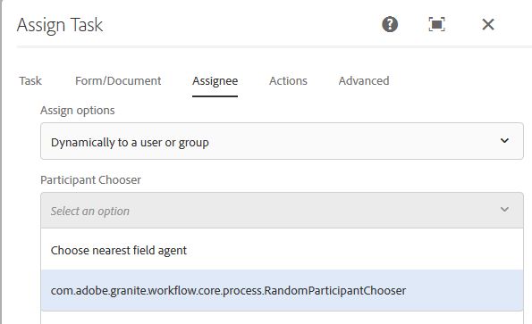

# Dynamische selectie van gebruiker of groep in AEM workflow {#dynamically-select-a-user-or-group-for-aem-forms-centric-workflow-steps}

Leer hoe u een gebruiker of groep selecteert voor een [!DNL AEM Forms] -workflow tijdens de runtime.

In grote organisaties, zijn er vereisten om gebruikers voor een proces dynamisch te selecteren. Bijvoorbeeld, die een gebiedsagent selecteren om een klant te dienen die op de nabijheid van de agent aan de klant wordt gebaseerd. In zulk een scenario, wordt de agent dynamisch geselecteerd.

Wijs taak toe en [!DNL Adobe Sign] stappen van [ Forms-centric werkschema&#39;s op OSGi ](aem-forms-workflow.md) verstrekken opties om een gebruiker dynamisch te selecteren. U kunt ECMAScript of bundels OSGi gebruiken om een toegewezen voor de stap van de Taak van de Taak dynamisch te selecteren of ondertekenaars voor de stap van het Document van het Document van de Ondertekening te selecteren.

## ECMAScript gebruiken om een gebruiker of groep dynamisch te selecteren {#use-ecmascript-to-dynamically-select-a-user-or-group}

ECMAScript is een scripttaal. Het wordt gebruikt voor client-side scripting en servertoepassingen. Voer de volgende stappen uit om een gebruiker of een groep dynamisch te selecteren met ECMAScript:

1. Open CRXDE Lite. De URL is `https://'[server]:[port]'/crx/de/index.jsp`
1. Maak een bestand met de extensie .ecma op het volgende pad. Als het pad (de knooppuntstructuur) niet bestaat, maakt u het:

   * (Pad voor taakstap toewijzen) `/apps/fd/dashboard/scripts/participantChooser`
   * (Pad voor stap Handtekening) `/apps/fd/workflow/scripts/adobesign`

1. Voeg ECMAScript, dat de logica aan dynamisch het selecteren van een gebruiker, aan het .ecma dossier heeft. Klik op **[!UICONTROL Save All]**.

   Voor steekproefmanuscripten, zie [ Steekproef ECMAScripts voor dynamisch het selecteren van een gebruiker of een groep ](dynamically-select-a-user-or-group-for-aem-workflow.md#sample-ecmascripts-to-dynamically-choose-a-user-or-a-group).

1. Voeg weergavenaam van het script toe. Deze naam wordt weergegeven in workflowstappen. De naam opgeven:

   1. Vouw het scriptknooppunt uit, klik met de rechtermuisknop op het knooppunt **[!UICONTROL jcr:content]** en klik op **[!UICONTROL Mixins]** .
   1. Voeg het `mix:title` bezit in Edit de dialoog van Mixins toe en klik **O.K.**.
   1. Voeg de volgende eigenschap toe aan het knooppunt jcr:content van het script:

      | Naam | Type | Waarde |
      |--- |--- |--- |
      | jcr:titel | String | Geef de naam van het script op. Kies bijvoorbeeld de dichtstbijzijnde veldagent. Deze naam wordt weergegeven in de stappen Taak toewijzen en Document ondertekenen. |

   1. Klik **sparen allen**. Het script wordt beschikbaar voor selectie in de componenten van AEM Workflow.

      

### Voorbeeld van ECMAScripts om dynamisch een gebruiker of een groep te kiezen {#sample-ecmascripts-to-dynamically-choose-a-user-or-a-group}

In het volgende voorbeeld van ECMAScript wordt dynamisch een toegewezen voor de stap Taak toewijzen geselecteerd. In dit script wordt een gebruiker geselecteerd op basis van het pad van de lading. Voordat u dit script gebruikt, moet u ervoor zorgen dat alle gebruikers die in het script worden vermeld, in AEM aanwezig zijn. Als de gebruikers die in het script worden vermeld, niet in AEM bestaan, kan het gerelateerde proces mislukken.

```javascript
function getParticipant() {

var workflowData = graniteWorkItem.getWorkflowData();

if (workflowData.getPayloadType() == "JCR_PATH") { 

var path = workflowData.getPayload().toString(); 
     if (path.indexOf("/content/geometrixx/en") == 0) {
    return "user1";
    } 
   else {
              return "user2";
            }
}
}
```

In het volgende voorbeeld van ECMAScript wordt dynamisch een toegewezen voor de stap [!DNL Adobe Sign] geselecteerd. Controleer voordat u het onderstaande script gebruikt of de gebruikersgegevens (e-mailadressen en telefoonnummers) in het script juist zijn. Als de gebruikersgegevens in het script onjuist zijn, kan het gerelateerde proces mislukken.

>[!NOTE]
>
>Wanneer u ECMAScript voor [!DNL Adobe Sign] gebruikt, moet het script zich in de crx-opslagplaats op /apps/fd/workflow/scripts/adobesign/ bevinden en moet het een functie met de naam getAdobeSignRecipients hebben om een lijst met gebruikers te retourneren.

```javascript
function getAdobeSignRecipients() {

    var recipientSetInfos = new Packages.java.util.ArrayList();

    var recipientInfoSet = new com.adobe.aem.adobesign.recipient.RecipientSetInfo();
    var recipientInfoList = new Packages.java.util.ArrayList();
    var recipientInfo = new com.adobe.aem.adobesign.recipient.RecipientInfo();

    var email;
    var recipientAuthenticationMethod = com.adobe.aem.adobesign.recipient.RecipientAuthenticationMethod.PHONE;  
    //var recipientAuthenticationMethod = com.adobe.aem.adobesign.recipient.RecipientAuthenticationMethod.NONE;
    var securityOptions = null;

    var phoneNumber = "123456789";
    var countryCode = "+1";
    var recipientPhoneInfo = new Array();
    recipientPhoneInfo.push(new com.adobe.aem.adobesign.recipient.RecipientPhoneInfo(phoneNumber, countryCode));

     securityOptions = new com.adobe.aem.adobesign.recipient.RecipientSecurityOption(recipientAuthenticationMethod, recipientPhoneInfo , null);
    
    email = "example@example.com";
    
    recipientInfo.setEmail(email);
    recipientInfo.setSecurityOptions(securityOptions);
    
    recipientInfoList.add(recipientInfo);
    recipientInfoSet.setMemberInfos(recipientInfoList);
    recipientSetInfos.add(recipientInfoSet);

    return recipientSetInfos;

}
```

## Java-interface gebruiken om een gebruiker of groep dynamisch te kiezen {#use-java-interface-to-dynamically-choose-a-user-or-group}

U kunt de ](https://developer.adobe.com/experience-manager/reference-materials/6-5/forms/javadocs/com/adobe/fd/workflow/adobesign/api/RecipientInfoSpecifier.html) interface van Java gebruiken 0} RecipientInfoSpecifier {om een gebruiker of een groep voor [!DNL Adobe Sign] dynamisch te kiezen en de stappen van de Taak toe te wijzen. [ U kunt een bundel tot stand brengen OSGi die het gebruik [ RecipientInfoSpecifier ](https://developer.adobe.com/experience-manager/reference-materials/6-5/forms/javadocs/com/adobe/fd/workflow/adobesign/api/RecipientInfoSpecifier.html) Java interface gebruikte en het aan de [!DNL AEM Forms] server opstelt. Hiermee maakt u de optie beschikbaar voor selectie in de componenten Taak toewijzen en [!DNL Adobe Sign] van AEM workflow.

U vereist ](https://experienceleague.adobe.com/docs/experience-manager-release-information/aem-release-updates/forms-updates/aem-forms-releases.html) jar van SDK van 0} Cliënt en [ granite jar ](https://repo1.maven.org/maven2/com/adobe/granite/com.adobe.granite.workflow.api/1.0.2/) dossiers om de hieronder vermelde codesteekproef te compileren. [[!DNL AEM Forms]  Voeg deze jar dossiers als externe gebiedsdelen aan het OSGi bundelproject toe. U kunt om het even welke winde van Java gebruiken om een bundel te creëren OSGi. De volgende procedure verstrekt stappen om Eclipse te gebruiken om een bundel te creëren OSGi:

1. Open Eclipse IDE. Navigeer naar **[!UICONTROL File]** > **[!UICONTROL New Project]** .
1. Selecteer **[!UICONTROL Maven Project]** in het scherm Selecteer een wizard en klik op **[!UICONTROL Next]** .
1. Voor het Nieuwe Maven project, houd gebreken, en klik **[!UICONTROL Next]**. Selecteer een archetype en klik op **[!UICONTROL Next]** . Bijvoorbeeld maven-archetype-quickstart. Geef **[!UICONTROL Group Id]** , **[!UICONTROL Artifact Id]** , **[!UICONTROL version]** en **[!UICONTROL package]** op voor het project en klik op **[!UICONTROL Finish]** . Het project wordt gemaakt.
1. Open het bestand pom.xml voor bewerking en vervang alle inhoud van het bestand door:

   ```xml
   <project xmlns="https://maven.apache.org/POM/4.0.0" xmlns:xsi="https://www.w3.org/2001/XMLSchema-instance"
       xsi:schemaLocation="https://maven.apache.org/POM/4.0.0 https://maven.apache.org/xsd/maven-4.0.0.xsd">
       <modelVersion>4.0.0</modelVersion>
   
       <groupId>getAgent</groupId>
       <artifactId>assignToAgent</artifactId>
       <version>1.0</version>
       <packaging>bundle</packaging><!-- packaging type bundle is must -->
   
       <name>assignToAgent</name>
       <url>https://maven.apache.org</url>
       <repositories>
           <repository>
               <id>adobe</id>
               <name>Adobe Public Repository</name>
               <url>https://repo1.maven.org/maven2/com/adobe/</url>
               <layout>default</layout>
           </repository>
       </repositories>
       <pluginRepositories>
           <pluginRepository>
               <id>adobe</id>
               <name>Adobe Public Repository</name>
               <url>https://repo1.maven.org/maven2/com/adobe/</url>
               <layout>default</layout>
           </pluginRepository>
       </pluginRepositories>
   
       <dependencies>
           <dependency>
               <groupId>com.adobe.aemfd</groupId>
               <artifactId>aemfd-client-sdk</artifactId>
               <version>6.0.138</version>
           </dependency>
           <dependency>
               <groupId>com.adobe.granite</groupId>
               <artifactId>com.adobe.granite.workflow.api</artifactId>
               <version>1.0.0</version>
           </dependency>
   
           <dependency>
               <groupId>org.osgi</groupId>
               <artifactId>org.osgi.core</artifactId>
               <version>4.2.0</version>
               <scope>provided</scope>
           </dependency>
   
           <dependency>
               <groupId>org.apache.felix</groupId>
               <artifactId>org.apache.felix.scr.annotations</artifactId>
               <version>1.7.0</version>
   
           </dependency>
   
           <dependency>
               <groupId>org.apache.sling</groupId>
               <artifactId>org.apache.sling.api</artifactId>
               <version>2.2.0</version>
   
           </dependency>
   
       </dependencies>
   
       <!-- ====================================================================== -->
       <!-- B U I L D D E F I N I T I O N -->
       <!-- ====================================================================== -->
       <build>
           <plugins>
   
               <plugin>
                   <groupId>org.apache.felix</groupId>
                   <artifactId>maven-bundle-plugin</artifactId>
                   <extensions>true</extensions>
                   <configuration>
                       <instructions>
                           <Bundle-SymbolicName>com.aem.assigntoAgent-bundle</Bundle-SymbolicName>
                       </instructions>
                   </configuration>
               </plugin>
   
               <plugin>
                   <groupId>org.apache.felix</groupId>
                   <artifactId>maven-scr-plugin</artifactId>
                   <version>1.9.0</version>
                   <executions>
                       <execution>
                           <id>generate-scr-descriptor</id>
                           <goals>
                               <goal>scr</goal>
                           </goals>
                       </execution>
                   </executions>
               </plugin>
           </plugins>
       </build>
   
   </project>
   ```

1. Voeg broncode toe die [ RecipientInfoSpecifier ](https://developer.adobe.com/experience-manager/reference-materials/6-5/forms/javadocs/com/adobe/fd/workflow/adobesign/api/RecipientInfoSpecifier.html) interface van Java gebruikt om een gebruiker of een groep voor de Assign taakstap dynamisch te kiezen. Voor steekproefcode, zie [ Steekproef voor dynamisch het kiezen van een gebruiker of een groep gebruikend de interface van Java ](#-sample-scripts-for).
1. Open een bevelherinnering en navigeer aan de folder die het OSGi bundelproject bevat. Gebruik het volgende bevel om de bundel te creëren OSGi:

   `mvn clean install`

1. Upload de bundel naar een [!DNL AEM Forms] -server. Met AEM pakketbeheer kunt u de bundel importeren naar de [!DNL AEM Forms] -server.

Nadat de bundel is geïmporteerd, wordt de optie om de Java-interface te kiezen voor het dynamisch selecteren van een gebruiker of een groep beschikbaar in Adobe Sign en Taakstappen toewijzen.

### Voorbeeld van Java-code om dynamisch een gebruiker of groep te kiezen {#sample-java-code-to-dynamically-choose-a-user-or-a-group}

In de volgende voorbeeldcode wordt dynamisch een toewijzing voor de Adobe Sign-stap gekozen. U gebruikt de code in een bundel OSGi. Controleer voordat u de onderstaande code gebruikt of de gebruikersgegevens (e-mailadressen en telefoonnummers) in de code juist zijn. Als de gebruikersinformatie in de code wordt vermeld onjuist is, kan het verwante proces ontbreken.

```java
/*************************************************************************

 *
 * ADOBE CONFIDENTIAL
 * __________________
 *
 * Copyright 2016 Adobe Systems Incorporated
 * All Rights Reserved.
 *
 * NOTICE:  All information contained herein is, and remains
 * the property of Adobe Systems Incorporated and its suppliers,
 * if any.  The intellectual and technical concepts contained
 * herein are proprietary to Adobe Systems Incorporated and its
 * suppliers and are protected by trade secret or copyright law.
 * Dissemination of this information or reproduction of this material
 * is strictly forbidden unless prior written permission is obtained
 * from Adobe Systems Incorporated.
 **************************************************************************/
 
package com.aem.impl;

import java.util.ArrayList;
import java.util.List;

import com.adobe.aem.adobesign.recipient.RecipientAuthenticationMethod;
import com.adobe.aem.adobesign.recipient.RecipientInfo;
import com.adobe.aem.adobesign.recipient.RecipientPhoneInfo;
import com.adobe.aem.adobesign.recipient.RecipientSecurityOption;
import com.adobe.aem.adobesign.recipient.RecipientSetInfo;
import com.adobe.fd.workflow.adobesign.api.RecipientInfoSpecifier;
import com.adobe.granite.workflow.WorkflowException;
import com.adobe.granite.workflow.WorkflowSession;
import com.adobe.granite.workflow.exec.WorkItem;
import com.adobe.granite.workflow.metadata.MetaDataMap;
import org.apache.felix.scr.annotations.Component;
import org.apache.felix.scr.annotations.Service;

/**
 * <code>DummyRecipientInfoSpecifier implementation. A sample code to write implementation of RecipientInfoSpecifier to choose recipients/code>...
 */
@Service

@Component(metatype = false)
public class DummyRecipientChoser implements RecipientInfoSpecifier {
    public List<RecipientSetInfo> getAdobeSignRecipients(WorkItem workItem, WorkflowSession workflowSession, MetaDataMap args) throws WorkflowException {

        List<RecipientSetInfo> recipientSetInfos = new ArrayList<RecipientSetInfo>();

                //First Recipient

                RecipientSetInfo recipientInfoSet1 = new RecipientSetInfo();
                List<RecipientInfo> recipientInfoList = new ArrayList<RecipientInfo>();
                RecipientInfo recipientInfo1 = new RecipientInfo();//Member to first recipient

                String email;

                RecipientAuthenticationMethod recipientAuthenticationMethod = RecipientAuthenticationMethod.WEB_IDENTITY;
                RecipientSecurityOption securityOptions = null;

                String phoneNumber = "123456789";
                String countryCode = "+1";
                RecipientPhoneInfo[] recipientPhoneInfo = new RecipientPhoneInfo[1];  //if multiple phone numbers, size>1
                recipientPhoneInfo[0] = new RecipientPhoneInfo(phoneNumber, countryCode);
                securityOptions = new RecipientSecurityOption(recipientAuthenticationMethod, recipientPhoneInfo , null);
                 
                email = "example@example.com";

                recipientInfo1.setEmail(email);
                recipientInfo1.setSecurityOptions(securityOptions);

                recipientInfoList.add(recipientInfo1);  //Add member

                recipientInfoSet1.setMemberInfos(recipientInfoList);

                //Second Recipient

                RecipientSetInfo recipientInfoSet2 = new RecipientSetInfo();
                List<RecipientInfo> recipientInfoList2 = new ArrayList<RecipientInfo>();

                recipientAuthenticationMethod = RecipientAuthenticationMethod.PHONE;
                securityOptions = null;
                 
                phoneNumber = "987654321";//"0123456789";

                countryCode = "+1";
                RecipientPhoneInfo[] recipientPhoneInfo_1 = new RecipientPhoneInfo[1];
                recipientPhoneInfo_1[0] = new RecipientPhoneInfo(phoneNumber, countryCode);
                securityOptions = new RecipientSecurityOption(recipientAuthenticationMethod, recipientPhoneInfo_1 , null);
                 
                email = "example2@example.com";//"dummymail2@domain.com";

                RecipientInfo recipientInfo2  = new RecipientInfo();
                recipientInfo2.setEmail(email);
                recipientInfo2.setSecurityOptions(securityOptions);

                recipientInfoList2.add(recipientInfo2);  //Add member

                recipientInfoSet2.setMemberInfos(recipientInfoList2);

                //*********************************

                recipientSetInfos.add(recipientInfoSet1); 
                recipientSetInfos.add(recipientInfoSet2);

        return recipientSetInfos;

    }

}
```

>[!MORELIKETHIS]
>
>* [ het werkschema van AEM Forms van het Gebruik voor bedrijfsprocesautomatisering ](/help/forms/aem-forms-workflow.md)