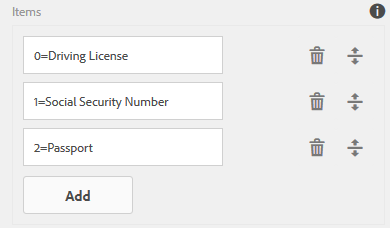

# Informatie uit gebruikersgegevens toevoegen aan metagegevens voor het verzenden van formulieren {#adding-information-from-user-data-to-form-submission-metadata}

U kunt waarden die zijn ingevoerd in een element van het formulier gebruiken om metagegevensvelden van een concept of een formulier te berekenen. Met metagegevens kunt u inhoud filteren op basis van gebruikersgegevens. Een gebruiker voert bijvoorbeeld Jan Smit in het naamveld van het formulier. U kunt deze informatie gebruiken om metagegevens te berekenen die deze verzending kunnen categoriseren onder de JD voor initialen.

Als u metagegevensvelden wilt berekenen met door de gebruiker ingevoerde waarden, voegt u elementen van het formulier toe aan de metagegevens. Wanneer een gebruiker een waarde in dat element invoert, gebruikt een script de waarde om informatie te berekenen. Deze informatie wordt toegevoegd aan de metagegevens. Wanneer u een element als meta-gegevensgebied toevoegt, verstrekt u een sleutel voor het. De sleutel wordt toegevoegd als gebied in de meta-gegevens, en de gegevens verwerkte informatie wordt geregistreerd tegen het.

Een ziekteverzekeringsbedrijf publiceert bijvoorbeeld een formulier. In dit formulier legt een veld de pagina van de eindgebruikers vast. De klant wil alle verzendingen in een bepaald leeftijdsbereik controleren nadat meerdere gebruikers het formulier hebben verzonden. In plaats van alle gegevens te doorlopen die gecompliceerd worden door een toenemend aantal formulieren, helpen extra metagegevens de klant. De auteur van het formulier kan configureren welke eigenschappen/gegevens door de eindgebruiker worden ingevuld op het hoogste niveau, zodat de zoekopdracht gemakkelijker kan worden uitgevoerd. De extra meta-gegevens zijn door de gebruiker ingevulde informatie die op het hoogste niveau van de meta-gegevensknoop wordt opgeslagen, aangezien de auteur het vormde.

Een ander voorbeeld van een formulier waarin e-mailadres en telefoonnummer worden vastgelegd. Wanneer een gebruiker dit formulier anoniem bezoekt en het formulier verlaat, kan de auteur het formulier zodanig configureren dat de e-mailadres en het telefoonnummer automatisch worden opgeslagen. Dit formulier wordt automatisch opgeslagen en het telefoonnummer en de e-mailadres worden opgeslagen in het metagegevensknooppunt van het concept. Een gebruik-geval van deze configuratie is het lood management dashboard.

## Formulierelementen toevoegen aan metagegevens {#adding-form-elements-to-metadata}

Voer de volgende stappen uit om een element toe te voegen aan de metagegevens:

1. Open het adaptieve formulier in de bewerkingsmodus.\
   Als u het formulier wilt openen in de bewerkingsmodus, selecteert u het formulier in het formulierbeheer en tikt u op **[!UICONTROL Open]**.
1. Selecteer in de bewerkingsmodus een component en tik op  > **[!DNL Adaptive Form Container]** en tikt u vervolgens op .
1. Klik in de zijbalk op **[!DNL Metadata]**.
1. Klik in het gedeelte Metagegevens op **[!DNL Add]**.
1. Voeg scripts toe in het veld Waarde van het tabblad Metagegevens. Met de scripts die u toevoegt, worden gegevens verzameld uit elementen op het formulier en worden waarden berekend die worden doorgegeven aan de metagegevens.

   Bijvoorbeeld: **[!DNL true]** is aangemeld bij de metagegevens als de ingevoerde leeftijd groter is dan 21, en **[!DNL false]** wordt geregistreerd als het minder dan 21 is. U voert het volgende script in op het tabblad Metagegevens:

   `(agebox.value >= 21) ? true : false`

   

   Script ingevoerd op het tabblad Metagegevens

1. Klik op **[!DNL OK]**.

Nadat een gebruiker gegevens in het element invoert dat als meta-gegevensgebied wordt geselecteerd, wordt de gegevens gegevens gegevens geregistreerd in de meta-gegevens. U kunt de metagegevens bekijken in de opslagplaats die u hebt geconfigureerd voor het opslaan van metagegevens.

## Metagegevens voor bijgewerkte formulierverzending bekijken: {#seeing-updated-form-nbsp-submission-metadata}

In het bovenstaande voorbeeld worden de metagegevens opgeslagen in de CRX-opslagplaats. De metagegevens zien er als volgt uit:

Als u een element van het controlevakje in de meta-gegevens toevoegt, worden de geselecteerde waarden opgeslagen als komma-gescheiden koord. U voegt bijvoorbeeld een component CheckBox in het formulier toe en geeft de naam van de component op als `checkbox1`. In de eigenschappen van de component van het controlevakje, voegt u de punten Rijvergunning, het Aantal van de Sociale Veiligheid, en Paspoort voor waarden 0, 1, en 2 toe.

U selecteert de container Adaptief formulier en u voegt in de formuliereigenschappen een metagegevenssleutel toe `cb1` die `checkbox1.value`en publiceert u het formulier. Wanneer een klant het formulier invult, selecteert de klant de opties Paspoort en burgerservicenummer in het veld Selectievakje. De waarden 1 en 2 worden opgeslagen als 1, 2 in het cb1-veld van de metagegevens voor verzending.

>[!NOTE]
>
>Het bovenstaande voorbeeld is alleen bedoeld voor leerdoeleinden. Zorg ervoor dat u naar metagegevens zoekt op de juiste locatie zoals deze in uw [!DNL Experience Manager Forms] uitvoering.