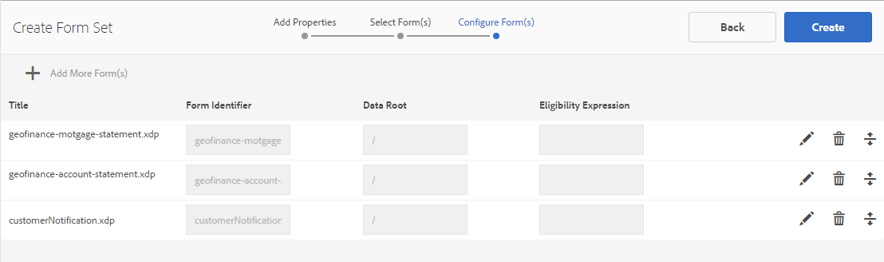

# Formulierset in AEM Forms{#form-set-in-aem-forms}

## Overzicht {#overview}

Uw klanten worden vaak gevraagd meerdere formulieren in te dienen om een service of een voordeel aan te vragen. Hierbij moeten alle relevante formulieren worden gevonden en moeten ze afzonderlijk worden ingevuld, ingediend en gevolgd. Bovendien moeten ze veelvoorkomende details meerdere keren invullen in verschillende formulieren. Het hele proces wordt omslachtig en foutgevoelig als het een groot aantal formulieren betreft. De functie Formulierenset van AEM Forms kan de gebruikerservaring in dergelijke scenario&#39;s vereenvoudigen.

Een formulierset is een verzameling HTML5-formulieren die zijn gegroepeerd en worden weergegeven als één set formulieren voor eindgebruikers. Wanneer eindgebruikers een formulierset beginnen in te vullen, worden ze naadloos van het ene naar het andere formulier overgezet. Uiteindelijk kunnen ze alle formulieren met één klik verzenden.

AEM Forms biedt formulierauteurs een intuïtieve gebruikersinterface voor het maken, configureren en beheren van formuliersets. Als auteur kunt u formulieren bestellen in een bepaalde volgorde die eindgebruikers moeten volgen. Ook kunt u voorwaarden of geschiktheidsexpressies toepassen op afzonderlijke formulieren om de zichtbaarheid ervan te bepalen op basis van de invoer van de gebruiker. U kunt bijvoorbeeld het formulier met de gegevens van de echtgenoot zo configureren dat het alleen wordt weergegeven wanneer de staat van het huwelijk als Gehuwd is opgegeven.

Bovendien kunt u gemeenschappelijke gebieden in verschillende vormen vormen om gemeenschappelijke gegevensbanden te delen. Als de juiste gegevensbindingen zijn ingesteld, moeten eindgebruikers de algemene gegevens slechts eenmaal invullen als deze automatisch worden ingevuld in de volgende formulieren.

Formuliersets worden ook ondersteund in de AEM Forms-app, zodat uw medewerkers in het veld een formulierset offline kunnen gebruiken, klanten kunnen bezoeken, invoergegevens kunnen invoeren en later kunnen synchroniseren met de AEM Forms-server om formuliergegevens naar bedrijfsprocessen te verzenden.

## Formulierset maken en beheren {#creating-and-managing-form-set}

U kunt verschillende XDP&#39;s of formuliersjablonen, gemaakt met Designer, koppelen aan een formulierset. Formuliersets kunnen vervolgens selectief worden gebruikt om de XDP&#39;s te renderen op basis van waarden die de gebruikers hebben ingevoerd in eerste formulieren en hun profielen.

Het gebruikersinterface van AEM Forms van het gebruik [&#128279;](https://experienceleague.adobe.com/en/docs/experience-manager-65/content/forms/getting-started/introduction-managing-forms) om al uw vormen, vormreeksen, en verwante activa te beheren.

### Een formulierset maken {#create-a-form-set}

Ga als volgt te werk om een formulierset te maken:

1. Selecteer Forms > Forms en Documenten.
1. Selecteer Maken > Formulierset.

1. Voeg op de pagina Eigenschappen toevoegen de volgende details toe en klik op Volgende.

   * Titel: geeft de titel van het document op. Met de titel kunt u de formulierset identificeren in de AEM Forms-gebruikersinterface.
   * Beschrijving: geeft de gedetailleerde informatie over het document op.
   * Tags: geeft codes op waarmee de formulierset op unieke wijze wordt geïdentificeerd. Tags helpen u bij het zoeken naar de formulierset. Als u tags wilt maken, typt u nieuwe tagnamen in het vak Tags.
   * Verzenden URL: geeft de URL op waar de verzonden gegevens worden gepost voor de zelfstandige uitvoering van een formulierset (gebruik van niet-AEM Forms-toepassingen). De gegevens worden voorgelegd aan dit eindpunt als multipart/formdata met volgende verzoekparameter:
   * dataXML: deze parameter bevat een XML-representatie van verzonden formuliersetgegevens. Als alle formulieren in de formulierset een gemeenschappelijk schema gebruiken, wordt de XML gegenereerd volgens dat schema. Anders bevat de XML-hoofdtag een onderliggende tag voor elk ingevuld formulier in de formulierset die gegevens bevat voor de formulierbijlagen.
   * formsetPath: Het pad van de formset in CRXDE, die is verzonden.
   * HTML-renderprofiel: u kunt bepaalde opties configureren, zoals zwevende velden, bijlagen en ontwerpondersteuning (voor zelfstandige uitvoering van een formulierset), om de weergave, het gedrag en de interacties van de formulierset aan te passen. U kunt het bestaande profiel aanpassen of uitbreiden om de instellingen van HTML-formulierprofielen te wijzigen.

    toe

1. In het scherm Formulier selecteren worden de beschikbare XDP-formulieren of XDP-bestanden weergegeven. Zoek en selecteer de formulieren die u in de formulierset wilt opnemen en klik vervolgens op Toevoegen aan formulierset. Zoek zo nodig nogmaals naar formulieren die u wilt toevoegen. Nadat u alle formulieren aan de formulierset hebt toegevoegd, klikt u op Volgende.

   >[!NOTE]
   >
   >Zorg ervoor dat de veldnamen in XDP-formulieren niet het puntteken bevatten. Anders kunnen scripts die proberen de velden op te lossen, die punttekens hebben, deze niet oplossen.

1. Op de pagina Formulier(s) configureren kunt u het volgende doen:

   * Formuliervolgorde: sleep de formulieren om ze opnieuw te ordenen. De formuliervolgorde definieert de volgorde waarin formulieren aan de eindgebruiker worden weergegeven in de AEM Forms-app en zelfstandige uitvoering.
   * Formulierid: geeft een unieke identiteit op voor de formulieren die moeten worden gebruikt in geschiktheidsexpressies.
   * Gegevensbasis: voor elk formulier in een formulierset kan de auteur de XPATH configureren waar de gegevens van dat formulier zich in verzonden XML bevinden. De standaardwaarde is /. Als alle formulieren in een formulierset zijn gebonden met een schema en hetzelfde XML-schema delen, kunt u deze waarde wijzigen. Het wordt aanbevolen dat voor elk veld in het formulier de juiste gegevensbinding is opgegeven in de XDP. Als twee velden in twee verschillende formulieren dezelfde gegevensbinding hebben, worden in het tweede formulier voorgevulde waarden uit het eerste formulier weergegeven. Bind twee subformulieren met dezelfde interne inhoud niet aan hetzelfde XML-knooppunt. Voor meer informatie ziet de structuur van XML van vormreeks, [ vooraf ingevulde XML voor de reeks van de Vorm ](https://experienceleague.adobe.com/en/docs/experience-manager-65/content/forms/html5-forms/formset-in-aem-forms#prefill-xml-for-form-set).
   * Beleenbaarheidsuitdrukking: geeft een JavaScript-expressie op die een Booleaanse waarde evalueert en aangeeft of een formulier in een formulierset in aanmerking komt voor invulling. Indien onwaar, wordt de gebruiker niet gevraagd of zelfs getoond het te vullen formulier. De expressie is doorgaans gebaseerd op de waarden van de velden die vóór dit formulier zijn vastgelegd. Expressies bevatten ook aanroepen van de formulierset-API fs.valueOf om de waarden te extraheren die de gebruiker heeft ingevuld in een veld van een formulierset:

   *fs.valueOf (&lt;Form Identifier>, &lt;fieldSom expression>) > &lt;value>*

   Als de formulierset bijvoorbeeld twee formulieren bevat: bedrijfskosten en reiskosten, kunt u een JavaScript-fragment toevoegen in het veld Belichtingsexpressie voor beide formulieren om de gebruikersinvoer te controleren op het type kosten in een formulier. Als de gebruiker BedrijfsKosten kiest, wordt het formulier BedrijfsKosten teruggegeven aan het eind - gebruiker. Of als de gebruiker reiskosten kiest, wordt een ander formulier weergegeven aan de eindgebruiker. Zie Beleenbaarheidsuitdrukking voor meer informatie.

   Bovendien kan de auteur ook verkiezen om een vorm uit de vormreeks te verwijderen gebruikend het pictogram van de Schrapping aanwezig bij de rechterhoek van elke rij of een andere reeks vormen toe te voegen gebruikend het &quot;**+**&quot;pictogram in de toolbar. Dit pictogram &#39;**+**&#39; stuurt de gebruiker terug naar de vorige stap in de wizard, die werd gebruikt om &#39;Formulier(s) selecteren&#39;. De bestaande selecties blijven behouden en eventuele extra selecties moeten aan de formulierset worden toegevoegd met het pictogram Toevoegen aan formulierset op die pagina.

   

   >[!NOTE]
   >
   >Alle formulieren die in een formulierset worden gebruikt, worden beheerd door de gebruikersinterface van AEM Forms.

### Een formulierset beheren {#managing-a-form-set}

Nadat een formulierset is gemaakt, kunt u de volgende handelingen op die formulierset uitvoeren:

* Eén klik: wanneer een formulierset wordt gemaakt en op de hoofdelementpagina wordt weergegeven, kunt u met één klik op de formulierset klikken om deze weer te geven. Er wordt een formulierset geopend en alle formuliersjablonen (XDP&#39;s) in die formulierset worden weergegeven.
* Bewerken: als u op Bewerken klikt nadat u een formulierset hebt geselecteerd, wordt het scherm Formulier(s) configureren dat hierboven in Stappen wordt weergegeven om een formulierset te maken, geopend. U kunt alle functies uitvoeren die hier worden beschreven.
* Kopiëren en plakken: hiermee kunt u de volledige formulierset van de ene locatie kopiëren en op dezelfde of een andere locatie of map plakken.
* Downloaden: u kunt de formulierset downloaden met alle afhankelijkheden.
* Revisie starten/beheren: wanneer een formulierset is gemaakt, kunt u de revisie instellen door op Revisie starten te klikken. Nadat de revisie voor een formulierset is gestart, wordt de optie Revisie beheren aan de gebruiker weergegeven. In het revisiescherm Beheren kunt u de revisie bijwerken of beëindigen. Voor de revisies die u hebt toegevoegd, kunt u de revisie controleren en zo nodig opmerkingen toevoegen.
* Verwijderen: hiermee verwijdert u de volledige formulierset. De formulieren in de verwijderde formulierset blijven in de gegevensopslagruimte.
* Publiceren/Publiceren ongedaan maken: hiermee wordt de formulierset samen met alle formulieren in de set gepubliceerd/gepubliceerd en worden de bijbehorende elementen van deze formulieren gepubliceerd.
* Voorvertoning: Voorvertoning biedt twee opties: Voorvertonen als HTML (zonder gegevens) en aangepaste voorvertoning met voorbeeldgegevens.
* Eigenschappen van weergave/bewerking: u kunt de eigenschappen van metagegevens van een geselecteerde formulierset weergeven/bewerken.


### Een formulierset bewerken {#edit-a-form-set}

Ga als volgt te werk om een formulierset te bewerken:

1. Selecteer Forms > Forms en Documenten.
1. Zoek de formulierset die u wilt bewerken. Beweeg over het en selecteer uitgeven ( ).
1. Op de pagina Formulier(s) configureren kunt u het volgende bewerken:

   * Formuliervolgorde
   * Formulierid
   * Gegevensbasis
   * Beleenbaarheidsuitdrukking

   U kunt ook op het betreffende pictogram Verwijderen klikken om het formulier uit de formulierset te verwijderen.

## Formulierset in Process Management {#form-set-in-process-management}

Nadat u een formulierset hebt gemaakt met de gebruikersinterface van AEM Forms Management, kunt u de formulierset in een beginpunt gebruiken of Taakactiviteit toewijzen met Workbench.

### Formulierset gebruiken in Taak- of beginpunt {#using-form-set-in-task-or-start-point}

1. Wanneer het ontwerpen van een proces, onder de Presentatie &amp; sectie van Gegevens van Assign Taak/Punt van het Begin, uitgezocht **gebruik een activa van CRX**. De CRX Asset-browser wordt weergegeven.

   

1. Selecteer een formulierset om de formulierset te filteren in de AEM-gegevensopslagruimte (CRX).

   

1. Selecteert een formulierset en klik op OK.

## Subsidiabiliteitsexpressies {#eligibility-expressions}

Geschiktheidsexpressies in een formulierset worden gebruikt om formulieren die voor een gebruiker worden weergegeven, te definiëren en dynamisch te beheren. Een bepaald formulier bijvoorbeeld alleen weergeven als de gebruiker tot een bepaalde leeftijdsgroep behoort. Een geschiktheidsexpressie opgeven en bewerken met behulp van formulierbeheer.

Een geschiktheidsexpressie kan elke geldige JavaScript-instructie zijn die een Booleaanse waarde retourneert. De laatste instructie in het JavaScript-codefragment wordt behandeld als een Booleaanse waarde die de geschiktheid van het formulier bepaalt op basis van de verwerking in de rest (vorige regels) van het JavaScript-codefragment. Als de waarde van de expressie true is, kan het formulier aan de gebruiker worden weergegeven. Dergelijke formulieren worden in aanmerking komende formulieren genoemd.

>[!NOTE]
>
>De kwalificatieexpressie voor het eerste formulier in een formulierset wordt niet uitgevoerd. Het eerste formulier wordt altijd weergegeven, ongeacht de geschiktheidsexpressie.

Naast de standaard JavaScript-functies stelt de formulierset ook de fs.valueOf API beschikbaar die toegang biedt tot de waarde van een veld in een formulierset. Gebruik deze API om toegang te krijgen tot de waarde van een formulierveld in een formulierset. De API-syntaxis is fs.valueOf (formUid, fieldSOM), waarbij:

* formUid (tekenreeks): een unieke id van een formulier in de formulierset. U kunt dit opgeven tijdens het maken van de formulierset in de gebruikersinterface van formulierbeheer. Standaard is dit de naam van het formulier.
* fieldSOM (tekenreeks): Een SOM-expressie van het veld in het formulier dat is opgegeven door formUid. De expressie SOM of de expressie Scripting Object Model wordt gebruikt om te verwijzen naar waarden, eigenschappen en methoden binnen een bepaald DOM (Document Object Model). U kunt het veld in Form Designer weergeven onder het tabblad Scripts als het veld is geselecteerd.

>[!NOTE]
>
>Zowel de parameter formUid als de parameter fieldSOM moeten een letterlijke tekenreeks zijn.

### Voorbeelden {#examples}

Geldig gebruik van de API:

`fs.valueOf("form1", "xfa.form.form1.subform1.field1")`

Ongeldig gebruik van de API:

```javascript
var formUid = "form1";
 var fieldSOM = "xfa.form.form1.subform1.field1"; fs.valueOf(formUid, fieldSOM);
```

## XML vooraf invullen voor formulierset {#prefill-xml-for-form-set}

Formulierset is een verzameling van meerdere HTML5-formulieren met gemeenschappelijke of verschillende schema&#39;s. Formulierset ondersteunt het vooraf invullen van formuliervelden met een XML-bestand. U kunt een XML-bestand aan een formulierset koppelen, zodat bepaalde velden in het formulier worden voorgepoleerd wanneer u een formulier in de formulierset opent.

Het vooraf ingevulde XML-bestand wordt opgegeven met de parameter dataRef van de URL van de formulierset. Met de parameter dataRef geeft u het absolute pad op van het XML-bestand met gegevens dat wordt samengevoegd met de formulierset.

U hebt bijvoorbeeld drie formulieren (form1, form2 en form3) in de formulierset met de volgende structuur:

form1

field
form1field

form2

field
form2field

form3

field
form3field

Elk formulier heeft een algemeen benoemd veld met de naam &quot;field&quot; en een uniek benoemd veld met de naam &quot;form&lt;i>field&quot;.

U kunt deze formulierset vooraf invullen met behulp van een XML met de volgende structuur:

```xml
<?xml version="1.0" encoding="UTF-8" ?>
<formSetRootTag>
 <field>common field value</field>
 <form1field>value1</form1field>
 <form2field>value2</form2field>
 <form3field>value3</form3field>
</formSetRootTag>
```

>[!NOTE]
>
>De XML-hoofdtag kan elke naam hebben, maar de elementtags die overeenkomen met de velden moeten dezelfde naam hebben als het veld. De hiërarchie van de XML moet de hiërarchie van het formulier nabootsen. Dit houdt in dat de XML overeenkomstige codes moet hebben voor het onderbrengen van subformulieren.

Het bovenstaande XML-fragment toont dat de vooraf ingevulde XML voor de formulierset een samenvoeging is van de vooraf ingevulde XML-fragmenten van de afzonderlijke formulieren. Als de gegevenshiërarchie/het schema van bepaalde velden in de verschillende formulieren op elkaar lijken, worden de velden voorgevuld met dezelfde waarden. In dit voorbeeld worden alle drie formulieren voorgevuld met dezelfde waarde voor het algemene veld, &quot;field&quot;. Dit is een eenvoudige manier om gegevens van het ene formulier naar het andere over te brengen. Dit kan ook worden bereikt door de velden te binden aan hetzelfde schema of dezelfde referentie voor gegevens. Als u de gegevens van de formulierset wilt segregeren op basis van het schema van het formulier. Dit kan worden bereikt door tijdens het maken van de formulierset het kenmerk &#39;gegevensbasiskenmerk&#39; van het formulier op te geven (de standaardwaarde is &#39;/&#39;, die wordt toegewezen aan de basiscode van de formulierset).

In het vorige voorbeeld, als u de gegevenswortels opgeeft: &quot;/form1&quot;, &quot;/form2&quot;, en &quot;/form3&quot; respectievelijk voor de drie formulieren, moet u een vooraf ingevulde XML van de volgende structuur gebruiken:

```xml
<?xml version="1.0" encoding="UTF-8" ?>
<formSetRootTag>
 <form1>
  <field>field value1</field>
  <form1field>value1</form1field>
 </form1>
 <form2>
  <field>field value2</field>
  <form2field>value2</form2field>
 </form2>
 <form3>
  <field>field value3</field>
  <form3field>value3</form3field>
 </form3>
</formSetRootTag>
```

In een formulierset definieert de XML een XML-schema met de volgende syntaxis:

```xml
<formset>
 <fs_data>
  <xdp:xdp xmlns:xdp="https://ns.adobe.com/xdp/">
  <xfa:datasets xmlns:xfa="https://www.xfa.org/schema/xfa-data/1.0/">
   <xfa:data>
   <rootElement>
    ... data ....
   </rootElement>
   </xfa:data>
  </xfa:datasets>
  </xdp:xdp>
 </fs_data>
 <fs_draft>
  ... private data...
 </fs_draft>
</formset>
```

>[!NOTE]
>
>Als er twee formulieren zijn met overlappende gegevenswortels, of de elementenhiërarchie van een formulier overlapt met de gegevenstramienhiërarchie van een ander formulier, worden de waarden van de overlappende elementen in de xml samengevoegd. De verzendende XML heeft een vergelijkbare structuur als de vooraf ingevulde XML, maar bij het verzenden van XML worden meer omvattende tags en aan het einde enkele contextgegevenscodes voor formuliersets toegevoegd.

### Beschrijving van vooraf ingevulde XML-elementen {#prefill-xml-elements-description}

Syntaxisregels voor het maken van een vooraf ingevuld XML-bestand:

* bovenliggende elementen: element(en) die het bovenliggende element kunnen zijn, waarbij null aangeeft dat het element zich in de basis van de XML kan bevinden.
* kardinaliteit: geeft het aantal keren weer dat het element binnen het bovenliggende element kan worden gebruikt.
* submitXML: geeft aan of het element altijd present(P) of optional(O) is in submit XML.
* prefillXML: geeft aan of het element vereist (R) of optioneel (O) is in vooraf ingevulde XML.
* onderliggende elementen: geeft aan welke elementen onderliggende elementen kunnen zijn.

### FORMSET {#formset}

`parent elements:`

`null`

`cardinality: [0,1]`

`submitXML: P`

`prefillXML: O`

`children: fs_data`

Het hoofdelement van de XML-formulierset. Het wordt aangeraden dit woord niet te gebruiken als de naam van het basissubformulier van een formulier in de formulierset.

### FS_DATA {#fs-data}

`parent elements:`

`formset`

kardinaliteit: [ 1 ]

submitXML: P

prefillXML: O

`children: xdp:xdp/rootElement`

De substructuur geeft de gegevens van de formulieren in de formulierset aan. Het element is alleen optioneel in vooraf ingevulde XML als het formuliersetelement niet aanwezig is

### XDP:XDP {#xdp-xdp}

`parent elements: fs_data/null`

`cardinality: [0,1]`

`submitXML: O`

`prefillXML: O`

`children: xfa:datasets`

Dit label geeft het begin van HTML5 Form XML aan. Dit wordt toegevoegd in het verzendende XML als het in vooraf ingevulde XML aanwezig is of er geen vooraf ingevulde XML is. Deze tag kan worden verwijderd uit de vooraf ingevulde XML.

### XFA:DATASETS {#xfa-datasets}

`parent elements: xdp:xdp`

`cardinality: [1]`

`submitXML: O`

`prefillXML: O`

`children: xfa:data`

### XFA:GEGEVENS {#xfa-data}

`parent elements: xfa:datasets`

`cardinality: [1]`

`submitXML: O`

`prefillXML: O`

`children: rootElement`

### ROOTELEMENT {#rootelement}

`parent elements: xfa:datasets/fs_data/null`

`cardinality: [0,1]`

`submitXML: P`

`prefillXML: O`

`children: controlled by the Forms in Form set`

Het name rootElement is slechts een plaatsaanduiding. De werkelijke naam wordt gekozen uit de formulieren die in de formulierset worden gebruikt. De substructuur die begint met rootElement bevat de gegevens van de velden en subformulieren in de Forms in de formulierset. Er zijn veelvoudige factoren die de structuur van rootElement en zijn kinderen bepalen.

In vooraf ingevulde XML is dit label optioneel, maar als het ontbreekt, wordt de volledige XML genegeerd.

NAAM VAN DE TAG BASISELEMENT

Als er een hoofdelement is in de vooraf ingevulde XML, wordt de naam van dat element ook gebruikt in de verzendings-XML. Wanneer er geen prefill-xml is, is de naam van het rootElement de naam van het basissubformulier van het eerste formulier in de formulierset met een eigenschap dataRoot ingesteld op &quot;/&quot;. Als er geen dergelijke vorm is, dan is de rootElement naam **fs_dummy_root**, die een gereserveerd sleutelwoord is.

## Formulierset in AEM Forms-app {#formset-in-workspace-app}

Met de AEM Forms-app kunnen veldwerkers hun mobiele apparaten synchroniseren met een AEM Forms-server en aan hun taken werken. De toepassing werkt zelfs wanneer het apparaat offline is door gegevens lokaal op het apparaat op te slaan. Met behulp van annotatiefuncties, zoals foto&#39;s, kunnen veldwerkers nauwkeurige informatie verschaffen om te integreren in de bedrijfsprocessen.

<!-- Update link as it is a 404 - For more information on AEM Forms app, see [AEM Forms app overview](/help/forms/using/mobile-workspace-overview.md).-->

## Bekende beperkingen - patronen worden niet volledig ondersteund in de formulierset {#known-limitations-patterns-not-fully-supported-in-form-set}

De volgende gegevenspatronen worden niet volledig ondersteund in de formulierset:

<table>
 <tbody>
  <tr>
   <td><strong>Patroon wordt niet volledig ondersteund in formulierset</strong></td>
   <td><strong>Voorbeeld</strong></td>
  </tr>
  <tr>
   <td>Invoergrootte en patroongrootte komen niet overeen</td>
   <td><p>When pattern= num{z,zzz}</p> <p>En input=</p> <p>12,345 of</p> <p>1,23</p> </td>
  </tr>
  <tr>
   <td>Figuurpatronen met haakjes "(" ")"</td>
   <td>num{(zz,zzz)}</td>
  </tr>
  <tr>
   <td>Meerdere gegevenspatronen</td>
   <td>num{zz,zzz} | num{z,zzz,zzz}</td>
  </tr>
  <tr>
   <td>Korte patronen </td>
   <td><p>num.integer{},</p> <p>num.decimal{},</p> <p>num.percent{}, of</p> <p>num.currency{}</p> </td>
  </tr>
 </tbody>
</table>
