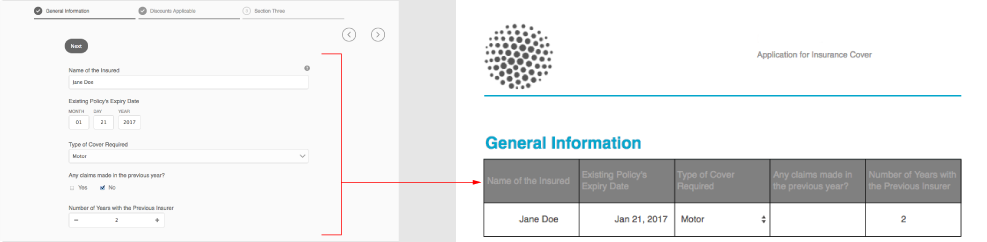

# Een PDF (voorheen Document of Record) voor verzending genereren voor adaptieve Forms (Core Components)

## Overzicht {#overview}

Wanneer een formulier wordt ingevuld of verzonden, kunt u het formulier afdrukken of in documentindeling registreren. Deze record wordt een Submission PDF (voorheen Document of Record, of DoR) genoemd. Het is een afdrukvriendelijke PDF van het ingediende formulier. U kunt ook naar de verzendversie van PDF verwijzen voor de informatie die klanten op een latere datum hebben ingevuld. Met de verzendversie van PDF kunt u formulieren en inhoud in PDF-indeling archiveren.

## Toepassings- en gebruiksgevallen

### Verzekeringen

## Kan AEM Forms documenten met verzekeringsclaims genereren?

Ja. AEM Forms ondersteunt het genereren van verzendings-PDF (voorheen Document of Record), waardoor verzekeraars PDF&#39;s en records kunnen maken op basis van ingediende formuliergegevens.

## Zijn door AEM Forms gegenereerde documenten geschikt voor audits?

Ja. AEM Forms ondersteunt consistente documentgeneratie, gecontroleerde toegang en traceerbaarheid, die belangrijk zijn voor audit- en nalevingsvereisten.

Om een verzendsjabloon voor PDF te maken, wordt een sjabloon op basis van XFA of Acroform samengevoegd met gegevens die via een adaptief formulier zijn verzameld. U kunt een PDF voor verzending automatisch of op aanvraag genereren. Met de optie Op aanvraag kunt u een aangepaste sjabloon voor XFA of Acrobat opgeven die een aangepaste weergave biedt voor uw verzendende PDF.

U kunt:

* [Een op XFA gebaseerde verzendings-PDF genereren](#generate-an-XFA-based-document-of-record)
* [Een op acroform gebaseerde (Acrobat Form PDF) verzending-PDF genereren](#generate-an-Acroform-based-document-of-record)
* [PDF voor verzending automatisch genereren](#auto-generate-a-document-of-record)

## Voordat u begint {#components-to-automatically-generate-a-document-of-record}

Voordat u de vereiste middelen voor een PDF voor verzending leert en gereed maakt:

**malplaatje van de Basis:** Een malplaatje XFA (XDP dossier) dat in Forms Designer of een Vorm van Acrobat (AcroForm) wordt gecreeerd. [ het malplaatje van de Basis ](#base-template-of-a-document-of-record) wordt gebruikt om het stileren en het brandmerken informatie voor een Verzending PDF te specificeren. Upload uw XFA-sjabloon (XDP-bestand) naar uw AEM Forms-instantie eerder.

**Aangepaste Vorm:** Een Aangepaste Vorm waarvoor de Verzending PDF moet worden geproduceerd.

## Een op XFA gebaseerde verzendings-PDF genereren {#generate-an-XFA-based-document-of-record}

Upload uw XFA-sjabloon (XDP-bestand) naar uw AEM Forms-instantie. Voer de volgende stappen uit om een adaptief formulier te configureren voor het gebruik van XFA-sjablonen (XDP-bestand) als sjabloon voor verzending naar PDF:

1. Klik in de Experience Manager-auteurinstantie op **[!UICONTROL Forms]** > **[!UICONTROL Forms and Documents].**
1. Selecteer een formulier of maak een adaptief formulier en klik op **[!UICONTROL Properties]** .
1. Selecteer **[!UICONTROL Form Model]** in het venster Eigenschappen.
1. Selecteer op het tabblad **[!UICONTROL Form Model]** in de vervolgkeuzelijst **[!UICONTROL Select From]** de optie **[!UICONTROL Form Data Model]** , **[!UICONTROL Schema]** of **[!UICONTROL None]** . U kunt ook een formuliermodel selecteren wanneer u een formulier maakt.
1. In het Document van de sectie van de Configuratie van het Malplaatje van het Verslag van het Model van de Vorm, uitgezochte **Vennoot het Malplaatje van de Vorm als Document van het Malplaatje van het Verslag**. Als u deze optie selecteert, worden alle XFA-sjablonen (XDP-bestanden) die op uw computer beschikbaar zijn, weergegeven. Selecteer het juiste bestand. Zorg er ook voor dat hetzelfde schema (gegevensschema) wordt gebruikt voor Adaptief formulier en geselecteerde XFA-sjabloon (XDP-bestand).
1. Klikken **[!UICONTROL Done]**

Uw adaptieve formulier is nu geconfigureerd voor het gebruik van een XDP-bestand als sjabloon voor verzending naar PDF. De volgende stap moet [ de Aangepaste componenten van de Vorm met overeenkomstige malplaatjegebieden ](#bind-adaptive-form-components-with-template-fields) binden.

## Een op acroform gebaseerde verzending PDF genereren {#generate-an-Acroform-based-document-of-record}

Upload uw Adobe Acrobat PDF (Acrobat) naar uw AEM Forms-exemplaar. Voer de volgende stappen uit om een adaptief formulier te configureren voor het gebruik van Adobe Acrobat PDF (Acrobat) als sjabloon voor verzending naar PDF:

1. Klik in de Experience Manager-auteurinstantie op **[!UICONTROL Forms]** > **[!UICONTROL Forms and Documents].**
1. Selecteer een formulier of **[!UICONTROL Create an Adaptive Form]** en klik op **[!UICONTROL Properties]** .
1. Selecteer **[!UICONTROL Form Model]** in het venster Eigenschappen.
1. Selecteer op het tabblad **[!UICONTROL Form Model]** in de vervolgkeuzelijst **[!UICONTROL Select From]** de optie **[!UICONTROL Form Data Model]** , **[!UICONTROL Schema]** of **[!UICONTROL None]** . U kunt ook een formuliermodel selecteren wanneer u een formulier maakt.
1. In het Document van de sectie van de Configuratie van het Malplaatje van het Verslag van het Model van de Vorm, uitgezochte **Vennoot het Malplaatje van de Vorm als Document van het Malplaatje van het Verslag**. Als u deze optie selecteert, worden alle Acrobat PDF (Acroform) die op uw computer beschikbaar zijn, weergegeven. Selecteer het formulier dat u wilt gebruiken.
1. Klikken **[!UICONTROL Done]**

Uw adaptieve formulier is nu geconfigureerd voor het gebruik van een Acrobat-formulier als sjabloon voor verzending naar PDF. De volgende stap moet [ de Aangepaste componenten van de Vorm met overeenkomstige malplaatjegebieden ](#bind-adaptive-form-components-with-template-fields) binden.

## Automatisch een PDF voor verzending genereren {#auto-generate-a-document-of-record}

Als een adaptief formulier is geconfigureerd om automatisch een verzendings-PDF te genereren, wordt de verzendings-PDF van het formulier direct bijgewerkt telkens wanneer een formulier wordt gewijzigd. Als bijvoorbeeld een veld wordt verwijderd uit een bestaand adaptief formulier, wordt het bijbehorende veld ook verwijderd en is het niet zichtbaar in de verzendende PDF. Er zijn veel andere voordelen van het automatisch genereren van een PDF voor verzending:

* Formulierontwikkelaars hoeven de gegevensbindingen niet handmatig bij te houden. Automatisch gegenereerde verzending door PDF zorgt voor updates met betrekking tot gegevensbinding.
* Formulierontwikkelaars hoeven velden die zijn gemarkeerd met de aanduiding Uitsluiten van Verzending PDF, niet handmatig te verbergen. Automatisch gegenereerde verzending PDF is vooraf geconfigureerd om dergelijke velden uit te sluiten.
* De optie PDF voor automatisch gegenereerde verzending bespaart tijd die nodig is om een formuliersjabloon voor Verzending te maken.
* Met de optie PDF voor automatisch gegenereerde verzending kunt u verschillende stijlen en weergaven gebruiken met verschillende basissjablonen. Het helpt de beste stijl en verschijning voor Verzending PDF voor uw organisatie te selecteren. Als u geen stijlen opgeeft, worden systeemstijlen standaard ingesteld.
* Automatisch gegenereerde verzending PDF zorgt ervoor dat elke wijziging in het formulier direct wordt doorgevoerd in de verzendende PDF.

Voer de volgende stappen uit om een adaptief formulier te configureren om automatisch een PDF voor verzending te genereren:

1. Klik in de Experience Manager-auteurinstantie op **[!UICONTROL Forms]** > **[!UICONTROL Forms and Documents].**
1. Selecteer een formulier of maak een adaptief formulier en klik op **[!UICONTROL Properties]** .
1. Selecteer **[!UICONTROL Form Model]** in het venster Eigenschappen.
1. Selecteer op het tabblad **[!UICONTROL Form Model]** in de vervolgkeuzelijst **[!UICONTROL Select From]** de optie **[!UICONTROL Form Data Model]** , **[!UICONTROL Schema]** of **[!UICONTROL None]** . U kunt ook een formuliermodel selecteren wanneer u een formulier maakt.
1. In het Document van de sectie van de Configuratie van het Malplaatje van het Verslag van het Model van de Vorm, uitgezocht **produceer Document van Verslag**.
1. Klikken **[!UICONTROL Done]**

## Aangepaste formuliercomponenten binden met sjabloonvelden {#bind-adaptive-form-components-with-template-fields}

Adaptief-formuliervelden binden met sjabloonvelden om vastgelegde formuliergegevens weer te geven in het corresponderende PDF-veld voor verzending. Aangepaste formuliercomponenten binden aan de overeenkomstige verzendings-PDF-sjabloonvelden:

1. Open het adaptieve formulier, geconfigureerd om een aangepaste formuliersjabloon te gebruiken voor bewerken.

1. Selecteer een Adaptieve component van de Vorm en klik open vormen  pictogram. De eigenschappenbrowser wordt geopend.

1. Blader in de eigenschappenbrowser naar een veld en selecteer dit.

   * (Voor de sjabloon AcroForm) de eigenschap **[!UICONTROL Document of Record Bind Reference field]** .
   * (Voor XFA-sjabloon) de eigenschap **[!UICONTROL Data Model Bind Reference]** .

1. Klik op **[!UICONTROL Save]**.

<!-- 
In the following video, Adaptive Form components are bound with corresponding Acroform template fields and the Document of Record is sent as an email attachment.
-->

U kunt verzendacties zoals &quot;verzenden E-mail&quot;, &quot;aanhalen een werkschema van AEM&quot;gebruiken, &quot;aanhalen een Macht automatisch stroom&quot;, en andere [ verzendt Acties ](configuring-submit-actions.md) om een Verzending PDF te ontvangen.
 voor

>[!NOTE]
>
> U kunt de eigenschap **[!UICONTROL Document of Record Bind Reference field]** gebruiken om de Verzending-PDF op te slaan voor elk formuliergegevensmodel.

## Incrementele updates van de PDF-sjabloon voor verzending {#document-of-record-template-incremental-updates}

Aangepaste formulieren en bijbehorende PDF-sjablonen voor verzending kunnen in de loop van de tijd evolueren. U kunt velden toevoegen, verwijderen of wijzigen aan een adaptief formulier of een PDF-sjabloon voor verzending.

Wanneer u een Submission PDF-sjabloon wijzigt en de gewijzigde sjabloon uploadt naar AEM Forms, detecteert de Adaptive Forms-editor automatisch de gewijzigde bindingen en wordt u geïnformeerd over de adaptieve formuliercomponenten waarvoor nieuwe bindingen nodig zijn. Hiermee kunt u incrementele updates uitvoeren voor een PDF-sjabloon voor verzending.

Bijvoorbeeld, heeft een Organisatie, *We.Retail*, een op AcroForm-Gebaseerde malplaatje van PDF van de Verzending, *wij-retail-factuur.pdf*. De sjabloon ziet er als volgt uit:

Nadat de sjabloon enige tijd is gebruikt, besluit de organisatie het veld `invoice-number` te hernoemen naar het veld `bill-number` en het e-mailadres van kopers vast te leggen. Een ontwikkelaar werkt de naam van het veld `invoice-number` bij en voegt een e-mailveld aan de sjabloon toe. Hij leidt ook tot een nieuwe versie van het malplaatje genoemd *wij-retail-factuur-v2.pdf*.

<!--

The developer uploads and applies to the updated template to the adaptive form. The adaptive form automatically detects and displays list of fields where binding has changed.

The form developer binds Adaptive Forms fields with corresponding Document of Record template.

-->

>[!VIDEO](assets/we-retail-binding.mp4)

Wanneer het adaptieve formulier wordt verzonden, wordt nu een bijgewerkte verzendings-PDF gegenereerd.

## Belangrijkste overwegingen bij het werken met de PDF voor verzending {#key-considerations-when-working-with-document-of-record}

Houd rekening met de volgende overwegingen en beperkingen wanneer u werkt aan de PDF for Adaptive Forms voor verzending.

* Verzendsjablonen van PDF ondersteunen RTF-bestanden niet. Alle RTF-tekst in het statische adaptieve formulier of in de informatie die de gebruiker heeft ingevuld, wordt daarom als onbewerkte tekst weergegeven in de verzendende PDF.
* Documentfragmenten in een adaptief formulier worden niet weergegeven in de verzendings-PDF. Adaptieve formulierfragmenten worden echter wel ondersteund.
* Inhoudbinding in de verzendings-PDF die is gegenereerd voor een adaptief formulier op basis van een XML-schema, wordt niet ondersteund.
* De gelokaliseerde versie van Verzending PDF wordt gecreeerd op bestelling voor een scène wanneer de gebruiker om de teruggave van Verzending PDF verzoekt. De lokalisatie van Verzending PDF vindt plaats in combinatie met de lokalisatie van het adaptieve formulier. <!-- For more information on localization of Document of Record and Adaptive Forms see Using AEM translation workflow to localize Adaptive Forms and Document of Record.-->

<!-- ## Configure an adaptive form to generate  Document of Record {#adaptive-form-types-and-their-documents-of-record}

While creating an adaptive form, in the Form Model tab of Adaptive Form properties, select one the following option: 

* **None**
  Select the option to create an Adaptive Form without a form model. When the option is selected, the Document of Record is automatically generated for your Adaptive Form.

* **[Associate form template as a Document of Record template](creating-adaptive-form.md#create-an-adaptive-form-based-on-an-xfa-form-template)**
  
  Select the option to use an XFA Form as a template for Document of Record. 

* **[Generate Document of Record](creating-adaptive-form.md#create-an-adaptive-form-based-on-xml-or-json-schema)**
  Select the option to use an XFA Form as a template. When the option is selected, the Document of Record is automatically generated for your Adaptive Form. When you use an XML schema as a template for an Adaptive Form, ensure that the adaptive form and associated XFA Form use the same XML schema as your Adaptive Form
  

When you select a form model, configure Document of Record using options available under Document of Record Template Configuration. See [Document of Record Template Configuration](#document-of-record-template-configuration). -->

## Toewijzing van adaptieve formulierelementen {#mapping-of-adaptive-form-elements}

In de volgende tabel worden de componenten Adaptief formulier en de corresponderende XFA-componenten beschreven en wordt aangegeven of deze in een verzendings-PDF worden weergegeven.

### Velden {#fields}

<table>
 <tbody>
  <tr>
   <th>Component Adaptief formulier</th>
   <th>Overeenkomende XFA-component</th>
   <th>Wordt standaard opgenomen in de PDF-sjabloon voor verzending?</th>
   <th>Notities</th>
  </tr>
  <tr>
   <td>Knop</td>
   <td>Knop</td>
   <td>false</td>
   <td> </td>
  </tr>
  <tr>
   <td>Selectievakje</td>
   <td>Selectievakje</td>
   <td>true</td>
   <td> </td>
  </tr>
  <tr>
   <td>Datumkiezer</td>
   <td>Datum-/tijdveld</td>
   <td>true</td>
   <td> </td>
  </tr>
  <tr>
   <td>Vervolgkeuzelijst</td>
   <td>Vervolgkeuzelijst</td>
   <td>true</td>
   <td> </td>
  </tr>
  <tr>
   <td>Numeriek vak</td>
   <td>Numeriek veld</td>
   <td>true</td>
   <td> </td>
  </tr>
  <tr>
   <td>Keuzerondje</td>
   <td>Keuzerondje</td>
   <td>true</td>
   <td> </td>
  </tr>
  <tr>
   <td>Tekstvak</td>
   <td>Tekstveld</td>
   <td>true</td>
   <td> </td>
  </tr>
  <tr>
   <td>Knop Opnieuw instellen</td>
   <td>Knop Opnieuw instellen</td>
   <td>false</td>
   <td> </td>
  </tr>
  <tr>
   <td>Verzenden, knop</td>
   <td>
Knop E-mail verzenden
 
Knop HTTP verzenden
 </td>
   <td>false</td>
   <td> </td>
  </tr>
  <tr>
   <td>Bestandsbijlage</td>
   <td> </td>
   <td>false</td>
   <td>Niet beschikbaar in PDF-template voor verzending. Alleen beschikbaar in Verzending PDF via bijlagen.</td>
  </tr>
 </tbody>
</table>

### Containers {#containers}

<table>
 <tbody>
  <tr>
   <th>Component Adaptief formulier</th>
   <th>Overeenkomende XFA-component</th>
   <th>Notities</th>
  </tr>
  <tr>
   <td>Deelvenster   </td>
   <td>Subform  </td>
   <td>Herhalbaar deelvenster verwijst naar herhaalbaar subformulier.</td>
  </tr>
 </tbody>
</table>

### Statische componenten {#static-components}

| Component Adaptief formulier | Overeenkomende XFA-component | Notities |
|---|---|---|
| Afbeelding | Afbeelding | De componenten TextDraw en Image, zowel gebonden als niet gebonden, verschijnen altijd in de Verzending PDF voor een op XSD gebaseerd Aangepast Vorm, tenzij uitgesloten gebruikend de montages van de Verzending PDF. |
| Tekst | Tekst |  |

### Tabellen {#tables}

De Adaptive Forms tabelcomponenten zoals koptekst, voettekst en rijtoewijzing aan de overeenkomstige XFA-componenten. U kunt herhaalbare deelvensters toewijzen aan tabellen in Verzending PDF.

## Basismodel van een verzendende PDF {#base-template-of-a-document-of-record}

Het malplaatje van de basis verstrekt het stileren en verschijningsinformatie aan Verzending PDF. Hiermee kunt u de standaardweergave van automatisch gegenereerde verzending PDF aanpassen. U kunt bijvoorbeeld een basissjabloon gebruiken om uw bedrijfslogo toe te voegen aan de koptekst en aan copyrightgegevens in de voettekst van de PDF Verzenden.

De basispagina van een basissjabloon wordt gebruikt als basispagina voor de PDF-sjabloon Verzenden. De hoofdpagina kan informatie bevatten zoals een paginakoptekst, voettekst en paginanummer die u kunt toepassen op de verzendende PDF. U kunt dergelijke informatie op de Verzending PDF toepassen gebruikend het basissjabloon voor autogeneratie van de Verzending PDF. Met een basissjabloon kunt u de standaardeigenschappen van velden wijzigen.

Volg altijd [ de overeenkomsten van het malplaatje van de Basis ](#base-template-conventions) wanneer u basissjabloon ontwerpt.

## Basissjabloonconventies {#base-template-conventions}

Een basissjabloon wordt gebruikt om de kop-, voettekst-, opmaak- en vormgeving van een Verzending-PDF te definiëren. De kop- en voettekst kunnen informatie bevatten zoals het bedrijfslogo en de copyrighttekst. De eerste basispagina in het basissjabloon wordt gekopieerd en gebruikt als een basispagina voor de Verzending PDF, die een koptekst, voettekst, paginanummer of andere informatie bevat die op alle pagina&#39;s in de Verzending PDF moet worden weergegeven. Als u een basissjabloon gebruikt dat niet voldoet aan de conventies van het basissjabloon, wordt de eerste basispagina van het basissjabloon nog steeds gebruikt in de PDF-sjabloon voor verzending. U wordt ten zeerste aangeraden om uw basissjabloon te ontwerpen volgens de conventies en deze te gebruiken voor het automatisch genereren van een verzendings-PDF.

**Hoofdpaginaovereenkomsten**

* Geef het basissubformulier in de basissjabloon de naam `AF_METATEMPLATE` en de basispagina de naam `AF_MASTERPAGE` .

* De basispagina met de naam `AF_MASTERPAGE` die zich onder het `AF_METATEMPLATE` basissubformulier bevindt, heeft de voorkeur voor het uitnemen van koptekst-, voettekst- en opmaakgegevens.

* Als `AF_MASTERPAGE` niet aanwezig is, wordt de eerste basispagina in de basissjabloon gebruikt.

**het Stijlen overeenkomsten voor gebieden**

* Als u stijl wilt toepassen op de velden in de verzendingssubformulier, bevat de basissjabloon velden in het subformulier `AF_FIELDSSUBFORM` onder het `AF_METATEMPLATE` -basissubformulier.

* De eigenschappen van deze velden worden toegepast op de velden in de PDF voor verzending. Deze velden moeten de naamgevingsconventie `AF_<name of field in all caps>_XFO` volgen. De veldnaam voor het selectievakje moet bijvoorbeeld `AF_CHECKBOX_XFO` zijn.

Ga als volgt te werk in Forms Designer om een basissjabloon te maken.

1. Klik op **[!UICONTROL File]** > **[!UICONTROL New]** .
1. Selecteer de optie **[!UICONTROL Based on a template]** .

1. Selecteer de categorie **[!UICONTROL Forms - Document of Record]** .
1. Selecteer **[!UICONTROL DoR Base Template]** .
1. Klik op **[!UICONTROL Next]** en geef de vereiste informatie op.

1. (Optioneel) Wijzig de opmaak en weergave van velden die u wilt toepassen op de velden in de PDF Verzenden.
1. Sla het formulier op.
   

U kunt het opgeslagen formulier nu gebruiken als een basissjabloon voor een verzendende PDF. Wijzig of verwijder geen scripts in de basissjabloon.

**wijzigend basissjabloon**

* Pas geen opmaak toe op velden in de basissjabloon. Het is aan te raden deze velden uit de basissjabloon te verwijderen, zodat upgrades van de basissjabloon automatisch worden opgehaald.
* Verwijder scripts niet tijdens het wijzigen van een basissjabloon, voeg ze toe of wijzig ze niet.

Volg nauwgezet bovenstaande conventies en instructies om een basissjabloon te ontwerpen.

## De brandinggegevens aanpassen in Verzending PDF {#customize-the-branding-information-in-document-of-record}

Wanneer u een PDF voor verzending genereert, kunt u de brandinggegevens voor de verzendende PDF wijzigen op het tabblad Document of Record. Het tabblad Document of Record bevat opties zoals logo, weergave, lay-out, koptekst en voettekst, disclaimer en of u niet het selectievakje en keuzerondjes wilt inschakelen of niet.

Als u de brandinggegevens die u opgeeft op het tabblad Document of Record wilt lokaliseren, moet u controleren of de landinstelling van de browser correct is ingesteld. Voer de volgende stappen uit om de brandinggegevens van Submission PDF aan te passen:

1. Selecteer een paneel (wortelpaneel) in de Verzending PDF en selecteer dan .
1. Selecteer . Het tabblad Document of Record wordt weergegeven.
1. Selecteer de standaardsjabloon of een aangepaste sjabloon voor het renderen van de verzendings-PDF. Als u de standaardsjabloon selecteert, wordt onder de vervolgkeuzelijst Sjabloon een miniatuurvoorvertoning van de PDF voor verzending weergegeven.
1. Afhankelijk van het feit of u een standaardsjabloon of een aangepaste sjabloon selecteert, worden enkele van de volgende eigenschappen of alle eigenschappen weergegeven op het tabblad Document of Record. Geef de hieronder vermelde eigenschappen op om de weergave van de verzendende PDF te definiëren:

   1. **BasisEigenschappen**:
      * **Malplaatje**: Als u een douanemalplaatje wilt selecteren, doorblader en selecteer XDP op uw [!DNL AEM Forms] server. Als u een sjabloon wilt gebruiken die niet beschikbaar is op uw [!DNL AEM Forms] -server, moet u de XDP eerst uploaden naar uw [!DNL AEM Forms] -server.
      * **Accentkleur**: De kleur waarin de kopbaltekst en de separatorlijnen in de Verzending PDF worden teruggegeven.
      * **Familie van de Doopvont**: De familie van de doopvont van de tekst in de Verzending PDF.

        >[!NOTE]
        >
        > AEM Forms biedt diverse ingebouwde lettertypen die naadloos kunnen worden geïntegreerd met PDF-bestanden. Om de lijst van gesteunde doopvonten te zien, [ klik hier ](/help/forms/supported-out-of-the-box-fonts.md).

      * **omvat vormvoorwerpen die niet verbindend aan gegevensmodel** zijn: Het plaatsen van het bezit omvat ongebonden gebieden van Schema gebaseerde Adaptieve Vorm in de Verzending PDF.

        <!-- **Exclude hidden fields from the Document of Record**: Setting the property identifies the hidden fields for exclusion from Document of Record.-->

      * **Verberg beschrijving van panelen**: Het plaatsen van het bezit sluit beschrijving van het paneel/de lijst van de Verzending PDF uit. Van toepassing op paneel en lijst.

   1. **Eigenschappen van het Gebied van de Vorm**:

      * **voor de componenten van de Doos van de Controle en van de Keuzerondje, toon slechts de geselecteerde waarden**: Het plaatsen van het bezit toont slechts geselecteerde waarden van controledoos en radioknoop in [!UICONTROL Document of Record].
      * **Scheidingsteken voor veelvoudige waarde(s)**: U kunt om het even welk separator zoals komma of lijnonderbreking kiezen om veelvoudige waarden te tonen.
      * **Uitlijning van Opties**: U kunt de gewenste uitlijning (Horizontaal, Verticaal, Zelfde als Aangepast Vorm) selecteren om de groepering voor de gebieden zoals controledoos of radioknoop te plaatsen om op [!UICONTROL Document of Record] worden getoond. Standaard wordt de verticale uitlijning ingesteld voor de velden in [!UICONTROL Document of Record] . Als u de eigenschappen van de [!UICONTROL Form Field Properties] van DoR instelt, worden de eigenschappen overschreven die zijn ingesteld in [!UICONTROL Item Alignment] voor de velden op een adaptief formulier. Als u de optie [!UICONTROL Same as Aaptive form] selecteert, wordt de uitlijning zoals geconfigureerd in een instantie van de auteur van een adaptief formulier gebruikt voor [!UICONTROL Document of Record] -velden.
      * **Aantal opties voor horizontale groepering**:You kan het aantal opties plaatsen dat op de Verzending PDF voor de horizontale groepering moet worden getoond.

   1. **Hoofdpagina Eigenschappen**:

      * **Beeld van het Logo**: U kunt of verkiezen om het logobeeld van de Aangepaste Vorm te gebruiken, één van DAM te kiezen, of één van uw computer te uploaden.
      * **Titel van de Vorm**: Titel van DoR.
* **Tekst van de Kopbal**: Tekst die bij de kopbalsectie van de Verzending PDF verschijnt.
* **Etiket van de Disclaimer**: Etiket van ontkenning.
* **Disclaimer**: Tekst die het werkingsgebied van rechten en verplichtingen op de Verzending PDF specificeert.
* **Tekst van de Disclaimer**: Tekst van ontkenning.

      &lt;!——>
     
     >[!NOTE]
     >
     >Als u een adaptieve formuliersjabloon gebruikt die is gemaakt met een versie van Designer ouder dan 6.3, zodat de eigenschappen Accentkleur en Lettertypefamilie werken, controleert u of het volgende aanwezig is in uw adaptieve formuliersjabloon onder het basissubformulier: 
     
      xml 
      &lt;proto> 
      &lt;font typeface=&quot;Arial&quot;/> 
      &lt;fill> 
      &lt;color value=&quot;4,166,203&quot;/> 
      &lt;/fill> 
      &lt;edge> 
      &lt;color value=&quot;4,166,203&quot;/> 
     &lt;/edge> 
     &lt;/proto> 
     &quot;
  
1. Selecteer **[!UICONTROL Done]** om de wijzigingen in de branding op te slaan.

>[!NOTE]
> 
> Om een titel van de douanevorm in uw Verzending PDF te tonen, geef de **Titel van de Vorm van de Douane** in **Document van Eigenschappen van het Verslag** > **Eigenschappen van de Hoofdpagina** uit. Deze aangepaste titel:
> 
> * Wordt weergegeven in de koptekst van de gegenereerde PDF
> * Wordt weergegeven als de titel in de documenteigenschappen van PDF
> * Wordt weergegeven als de titel Weergave bij openen als de PDF wordt geopend

## Tabel- en kolomindelingen voor deelvensters in Verzending PDF {#table-and-column-layouts-for-panels-in-document-of-record}

Het adaptieve formulier kan lang zijn en meerdere formuliervelden bevatten. U kunt een PDF voor verzending niet opslaan als een exacte kopie van het adaptieve formulier. Nu kunt u een tabel- of kolomindeling kiezen om een of meer deelvensters voor Adaptief formulier op te slaan in de verzendings-PDF.

Voordat u een PDF voor verzending genereert, kiest u in de instellingen van een deelvenster de optie Layout voor het document van record voor dat deelvenster als tabel of kolom. De velden in het deelvenster worden op basis hiervan ingedeeld in Verzending PDF.

 wordt teruggegeven

Velden in een deelvenster die zijn gerenderd in een tabellay-out in de PDF Verzenden

 wordt teruggegeven

Velden in een deelvenster die zijn gerenderd in een kolomlay-out in de Verzending-PDF

## PDF-instellingen voor verzending {#document-of-record-settings}

Met de PDF-instellingen voor verzending kunt u opties kiezen die u wilt opnemen in de PDF voor verzending. Een bank accepteert bijvoorbeeld naam, leeftijd, socialezekerheidsnummer en telefoonnummer in een formulier. Het formulier genereert een bankrekeningnummer en filiaalgegevens. U kunt ervoor kiezen alleen de naam, het socialezekerheidsnummer, de bankrekening en de filiaalgegevens weer te geven in Verzending PDF.

De instelling van de component Document of Record is beschikbaar onder de eigenschappen. Om tot de eigenschappen toegang te hebben een component, selecteer de component en klik  in de bekleding. De eigenschappen worden vermeld in de zijbalk en u kunt de volgende instellingen erin vinden.

**het niveaumontages van het Gebied**

* **sluit van Document van Verslag** uit: Het plaatsen van het bezit waar sluit het gebied van Verzending PDF uit. Dit is een scripteigenschap met de naam `excludeFromDoR` . Zijn gedrag hangt van **gebieden van DoR uit als verborgen** bezit van het vormniveau.

* **het paneel van de Vertoning als lijst:** plaatsend het paneel van bezitsvertoningen als lijst in Verzending PDF als het paneel minder dan 6 gebieden in het heeft. Alleen van toepassing op het deelvenster.
* **sluit titel van Document van Verslag uit:** het plaatsen van het bezit sluit titel van het paneel/de lijst van Verzending PDF uit. Alleen van toepassing op deelvenster en tabel.
* **sluit beschrijving van Document van Verslag uit:** het plaatsen van het bezit sluit beschrijving van het paneel/de lijst van Verzending PDF uit. Alleen van toepassing op deelvenster en tabel.
* **sluit verborgen gebieden van Document van Verslag** uit: het selecteren van dit bezit sluit verborgen gebieden van de Verzending PDF uit. Dit is van toepassing op alle formuliervelden. Door gebrek, **sluit verborgen gebieden van Document van het Verslag** optie uit wordt niet geselecteerd.

**het niveau van de Vorm montages**

* **omvat niet verbindende gebieden in DoR:** het plaatsen van het bezit omvat ongebonden gebieden van Schema gebaseerd Aangepast Vorm in Verzending PDF. Standaard is dit waar.

## Zie ook {#see-also}

{{see-also}}

<!-- 

**Exclude fields from DoR if hidden:** Set the property to exclude the hidden fields from Document of Record at form submission. When you enable [Revalidate on server](/help/forms/configuring-submit-actions.md#server-side-revalidation-in-adaptive-form-server-side-revalidation-in-adaptive-form), the server recomputes the hidden fields before excluding those fields from the Document of Record.

!->>
