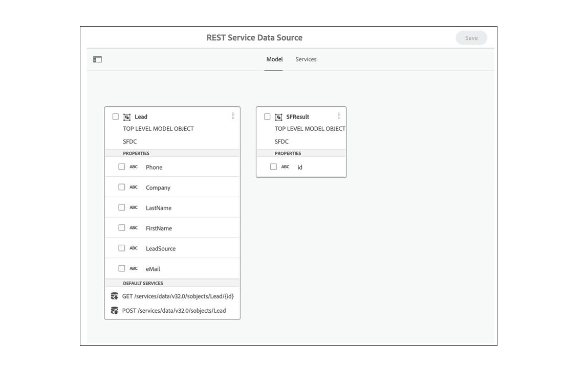

<!-- # Introduction to [!DNL AEM Forms] as a Cloud Service {#overview}

Adobe Experience Manager Forms as a Cloud Service offers a cloud-native, Platform as a Service (PaaS) solution for businesses to create, manage, publish, and update complex digital forms while integrating submitted data with back-end processes, business rules, and saving data in an external data store. The service is always current, always available, and always learning.

You can use the service to create and rollout  interactive and engaging digital forms. For example, an organization is looking to digitize their customer enrollment journey. They have multiple data sources with existing customer data, they are looking to pre-populate forms, add e-sign their forms, and archive filled forms as PDF files. Besides, the organization has multiple print forms (PDF forms), they are also looking to convert all of their print forms to digital forms.

The organization can use [!DNL AEM Forms] as a Cloud Service to create digital forms, connect forms to existing data sources, integrate forms with [!DNL Adobe Sign] to add e-signatures to forms, and generate Document of Record (DoR) to archive filled forms as PDF files. The organization can also use the service to convert their existing PDF forms to digital forms. 

An organization can sign up for [!DNL AEM Forms] as a Cloud Service and start using all these features without waiting to buy and set up a local infrastructure. The service also frees the organizations from the cycle of upgrades as it is always up to date and always offers the latest feature.  -->

# Nieuwste innovaties {#latest-innovations}

Tot de meest recente innovaties in AEM Forms as a Cloud Service behoren:

| Functie | Details |
|---|---|
| Forms zonder hoofdadapter | Maken en beheren [Forms zonder hoofdadapter](https://experienceleague.corp.adobe.com/docs/experience-manager-headless-adaptive-forms/using/overview.html) op het Adobe Experience Manager-platform. Laat uw ontwikkelaars toe om, interactieve vormen tot stand te brengen te publiceren en te beheren die met door APIs, eerder dan door een traditionele grafische gebruikersinterface kunnen worden betreden en met. communiceren.     Deze formulieren zijn ontworpen om te worden ingediend zonder dat er een traditionele interface voor HTML-formulieren nodig is. Met andere woorden, u kunt hiermee formuliergegevens programmatisch verzenden via een API of code met en zonder zichtbare formulierelementen aan de voorzijde.     Formulieren zonder kop zijn handig in verschillende scenario&#39;s, zoals bij het ontwikkelen van toepassingen van één pagina, progressieve webapps of mobiele toepassingen, waarbij een traditionele HTML-formulierinterface niet altijd nodig of praktisch is. Door ontwikkelaars toe te staan formuliergegevens rechtstreeks via API&#39;s of backendcode te verzenden, helpen headless formulieren workflows te stroomlijnen en de algehele prestaties van webtoepassingen te verbeteren. |
| Kernonderdelen | De [Adaptieve Forms Core-componenten](https://experienceleague.adobe.com/docs/experience-manager-core-components/using/adaptive-forms/introduction.html#features) zijn 24 open-source, BEM-compatibele componenten die op de basis van de Adobe Experience Manager WCM Core Components zijn gebouwd. Deze zijn speciaal ontworpen voor het maken van Adaptief Forms. Dit zijn formulieren die worden aangepast aan het apparaat, de browser en de schermgrootte van de gebruiker.     Deze componenten kunnen worden gebruikt om buitengewone ervaringen met het vastleggen en inschrijven van gegevens te maken door een groot aantal opties voor formuliervelden te bieden, zoals tekstvelden, selectievakjes, vervolgkeuzemenu&#39;s en nog veel meer. Ze bevatten ook functies zoals validatie, voorwaardelijke logica en responsief ontwerp, waarmee u formulieren kunt maken die gebruiksvriendelijk en gebruiksvriendelijk zijn.      Bovendien, aangezien deze componenten open-bron zijn, hebben de ontwikkelaars de capaciteit om de componenten gemakkelijk aan te passen en uit te breiden om aan de specifieke behoeften van hun organisatie te passen. Deze componenten zijn gebaseerd op BEM-methoden die ervoor zorgen dat ze schaalbaar en onderhoudsbaar zijn. |
| Microsoft PowerAutomate-connector | Met de AEM Forms Power Automate Connector kunt u Adobe Experience Manager (AEM) Forms integreren met Microsoft Power Automate (voorheen bekend als Microsoft Flow). Power Automate is een cloudgebaseerde service waarmee u geautomatiseerde workflows kunt maken tussen verschillende toepassingen en services.      Met AEM Form Power Automate Connector kunt u workflows maken die automatisch worden geactiveerd op basis van verzending van een adaptief formulier. U kunt bijvoorbeeld een workflow maken die automatisch een e-mailbericht naar een specifieke persoon stuurt wanneer een gebruiker een formulier verzendt of een taak maakt in Microsoft Planner wanneer een gebruiker een formulier invult.       De AEM Forms Power Automate Connector is een krachtig hulpmiddel waarmee u uw Adaptive Forms kunt automatiseren en integreren met andere toepassingen en services die aansluiten op Microsoft Power Automate, zodat u met een groter aantal tools kunt werken. U kunt workflows maken die zijn afgestemd op uw specifieke behoeften, met de mogelijkheid om aangepaste handelingen, voorwaarden en triggers toe te voegen. Daarnaast biedt Power Automate gedetailleerde analyses en rapportage, waarmee u uw workflows in de loop der tijd kunt bewaken en optimaliseren. |
| Microsoft Storage Connectors | AEM Forms Microsoft Storage Connectors voor <a href="https://experienceleague.corp.adobe.com/docs/experience-manager-cloud-service/content/forms/adaptive-forms-authoring/authoring-adaptive-forms-foundation-components/configure-submit-actions-and-metadata-submission/configuring-submit-actions.html#submit-to-sharedrive">OneDrive</a>, <a href="https://experienceleague.corp.adobe.com/docs/experience-manager-cloud-service/content/forms/adaptive-forms-authoring/authoring-adaptive-forms-foundation-components/configure-submit-actions-and-metadata-submission/configuring-submit-actions.html?#submit-to-sharedrive"> SharePoint </a> en <a href="https://experienceleague.corp.adobe.com/docs/experience-manager-cloud-service/content/forms/adaptive-forms-authoring/authoring-adaptive-forms-foundation-components/configure-submit-actions-and-metadata-submission/configuring-submit-actions.html?#submit-to-azure-blob-storage"> Azure Blob Storage </a> zijn connectors waarmee u Adobe Experience Manager (AEM) Forms kunt integreren met Microsoft OneDrive en SharePoint. Met deze connector kunt u gegevensbestanden en bijlagen rechtstreeks vanaf Adaptive Forms uploaden naar OneDrive en SharePoint.     OneDrive en SharePoint kunnen integreren met andere bedrijfstoepassingen, zoals CRM-systemen, boekhoudsoftware en tools voor projectbeheer. Hierdoor kunt u uw bedrijfsprocessen stroomlijnen, handmatige gegevensinvoer verminderen en de algehele efficiëntie verbeteren. |
| Wizard-UI | De interface van de wizard Adaptive Forms is een krachtig hulpmiddel om snel en eenvoudig adaptieve formulieren te maken. Zijn gebruikersvriendelijke interface en aanpassingsopties maken het toegankelijk voor alle gebruikers, ongeacht hun niveau van technische deskundigheid.     De wizardgebruikersinterface vereenvoudigt het proces voor het maken van adaptieve formulieren door gebruikers stapsgewijs door het maken van formulieren te begeleiden. Wizard-UI is verdeeld in veelvoudige lusjes, met elk lusje duidelijk die opties verstrekken om een Aangepast Vorm te vormen. De auteur van een formulier doorloopt de tabbladen lineair en selecteert opties, zoals sjablonen, acties en gegevensbronnen voor formuliercomponenten.     De wizardinterface stroomlijnt het proces van het ontdekken van alle essentiële opties voor een Aangepast Formulier en maakt de verwezenlijking van vorm gemakkelijker, zelfs voor gebruikers die niet met de technologie vertrouwd zijn. |
| Fast Track Analytics | Analyses van formulieren kunnen waardevolle inzichten bieden in de prestaties van formulieren door de betrokkenheid van gebruikers te meten, conversiesnelheden te optimaliseren, de prestaties van formulieren te controleren en de gebruikerservaring te verbeteren.  Door gebruikersgedrag en feedback te volgen, kunnen analyses gebieden in het formulier identificeren die frustratie of verwarring veroorzaken, waardoor het ontwerp en de functionaliteit van het formulier worden verbeterd.     Met Fast Track Analytics kunt u Forms Analytics inschakelen met één knop. Met Fast Track Analytics kunt u AEM Forms as a Cloud Service verbinden met Experience Platforms-tags en Adobe Analytics om prestatiegegevens voor gepubliceerde formulieren vast te leggen en bij te houden.         Forms as a Cloud Service geeft een Adobe Analytics-rapport over OOTB. Zo kunt u gemakkelijk de prestaties van uw formulieren begrijpen. De maatstaven op formulierniveau bieden u inzicht in de manier waarop het formulier werkt met meerdere prestatie-indicatoren (KPI&#39;s), zoals uitvoeringen, bezoekers, verzendingen, gemiddelde vultijd.     Het biedt ook informatie over het gemiddelde aantal keren dat gebruikers de Help in de context voor de velden in het deelvenster hebben geopend, zodat u beter kunt voldoen aan de velden waardoor gebruikers informatie kunnen zoeken en stoppen voordat ze informatie verstrekken. U kunt dergelijke velden verder vereenvoudigen of inhoud helpen conversies te verbeteren. |

<!-- 

# Key features and capabilities {#key-features}

[!DNL AEM Forms] as a Cloud Service provides several cloud-native capabilities such as a cloud-native architecture, auto-scaling, zero downtime for upgrades, a CDN (Content Delivery Network), cloud-native development environment, and ability to self-Service the environments via Cloud Manager. You can use the service to: 

* [Create Adaptive Forms](creating-adaptive-form.md#strong-create-an-adaptive-form-strong) that automatically render for a user's device and browser.

    

* [Create pixel-perfect PDF forms](use-forms-designer.md#create-an-adaptive-form) that look almost like paper.

* Use [Automated Forms Conversion service](https://experienceleague.adobe.com/docs/aem-forms-automated-conversion-service/using/introduction.html) to convert a PDF Form to an Adaptive Form. It helps you accelerate digitization and modernization of data capture experiences of your organization.

    

* [Create business processes](aem-forms-workflow-step-reference.md#create-form-centric-workflows). For example, You can create and trigger an approval and rejection workflow on submission of an Adaptive Form.

In addition to above [!DNL AEM Forms] as a Cloud Service offers the following features and capabilities:

* An easy-to-use graphical user interface to let business users easily import, manage, preview, and publish forms
* A responsive forms directory with powerful search features using keywords, tags, and metadata
* Dynamic detection of a user's device and location to render the form appropriately across web and mobile channels
* [Integration with Adobe Sign](adobe-sign-integration-adaptive-forms.md) services or Scribble to electronically sign documents containing confidential information
* Ability to [connect the service to various types of data sources](data-integration.md#create-an-adaptive-form) to send and retrieve data. The service supports sending and retrieving data from RESTful web services, SOAP-based web services, and OData enabled services.
* Integration with AEM Sites. It allows to embed an adaptive form in an AEM Sites page. You can also integrate an adaptive form to any webpage. 
* Ability to create a Document of Record (DoR) to keep a record of the information that you provide and submit in an Adaptive Form so that you can refer to it later. A DoR is a PDF version of a form. It includes both a template and data. The service provides a default DoR template and tools to develop a custom template.
* Ability to create Adaptive Forms to produce schema-compliant data. It helps you submit captured data to existing processes and data sources without any or minimal modifications.
* Ability to create a prefill service to fill a form with existing customer data based on a criteria. It helps fasten the form filling process and reduce the abandon rate.

<!-- 

## Enterprise-class forms {#enterprise-class-forms}

You can create enterprise class forms (Adaptive Forms) and deliver beautiful, interactive, responsive, and personalized experiences to your customers. These forms change behavior and appearance based on the underlying device. You can also use themes and templates with Adaptive Forms to mandate a uniform structure and appearance for all the forms of an organization or a department.

## Automatic conversion of PDF forms to Adaptive Forms {#automatic-conversion-of-pdf-forms-to-adaptive-forms}

You can use Automated Forms Conversion service to convert a PDF Form to an Adaptive Form. It helps you accelerate digitization and modernization of data capture experiences of your organization.

## Data Integration {#data-integration}

You can connect the service to various types of data sources to send and retrieve data. The service supports sending and retrieving data from RESTful web services, SOAP-based web services, and OData enabled services.

## Integration with [!DNL Adobe Sign] {#integration-with-adobe-sign}

 You can integrate the service with [!DNL Adobe Sign] and add [!DNL Adobe Sign] fields to an Adaptive Form. It allows your users to e-sign an Adaptive Form and use [!DNL Adobe Sign] with AEM Workflows. You can use AEM Workflows to develop a business logic and send forms and documents to recipients for signatures based on the business logic.

## Integration with [!DNL AEM Sites] {#integration-with-aem-sites}

You can embed an adaptive form in an AEM Sites or an external webpage. The service provides a component out of the box to integrate an adaptive forms to an AEM Sites page.

## Business Processes Automation {#bpa}

You can use AEM Workflows to create business processes and automate operations. For example, You can create and trigger an approval and rejection workflow on submission of an Adaptive Form. 

## Document of Record {#dor}

You can create a Document of Record (DoR) to keep a record of the information that you provide and submit in an Adaptive Form so that you can refer to it later. A DoR is a PDF version of a form. It includes both a template and data. The service provides a default DoR template and tools to develop a custom template.

## Rule editor {#rule-editor}

Rule editor empowers you to build dynamism and interactivity to Adaptive Forms. These rules define actions to trigger on form objects based on preset conditions, user inputs, and user actions on the form. It helps  streamline the form filling experience while ensuring accuracy and speed.
  

## WYSIWYG editors {#wysiwyg-editor} 

The service provides several WYSIWYG editors: Adaptive Forms editor, Theme editor, and Template editor. These help you create and edit forms and related assets in WYSIWYG manner. The editors also provide out-of-the-box options to simulate views for popular mobile devices, tablets, and desktop screen configurations.

## Schema-compliant data {#schema-complaint-data}

You can create Adaptive Forms to produce schema-compliant data. It helps you submit captured data to existing processes and data sources without any or minimal modifications.

## Prefill a form

You can create a prefill service to fill a form with existing customer data based on a criteria. It helps fasten the form filling process and reduce the abandon rate.

## Submit Actions

A Submit Action allows you to persist and process captured data. The service provides several Submit Actions out-of-the-box. You can use these Submit Actions to send submitted data to a REST endpoint, database, or an AEM Workflow. You can also email submitted data along with attachments and Document of Record(DoR). You can also develop a custom Submit Action to perform an action specific to your business.

* **Emulators:** You can view an Adaptive Form in an in-built emulator. It helps you simulate how an Adaptive Form appears on different devices to an end user. It provides out-of-the-box options to simulate views for popular mobile devices, tablets, and desktop screen configurations. 

In addition to standard [!DNL AEM Forms] features, [!DNL AEM Forms] as a Cloud Service provides several cloud-native capabilities such as a cloud-native architecture, auto-scaling, zero downtime for upgrades, a CDN (Content Delivery Network), cloud-native development environment, and ability to self-Service the environments via Cloud Manager. -->
