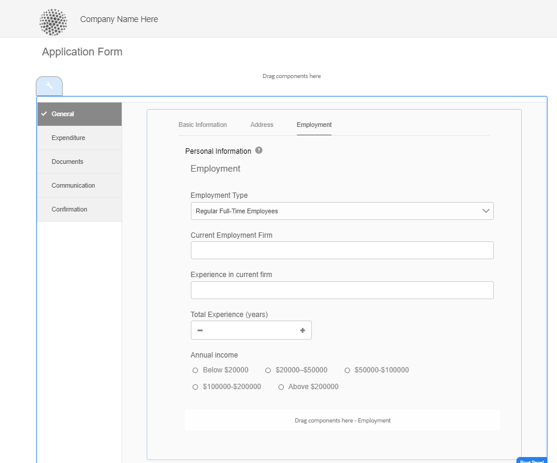

# Lay-outmogelijkheden van adaptieve Forms {#layout-capabilities-of-adaptive-forms}

>[!NOTE]
>
> De Adobe adviseert het gebruiken van de moderne en verlengbare gegevens vangt [ Componenten van de Kern ](https://experienceleague.adobe.com/docs/experience-manager-core-components/using/adaptive-forms/introduction.html) voor [ het creëren van nieuwe Aangepaste Forms ](/help/forms/creating-adaptive-form-core-components.md) of [ het toevoegen van Aangepaste Forms aan de pagina&#39;s van AEM Sites ](/help/forms/create-or-add-an-adaptive-form-to-aem-sites-page.md). Deze componenten betekenen een aanzienlijke vooruitgang in de aanmaak van Adaptive Forms en zorgen voor indrukwekkende gebruikerservaring. In dit artikel wordt een oudere aanpak beschreven voor de auteur Adaptive Forms die gebruikmaakt van stichtingscomponenten.


| Versie | Artikelkoppeling |
| -------- | ---------------------------- |
| AEM 6,5 | [ klik hier ](https://experienceleague.adobe.com/docs/experience-manager-65/forms/adaptive-forms-basic-authoring/layout-capabilities-adaptive-forms.html) |
| AEM as a Cloud Service (Core Components) | [ klik hier ](/help/forms/layout-capabilities-adaptive-forms-core-components.md) |
| AEM as a Cloud Service (Foundation Components) | Dit artikel |

Met [!DNL Adobe Experience Manager] kunt u gebruiksvriendelijke adaptieve Forms maken die eindgebruikers een dynamische ervaring biedt. De formulierindeling bepaalt hoe items of componenten in een adaptieve vorm worden weergegeven.

<!-- ## Prerequisite knowledge {#prerequisite-knowledge}

Before learning about the different layout capabilities of Adaptive Forms, read [Introduction to authoring forms](introduction-forms-authoring.md) to know more about Adaptive Forms. -->

## Typen lay-outs {#types-of-layouts}

Een adaptief formulier biedt u de volgende typen indelingen:

**[!UICONTROL Panel Layout]** Hiermee bepaalt u hoe items of componenten in een deelvenster op een apparaat worden weergegeven.

**[!UICONTROL Mobile Layout]** Hiermee regelt u de navigatie van een formulier op een mobiel apparaat. Als de apparaatbreedte 768 pixels of meer is, wordt de lay-out beschouwd als een mobiele lay-out en geoptimaliseerd voor een mobiel apparaat.

**[!UICONTROL Toolbar Layout]** Hiermee bepaalt u de plaatsing van de knoppen Handeling op de werkbalk of op de werkbalk van het deelvenster in een formulier.

Al deze deelvensterlay-outs worden gedefinieerd op de locatie `/libs/fd/af/layouts` .

Als u de indeling van een adaptief formulier wilt wijzigen, gebruikt u de ontwerpmodus in [!DNL Experience Manager] .

## [!UICONTROL Panel layout] {#panel-layout}

Een auteur van een formulier kan een indeling koppelen aan elk deelvenster van een adaptief formulier, inclusief het hoofdvenster.

De schermindelingen van het deelvenster zijn beschikbaar op de locatie `/libs/fd/af/layouts/panel` . Selecteer het paneel en selecteer  om de paneeleigenschappen te bekijken.


### [!UICONTROL Responsive - everything on one page without navigation] {#responsive-everything-on-one-page-without-navigation-br}

Met deze deelvensterlay-out maakt u een responsieve lay-out die zich aanpast aan de schermgrootte van uw apparaat zonder dat u hiervoor speciale navigatie nodig hebt.

Met deze lay-out kunt u meerdere **[!UICONTROL Panel Adaptive Form]** componenten achter elkaar in het deelvenster plaatsen.

 gebruikt

### [!UICONTROL Wizard] {#wizard}

Met deze deelvensterindeling kunt u navigatie met instructies in een formulier bieden. Gebruik deze indeling bijvoorbeeld wanneer u verplichte gegevens in een formulier wilt vastleggen en gebruikers stapsgewijs wilt begeleiden.

Gebruik de component **[!UICONTROL Panel Adaptive Form]** om stapsgewijze navigatie binnen een deelvenster te bieden. Als u deze lay-out gebruikt, gaat een gebruiker pas naar de volgende stap nadat de huidige stap is voltooid

```javascript
window.guideBridge.validate([], this.panel.navigationContext.currentItem.somExpression)
```


### [!UICONTROL Accordion] {#layout-for-accordion-design}

Met deze lay-out kunt u de component **[!UICONTROL Panel Adaptive Form]** plaatsen in een deelvenster met accordeonstijlnavigatie. Met deze indeling kunt u ook herhaalbare deelvensters maken. Met herhalende deelvensters kunt u, indien nodig, deelvensters dynamisch toevoegen of verwijderen. U kunt het minimum en het maximum aantal keren bepalen dat een paneel herhaalt. De titel van het deelvenster kan ook dynamisch worden bepaald op basis van de informatie in de deelvensteritems.

De summiere uitdrukking kan worden gebruikt om de waarden te tonen die door de gebruiker in de titel van het geminimaliseerde paneel worden verstrekt.


### [!UICONTROL Tabbed layout - tabs appear on the left]{#tabbed-layout-tabs-appear-on-the-left}

Met deze indeling kunt u de component **[!UICONTROL Panel Adaptive Form]** in een deelvenster met tabnavigatie plaatsen. De tabbladen worden links van de inhoud van het deelvenster geplaatst.


Tabs die links van een deelvenster worden weergegeven

### [!UICONTROL Tabbed layout - tabs appear on the top] {#tabbed-layout-tabs-appear-on-the-top}

Met deze indeling kunt u de component **[!UICONTROL Panel Adaptive Form]** in een deelvenster met tabnavigatie plaatsen. De tabbladen worden boven op de inhoud van het deelvenster geplaatst.



## Mobiele lay-outs {#mobile-layouts}

Mobiele lay-outs maken gebruikersvriendelijke navigatie op mobiele apparaten met relatief kleinere schermen mogelijk. Mobiele lay-outs maken gebruik van tabbladen of wizards voor formuliernavigatie. Als u een mobiele indeling toepast, beschikt u over één indeling voor het hele formulier.

Deze indeling bepaalt de navigatie met behulp van een navigatiebalk en een navigatiemenu. De navigatiebalk geeft het pictogram **&lt;** en **>** weer om de navigatiestappen **[!UICONTROL next]** en **[!UICONTROL previous]** in het formulier aan te geven.

De mobiele lay-outs zijn beschikbaar op `/libs/fd/af/layouts/mobile/` locatie. De volgende mobiele lay-outs zijn standaard beschikbaar in Adaptive Forms.


Selecteer de optie **[!UICONTROL Add navigable items of responsive layout to mobile menu]** om de opties weer te geven die beschikbaar zijn voor een deelvenster in de mobiele lay-out. De opties voor navigatie zijn alleen zichtbaar als u **[!UICONTROL Responsive]** lay-out voor een deelvenster selecteert.

Wanneer het gebruiken van een Mobiele lay-out, is het vormmenu, om tot diverse vormpanelen toegang te hebben, beschikbaar door  pictogram.

### [!UICONTROL Layout with panel titles in the form header] {#layout-with-panel-titles-in-the-form-header}

In deze indeling worden, zoals in de naam wordt gesuggereerd, deelvenstertitels weergegeven, samen met het navigatiemenu en de navigatiebalk. Deze indeling biedt ook de pictogrammen Volgende en Vorige voor navigatie.


### [!UICONTROL Layout without panel titles in the form header]{#layout-without-panel-titles-in-the-form-header}

In deze indeling worden, zoals in de naam wordt gesuggereerd, alleen het navigatiemenu en de navigatiebalk zonder venstertitels weergegeven. Deze indeling biedt ook de pictogrammen Volgende en Vorige voor navigatie.


## Zie ook {#see-also}

{{see-also}}


<!-- ## Toolbar layouts {#toolbar-layouts}

A Toolbar Layout controls positioning and display of any action buttons that you add to your Adaptive Forms. The layout can be added at a form level or at a panel level.


A list of Toolbar Layouts in Adaptive Forms

Toolbar layouts are available at `/libs/fd/af/layouts/toolbar` location. Adaptive Forms provide the following Toolbar Layouts, by default.

### [!UICONTROL Default layout for toolbar] {#default-layout-for-toolbar}

This layout is selected as the default layout when you add any action buttons in an Adaptive Form. Selecting this layout displays the same layout for both, desktop and mobile devices.

Also, you can add multiple toolbars containing action buttons configured with this layout. An action button is associated with a form control. You can configure the toolbars to be before or after a panel.


Default view for toolbar

### [!UICONTROL Mobile fixed layout for toolbar] {#mobile-fixed-layout-for-toolbar}

Select this layout to provide alternate layouts for desktop and mobile devices.

For the desktop layout, you can add Action buttons using some specific labels. Only one toolbar can be configured with this layout. If more than one toolbar is configured with this layout, there is an overlap for mobile devices and only one toolbar is visible. For example, you can have a toolbar at the bottom or the top of the form, or, after or before panels in the form.

For the Mobile layout, you can add action buttons using icons.


Mobile fixed layout for toolbar-->


