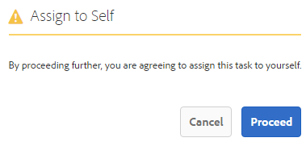

# Forms-toepassingen en -taken beheren in AEM Inbox{#manage-forms-applications-and-tasks-in-aem-inbox}

Een van de vele manieren om een Forms-centric workflow te starten of activeren is via toepassingen in AEM Inbox. U moet een workflowtoepassing maken om een Forms Workflow als toepassing beschikbaar te maken in Inbox. Voor meer informatie over werkschematoepassing en andere manieren om de werkschema&#39;s van Forms te lanceren, zie [&#x200B; Lancering een Forms-centric werkschema op OSGi &#x200B;](aem-forms-workflow.md#launch).

Daarnaast consolideert AEM Inbox meldingen en taken van verschillende AEM-componenten, waaronder Forms-workflows. Wanneer een Forms Workflow die een taakstap toewijzen bevat, wordt geactiveerd, wordt de bijbehorende toepassing weergegeven als een taak in het Postvak In van de ontvanger. Als de toegewezen persoon een groep is, wordt de taak in het Postvak In van alle groepsleden weergegeven totdat een persoon de taak aanvraagt of delegeert.

De gebruikersinterface van Inbox verstrekt lijst en kalendermeningen om taken te bekijken. U kunt ook de weergave-instellingen configureren. U kunt taken filteren op basis van verschillende parameters. Voor meer informatie over mening en filters, zie [&#x200B; Uw Inbox &#x200B;](https://experienceleague.adobe.com/docs/experience-manager-cloud-service/sites/authoring/getting-started/inbox.html?lang=nl-NL#inbox-in-the-header).

Samenvattend kunt u met Inbox een toepassing maken en toegewezen taken beheren.

>[!NOTE]
>
>U moet lid zijn van de groep [!DNL workflow-users] om AEM Inbox te kunnen gebruiken.

## Toepassing maken {#create-application}

1. Ga naar AEM Inbox in https://&#39;[ server ]:[ haven ]&#39;/aem/inbox.
1. Selecteer **[!UICONTROL Create > Application]** in de gebruikersinterface van het Postvak IN. De pagina Selecteer toepassing wordt weergegeven.
1. Selecteer een toepassing en klik op **[!UICONTROL Create]** . Het adaptieve formulier dat aan de toepassing is gekoppeld, wordt geopend. Vul de gegevens in het adaptieve formulier in en selecteer **[!UICONTROL Submit]** . De bijbehorende workflow wordt gestart en er wordt een taak gemaakt in het Postvak In van de ontvanger.

## Taken beheren {#manage-tasks}

Als een Forms-workflowtrigger wordt geactiveerd en u bent een toegewezen persoon of onderdeel van de groep waaraan u bent toegewezen, wordt een taak weergegeven in uw Postvak In. U kunt taakdetails bekijken en beschikbare acties op de taak van binnen Inbox uitvoeren.

### Vorderingen of gedelegeerde taken {#claim-or-delegate-tasks}

De taken die aan een groep worden toegewezen verschijnen in Inbox van alle groepsleden. Om het even welk groepslid kan die taak beweren of het aan een ander groepslid delegeren. Daartoe:

1. Selecteer deze optie om de miniatuur van de taak te selecteren. Opties voor het openen of delegeren van de taak worden bovenaan weergegeven.

   

1. Voer een van de volgende handelingen uit:

   * Selecteer **[!UICONTROL Delegate]** als u de taak wilt delegeren. Het dialoogvenster Item delegeren wordt geopend. Selecteer een gebruiker, voeg desgewenst een opmerking toe en selecteer **[!UICONTROL OK]** .

   

   * Selecteer **[!UICONTROL Open]** om de taak op te eisen. Het dialoogvenster Toewijzen aan zelf wordt geopend. Selecteer **[!UICONTROL Proceed]** om de taak te claimen. De geclaimde taak wordt met u weergegeven als de toegewezen persoon in uw Postvak IN.

   

### Details weergeven en handelingen uitvoeren voor taken {#view-details-and-perform-actions-on-tasks}

Wanneer u een taak opent, kunt u taakdetails bekijken en beschikbare acties uitvoeren. De acties beschikbaar voor een taak worden bepaald in de Assign taakstap van bijbehorende Forms Workflow.

1. Selecteer deze optie om de miniatuur van de taak te selecteren. Opties voor het openen of delegeren van de geselecteerde taak worden bovenaan weergegeven.
1. Selecteer **Open** om taakdetails en beschikbare acties te bekijken. De gedetailleerde taakweergave wordt geopend. In deze weergave kunt u taakdetails weergeven en op een taak reageren.

   >[!NOTE]
   >
   >Als een taak aan een groep wordt toegewezen, moet u beweren het in gedetailleerde mening kan openen.


De gedetailleerde taakmening omvat de volgende secties:

* Taakdetails
* Formulier
* Workflowdetails
* Werkbalk Handelingen

#### Taakdetails {#task-details}

In de sectie Taakdetails wordt informatie over de taak weergegeven. De getoonde informatie hangt van de configuratiemontages van [&#x200B; af wijst taakstap &#x200B;](https://experienceleague.adobe.com/docs/experience-manager-65/developing/extending-aem/extending-workflows/workflows-step-ref.html?lang=nl-NL#extending-aem) in het werkschema toe. In het bovenstaande voorbeeld worden de beschrijving, de status, de begindatum en de workflow weergegeven die voor de taak worden gebruikt. U kunt ook een bestand aan de taak koppelen.

#### Formulier {#form}

Op het tabblad Formulier in het hoofdinhoudsgebied worden het verzonden formulier en eventuele bijlagen op veldniveau weergegeven.

#### Workflowdetails {#workflow-details}

Het tabblad Workflowdetails bovenaan geeft de voortgang van de taak in verschillende fasen van de workflow weer. Het toont voltooide, huidige, en hangende stadia voor de taak. De stadia voor een werkschema worden bepaald in [&#x200B; wijs taakstap &#x200B;](https://experienceleague.adobe.com/docs/experience-manager-65/developing/extending-aem/extending-workflows/workflows-step-ref.html?lang=nl-NL#extending-aem) van het bijbehorende werkschema toe.

Bovendien geeft het tabblad de taakgeschiedenis weer voor elk voltooid werkgebied in de workflow. U kunt **[!UICONTROL View Details]** selecteren voor een voltooid werkgebied om details over dat werkgebied te kennen. Er worden opmerkingen, formulier- en taakbijlagen, status, begin- en einddatums enzovoort over de taak weergegeven.


#### Werkbalk Handelingen {#actions-toolbar}

Op de werkbalk Handelingen staan alle beschikbare opties voor de taak. Terwijl sparen, het Terugstellen, en de Afgevaardigde standaardacties zijn, worden andere beschikbare acties gevormd in [&#x200B; toewijzen taakstap &#x200B;](https://experienceleague.adobe.com/docs/experience-manager-65/developing/extending-aem/extending-workflows/workflows-step-ref.html?lang=nl-NL#extending-aem). In het bovenstaande voorbeeld worden Goedkeuren en Afwijzen geconfigureerd in de workflow.

Als u de taak uitvoert, gaat deze verder in de workflow.

### Voltooide taken weergeven {#view-completed-tasks}

In AEM Inbox worden alleen actieve taken weergegeven. Voltooide taken worden niet in de lijst weergegeven. U kunt echter Inbox-filters gebruiken om taken te filteren op basis van verschillende parameters, zoals taaktype, status, begin- en einddatum. Voltooide taken weergeven:

1. In AEM Inbox, uitgezochte  om de filterselecteur te openen.
1. Selecteer **[!UICONTROL Task Status]** accordion en selecteer **[!UICONTROL Complete]** . Alle voltooide taken worden weergegeven.

   

1. Selecteer deze optie om een taak te selecteren en klik op **[!UICONTROL Open]** .

De taak wordt geopend om het document of het adaptieve formulier weer te geven dat aan de taak is gekoppeld. Voor Aanpassings Vorm, toont de taak de read-only Aanpassings Vorm of zijn Document van PDF van Verslag zoals gevormd in het lusje van de Vorm/van het Document van de [&#x200B; werkschemastap van de Taak toewijzen &#x200B;](https://experienceleague.adobe.com/docs/experience-manager-65/developing/extending-aem/extending-workflows/workflows-step-ref.html?lang=nl-NL#extending-aem).

In de sectie met taakdetails wordt informatie weergegeven zoals de ondernomen actie, taakstatus, begindatum en einddatum.


Op het tabblad **[!UICONTROL Workflow Details]** wordt elke stap van de workflow weergegeven. Selecteer **[!UICONTROL View details]** voor een stap voor meer informatie.


## Problemen oplossen {#troubleshooting-workflows}

### Kan geen items weergeven die gerelateerd zijn aan AEM Workflow in AEM Inbox {#unable-to-see-aem-worklow-items}

Een eigenaar van een workflowmodel kan geen items weergeven die gerelateerd zijn aan de AEM Workflow in AEM Inbox. Om het probleem op te lossen, voegt u de onderstaande indices toe aan uw AEM-opslagplaats en maakt u de index opnieuw.

1. Gebruik een van de volgende methoden om indexen toe te voegen:

   * Maak de volgende knooppunten in CRX DE op `/oak:index/workflowDataLucene/indexRules/granite:InboxItem/properties` met de respectievelijke eigenschappen zoals opgegeven in de volgende tabel:

     | Knooppunt | Eigenschap | Type |
     |---|---|---|
     | sharedWith | sharedWith | TEKENREEKS |
     | vergrendeld | vergrendeld | BOOLEAN |
     | geretourneerd | geretourneerd | BOOLEAN |
     | allowInboxSharing | allowInboxSharing | BOOLEAN |
     | allowExplicitSharing | allowExplicitSharing | BOOLEAN |


   * Implementeer de indices via een AEM-pakket. U kunt een [&#x200B; Archetype van AEM &#x200B;](https://experienceleague.adobe.com/docs/experience-manager-core-components/using/developing/archetype/overview.html?lang=nl-NL) project gebruiken om een plaatsbaar pakket van AEM tot stand te brengen. Gebruik de volgende voorbeeldcode om indexen toe te voegen aan een AEM Archetype-project:

   ```Java
      .property("sharedWith", "sharedWith").type(TYPENAME_STRING).propertyIndex()
      .property("locked", "locked").type(TYPENAME_BOOLEAN).propertyIndex()
      .property("returned", "returned").type(TYPENAME_BOOLEAN).propertyIndex()
      .property("allowInboxSharing", "allowInboxSharing").type(TYPENAME_BOOLEAN).propertyIndex()
      .property("allowExplicitSharing", "allowExplicitSharing").type(TYPENAME_BOOLEAN).propertyIndex()
   ```

1. [&#x200B; creeer een Index van het Bezit en plaats het aan waar &#x200B;](https://experienceleague.adobe.com/docs/experience-manager-65/deploying/deploying/queries-and-indexing.html?lang=nl-NL#the-property-index).

1. Na het configureren van indices in CRX DE of het implementeren via een pakket, dient u de repository opnieuw te indexeren.
