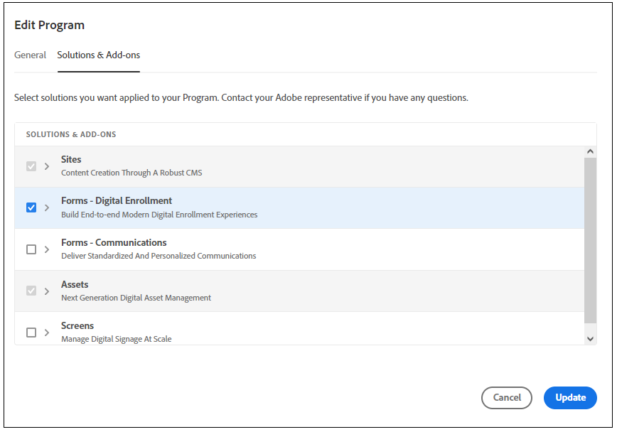

# Migreren van een [!DNL AEM Forms] (Op locatie en AMS-omgevingen) naar [!DNL AEM Forms] as a Cloud Service  {#Harden-your-AEM-Forms-as-a-Cloud-Service-environment}

| Versie | Artikelkoppeling |
| -------- | ---------------------------- |
| AEM 6,5 | [Klik hier](https://experienceleague.adobe.com/docs/experience-manager-65/forms/upgrade-aem-forms/upgrade.html) |
| AEM as a Cloud Service | Dit artikel |

U kunt uw adaptieve Forms-, thema-, sjablonen- en cloudconfiguraties migreren of upgraden vanuit <!-- AEM 6.3 Forms AEM 6.4 Forms on OSGi and --> AEM 6.5 Forms over OSGi aan [!DNL AEM] as a Cloud Service. Voordat u deze elementen gaat migreren, gebruikt u het migratiehulpprogramma om de indeling die in de eerdere versies werd gebruikt, om te zetten in de indeling die in [!DNL AEM] as a Cloud Service.
Laten we beginnen met de migratiereis naar AEM as a Cloud Service | Adobe Experience Manager. Wanneer u het Hulpprogramma voor migratie uitvoert, worden de volgende middelen bijgewerkt:

* Aangepaste componenten voor adaptieve Forms
* Aangepaste Forms-sjablonen en -thema&#39;s
* Cloud-configuraties
* Scripts van de code-editor worden omgezet in herbruikbare functies en toegepast op visuele regels.

## Overwegingen bij migratie naar as a Cloud Service Forms {#consideration}

Om van AEM 6.5 Forms naar AEM Cloud Service te migreren, is het belangrijk rekening te houden met de volgende punten:

* De service helpt inhoud alleen te migreren van [!DNL AEM Forms] in OSGi-omgevingen. Inhoud migreren uit [!DNL AEM Forms] op JEE aan een milieu van de Cloud Service wordt niet gesteund.

* (Alleen voor versies ouder dan AEM 6.5 Forms) Adaptieve Forms op basis van out-of-the-box sjablonen en thema&#39;s die beschikbaar zijn in AEM 6.3 Forms of vorige versie worden niet ondersteund op [!DNL AEM Forms] as a Cloud Service.

* Adobe Experience Manager Forms as a Cloud Service brengt een aantal opmerkelijke veranderingen in bestaande eigenschappen in vergelijking met Adobe Experience Manager 6.5 Forms (On-Premise en Adobe-Beheerde Dienst) milieu&#39;s. Voordat u naar de service gaat migreren, [Meer informatie over deze opmerkelijke wijzigingen](notable-changes.md) en de [verschillen op functieniveau](https://experienceleague.adobe.com/docs/experience-manager-cloud-service/content/migration-journey/cloud-migration/best-practices-analyzer/using-best-practices-analyzer.html?lang=en#viewing-report) om te beslissen over migratie op basis van functies die uw organisatie nodig heeft.

<!-- 
## Difference with AEM 6.5 Forms 

| Feature         | Difference with AEM 6.5 Forms    |
|--------------|-----------|
| HTML5 Forms (Mobile Forms)     | The service does not support HTML5 Forms (Mobile Forms). If you render your XDP-based forms as HTML5 Forms, you can continue using the feature on AEM 6.5 Forms. |
| Adaptive Forms     | <li><b>XSD-Based Adaptive Forms:</b> The service does not support HTML5 Forms (Mobile Forms). If you render your XDP-based forms as HTML5 Forms, you can continue using the feature on AEM 6.5 Forms. </li> <li><b> Adaptive Form templates:</b> Use build pipeline and corresponding Git repository of your program to import existing Adaptive Form templates. </li><li><b>Rule editor:</b> AEM Forms as a Cloud Service provides a hardened [Rule editor](rule-editor.md#visual-rule-editor). The code editor is not available on Forms as a Cloud Service. The migration utility helps you migrate your forms that have custom rules (created in code editor). The utility converts such rules into custom functions supported on Forms as a Cloud Service. You can use the reusable functions with Rule editor to continue obtaining results obtained with rule scripts  The `onSubmitError` or `onSubmitSuccess` functions are now available as actions the Rule Editor. </li> <li><b>Drafts and submissions:</b> The service does not retain metadata for drafts and submitted Adaptive Forms. </li> <li><b> Prefill Service:</b> By default, the prefill service merges data with an Adaptive Form at client as opposed to merging data on Server in AEM 6.5 Forms. The feature helps improve the time required to prefill an Adaptive Form. You can always configure to run the merge action on the Adobe Experience Manager Forms Server. </li><li><b>Submit actions:</b> The **Email as PDF** action is not available. The **Email** submit action provide options to send attachments and attach Document of Record (DoR) with email. </li>|
| Form Data Model | <li>Forms data model supports only HTTP and HTTPs endpoints to submit data. </li><li>Forms as a Cloud Service allows to use Microsoft Azure Blob, Microsoft Sharepoint, Microsoft OneDrive, and services supporting general CRUD (Create, Read, Update, and Delete) operations as data stores. The service does not support JDBC connector, Mutual SSL for Rest connector, and x509 certificate-based authentication for SOAP data sources. </li>|
| Automated Forms Conversion Service     | The service does not provide meta-model for Automated Forms Conversion Service. You can [download it from Automated Forms Conversion Service documentation](https://experienceleague.adobe.com/docs/aem-forms-automated-conversion-service/using/extending-the-default-meta-model.html?lang=en#default-meta-model).|
|Configurations|<li>Email support only HTTP and HTTPs protocols, by default. [Contact the support team](https://experienceleague.adobe.com/docs/experience-manager-cloud-service/implementing/developing/development-guidelines.html#sending-email) to enable ports for sending emails and to enable SMTP protocol for your environment. </li> <li>If you use custom bundles, recompile your code with latest version of adobe-aemfd-docmanager before using these bundles with Forms as a Cloud Service.</li> |
| Document Manipulation APIs (Assembler Service)| The service does not support operations dependent on other services or applications: <li>Conversion of documents in a non-PDF format to a PDF format is not supported. For example, Microsoft Word to PDF, Microsoft Excel to PDF, and HTML to PDF are not supported</li><li>Adobe Distiller-based conversions are not supported. For example, PostScript(PS) to PDF</li><li>Forms Service-based conversions are not supported. For example, XDP to PDF Forms.</li><li>The service does not support converting a Signed PDF or Transparent PDF to another PDF format.</li>| -->

## Vereisten {#prerequisites}

Om een soepele overgang van AEM Forms 6.5 naar AEM as a Cloud Service omgeving te garanderen, is het belangrijk de volgende voorwaarden in overweging te nemen:

* Inschakelen [Forms - Digitale inschrijving](https://experienceleague.adobe.com/docs/experience-manager-cloud-manager/using/getting-started/setting-up-program.html?#editing-program) voor uw Forms Cloud Service-programma en [de pijpleiding in werking stellen](https://experienceleague.adobe.com/docs/experience-manager-cloud-manager/using/how-to-use/deploying-code.html).

  

* In een Cloud Service-omgeving werkt het migratiehulpprogramma samen met het Hulpprogramma voor het toewijzen van gebruikersgegevens en het gereedschap voor het overbrengen van inhoud. Het migratiehulpprogramma maakt [!DNL AEM Forms] elementen die compatibel zijn met Cloud Service en het gereedschap voor inhoudsoverdracht migreren de inhoud van uw [!DNL AEM Forms] milieu aan [!DNL AEM] as a Cloud Service omgeving. Voordat u het migratiehulpprogramma gaat gebruiken, moet u het proces van [verplaatsen naar AEM as a Cloud Service](https://experienceleague.adobe.com/docs/experience-manager-cloud-service/moving/home.html). Het proces heeft twee gereedschappen:
   * [Gereedschap Gebruiker toewijzen](https://experienceleague.adobe.com/docs/experience-manager-cloud-service/moving/cloud-migration/content-transfer-tool/using-user-mapping-tool.html?lang=en#cloud-migration): Met het gereedschap Toewijzing gebruiker kunt u uw gebruikers toewijzen met de bijbehorende Adobe IMS-gebruikersaccounts.
   * [Inhoud overbrengen](https://experienceleague.adobe.com/docs/experience-manager-cloud-service/moving/cloud-migration/content-transfer-tool/overview-content-transfer-tool.html?#cloud-migration): Met het gereedschap Inhoud overbrengen kunt u inhoud voorbereiden en overbrengen van een bestaande omgeving naar een Cloud Service-omgeving. Hiermee kunnen gebruikers eenvoudig upgraden van AEM Forms naar de cloud-omgeving.
* Accounts met beheerdersrechten op [!DNL AEM Forms] as a Cloud Service en uw lokale [!DNL AEM Forms] milieu.
* Download en installeer Best Practice Analyzer, Content Transfer Tool en [!DNL AEM Forms] Hulpprogramma voor migratie van [Software Distribution Portal.](https://experience.adobe.com/#/downloads/content/software-distribution/en/aemcloud.html)

* Voer de [Analysator van best practices](https://experienceleague.adobe.com/docs/experience-manager-cloud-service/moving/cloud-migration/best-practices-analyzer/overview-best-practices-analyzer.html?lang=en#cloud-migration) en verhelpt u het gerapporteerde probleem. Voor de mogelijke problemen met betrekking tot de migratie van Adobe Experience Manager Forms naar Adobe Experience Manager Forms as a Cloud Service gaat u naar [AEM Patroondetectie voor Forms as a Cloud Service](https://experienceleague.adobe.com/docs/experience-manager-cloud-service/content/migration-journey/cloud-migration/best-practices-analyzer/using-best-practices-analyzer.html?lang=en#viewing-report).

<!-- * Download the latest [compatibility package](https://experienceleague.adobe.com/docs/experience-manager-release-information/aem-release-updates/forms-updates/aem-forms-releases.html?lang=en#aem-65-forms-releases) for your [!DNL AEM Forms] version. -->

## Migreren [!DNL AEM 6.5 Forms] activa aan AEM Cloud Service {#use-the-migration-utility}

Voer de volgende stappen uit om uw [!DNL AEM Forms] activa die verenigbaar zijn met de Cloud Service, en deze overdragen aan een [!DNL AEM] as a Cloud Service omgeving.

1. Een [klonen](https://experienceleaguecommunities.adobe.com/t5/adobe-experience-manager/correct-method-to-clone-the-aem-environment/qaq-p/363487) van uw bestaande [!DNL AEM Forms] milieu.

   >[!NOTE]
   >
   > Wanneer u van 6.5 naar de cloudservice migreert, wordt u aangeraden de gekloonde omgeving te gebruiken om het gereedschap Inhoud overbrengen en het migratiehulpprogramma uit te voeren. Met het hulpprogramma voor het overbrengen van inhoud en het migratiehulpprogramma wijzigt u de inhoud en elementen. Voer dus het gereedschap Inhoud overbrengen en het migratiehulpprogramma niet uit in een productieomgeving.

1. Meld u met beheerdersrechten aan bij uw gekloonde omgeving.

1. Voer de [Gereedschap Gebruiker toewijzen](https://experienceleague.adobe.com/docs/experience-manager-cloud-service/moving/cloud-migration/content-transfer-tool/using-user-mapping-tool.html?lang=en#cloud-migration) om uw gebruikers toe te wijzen aan de overeenkomstige Adobe IMS-gebruikersaccounts. Adobe IMS-gebruikersaccounts moeten zich aanmelden bij een [!DNL AEM Forms] as a Cloud Service instantie.

1. Download en installeer de [Inhoud overbrengen](https://experienceleague.adobe.com/docs/experience-manager-cloud-service/moving/cloud-migration/content-transfer-tool/overview-content-transfer-tool.html?#cloud-migration) en [!DNL AEM Forms] as a Cloud Service migratiehulpprogramma van [Software Distribution Portal](https://experience.adobe.com/#/downloads/content/software-distribution/en/aemcloud.html) over de gekloonde omgeving. U kunt AEM Package Manager gebruiken om het hulpmiddel en het nut te installeren.

1. Navigeren naar **[!UICONTROL Tools]** > **[!UICONTROL Operations]** > **[!UICONTROL Content Migration]**.

1. Open de **[!UICONTROL Prepare Forms for migration]** kaart. In de browser worden vijf opties weergegeven:
   * **[!UICONTROL AEM Forms Assets Migration]**
   * **[!UICONTROL Adaptive Forms Custom Components Migration]**
   * **[!UICONTROL Adaptive Forms Templates Migration]**
   * **[!UICONTROL AEM Forms Cloud Configurations Migration]**
   * **[!UICONTROL Code Editor Script Migration]**

1. Gebruik de optie een voor een om uw [!DNL AEM Forms] activa die verenigbaar zijn met [!DNL AEM] as a Cloud Service:

   1. Selecteren **[!UICONTROL AEM Forms Assets Migration]** en in het volgende scherm selecteert u **[!UICONTROL Start Migration]**. Het maakt Adaptieve Forms en thema&#39;s op uw [!DNL AEM Forms] milieu verenigbaar met [!DNL AEM] AS A CLOUD SERVICE .

   1. Selecteren **[!UICONTROL Adaptive Forms Custom Components Migration]** en selecteert u op de pagina Custom Components Migration de optie **[!UICONTROL Start Migration]**. Elke aangepaste component die is ontwikkeld voor Adaptive Forms en componentoverlays op uw [!DNL AEM Forms] milieu verenigbaar met [!DNL AEM] AS A CLOUD SERVICE .

   1. Selecteren **[!UICONTROL Adaptive Forms Template Migration]** en selecteert u op de pagina Custom Components Migration de optie **[!UICONTROL Start Migration]**. Er worden adaptieve formuliersjablonen gemaakt op `/apps` of `/conf` en gemaakt met AEM Sjablooneditor die compatibel is met [!DNL AEM] AS A CLOUD SERVICE .

   1. Selecteren **[!UICONTROL AEM Forms Cloud Configurations Migration]** en vervolgens op de pagina Configuratie-migratie selecteert u **[!UICONTROL Start Migration]**. De volgende Cloud Servicen worden bijgewerkt en naar een nieuwe locatie verplaatst:

      * Cloud Service formuliergegevensmodel
      * Google reCAPTCHA Cloud Service
      * [!DNL Adobe Sign] Cloud Service
      * Adobe Fonts Cloud Service

   1. Selecteren **[!UICONTROL Code Editor Script Migration]**, geeft u een locatie op waar herbruikbare functies moeten worden opgeslagen en selecteert u **[!UICONTROL Start Migration].

   De Cloud Service ondersteunt geen regeleditorscripts. De **[!UICONTROL Code editor script migration]** het hulpmiddel zet alle regelmanuscripten op uw milieu in herbruikbare functies om en past de herbruikbare functies op visuele redacteur op aangewezen plaats toe. Deze herbruikbare functies worden opgeslagen in de vorm van clientbibliotheken en zorgen ervoor dat de bestaande functionaliteit behouden blijft. Het gereedschap past automatisch de gegenereerde herbruikbare functies toe op de overeenkomstige adaptieve Forms.

   AEM de migratie van formulieren naar de Cloud Service [Pakketbeheer](https://experienceleague.adobe.com/docs/experience-manager-65/administering/contentmanagement/package-manager.html?lang=en#contentmanagement) om de herbruikbare functies (Clientbibliotheken) naar een pakket te exporteren.

1. [Implementeren](https://experienceleague.adobe.com/docs/experience-manager-cloud-service/implementing/deploying/overview.html?lang=en#deploying-content-packages-via-cloud-manager-and-package-manager) het pakket herbruikbare functies (Client Libraries); [aangepaste code, componenten, configuraties](https://experienceleague.adobe.com/docs/experience-manager-learn/cloud-service/cloud-manager/devops/deploy-code.html#cloud-manager), aangepaste, landspecifieke bibliotheken voor uw [!DNL AEM] as a Cloud Service omgeving.

   <!-- 1. Install the latest [Compatibility Package](https://experienceleague.adobe.com/docs/experience-manager-cloud-service/moving/cloud-migration/content-transfer-tool/overview-content-transfer-tool.html?#cloud-migration) to your cloned [!DNL AEM Forms] environment. -->

1. Voer de [Inhoud overbrengen](https://experienceleague.adobe.com/docs/experience-manager-cloud-service/moving/cloud-migration/content-transfer-tool/overview-content-transfer-tool.html?#cloud-migration). Terwijl het specificeren van parameters op **[!UICONTROL Create Migration Set]** het scherm, specificeer de weg van Adaptive Forms, thema&#39;s, malplaatjes, het Model van de Gegevens van de Vorm (FDM), Cloud Servicen, de Componenten van de Douane en andere AEM Forms-specifieke activa aan het **[!UICONTROL Paths to be included]** -optie. Opgegeven [!DNL AEM Forms] te migreren elementen.

## Paden van verschillende AEM Forms-specifieke activa

Wanneer u van AEM Forms 6.5 naar de cloudservice migreert, kunt u de AEM Forms-specifieke middelen vinden op:

* **Adaptieve Forms**: U kunt Adaptieve formulieren vinden op `/content/dam/formsanddocuments/`en `/content/forms/af`. Voeg bijvoorbeeld paden toe voor een adaptief formulier met de naam WKND-registratie `/content/dam/formsanddocuments/wknd-registration` en `/content/forms/af/wknd-registration`.
* **Formuliergegevensmodel**: U kunt alle FDM (Form Data Model) vinden op `/content/dam/formsanddocuments-fdm`. Bijvoorbeeld: `/content/dam/formsanddocuments-fdm/ms-dynamics-fdm`.

* **Clientbibliotheken**: Het standaardpad van clientbibliotheken is `/etc/clientlibs/fd/theme`.

* **Aangepaste formuliersjablonen**: Het standaardpad van sjablonen is `/conf/<template folder>`. Voor een sjabloon met de naam basis voegt u bijvoorbeeld een pad toe `/conf/ReferenceEditableTemplates/settings/wcm/templates/basic`.

* **Adaptieve formulierthema&#39;s en clientbibliotheken**: Het standaardpad van thema&#39;s is ` /content/dam/formsanddocuments-themes/` en het standaardpad van de clientbibliotheken is `/etc/clientlibs/fd/theme`. Voor een sjabloon met de naam WKND-thema voegt u bijvoorbeeld een pad toe ` /content/dam/formsanddocuments-themes/wkndtheme` en clientbibliotheken voor het thema op `/etc/clientlibs/reference-themes/wkndtheme-3-0`. U kunt thema&#39;s en cliëntbibliotheken bij andere douanepaden ook hebben.

* **Cloudconfiguraties**: U vindt Cloud Configurations op `/conf/`. De cloudconfiguratie van het Form Data Model (FDM) bevindt zich bijvoorbeeld op `/conf/global/settings/cloudconfigs/fdm`.

* **Workflowmodel**: U kunt AEM workflowmodellen vinden op `/conf/global/settings/workflow/models/`. Bijvoorbeeld voor een workflowmodel met de naam WKND-registratie: pad toevoegen `/conf/global/settings/workflow/models/wknd-registration`

U kunt hieronder vermelde mappaden op het hoogste niveau toevoegen of specifieke mappaden zoals hieronder beschreven. Hiermee kunt u een bepaald middel en alle elementen en formulieren tegelijk migreren wanneer u een upgrade uitvoert naar de cloudservice van AEM formulieren 6.5.

* `/content/dam/formsanddocuments-fdm`
* `/content/dam/formsanddocuments/themes`
* `/content/forms/af`
* `/etc/clientlibs/fd/theme`

Wanneer u AEM workflowmodellen van AEM Forms 6.5 naar Cloud Service migreert, geeft u de volgende paden op:

* `/conf/global/settings/workflow/models/`
* `/conf/global/settings/workflow/launcher`
* `/var/workflow/models`

## Zie volgende

* [Opvallende wijzigingen voor bestaande Adobe Experience Manager 6.5 Forms-gebruikers](https://experienceleague.adobe.com/docs/experience-manager-cloud-service/content/forms/forms-overview/notable-changes.html)
* [Aan boord van AEM Forms as a Cloud Service](https://experienceleague.adobe.com/docs/experience-manager-cloud-service/content/forms/setup-configure-migrate/setup-forms-cloud-service.html)
* [Uw eerste adaptieve formulier maken op Cloud Service](https://experienceleague.adobe.com/docs/experience-manager-cloud-service/content/forms/adaptive-forms-authoring/authoring-adaptive-forms-foundation-components/create-an-adaptive-form-on-forms-cs/creating-adaptive-form.html)

## Aanvullende informatie

Met het migratiehulpprogramma kunt u Adaptief Forms migreren op basis van stichtingscomponenten. Daarnaast biedt Forms as a Cloud Service ondersteuning voor Adaptive Forms Core Components. U kunt dus:

* [Zelfstandige adaptieve Forms op basis van Core Component maken](/help/forms/creating-adaptive-form-core-components.md)
* [Een adaptief formulier op basis van een Core-component rechtstreeks op een AEM Sites-pagina maken](/help/forms/create-or-add-an-adaptive-form-to-aem-sites-page.md)

Meer informatie over as a Cloud Service AEM Forms vindt u in:

* [Inleiding tot AEM Forms Cloud Service](/help/forms/home.md)
* [Innovaties in AEM Forms Cloud Service](/help/forms/latest-innovations.md)