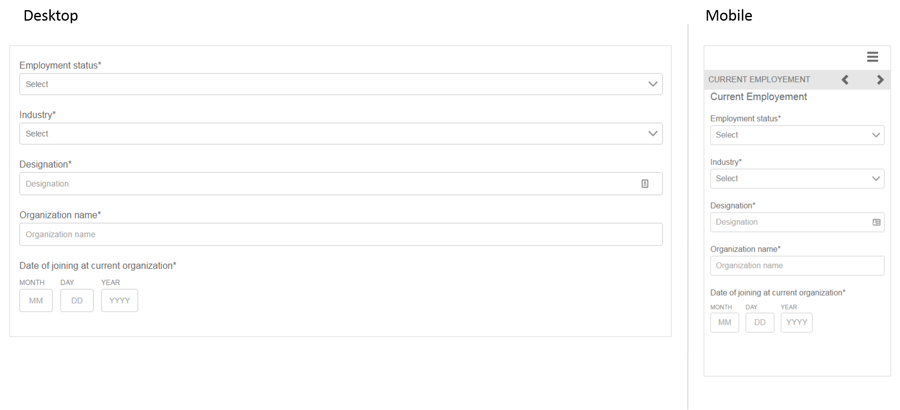

# Referentie adaptieve formulierfragmenten {#reference-adaptive-form-fragments}

Adaptief formulierfragment is een groep velden of een deelvenster met een groep velden die u kunt gebruiken wanneer u een formulier maakt. Hiermee kunt u gemakkelijk en snel een formulier maken. U kunt een adaptief formulierfragment naar een formulier slepen met de middelenbrowser in het zijpaneel en het vervolgens bewerken in de formuliereditor.

Voor de Aanpassings auteurs van Forms, worden de verwijzingsfragmenten verstrekt in het [!DNL AEM Forms] pakket [[!DNL AEM FORMS]  FRAGMENTEN VAN DE VERWIJZING ](https://www.adobeaemcloud.com/content/marketplace/marketplaceProxy.html?packagePath=/content/companies/public/adobe/packages/cq630/fd/AEM-FORMS-6.3-REFERENCE-FRAGMENTS). Het bevat de volgende fragmenten:

* Adres
* Contactgegevens
* Creditcardgegevens
* Huidige werkgelegenheid
* Informatie over afhankelijke personen
* Werkgelegenheidsgeschiedenis
* Inkomsten en uitgaven
* Naam
* Voorwaarden en bepalingen
* Voorwaarden en bepalingen met krabbels

Wanneer u het pakket installeert, wordt een map Reference Fragments met verwijzingsfragmenten gemaakt onder Forms &amp; Documents. Voor het installeren van een pakket, zie [ het Opstellen van Inhoudspakketten via Cloud Manager en de Manager van het Pakket ](https://experienceleague.adobe.com/docs/experience-manager-cloud-service/implementing/deploying/overview.html#deploying-content-packages-via-cloud-manager-and-package-manager) en [ hoe te met Pakketten ](https://experienceleague.adobe.com/docs/experience-manager-65/administering/contentmanagement/package-manager.html) werken.

## Adres {#address}

Bevat velden voor het opgeven van een postadres. De beschikbare velden zijn adres, postcode, plaats, staat en land. Het omvat ook een vooraf geconfigureerde webservice die de stad en de staat voor een opgegeven Amerikaanse postcode vult.

<!--[Click to enlarge

](assets/address-1.png)-->

## Contactgegevens {#contact-information}

Bevat velden voor het vastleggen van een telefoonnummer en e-mailadres.

<!--[Click to enlarge

](assets/contact-info-1.png)-->

## Creditcardgegevens {#credit-card-information}

Bevat velden voor het vastleggen van creditcardgegevens die kunnen worden gebruikt voor het verwerken van betalingen.

## Huidige werkgelegenheid {#current-employment}

Bevat velden waarin actuele werkgelegenheidsdetails worden opgenomen, zoals arbeidsstatus, werkterrein, aanwijzing, organisatie en datum van toetreding.

<!--[Click to enlarge

](assets/current-emp-1.png)-->

## Informatie over afhankelijke personen {#dependents-information}

Omvat gebieden om informatie over één of meerdere gebiedsdelen, zoals hun naam, verhouding, en leeftijd in een tabelvorm te specificeren.

<!--[Click to enlarge

](assets/dependents-info-1.png)-->

## Werkgelegenheidsgeschiedenis {#employment-history}

Bevat velden voor het vastleggen van de arbeidsgeschiedenis. Het staat toe toevoegend veelvoudige organisaties.

<!--[Click to enlarge

](assets/emp-history-1.png)-->

## Inkomsten en uitgaven {#income-expenditure}

Bevat velden voor het opnemen van maandelijkse kasstroom en uitgaven. Forms die van gebruikers eist dat ze financiële gegevens verstrekken, kan dit fragment gebruiken om inkomsten en uitgaven vast te leggen.

<!--[Click to enlarge

](assets/income-1.png)-->

## Naam {#name}

Bevat velden voor het opgeven van de titel, voornaam, middelste naam en achternaam.

<!--[Click to enlarge

](assets/name-1.png)-->

## Voorwaarden en bepalingen {#terms-conditions}

Hiermee geeft u aan welke voorwaarden gebruikers moeten accepteren voordat ze een formulier verzenden.

<!--[Click to enlarge

](assets/tnc-1.png)-->

## Voorwaarden en bepalingen met krabbels {#terms-conditions-with-scribble}

Hiermee geeft u aan onder welke voorwaarden gebruikers een formulier moeten accepteren en ondertekenen voordat ze het verzenden.

<!--[Click to enlarge

](assets/tnc-scribble-1.png)-->
