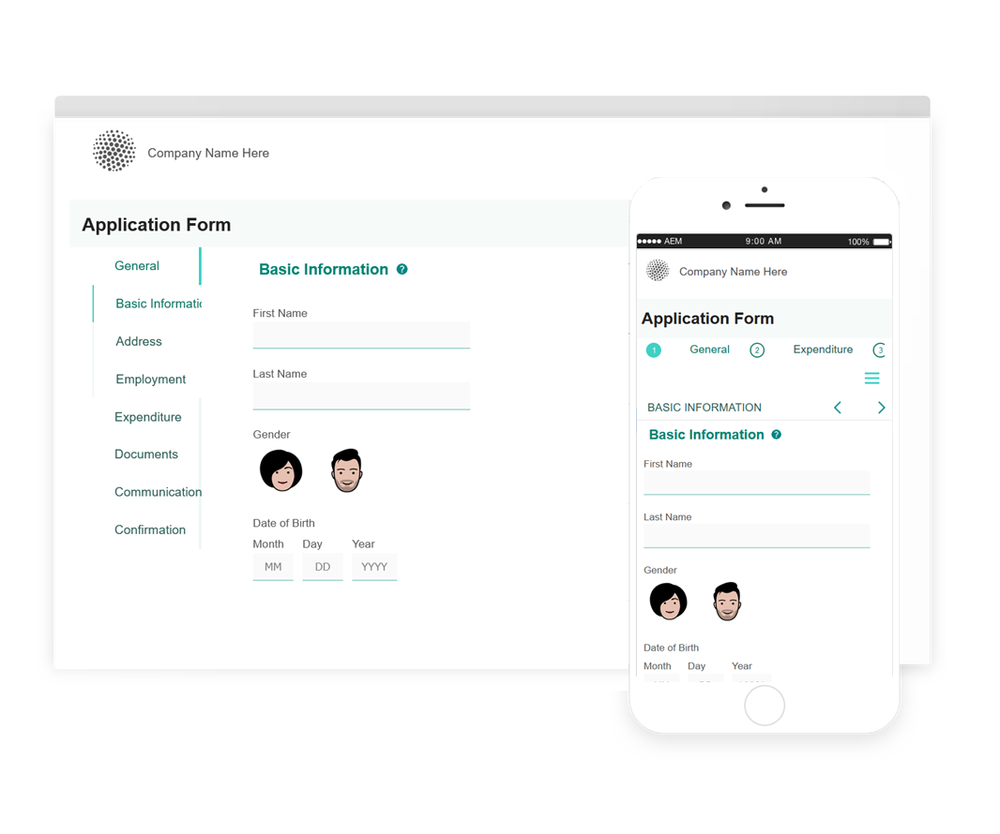

# Referentiethema&#39;s, sjablonen en modellen formuliergegevens {#reference-themes-templates-and-data-models}

| Van toepassing op | Artikelkoppeling |
| -------- | ---------------------------- |
| Adaptief formulier op basis van kerncomponenten | [ klik hier ](https://experienceleague.adobe.com/docs/experience-manager-core-components/using/adaptive-forms/sample-themes-templates-form-data-models-core-components.html) |
| Adaptief formulier op basis van elementaire componenten | Dit artikel |

 de Adobe adviseert gebruikend de moderne en verlengbare gegevens vangen [ Componenten van de Kern ](https://experienceleague.adobe.com/docs/experience-manager-core-components/using/adaptive-forms/introduction.html) voor [ het creëren van nieuwe Aangepaste Forms ](/help/forms/creating-adaptive-form-core-components.md) of [ het toevoegen van Aangepaste Forms aan de pagina&#39;s van AEM Sites ](/help/forms/create-or-add-an-adaptive-form-to-aem-sites-page.md). Deze componenten betekenen een aanzienlijke vooruitgang in de aanmaak van Adaptive Forms en zorgen voor indrukwekkende gebruikerservaring. In dit artikel wordt een oudere aanpak beschreven voor de auteur Adaptive Forms die gebruikmaakt van stichtingscomponenten. 

AEM Forms as a Cloud Service biedt meerdere referentiethema&#39;s, sjablonen en FDM (Form Data Model) waarmee u snel Adaptive Forms kunt gaan maken. U kunt het [ pakket van de verwijzingsinhoud van het portaal van de softwaredistributie downloaden ](https://experience.adobe.com/#/downloads/content/software-distribution/en/aemcloud.html?package=/content/software-distribution/en/details.html/content/dam/aemcloud/public/aem-forms-reference-content.ui.content-2.1.0.zip) en de [ Manager van het Pakket ](/help/implementing/developing/tools/package-manager.md) gebruiken om het [ pakket van de verwijzingsinhoud ](https://experience.adobe.com/#/downloads/content/software-distribution/en/aemcloud.html?package=/content/software-distribution/en/details.html/content/dam/aemcloud/public/aem-forms-reference-content.ui.content-2.1.0.zip) op uw productie, ontwikkeling, of lokale ontwikkelomgeving te installeren om deze verwijzingsactiva aan uw milieu te krijgen.

De thema&#39;s, de malplaatjes, en het model van vormgegevens (FDM) omvatten het verwijzingsinhoudspakket zijn:

| Thema&#39;s | Sjablonen | Formuliergegevensmodel (FDM) |
---------|----------|---------
| Canvas 3.0 | Basis | Microsoft Dynamics 365 |
| Tranquil | Leeg | Salesforce |
| Urbane |   |  |
| Ultramarijn |  |  |
| Beryl |  |  |
| Gezondheidszorg |  |   |
| FSI |   |   |

## Referentiethema&#39;s {#reference-themes}

[ Thema&#39;s ](/help/forms/themes.md) laat u uw vormen zonder diepe kennis van CSS opmaken. U kunt de volgende thema&#39;s krijgen door het [ inhoudspakket van de Verwijzing ](https://experience.adobe.com/#/downloads/content/software-distribution/en/aemcloud.html?package=/content/software-distribution/en/details.html/content/dam/aemcloud/public/aem-forms-reference-content.ui.content-2.1.0.zip) te installeren:

* Beryl
* Canvas 3.0
* Tranquil
* Urbane
* Ultramarijn
* Gezondheidszorg
* FSI (Financiële diensten en verzekeringen)

Elk thema bevat een unieke en elegante stijl waarmee u aanpasbare formulieren voor uw gebruikers kunt maken. Het bevat unieke opmaak voor kiezers, zoals het deelvenster, het tekstvak, het numerieke vak, het keuzerondje, de tabel en de schakelaar. De stijlen in deze thema&#39;s zijn gebaseerd op vereisten. In een bepaald scenario hebt u bijvoorbeeld een minimalistisch thema met schone lettertypen nodig. Met het thema van de vrijheid kun je dat uiterlijk bereiken.

De thema&#39;s in dit pakket reageren snel en de stijl in deze thema&#39;s is gedefinieerd voor mobiele schermen en desktopschermen. De meeste moderne browsers op verschillende apparaten kunnen formulieren die met een van deze thema&#39;s zijn toegepast, zonder problemen weergeven.

Voor meer informatie bij het installeren van het pakket, zie [ hoe te met Pakketten ](/help/implementing/developing/tools/package-manager.md) werken.

## Beryl {#beryl}

In het thema Beryl wordt het gebruik van achtergrondafbeeldingen, transparantie en grote, platte pictogrammen benadrukt. In de onderstaande schermafbeelding kunt u zien hoe het Beryl-thema eruitziet en hoe het de opmaak van uw formulier kan verbeteren.

## Canvas 3.0 {#canvas}

Canvas 3.0 is het standaardthema voor Adaptief Forms en benadrukt het gebruik van basiskleuren, transparantie en platte pictogrammen. In de onderstaande schermafbeelding kunt u zien hoe het thema Canvas 3.0 eruitziet.

## Tranquil {#tranquil}

Het thema Tranquil biedt lichte en donkere tinten van het schema Tranquil om verschillende componenten van een formulier te benadrukken. Keuzerondjes, deelvensters en tabs krijgen bijvoorbeeld een andere groene tint.

## Urbane {#urbane}

Met het thema Urbane wordt de nadruk gelegd op een minimalistische en functionele vormgeving. Wanneer u het thema Urbane op uw formulier toepast, ziet u dat de componenten plat zijn. De deelvensters krijgen dunne omtrekken om een modern uiterlijk te krijgen.

## Ultramarijn {#ultramarine}

Het thema Ultramarijn gebruikt diepe blauwe schaduwen om componenten zoals lusjes, panelen, tekstvakjes, en knopen te benadrukken.

## Gezondheidszorg {#healthcare}

In het thema Gezondheid worden diepe groene tinten gebruikt om componenten zoals tabbladen, deelvensters, tekstvakken en knoppen te markeren.

## FSI (Financiële diensten en verzekeringen)

In het FSI-thema wordt de nadruk gelegd op een minimalistisch en functioneel uiterlijk van uw formulier. Wanneer u het FSI-thema toepast op uw formulier, ziet u dat deelvenstercomponenten geel zijn.

## Referentiesjablonen {#reference-templates}

[ Malplaatjes ](/help/forms/themes.md) laat u aanvankelijke vormstructuur, inhoud, en acties voor uw vormen bepalen. U kunt de volgende malplaatjes krijgen door het [ inhoudspakket van de Verwijzing ](https://experience.adobe.com/#/downloads/content/software-distribution/en/aemcloud.html?package=/content/software-distribution/en/details.html/content/dam/aemcloud/public/aem-forms-reference-content.ui.content-2.1.0.zip) te installeren:

* Basis
* Leeg

Met de standaardsjabloon kunt u snel een inschrijvingsformulier maken. U kunt deze ook gebruiken om een voorvertoning weer te geven van de functionaliteit van Aanpassings Forms-stichtingscomponenten. Het verstrekt een tovenaar lay-out voor sectie-door-sectie presentatie van gegevens. Gebruik de sjabloon Blanco om een adaptief formulier te maken op een leeg canvas.

## Referentieformuliergegevensmodel (FDM) {#reference-models}

De Adaptive Forms kan vervolgens communiceren met Microsoft Dynamics 365 en Salesforce-servers om bedrijfsworkflows mogelijk te maken. Bijvoorbeeld:

* Schrijf gegevens naar Microsoft Dynamics 365 en Salesforce bij het verzenden van adaptieve formulieren.
* Schrijf gegevens in de Dynamica 365 van Microsoft en Salesforce door douaneentiteiten die in het Model van de Gegevens van de Vorm (FDM) worden bepaald en omgekeerd.
* Vraag Microsoft Dynamics 365 en Salesforce-server naar gegevens en vul Adaptive Forms vooraf in.
* Lees gegevens van Microsoft Dynamics 365 en Salesforce-server.

U kunt het volgende Model van de Gegevens van de Vorm (FDM) krijgen door het [ inhoudspakket van de Verwijzing ](https://experience.adobe.com/#/downloads/content/software-distribution/en/aemcloud.html?package=/content/software-distribution/en/details.html/content/dam/aemcloud/public/aem-forms-reference-content.ui.content-2.1.0.zip) te installeren:

* Microsoft® Dynamics 365
* Salesforce

Voor informatie bij het gebruiken van deze modellen, zie [ Dynamiek 365 van Microsoft en de wolkendiensten van Salesforce vormen ](https://experienceleague.adobe.com/docs/experience-manager-cloud-service/content/forms/integrate/use-form-data-model/configure-msdynamics-salesforce.html?lang=en#configure-dynamics-cloud-service)

## Zie ook {#see-also}

{{see-also}}