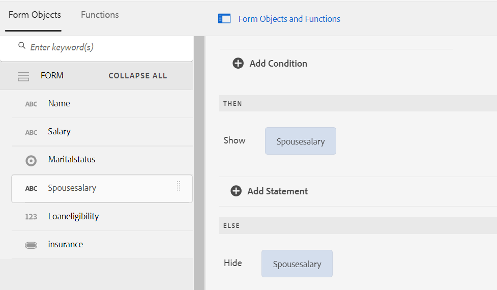

# De gebruikersinterface van de Redacteur van de regel voor Adaptieve Forms die op de Componenten van de Kern wordt gebaseerd

De gebruikersinterface van de Rule Editor voor Adaptive Forms op basis van Core Components verbetert het proces voor het maken van formulieren in Adobe Experience Manager (AEM). Het stelt zowel zakelijke gebruikers als ontwikkelaars in staat dynamisch gedrag en complexe logica in formulieren te implementeren door regels te schrijven die handelingen activeren op basis van vooraf gedefinieerde voorwaarden, gebruikersinvoer en interacties. Deze functie ondersteunt moderne JavaScript-functies tot ES2022 en biedt een intuïtieve visuele editor die het regelschrijfproces vereenvoudigt.
De Editor voor regels is handig voor het stroomlijnen van de ervaring die het invullen van formulieren met zich meebrengt, zodat u zowel accuraat als efficiënt kunt werken. Hiermee kunt u deelvensters en formulieren valideren of opnieuw instellen en kunt u aangepaste functies uitvoeren om waarden van formulierobjecten te berekenen. Met zijn steun voor geneste voorwaarden en de capaciteit om de modeldiensten van de Gegevens van de Vorm aan te halen, is het Gebruikersinterface van de Redacteur van de Regel een essentiële component voor het creëren van ontvankelijke, gebruikersvriendelijke, en adaptieve vormen.

## Het begrip van de regel redacteur gebruikersinterface {#understanding-the-rule-editor-user-interface}

De redacteur van de regel verstrekt een uitvoerige maar eenvoudige gebruikersinterface om regels te schrijven en te beheren. U kunt de gebruikersinterface van de regeleditor starten vanuit een adaptief formulier in de ontwerpmodus.

Om het gebruikersinterface van de regelredacteur te lanceren:

1. Open een adaptief formulier in de ontwerpmodus.
1. Selecteer het vormvoorwerp waarvoor u een regel wilt schrijven, en in Toolbar van de Component selecteren  uit. De gebruikersinterface van de regeleditor wordt weergegeven.

   

   Eventuele bestaande regels voor de geselecteerde formulierobjecten worden in deze weergave weergegeven. Voor informatie over het beheren van bestaande regels, zie [ regels ](rule-editor.md#p-manage-rules-p) leiden.

1. Selecteer **[!UICONTROL Create]** om een nieuwe regel te schrijven. De visuele redacteur van het gebruikersinterface van de regelredacteur opent door gebrek wanneer u de regelredacteur de eerste keer lanceert.

   

Laten wij elke component van de regelredacteur UI in detail bekijken.

### A. Component-rule display {#a-component-rule-display}

Hiermee geeft u de titel weer van het object Adaptief formulier waarmee u de regeleditor hebt gestart en het regeltype dat momenteel is geselecteerd. In het bovenstaande voorbeeld wordt de regeleditor gestart vanuit een adaptief formulierobject genaamd Vraag 1 en is het geselecteerde regeltype When.

### B. Formulierobjecten en -functies {#b-form-objects-and-functions-br}

Het deelvenster links in de gebruikersinterface van de regeleditor bevat twee tabbladen: **[!UICONTROL Forms Objects]** en **[!UICONTROL Functions]** .

Op het tabblad Formulierobjecten ziet u een hiërarchische weergave van alle objecten in het adaptieve formulier. De titel en het type van de objecten worden weergegeven. Bij het schrijven van een regel kunt u formulierobjecten naar de regeleditor slepen. Wanneer u een regel maakt of bewerkt en een object of functie naar een tijdelijke aanduiding sleept, neemt de tijdelijke aanduiding automatisch het juiste waardetype.

De formulierobjecten waarop een of meer geldige regels zijn toegepast, worden gemarkeerd met een groene stip. Als een van de regels die op een formulierobject zijn toegepast ongeldig is, wordt het formulierobject gemarkeerd met een gele stip.

Het tabblad Functies bevat een set ingebouwde functies, zoals som van, min of meer, max van, gemiddelde van, aantal en validerende vorm. U kunt deze functies gebruiken om waarden in herhaalbare deelvensters en tabelrijen te berekenen en deze tijdens het schrijven van regels te gebruiken in instructies voor handelingen en voorwaarden. U kunt echter ook aangepaste functies maken.

Enkele lijst van functies wordt getoond in het cijfer:


>[!NOTE]
>
>U kunt tekstzoekopdrachten uitvoeren op namen en titels van objecten en functies op de tabbladen Objecten en Functies van Forms.

In de linkerstructuur van de formulierobjecten kunt u de formulierobjecten selecteren om de regels weer te geven die op elk object zijn toegepast. U kunt niet alleen door de regels van de verschillende formulierobjecten navigeren, u kunt ook regels kopiëren en plakken tussen de formulierobjecten. Voor meer informatie, zie [ kopiëren-kleeft regels ](rule-editor.md#p-copy-paste-rules-p).

### C. Schakelen tussen formulierobjecten en -functies {#c-form-objects-and-functions-toggle-br}

Met de schakelknop schakelt u, wanneer hierop wordt getikt, de formulierobjecten en het deelvenster met functies in of uit.

### D. Visuele regeleditor {#visual-rule-editor}

De visuele regelredacteur is het gebied op de visuele redacteurswijze van het gebruikersinterface van de regelredacteur waar u regels schrijft. Hiermee kunt u een regeltype selecteren en voorwaarden en handelingen definiëren. Wanneer u voorwaarden en handelingen in een regel definieert, kunt u formulierobjecten en -functies slepen en neerzetten vanuit het deelvenster Formulierobjecten en -functies.

Voor meer informatie over het gebruiken van een visuele regelredacteur, zie [ regels ](rule-editor.md#p-write-rules-p) schrijven.
<!-- 
### E. Visual-code editors switcher {#e-visual-code-editors-switcher}

Users in the forms-power-users group can access code editor. For other users, code editor is not available. If you have the rights, you can switch from visual editor mode to code editor mode of the rule editor, and conversely, using the switcher right above the rule editor. When you launch rule editor the first time, it opens in the visual editor mode. You can write rules in the visual editor mode or switch to the code editor mode to write a rule script. However, note that if you modify a rule or write a rule in code editor, you cannot switch back to the visual editor for that rule unless you clear the code editor.

[!DNL Experience Manager Forms] tracks the rule editor mode you used last to write a rule. When you launch the rule editor next time, it opens in that mode. However, you can also configure a default mode to open the rule editor in the specified mode. To do so:

1. Go to [!DNL Experience Manager] web console at `https://[host]:[port]/system/console/configMgr`.
1. Click to edit **[!UICONTROL Adaptive Form Configuration Service]**.
1. choose **[!UICONTROL Visual Editor]** or **[!UICONTROL Code Editor]** from the **[!UICONTROL Default Mode for Rule Editor]** drop-down

1. Click **[!UICONTROL Save]**.
-->

### E. Gereed en annuleer knoppen {#done-and-cancel-buttons}

Met de knop **[!UICONTROL Done]** kunt u een regel opslaan. U kunt een onvolledige regel opslaan. Onvolledig zijn echter ongeldig en worden niet uitgevoerd. Opgeslagen regels voor een formulierobject worden weergegeven wanneer u de regeleditor de volgende keer start vanuit hetzelfde formulierobject. U kunt bestaande regels in die weergave beheren. Voor meer informatie, zie [ regels ](rule-editor.md#p-manage-rules-p) leiden.

De knoop **[!UICONTROL Cancel]** verwerpt om het even welke veranderingen die u aan een regel aanbracht en sluit de regelredacteur.

## Schrijfregels {#write-rules}

U kunt regels schrijven met de visuele regeleditor <!-- or the code editor. When you launch the rule editor the first time, it opens in the visual editor mode. You can switch to the code editor mode and write rules. However, if you write or modify a rule in code editor, you cannot switch to the visual editor for that rule unless you clear the code editor. When you launch the rule editor next time, it opens in the mode that you used last to create rule. -->

Laten we eerst bekijken hoe u regels schrijft met een visuele editor.

+++ Visuele editor gebruiken {#using-visual-editor}

Laten we begrijpen hoe u een regel maakt in een visuele editor met behulp van het volgende voorbeeldformulier.


In het gedeelte met vereisten voor leningen in het voorbeeldformulier voor het aanvragen van leningen moeten aanvragers hun echtelijke staat, salaris en indien gehuwd, het salaris van hun echtgenoot vermelden. Op basis van de gebruikersinput wordt het bedrag dat voor de lening in aanmerking komt, berekend door de regel en wordt dit weergegeven in het veld Beleenbaarheid van de lening. Pas de volgende regels toe om het scenario uit te voeren:

* Het veld Salaris van de echtgenoot wordt alleen weergegeven wanneer de huwelijksstatus wordt gehuwd.
* De beleenbaarheid van de lening bedraagt 50% van het totale salaris.

Voer de volgende stappen uit om regels te schrijven:

1. Eerst schrijft u de regel om de zichtbaarheid van het veld Sjabloon bij echtgeno(o)t(e) in te stellen op basis van de optie die de gebruiker selecteert voor het keuzerondje Genderstatus.

   Open het aanvraagformulier voor de lening in de ontwerpmodus. Selecteer de **[!UICONTROL Marital Status]** component en selecteer  uit. Selecteer vervolgens **[!UICONTROL Create]** om de regeleditor te starten.

   

   Wanneer u de regelredacteur lanceert, wanneer de regel door gebrek wordt geselecteerd. Bovendien wordt het formulierobject (in dit geval de huwelijksstatus) waaruit u de regeleditor hebt gestart, opgegeven in de instructie When.

   U kunt het geselecteerde object niet wijzigen of wijzigen, maar u kunt een ander regeltype selecteren met de vervolgkeuzelijst Regel, zoals hieronder wordt weergegeven. Als u een regel voor een ander object wilt maken, selecteert u Annuleren om de regeleditor af te sluiten en opnieuw te starten vanuit het gewenste formulierobject.

1. Selecteer **[!UICONTROL Select State]** vervolgkeuzelijst en selecteer **[!UICONTROL is equal to]** . Het veld **[!UICONTROL Enter a String]** wordt weergegeven.

   

1. Op het **[!UICONTROL Enter a String]** gebied in de regel, uitgezocht **Gehuwd** van het drop-down menu.

   

   U hebt de voorwaarde gedefinieerd als `When Marital Status is equal to Married` . Definieer vervolgens de actie die moet worden uitgevoerd als deze voorwaarde Waar is.

1. Selecteer in de instructie Vervolgens **[!UICONTROL Show]** in de vervolgkeuzelijst **[!UICONTROL Select Action]** .

   

1. Sleep het veld **[!UICONTROL Spouse Salary]** naar het tabblad Formulierobjecten in het veld **[!UICONTROL Drop object or select here]** . U kunt ook het veld **[!UICONTROL Drop object or select here]** selecteren en het veld **[!UICONTROL Spouse Salary]** in het pop-upmenu selecteren, waarin alle formulierobjecten in het formulier worden vermeld.

   

   Definieer vervolgens de handeling die moet worden uitgevoerd als deze voorwaarde false is.
1. Klik op **[!UICONTROL Add Else Section]** om een andere voorwaarde voor het veld **[!UICONTROL Spouse Salary]** toe te voegen, voor het geval u de staat van het huwelijk als één voorwaarde selecteert.

   


1. Selecteer in de instructie else **[!UICONTROL Hide]** in de vervolgkeuzelijst **[!UICONTROL Select Action]** .
   

1. Sleep het veld **[!UICONTROL Spouse Salary]** naar het tabblad Formulierobjecten in het veld **[!UICONTROL Drop object or select here]** . U kunt ook het veld **[!UICONTROL Drop object or select here]** selecteren en het veld **[!UICONTROL Spouse Salary]** in het pop-upmenu selecteren, waarin alle formulierobjecten in het formulier worden vermeld.
   

   De regel wordt als volgt weergegeven in de regeleditor.

   

1. Selecteer **[!UICONTROL Done]** om de regel op te slaan.

<!--
1. Repeat steps 1 through 5 to define another rule to hide the Spouse Salary field if the marital Status is Single. The rule appears as follows in the rule editor.

    -->

>[!NOTE]
>
> Alternatief, kunt u een Show regel op het gebied van de Salaris van de Echtgenote, in plaats van een wanneer regels op het gebied van de Burgerlijke Status, schrijven om het zelfde gedrag uit te voeren.


1. Vervolgens schrijft u een regel om het beleenbare bedrag van de lening te berekenen, dat 50% van het totale salaris is, en geeft u dit weer in het veld Beleenbaarheid van de lening. U bereikt dit resultaat door **[!UICONTROL Set value Of]** regels te maken voor het veld Beleenbaarheid van lening.

   Op auteurswijze, selecteer het **[!UICONTROL Loan Eligibility]** gebied en selecteer  uit. Selecteer vervolgens **[!UICONTROL Create]** om de regeleditor te starten.

1. Selecteer **[!UICONTROL Set Value Of]** regel in de vervolgkeuzelijst met regels.

   

1. Selecteer **[!UICONTROL Select Option]** en selecteer **[!UICONTROL Mathematical Expression]** . Er wordt een veld voor het schrijven van wiskundige expressies geopend.

   

1. In het expressieveld:

   * Selecteer of sleep-daling van het lusje van de Objecten van Forms het **[!UICONTROL Salary]** gebied in het eerste **[!UICONTROL Drop object or select here]** gebied.

   * Selecteer **[!UICONTROL Plus]** in het veld **[!UICONTROL Select Operator]** .

   * Selecteer of sleep-daling van het lusje van de Objecten van Forms het **[!UICONTROL Spouse Salary]** gebied in het andere **[!UICONTROL Drop object or select here]** gebied.

   

1. Selecteer vervolgens in het gemarkeerde gebied rond het expressieveld en selecteer **[!UICONTROL Extend Expression]** .

   

   Selecteer in het veld Uitgebreide expressie **[!UICONTROL divided by]** in het **[!UICONTROL Select Operator]** veld en **[!UICONTROL Number]** in het **[!UICONTROL Select Option]** veld. Geef vervolgens **[!UICONTROL 2]** op in het nummerveld.

   

   >[!NOTE]
   >
   >U kunt complexe expressies maken met behulp van componenten, functies, wiskundige expressies en eigenschapwaarden in het veld Optie selecteren.

   Maak vervolgens een voorwaarde die, wanneer True wordt geretourneerd, de expressie uitvoert.

1. Selecteer **[!UICONTROL Add Condition]** om de instructie When toe te voegen.

   

   In de instructie When:

   * Selecteer of sleep-daling van het lusje van de Objecten van Forms het **[!UICONTROL Marital Status]** gebied in het eerste **[!UICONTROL Drop object or select here]** gebied.

   * Selecteer **[!UICONTROL is equal to]** in het veld **[!UICONTROL Select Operator]** .

   * Selecteer String in het andere veld **[!UICONTROL Drop object or select here]** en geef **[!UICONTROL Married]** op in het veld **[!UICONTROL Enter a String]** .

   De regel wordt uiteindelijk als volgt weergegeven in de regeleditor.  

1. Selecteer **[!UICONTROL Done]**. Het bespaart de regel.

1. Herhaal stap 7 tot en met 14 om een andere regel te definiëren om de beleenbaarheid van de lening te berekenen als de burgerlijke stand eenmalig is. De regel wordt als volgt weergegeven in de regeleditor.

   

U kunt ook de regel Waarde instellen van gebruiken om de beleenbaarheid van leningen te berekenen in de regel When die u hebt gemaakt om het veld Salaris van de echtgenoot weer te geven en te verbergen. De resulterende gecombineerde regel wanneer de Status van het Samenhang Enige is verschijnt als volgt in de regelredacteur.


U kunt een gecombineerde regel schrijven om de zichtbaarheid van het veld Echtgenloon te bepalen en de beleenbaarheid van de lening berekenen wanneer de huwelijkse staat wordt gehuwd met behulp van de Else voorwaarde.


+++


<!-- ### Using code editor {#using-code-editor}

Users added to the forms-power-users group can use code editor. The rule editor auto generates the JavaScript code for any rule you create using visual editor. You can switch from visual editor to the code editor to view the generated code. However, if you modify the rule code in the code editor, you cannot switch back to the visual editor. If you prefer writing rules in code editor rather than visual editor, you can write rules afresh in the code editor. The visual-code editors switcher helps you switch between the two modes.

The code editor JavaScript is the expression language of Adaptive Forms. All the expressions are valid JavaScript expressions and use Adaptive Forms scripting model APIs. These expressions return values of certain types. For the complete list of Adaptive Forms classes, events, objects, and public APIs, see [JavaScript Library API reference for Adaptive Forms](https://helpx.adobe.com/experience-manager/6-5/forms/javascript-api/index.html).

For more information about guidelines to write rules in the code editor, see [Adaptive Form Expressions](adaptive-form-expressions.md).

While writing JavaScript code in the rule editor, the following visual cues help you with the structure and syntax:

* Syntax highlights

* Auto Indentation

* Hints and suggestions for Form objects, functions, and their properties

* Auto completion of form component names and common JavaScript functions


-->

### Aangepaste functies in regeleditor {#custom-functions}

Naast de uit-van-de-doos functies als *Som van* die onder **Uitvoer van Functies** vermeld zijn, kunt u douanefuncties in uw regelredacteur ook gebruiken. De redacteur van de regel steunt de syntaxis van JavaScript ECMAScript 2019 voor manuscripten en douanefuncties. Voor instructies bij het creëren van douanefuncties, verwijs naar de artikel [ Functies van de Douane in Aanpassings Forms ](/help/forms/create-and-use-custom-functions.md).

<!--

Ensure that the function you write is accompanied by the `jsdoc` above it. Adaptive Form supports the various [JavaScript annotations for custom functions](/help/forms/create-and-use-custom-functions.md#js-annotations).

For more information, see [jsdoc.app](https://jsdoc.app/).

Accompanying `jsdoc` is required:

* If you want custom configuration and description
* Because there are multiple ways to declare a function in `JavaScript,` and comments let you keep a track of the functions.

Supported `jsdoc` tags:

* **Private**
  Syntax: `@private`
  A private function is not included as a custom function.

* **Name**
  Syntax: `@name funcName <Function Name>`
  Alternatively `,` you can use: `@function funcName <Function Name>` **or** `@func` `funcName <Function Name>`.
  `funcName` is the name of the function (no spaces allowed).
  `<Function Name>` is the display name of the function.

* **Parameter**
  Syntax: `@param {type} name <Parameter Description>`
  Alternatively, you can use: `@argument` `{type} name <Parameter Description>` **or** `@arg` `{type}` `name <Parameter Description>`.
  Shows parameters used by the function. A function can have multiple parameter tags, one tag for each parameter in the order of occurrence.
  `{type}` represents parameter type. Allowed parameter types are:

    1. string
    2. number
    3. boolean
    4. scope
    5. string[]
    6. number[]
    7. boolean[]
    8. date
    9. date[]
    10. array
    11. object

   `scope` refers to a special globals object which is provided by forms runtime. It must be the last parameter and is not be visible to the user in the rule editor. You can use scope to access readable form and field proxy object to read properties, event which triggered the rule and a set of functions to manipulate the form.

   `object` type is used to pass readable field object in parameter to a custom function instead of passing the value.

   All parameter types are categorized under one of the above. None is not supported. Ensure that you select one of the types above. Types are not case-sensitive. Spaces are not allowed in the parameter name.  Parameter description can have multiple words.

* **Optional Parameter**
Syntax: `@param {type=} name <Parameter Description>` 
Alternatively, you can use: `@param {type} [name] <Parameter Description>`
By default all parameters are mandatory. You can mark a parameter optional by adding `=` in type of the parameter or by putting param name in square brackets.
   
   For example, let us declare `Input1` as optional parameter:
    * `@param {type=} Input1`
    * `@param {type} [Input1]`

* **Return Type**
  Syntax: `@return {type}`
  Alternatively, you can use `@returns {type}`.
  Adds information about the function, such as its objective.
  {type} represents the return type of the function. Allowed return types are:

    1. string
    2. number
    3. boolean
    4. string[]
    5. number[]
    6. boolean[]
    7. date
    8. date[]
    9. array
    10. object

  All other return types are categorized under one of the above. None is not supported. Ensure that you select one of the types above. Return types are not case-sensitive.

**Adding a custom function**

For example, you want to add a custom function which calculates area of a square. Side length is the user input to the custom function, which is accepted using a numeric box in your form. The calculated output is displayed in another numeric box in your form. To add a custom function, you have to first create a client library, and then add it to the CRX repository.

To create a client library and add it in the CRX repository, perform the following steps:

1. Create a client library. For more information, see [Using Client-Side Libraries](https://experienceleague.adobe.com/docs/experience-manager-cloud-service/implementing/developing/full-stack/clientlibs.html#developing).
2. In CRXDE, add a property `categories`with string type value as `customfunction` to the `clientlib` folder.

   >[!NOTE]
   >
   >`customfunction`is an example category. You can choose any name for the category you create in the `clientlib`folder.

After you have added your client library in the CRX repository, use it in your Adaptive Form. It lets you use your custom function as a rule in your form. To add the client library in your Adaptive Form, perform the following steps:

1. Open your form in edit mode.
   To open a form in edit mode, select a form and select **[!UICONTROL Open]**.
1. In the edit mode, select a component, then select  &gt; **[!UICONTROL Adaptive Form Container]**, and then select .
1. In the sidebar, under Name of Client Library, add your client library. ( `customfunction` in the example.)

   

1. Select the input numeric box, and select  to open the rule editor.
1. Select **[!UICONTROL Create Rule]**. Using options shown below, create a rule to save the squared value of the input in the Output field of your form.

   [](assets/add-custom-rule.png)
  
1. Select **[!UICONTROL Done]**. Your custom function is added.

   >[!NOTE]
   >
   > To invoke a form data model from rule editor using custom functions, [see here](/help/forms/using-form-data-model.md#invoke-services-in-adaptive-forms-using-rules-invoke-services). 

#### Function declaration supported types {#function-declaration-supported-types}

**Function Statement**

```javascript
function area(len) {
    return len*len;
}
```

This function is included without `jsdoc` comments.

**Function Expression**

```javascript
var area;
//Some codes later
/** */
area = function(len) {
    return len*len;
};
```

**Function Expression and Statement**

```javascript
var b={};
/** */
b.area = function(len) {
    return len*len;
}
```

**Function Declaration as Variable**

```javascript
/** */
var x1,
    area = function(len) {
        return len*len;
    },
    x2 =5, x3 =true;
```

Limitation: custom function picks only the first function declaration from the variable list, if together. You can use function expression for every function declared.

**Function Declaration as Object**

```javascript
var c = {
    b : {
        /** */
        area : function(len) {
            return len*len;
        }
    }
};
```

>[!NOTE]
>
>Ensure that you use `jsdoc` for every custom function. Although `jsdoc`comments are encouraged, include an empty `jsdoc`comment to mark your function as custom function. It enables default handling of your custom function.
-->

## Regels beheren {#manage-rules}

Om het even welke bestaande regels op een vormvoorwerp zijn vermeld wanneer u het voorwerp selecteert en . U kunt de titel en een voorvertoning van het regeloverzicht weergeven. Voorts laat UI u de volledige regelsamenvatting uitbreiden en bekijken, de orde van regels veranderen, regels uitgeven, en regels schrappen.


U kunt de volgende handelingen op de regels uitvoeren:

* **breid/Vouw** samen: De kolom van de Inhoud in de regellijst toont de regelinhoud. Als de volledige regelinhoud niet zichtbaar in de standaardmening is, uitgezocht  om het uit te breiden.

* **opnieuw rangschikt**: Om het even welke nieuwe regel u creeert wordt gestapeld bij de bodem van de regellijst. De regels worden van boven naar beneden uitgevoerd. De regel bij de bovenkant voert eerst gevolgd door andere regels van het zelfde type uit. Bijvoorbeeld, als u hebt wanneer, tonen, toelaten, en wanneer de regels bij de eerste, tweede, derde, en vierde posities van de bovenkant, respectievelijk, wanneer de regel bij de bovenkant eerst wordt uitgevoerd gevolgd door wanneer de regel bij de vierde positie. Vervolgens worden de regels Tonen en Inschakelen uitgevoerd.
U kunt de orde van een regel veranderen door  tegen het te tikken of belemmering-daling het aan de gewenste orde in de lijst.

* **geeft** uit: Om een regel uit te geven, selecteer het controlevakje naast de regeltitel. Er worden opties weergegeven voor het bewerken en verwijderen van de regel. Selecteer **[!UICONTROL Edit]** om de geselecteerde regel te openen in de regeleditor.

* **Schrapping**: Om een regel te schrappen, selecteer de regel en selecteer **[!UICONTROL Delete]**.

* **toelaten/onbruikbaar maken**: Wanneer u gebruik van een regel tijdelijk moet onderbreken, kunt u één of meerdere regels selecteren en **[!UICONTROL Disable]** in de toolbar van Acties selecteren om hen onbruikbaar te maken. Als een regel is uitgeschakeld, wordt deze niet uitgevoerd tijdens de runtime. Als u een uitgeschakelde regel wilt inschakelen, selecteert u deze en selecteert u Inschakelen op de werkbalk Handelingen. De statuskolom van de regel geeft aan of de regel is ingeschakeld of uitgeschakeld.

 onbruikbaar

## Regels kopiëren en plakken {#copy-paste-rules}

U kunt een regel kopiëren-kleven van één gebied aan andere gelijkaardige gebieden om tijd te besparen.

Ga als volgt te werk om regels te kopiëren en te plakken:

1. Selecteer het vormvoorwerp waarvan u een regel wilt kopiëren, en in de componententoolbar uitgezocht  uit. De gebruikersinterface van de regeleditor wordt weergegeven terwijl het formulierobject is geselecteerd en de bestaande regels worden weergegeven.

   

   Voor informatie over het beheren van bestaande regels, zie [ regels ](rule-editor.md#p-manage-rules-p) leiden.

1. Schakel het selectievakje naast de titel van de regel in. Er worden opties voor het beheer van de regel weergegeven. Selecteer **[!UICONTROL Copy]** .

   

1. Selecteer een ander formulierobject waarop u de regel wilt plakken en selecteer **[!UICONTROL Paste]** . Bovendien kunt u de regel bewerken om er wijzigingen in aan te brengen.

   >[!NOTE]
   >
   >U kunt een regel alleen in een ander formulierobject plakken als dat formulierobject de gebeurtenis van de gekopieerde regel ondersteunt. Een knop ondersteunt bijvoorbeeld de gebeurtenis click. U kunt een regel met een klikgebeurtenis aan een knoop maar niet aan een controledoos kleven.

1. Selecteer **[!UICONTROL Done]** om de regel op te slaan.

## Volgende stap

Om de diverse exploitanttypes en de gebeurtenissen in de regelredacteur van een Aanpassende Vorm te begrijpen, verwijs naar de [ Beschikbare Types en Gebeurtenissen van Exploitant in de Redacteur van de Regel van een Aangepast 1&rbrace; artikel van de Vorm.](/help/forms/rule-editor-core-components-events-operators.md)


## Zie ook

{{see-also-rule-editor}}
