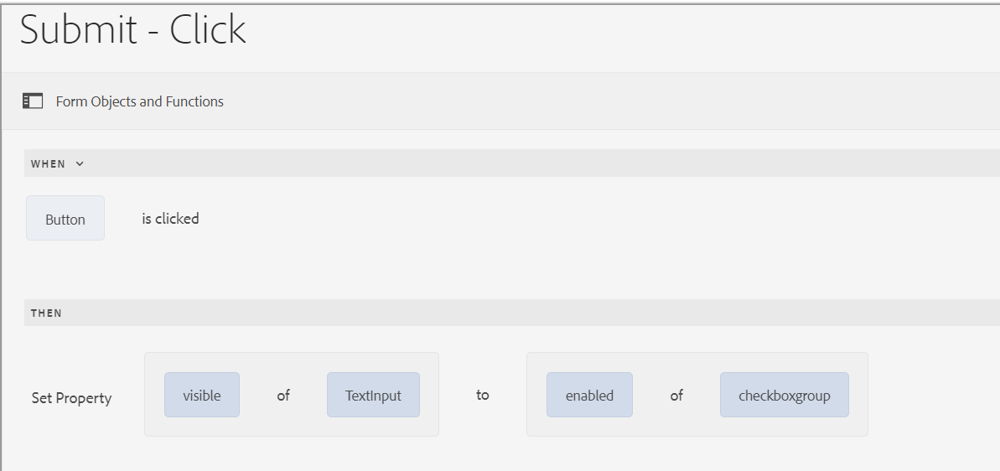
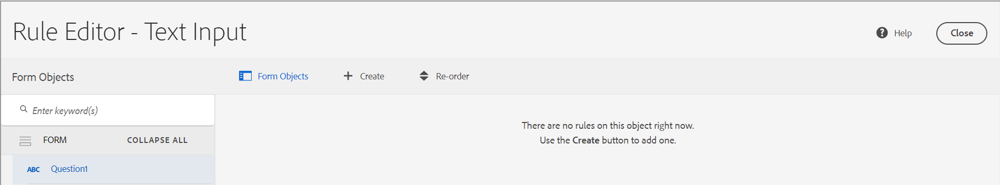
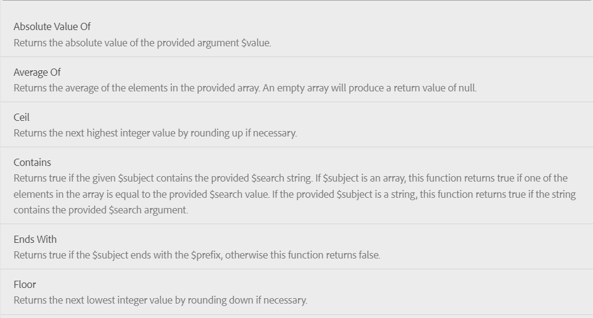
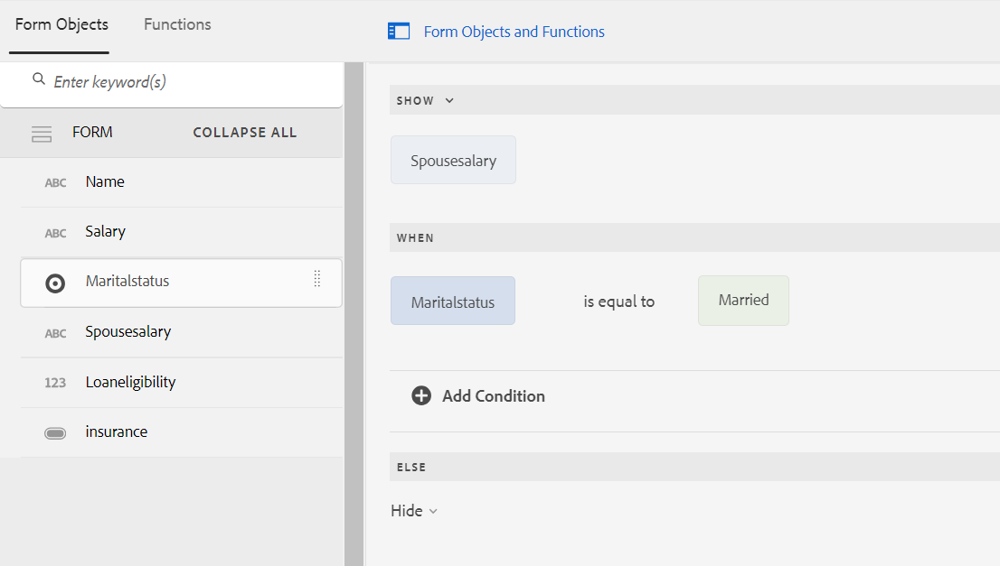

<span class="preview"> Dit artikel bevat inhoud voor enkele functies die aan de release zijn toegevoegd. Deze pre-releasefuncties zijn alleen toegankelijk via onze [pre-releasekanaal](https://experienceleague.adobe.com/docs/experience-manager-cloud-service/content/release-notes/prerelease.html#new-features). Het pre-releaseprogramma heeft de volgende kenmerken:
* Steun voor het uitvoeren van genestelde voorwaarden met wanneer-toen functionaliteit
* Deelvensters en formulieren valideren of opnieuw instellen, inclusief velden
* Ondersteuning voor moderne JavaScript-functies zoals let- en pijlfuncties (ES10-ondersteuning) binnen aangepaste functies.
</span>

# Regels toevoegen aan een adaptief formulier (kerncomponenten) {#adaptive-forms-rule-editor}

Met de functie voor regeleditors kunnen zakelijke gebruikers en ontwikkelaars regels schrijven voor adaptieve formulierobjecten. Met deze regels worden acties gedefinieerd die op formulierobjecten worden geactiveerd op basis van vooraf ingestelde voorwaarden, gebruikersinvoer en gebruikersacties op het formulier. Hierdoor wordt de ervaring met het invullen van formulieren verder gestroomlijnd, zodat u nauwkeurige en snelle informatie krijgt.

De regelredacteur verstrekt een intuïtieve en vereenvoudigde gebruikersinterface om regels te schrijven. De redacteur van de regel biedt een visuele redacteur voor alle gebruikers aan.<!-- In addition, only for forms power users, rule editor provides a code editor to write rules and scripts. --> Enkele belangrijke handelingen die u met behulp van regels kunt uitvoeren op adaptieve formulierobjecten:

* Een object tonen of verbergen
* Een object in- of uitschakelen
* Een waarde instellen voor een object
* De waarde van een object valideren
* Functies uitvoeren om de waarde van een object te berekenen
* Roep de service Form Data Model (FDM) aan en voer een bewerking uit
* Eigenschap van een object instellen

<!-- Rule editor replaces the scripting capabilities in [!DNL Experience Manager 6.1 Forms] and earlier releases. However, your existing scripts are preserved in the new rule editor. For more information about working with existing scripts in the rule editor, see [Impact of rule editor on existing scripts](rule-editor.md#p-impact-of-rule-editor-on-existing-scripts-p). -->

Gebruikers die zijn toegevoegd aan de gebruikersgroep voor formulieren, kunnen scripts maken en bestaande scripts bewerken. Gebruikers in de [!DNL forms-users] groep kan de scripts gebruiken, maar geen scripts maken of bewerken.

## Een regel begrijpen {#understanding-a-rule}

Een regel is een combinatie van handelingen en voorwaarden. In de regeleditor omvatten handelingen zoals verbergen, weergeven, inschakelen, uitschakelen of de waarde van een object in een formulier berekenen. Voorwaarden zijn Booleaanse expressies die worden geëvalueerd door controles en bewerkingen uit te voeren op de status, waarde of eigenschap van een formulierobject. Handelingen worden uitgevoerd op basis van de waarde ( `True` of `False`) geretourneerd door een voorwaarde te evalueren.

De regelredacteur verstrekt een reeks vooraf bepaalde regeltypes, zoals wanneer, tonen, verbergen, toelaten, onbruikbaar maken, Vastgestelde Waarde van, en Valideren om u te helpen regels schrijven. Elk regeltype laat u voorwaarden en acties in een regel bepalen. Het document verklaart verder elk regeltype in detail.

Een regel volgt doorgaans een van de volgende constructies:

**Voorwaarde-actie** In deze constructie definieert een regel eerst een voorwaarde gevolgd door een handeling die moet worden geactiveerd. De constructie is vergelijkbaar met if-then statement in programmeertalen.

In de regeleditor **Wanneer** het regeltype dwingt de voorwaarde-actie constructie af.

**Handeling-voorwaarde** In deze constructie, bepaalt een regel eerst een actie die door voorwaarden voor evaluatie wordt gevolgd teweegbrengen. Een andere variatie van deze constructie is actie-voorwaarde-afwisselende actie, die ook een afwisselende actie bepaalt om te teweegbrengen als de voorwaarde Vals terugkeert.

Toon, verberg, laat toe, maak onbruikbaar, plaats Waarde van, en bevestig regeltypes in regelredacteur om de actie-voorwaarde regelconstructie af te dwingen. Standaard is de alternatieve actie voor Tonen Verbergen en voor Inschakelen Uitgeschakeld en de tegenovergestelde manier. U kunt de alternatieve standaardhandeling niet wijzigen.

>[!NOTE]
>
>De beschikbare regeltypen, inclusief de voorwaarden en handelingen die u in de regeleditor definieert, zijn ook afhankelijk van het type formulierobject waarop u een regel maakt. In de regeleditor worden alleen geldige regeltypen en opties weergegeven voor het schrijven van voorwaarde- en handelingsinstructies voor een bepaald type formulierobject. U ziet bijvoorbeeld geen typen Valideren en Waarde instellen voor een deelvensterobject.

Voor meer informatie over regeltypes beschikbaar in de regelredacteur, zie [Beschikbare regeltypen in regeleditor](rule-editor.md#p-available-rule-types-in-rule-editor-p).

### Richtlijnen voor het kiezen van een regelconstructie {#guidelines-for-choosing-a-rule-construct}

Hoewel u de meeste gebruiksgevallen kunt bereiken door om het even welke regelconstructie te gebruiken, zijn hier sommige richtlijnen om één constructie over een andere te kiezen. Voor meer informatie over de beschikbare regels in regelredacteur, zie [Beschikbare regeltypen in regeleditor](rule-editor.md#p-available-rule-types-in-rule-editor-p).

* Een typische regel van het duim wanneer het creëren van een regel is het denken over het in de context van het voorwerp waarop u een regel schrijft. Denk eraan dat u veld B wilt verbergen of weergeven op basis van de waarde die een gebruiker in veld A heeft opgegeven. In dit geval evalueert u een voorwaarde in veld A en activeert u een actie in veld B op basis van de waarde die de voorwaarde retourneert.

  Daarom als u een regel op gebied B (het voorwerp schrijft waarop u een voorwaarde) evalueert, gebruik de voorwaarde-actie constructie of het wanneer regeltype. Op dezelfde manier gebruikt u de handeling-voorwaarde constructie of toont of verbergt regeltype op gebied A.

* Soms moet u meerdere handelingen uitvoeren op basis van één voorwaarde. In dergelijke gevallen wordt het aanbevolen om de condition-action construct te gebruiken. Op deze wijze kunt u een voorwaarde één keer evalueren en meerdere actieinstructies opgeven.

  Als u bijvoorbeeld de velden B, C en D wilt verbergen op basis van de voorwaarde dat de waarde wordt gecontroleerd die een gebruiker in veld A opgeeft, moet u één regel schrijven met voorwaarde-actieconstructie of Wanneer-regeltype op veld A en handelingen opgeven om de zichtbaarheid van de velden B, C en D te regelen. Anders hebt u drie afzonderlijke regels nodig voor velden B,  C en D, waarbij elke regel de voorwaarde controleert en het desbetreffende veld toont of verbergt. In dit voorbeeld is het efficiënter om het type Wanneer-regel op één object te schrijven in plaats van het teksttype Regel tonen of verbergen op drie objecten.

* Als u een handeling wilt activeren die op meerdere voorwaarden is gebaseerd, wordt het aanbevolen om een actie-voorwaardeconstructie te gebruiken. Als u bijvoorbeeld veld A wilt weergeven en verbergen door de voorwaarden voor velden B, C en D te evalueren, gebruikt u regeltype Tonen of Verbergen voor veld A.
* Gebruik voorwaarde-actie of actievoorwaardeconstructie als de regel één handeling voor één voorwaarde bevat.
* Als een regel op een voorwaarde controleert en direct een actie uitvoert wanneer een waarde wordt gerekend in een veld of bij het afsluiten van een veld, is het raadzaam om een regel met een voorwaarde-actieconstructie of het type Wanneer te schrijven in het veld waarop de voorwaarde wordt geëvalueerd.
* De voorwaarde in wanneer regel wordt geëvalueerd wanneer een gebruiker de waarde van het voorwerp verandert waarop wanneer regel wordt toegepast. Als u echter wilt dat de actie wordt geactiveerd wanneer de waarde aan de serverzijde verandert, bijvoorbeeld bij het vooraf invullen van de waarde, kunt u het beste een When-regel schrijven die de actie activeert wanneer het veld wordt geïnitialiseerd.
* Wanneer u regels schrijft voor vervolgkeuzelijsten, keuzerondjes of selectievakjes, worden de opties of waarden van deze formulierobjecten in het formulier vooraf ingevuld in de regeleditor.

## Beschikbare operatortypen en gebeurtenissen in regeleditor {#available-operator-types-and-events-in-rule-editor}

De regeleditor biedt de volgende logische operatoren en gebeurtenissen waarmee u regels kunt maken.

* **Is gelijk aan**
* **Is niet gelijk aan**
* **Begint met**
* **Eindigt met**
* **Bevat**
* **Bevat niet**
* **Is leeg**
* **Is niet leeg**
* **Heeft geselecteerd:** Retourneert true wanneer de gebruiker een bepaalde optie voor een selectievakje, vervolgkeuzelijst of keuzerondje selecteert.
* **Is geïnitialiseerd (gebeurtenis):** Retourneert true wanneer een formulierobject in de browser wordt weergegeven.
* **Is gewijzigd (gebeurtenis):** Retourneert true wanneer de gebruiker de ingevoerde waarde of de geselecteerde optie voor een formulierobject wijzigt.

<!--
* **Navigation(event):** Returns true when the user clicks a navigation object. Navigation objects are used to move between panels. 
* **Step Completion(event):** Returns true when a step of a rule completes.
* **Successful Submission(event):** Returns true on successful submission of data to a form data model.
* **Error in Submission(event):**  Returns true on unsuccessful submission of data to a form data model. -->

## Beschikbare regeltypen in regeleditor {#available-rule-types-in-rule-editor}

De regelredacteur verstrekt een reeks vooraf bepaalde regeltypes die u kunt gebruiken om regels te schrijven. Laten we elk regeltype in detail bekijken. Voor meer informatie over het schrijven van regels in regelredacteur, zie [Schrijfregels](rule-editor.md#p-write-rules-p).

### [!UICONTROL When] {#whenruletype}

De **[!UICONTROL When]** regeltype volgt **condition-action-alternate action** regelconstructie, of soms alleen de **voorwaarde-actie** construct. In dit regeltype geeft u eerst een voorwaarde op voor evaluatie gevolgd door een handeling die wordt geactiveerd als aan de voorwaarde is voldaan ( `True`). Wanneer u het regeltype When gebruikt, kunt u meerdere AND- en OR-operatoren gebruiken om [geneste expressies](#nestedexpressions).

Met het regeltype &#39;Wanneer&#39; kunt u een voorwaarde op een formulierobject evalueren en acties op een of meer objecten uitvoeren.

In duidelijke woorden, typisch wanneer de regel als volgt gestructureerd is:

`When on Object A:`

`(Condition 1 AND Condition 2 OR Condition 3) is TRUE;`

`Then, do the following:`

Actie 2 betreffende object B; EN actie 3 betreffende object C;

`Else, do the following:`

Handeling 2 op Object C;
_

Wanneer u een component met meerdere waarden hebt, zoals keuzerondjes of een lijst, worden de opties bij het maken van een regel voor die component automatisch opgehaald en beschikbaar gemaakt voor de maker van de regel. U hoeft de optiewaarden niet opnieuw te typen.

Een lijst bevat bijvoorbeeld vier opties: Rood, Blauw, Groen en Geel. Tijdens het creëren van de regel, worden de opties (radioknopen) automatisch teruggewonnen en ter beschikking gesteld van de regelschepper als volgt:


Tijdens het schrijven van een When-regel kunt u de Clear Value of action activeren. Met Waarde wissen wordt de waarde van het opgegeven object gewist. Met de instructie &#39;Wissen&#39; als optie kunt u complexe voorwaarden maken met meerdere velden. U kunt de instructie Else toevoegen om meer voorwaarden toe te voegen


>[!NOTE]
>
> Als regeltype alleen single-level then-else instructies ondersteunt.

**[!UICONTROL Hide]** Verbergt het opgegeven object.

**[!UICONTROL Show]** Hiermee wordt het opgegeven object weergegeven.

**[!UICONTROL Enable]** Hiermee wordt het opgegeven object ingeschakeld.

**[!UICONTROL Disable]** Hiermee wordt het opgegeven object uitgeschakeld.

**[!UICONTROL Invoke service]** Roept de dienst aan die in een model van vormgegevens (FDM) wordt gevormd. Wanneer u de Invoke-service kiest, wordt een veld weergegeven. Bij het tikken van het gebied, toont het alle diensten die in al model van vormgegevens (FDM) op uw worden gevormd [!DNL Experience Manager] -instantie. Als u een service Formuliergegevensmodel kiest, worden meer velden weergegeven waarin u formulierobjecten kunt toewijzen met invoer- en uitvoerparameters voor de opgegeven service. Zie voorbeeldregel voor het aanroepen van de diensten van het Model van de Gegevens van de Vorm (FDM).

Naast de service Formuliergegevensmodel kunt u een directe WSDL-URL opgeven om een webservice aan te roepen. Nochtans, heeft de modeldienst van de Gegevens van het Vorm vele voordelen en de geadviseerde benadering om de dienst aan te halen.

Voor meer informatie over het vormen van de diensten in het model van vormgegevens (FDM), zie [[!DNL Experience Manager Forms] Gegevensintegratie](data-integration.md).

**[!UICONTROL Set value of]** Berekent en stelt de waarde van het opgegeven object in. U kunt de objectwaarde instellen op een tekenreeks, de waarde van een ander object, de berekende waarde met wiskundige expressie of functie, de waarde van een eigenschap van een object of de uitvoerwaarde van een geconfigureerde service Formuliergegevensmodel. Wanneer u de optie Webservice kiest, worden alle services weergegeven die in het FDM-model (Form Data Model) zijn geconfigureerd [!DNL Experience Manager] -instantie. Als u een service Formuliergegevensmodel kiest, worden meer velden weergegeven waarin u formulierobjecten kunt toewijzen met invoer- en uitvoerparameters voor de opgegeven service.

Voor meer informatie over het vormen van de diensten in het model van vormgegevens (FDM), zie [[!DNL Experience Manager Forms] Gegevensintegratie](data-integration.md).

De **[!UICONTROL Set Property]** Met regeltype kunt u de waarde van een eigenschap van het opgegeven object instellen op basis van een voorwaardenactie. U kunt eigenschap instellen op een van de volgende opties:
* visible (Boolean)
* label.value (String)
* label.visible (Boolean)
* description (String)
* enabled (Boolean)
* readOnly (Boolean)
* required (Boolean)
* screenReaderText (String)
* valid (Boolean)
* errorMessage (String)
* default (Number, String, Date)
* enumNames (String[])
* chartType (String)

U kunt bijvoorbeeld regels definiëren om het tekstvak weer te geven wanneer op een knop wordt geklikt. U kunt een regel definiëren met behulp van een aangepaste functie, een formulierobject, objecteigenschap of een service-uitvoer.


Als u een regel wilt definiëren op basis van een aangepaste functie, selecteert u **[!UICONTROL Function Output]** in de vervolgkeuzelijst en een aangepaste functie slepen en neerzetten vanuit de **[!UICONTROL Functions]** tab. Als aan de voorwaarde wordt voldaan, wordt het tekstinvoervak weergegeven.

Als u een regel wilt definiëren op basis van een formulierobject, selecteert u **[!UICONTROL Form Object]** in de vervolgkeuzelijst en een formulierobject slepen en neerzetten vanuit de **[!UICONTROL Form Objects]** tab. Als aan de voorwaarde is voldaan, wordt het tekstinvoervak weergegeven in het adaptieve formulier.

Met de regel Eigenschap instellen die is gebaseerd op een objecteigenschap kunt u het tekstinvoervak zichtbaar maken in een adaptief formulier op basis van een andere objecteigenschap die is opgenomen in het adaptieve formulier.

De volgende afbeelding toont een voorbeeld van het dynamisch inschakelen van het selectievakje op basis van het verbergen of weergeven van een tekstvak in een adaptieve vorm:



**[!UICONTROL Clear Value Of]** Wist de waarde van het opgegeven object.

**[!UICONTROL Set Focus]** Hiermee wordt de focus op het opgegeven object ingesteld.

**[!UICONTROL Submit Form]** Hiermee verzendt u het formulier.

**[!UICONTROL Reset]** Hiermee wordt het formulier of het opgegeven object opnieuw ingesteld.

**[!UICONTROL Validate]** Valideert het formulier of het opgegeven object.

**[!UICONTROL Add Instance]** Hiermee wordt een instantie van het opgegeven herhaalbare deelvenster of de opgegeven tabelrij toegevoegd.

**[!UICONTROL Remove Instance]** Hiermee wordt een instantie van het opgegeven herhaalbare deelvenster of de opgegeven tabelrij verwijderd.

**[!UICONTROL Function Output]** Definieert een regel op basis van vooraf gedefinieerde functies of aangepaste functies.

**[!UICONTROL Navigate to]** Navigeert naar andere <!--Interactive Communications,--> Adaptieve Forms, andere elementen, zoals afbeeldingen of documentfragmenten, of een externe URL. <!-- For more information, see [Add button to the Interactive Communication](create-interactive-communication.md#addbuttontothewebchannel). -->

**[!UICONTROL Dispatch Event]** De specifieke acties of gedragingen worden geactiveerd op basis van vooraf gedefinieerde voorwaarden of gebeurtenissen.


### [!UICONTROL Set Value of] {#set-value-of}

De **[!UICONTROL Set Value of]** met regeltype kunt u de waarde van een formulierobject instellen, afhankelijk van het feit of aan de opgegeven voorwaarde wordt voldaan of niet. De waarde kan worden ingesteld op een waarde van een ander object, een letterlijke tekenreeks, een waarde die is afgeleid van een wiskundige expressie of een functie, een waarde van een eigenschap van een ander object of de uitvoer van een service Form Data Model. Op dezelfde manier kunt u controleren op een voorwaarde voor een component, een tekenreeks, een eigenschap of waarden die zijn afgeleid van een functie of wiskundige expressie.

De **Waarde instellen van** Regeltype is niet beschikbaar voor alle formulierobjecten, zoals deelvensters en werkbalkknoppen. Een standaardsetwaarde van regel heeft de volgende structuur:

Waarde van Object A instellen op:

(tekenreeks ABC) OF
(objecteigenschap X van Object C) OF
(waarde van een functie) OF
(waarde van een wiskundige uitdrukking) OF
(uitvoerwaarde van een datamodelservice);

Wanneer (optioneel):

(Voorwaarde 1 EN Voorwaarde 2 EN Voorwaarde 3) is TRUE;

In het volgende voorbeeld wordt de waarde van `Question2` as `True` geselecteerd en wordt de waarde van `Result` as ingesteld.`correct`


Voorbeeld van waardenregel instellen met de service Formuliergegevensmodel.

### [!UICONTROL Show] {#show}

Met de **[!UICONTROL Show]** regeltype, kunt u een regel schrijven om een formulierobject weer te geven of te verbergen op basis van het feit of aan een voorwaarde is voldaan of niet. Het regeltype Tonen activeert ook de handeling Verbergen als de voorwaarde niet wordt vervuld of wordt geretourneerd `False`.

Een typische Show regel is gestructureerd als volgt:

`Show Object A;`

`When:`

`(Condition 1 OR Condition 2 OR Condition 3) is TRUE;`

`Else:`

`Hide Object A;`

### [!UICONTROL Hide] {#hide}

Net als het regeltype Tonen kunt u de opdracht **[!UICONTROL Hide]** regeltype om een formulierobject weer te geven of te verbergen op basis van het feit of aan een voorwaarde is voldaan of niet. Het regeltype Verbergen activeert ook de handeling Tonen als de voorwaarde niet wordt vervuld of wordt geretourneerd `False`.

Een typische regel van de Huid is gestructureerd als volgt:

`Hide Object A;`

`When:`

`(Condition 1 AND Condition 2 AND Condition 3) is TRUE;`

`Else:`

`Show Object A;`

### [!UICONTROL Enable] {#enable}

De **[!UICONTROL Enable]** met regeltype kunt u een formulierobject in- of uitschakelen op basis van het feit of aan een voorwaarde wordt voldaan of niet. Het Enable regeltype activeert ook de Disable-actie voor het geval dat de voorwaarde niet wordt vervuld of wordt geretourneerd `False`.

Een typisch laat regel toe is gestructureerd als volgt:

`Enable Object A;`

`When:`

`(Condition 1 AND Condition 2 AND Condition 3) is TRUE;`

`Else:`

`Disable Object A;`

### [!UICONTROL Disable] {#disable}

Gelijkaardig aan het Enable regeltype, **[!UICONTROL Disable]** met regeltype kunt u een formulierobject in- of uitschakelen op basis van het feit of aan een voorwaarde wordt voldaan of niet. Het regeltype Uitschakelen activeert ook de handeling Enable voor het geval dat de voorwaarde niet wordt vervuld of wordt geretourneerd `False`.

Een typisch onbruikbaar maken regel is gestructureerd als volgt:

`Disable Object A;`

`When:`

`(Condition 1 OR Condition 2 OR Condition 3) is TRUE;`

`Else:`

`Enable Object A;`

### [!UICONTROL Validate] {#validate}

De **[!UICONTROL Validate]** regeltype valideert de waarde in een veld met een expressie. U kunt bijvoorbeeld een expressie schrijven om te controleren of het tekstvak voor het opgeven van de naam geen speciale tekens of getallen bevat.

Een typisch Validate regel is gestructureerd als volgt:

`Validate Object A;`

`Using:`

`(Expression 1 AND Expression 2 AND Expression 3) is TRUE;`

>[!NOTE]
>
>Als de opgegeven waarde niet voldoet aan de regel Valideren, kunt u een validatiebericht voor de gebruiker weergeven. U kunt het bericht opgeven in het dialoogvenster **[!UICONTROL Script validation message]** in de componenteigenschappen in de zijbalk.


<!--
### [!UICONTROL Set Options Of] {#setoptionsof}

The **[!UICONTROL Set Options Of]** rule type enables you to define rules to add check boxes dynamically to the Adaptive Form. You can use a Form Data Model or a custom function to define the rule.

To define a rule based on a custom function, select **[!UICONTROL Function Output]** from the drop-down list, and drag-and-drop a custom function from the **[!UICONTROL Functions]** tab. The number of checkboxes defined in the custom function are added to the Adaptive Form.


To create a custom function, see [custom functions in rule editor](#custom-functions).

To define a rule based on a form data model:

1. Select **[!UICONTROL Service Output]** from the drop-down list.
1. Select the data model object.
1. Select a data model object property from the **[!UICONTROL Display Value]** drop-down list. The number of checkboxes in the Adaptive Form is derived from the number of instances defined for that property in the database.
1. Select a data model object property from the **[!UICONTROL Save Value]** drop-down list.

 -->

## Het begrip van de regel redacteur gebruikersinterface {#understanding-the-rule-editor-user-interface}

De redacteur van de regel verstrekt een uitvoerige maar eenvoudige gebruikersinterface om regels te schrijven en te beheren. U kunt de gebruikersinterface van de regeleditor starten vanuit een adaptief formulier in de ontwerpmodus.

Om het gebruikersinterface van de regelredacteur te lanceren:

1. Open een adaptief formulier in de ontwerpmodus.
1. Selecteer het formulierobject waarvoor u een regel wilt schrijven en selecteer op de werkbalk Component de optie . De gebruikersinterface van de regeleditor wordt weergegeven.

   

   Eventuele bestaande regels voor de geselecteerde formulierobjecten worden in deze weergave weergegeven. Voor informatie over het beheren van bestaande regels raadpleegt u [Regels beheren](rule-editor.md#p-manage-rules-p).

1. Selecteren **[!UICONTROL Create]** om een nieuwe regel te schrijven. De visuele redacteur van het gebruikersinterface van de regelredacteur opent door gebrek wanneer u de regelredacteur de eerste keer lanceert.

   

Laten wij elke component van de regelredacteur UI in detail bekijken.

### A. Component-rule display {#a-component-rule-display}

Hiermee geeft u de titel weer van het object Adaptief formulier waarmee u de regeleditor hebt gestart en het regeltype dat momenteel is geselecteerd. In het bovenstaande voorbeeld wordt de regeleditor gestart vanuit een adaptief formulierobject genaamd Vraag 1 en is het geselecteerde regeltype When.

### B. Formulierobjecten en -functies {#b-form-objects-and-functions-br}

De ruit op de linkerzijde in het gebruikersinterface van de regelredacteur omvat twee lusjes — **[!UICONTROL Forms Objects]** en **[!UICONTROL Functions]**.

Op het tabblad Formulierobjecten ziet u een hiërarchische weergave van alle objecten in het adaptieve formulier. De titel en het type van de objecten worden weergegeven. Bij het schrijven van een regel kunt u formulierobjecten naar de regeleditor slepen. Wanneer u een regel maakt of bewerkt en een object of functie naar een tijdelijke aanduiding sleept, neemt de tijdelijke aanduiding automatisch het juiste waardetype.

De formulierobjecten waarop een of meer geldige regels zijn toegepast, worden gemarkeerd met een groene stip. Als een van de regels die op een formulierobject zijn toegepast ongeldig is, wordt het formulierobject gemarkeerd met een gele stip.

Het tabblad Functies bevat een set ingebouwde functies, zoals som van, min of meer, max van, gemiddelde van, aantal en validerende vorm. U kunt deze functies gebruiken om waarden in herhaalbare deelvensters en tabelrijen te berekenen en deze tijdens het schrijven van regels te gebruiken in instructies voor handelingen en voorwaarden. U kunt echter ook aangepaste functies maken.

Enkele lijst van functies wordt getoond in het cijfer:



>[!NOTE]
>
>U kunt tekstzoekopdrachten uitvoeren op namen en titels van objecten en functies op de tabbladen Objecten en Functies van Forms.

In de linkerstructuur van de formulierobjecten kunt u de formulierobjecten selecteren om de regels weer te geven die op elk object zijn toegepast. U kunt niet alleen door de regels van de verschillende formulierobjecten navigeren, u kunt ook regels kopiëren en plakken tussen de formulierobjecten. Zie voor meer informatie [Regels kopiëren en plakken](rule-editor.md#p-copy-paste-rules-p).

### C. Schakelen tussen formulierobjecten en -functies {#c-form-objects-and-functions-toggle-br}

Met de schakelknop schakelt u, wanneer hierop wordt getikt, de formulierobjecten en het deelvenster met functies in of uit.

### D. Visuele regeleditor {#visual-rule-editor}

De visuele regelredacteur is het gebied op de visuele redacteurswijze van het gebruikersinterface van de regelredacteur waar u regels schrijft. Hiermee kunt u een regeltype selecteren en voorwaarden en handelingen definiëren. Wanneer u voorwaarden en handelingen in een regel definieert, kunt u formulierobjecten en -functies slepen en neerzetten vanuit het deelvenster Formulierobjecten en -functies.

Voor meer informatie over het gebruiken van visuele regelredacteur, zie [Schrijfregels](rule-editor.md#p-write-rules-p).
<!-- 
### E. Visual-code editors switcher {#e-visual-code-editors-switcher}

Users in the forms-power-users group can access code editor. For other users, code editor is not available. If you have the rights, you can switch from visual editor mode to code editor mode of the rule editor, and conversely, using the switcher right above the rule editor. When you launch rule editor the first time, it opens in the visual editor mode. You can write rules in the visual editor mode or switch to the code editor mode to write a rule script. However, note that if you modify a rule or write a rule in code editor, you cannot switch back to the visual editor for that rule unless you clear the code editor.

[!DNL Experience Manager Forms] tracks the rule editor mode you used last to write a rule. When you launch the rule editor next time, it opens in that mode. However, you can also configure a default mode to open the rule editor in the specified mode. To do so:

1. Go to [!DNL Experience Manager] web console at `https://[host]:[port]/system/console/configMgr`.
1. Click to edit **[!UICONTROL Adaptive Form Configuration Service]**.
1. choose **[!UICONTROL Visual Editor]** or **[!UICONTROL Code Editor]** from the **[!UICONTROL Default Mode for Rule Editor]** drop-down

1. Click **[!UICONTROL Save]**.
-->

### E. Gereed en annuleer knoppen {#done-and-cancel-buttons}

De **[!UICONTROL Done]** wordt gebruikt om een regel op te slaan. U kunt een onvolledige regel opslaan. Onvolledig zijn echter ongeldig en worden niet uitgevoerd. Opgeslagen regels voor een formulierobject worden weergegeven wanneer u de regeleditor de volgende keer start vanuit hetzelfde formulierobject. U kunt bestaande regels in die weergave beheren. Zie voor meer informatie [Regels beheren](rule-editor.md#p-manage-rules-p).

De **[!UICONTROL Cancel]** de knoop verwerpt om het even welke veranderingen u aan een regel aanbracht en sluit de regelredacteur.

## Schrijfregels {#write-rules}

U kunt regels schrijven met de Visuele regeleditor <!-- or the code editor. When you launch the rule editor the first time, it opens in the visual editor mode. You can switch to the code editor mode and write rules. However, if you write or modify a rule in code editor, you cannot switch to the visual editor for that rule unless you clear the code editor. When you launch the rule editor next time, it opens in the mode that you used last to create rule. -->

Laten we eerst kijken naar hoe u regels schrijft met de visuele editor.

### De visuele editor gebruiken {#using-visual-editor}

Laten we begrijpen hoe u een regel maakt in een visuele editor met behulp van het volgende voorbeeldformulier.


In het gedeelte met vereisten voor leningen in het voorbeeldformulier voor het aanvragen van leningen moeten aanvragers hun echtelijke staat, salaris en indien gehuwd, het salaris van hun echtgenoot vermelden. Op basis van de gebruikersinput wordt het bedrag dat voor de lening in aanmerking komt, berekend door de regel en wordt dit weergegeven in het veld Beleenbaarheid van de lening. Pas de volgende regels toe om het scenario uit te voeren:

* Het veld Salaris van de echtgenoot wordt alleen weergegeven wanneer de huwelijksstatus wordt gehuwd.
* De beleenbaarheid van de lening bedraagt 50% van het totale salaris.

Voer de volgende stappen uit om regels te schrijven:

1. Eerst schrijft u de regel om de zichtbaarheid van het veld Sjabloon bij echtgeno(o)t(e) in te stellen op basis van de optie die de gebruiker selecteert voor het keuzerondje Genderstatus.

   Open het aanvraagformulier voor de lening in de ontwerpmodus. Selecteer de **[!UICONTROL Marital Status]** en selecteert u . Selecteer vervolgens **[!UICONTROL Create]** om de regeleditor te starten.

   

   Wanneer u de regelredacteur lanceert, wanneer de regel door gebrek wordt geselecteerd. Bovendien wordt het formulierobject (in dit geval de huwelijksstatus) waaruit u de regeleditor hebt gestart, opgegeven in de instructie When.

   U kunt het geselecteerde object niet wijzigen of wijzigen, maar u kunt een ander regeltype selecteren met de vervolgkeuzelijst Regel, zoals hieronder wordt weergegeven. Als u een regel voor een ander object wilt maken, selecteert u Annuleren om de regeleditor af te sluiten en opnieuw te starten vanuit het gewenste formulierobject.

1. Selecteren **[!UICONTROL Select State]** vervolgkeuzelijst en selecteer **[!UICONTROL is equal to]**. De **[!UICONTROL Enter a String]** wordt weergegeven.

   

<!--  In the Marital Status radio button, **[!UICONTROL Married]** and **[!UICONTROL Single]** options are assigned **0** and **1** values, respectively. You can verify assigned values in the Title tab of the Edit radio button dialog as shown below.

   -->

1. In de **[!UICONTROL Enter a String]** veld in de regel, selecteert u **Gehuwd** in het keuzemenu.

   

   U hebt de voorwaarde gedefinieerd als `When Marital Status is equal to Married`. Definieer vervolgens de actie die moet worden uitgevoerd als deze voorwaarde Waar is.

1. Selecteer in de instructie Vervolgens de optie **[!UICONTROL Show]** van de **[!UICONTROL Select Action]** vervolgkeuzelijst.

   

1. Sleep de **[!UICONTROL Spouse Salary]** veld op het tabblad Formulierobjecten in het dialoogvenster **[!UICONTROL Drop object or select here]** veld. U kunt ook de **[!UICONTROL Drop object or select here]** en selecteer de **[!UICONTROL Spouse Salary]** in het pop-upmenu waarin alle formulierobjecten in het formulier worden vermeld.

   

   Definieer vervolgens de handeling die moet worden uitgevoerd als deze voorwaarde false is.
1. Klikken **[!UICONTROL Add Else Section]** om een andere voorwaarde voor de **[!UICONTROL Spouse Salary]** veld, voor het geval u de huwelijksstatus als enkelvoudig selecteert.

   


1. Selecteer in de instructie Else de optie **[!UICONTROL Hide]** van de **[!UICONTROL Select Action]** vervolgkeuzelijst.
   

1. Sleep de **[!UICONTROL Spouse Salary]** veld op het tabblad Formulierobjecten in het dialoogvenster **[!UICONTROL Drop object or select here]** veld. U kunt ook de **[!UICONTROL Drop object or select here]** en selecteer de **[!UICONTROL Spouse Salary]** in het pop-upmenu waarin alle formulierobjecten in het formulier worden vermeld.
   

   De regel wordt als volgt weergegeven in de regeleditor.

   


1. Selecteren **[!UICONTROL Done]** om de regel op te slaan.

<!--
1. Repeat steps 1 through 5 to define another rule to hide the Spouse Salary field if the marital Status is Single. The rule appears as follows in the rule editor.

    -->

>[!NOTE]
>
> Alternatief, kunt u een Show regel op het gebied van de Salaris van de Echtgenote, in plaats van een wanneer regels op het gebied van de Burgerlijke Status, schrijven om het zelfde gedrag uit te voeren.



1. Vervolgens schrijft u een regel om het beleenbare bedrag van de lening te berekenen, dat 50% van het totale salaris is, en geeft u dit weer in het veld Beleenbaarheid van de lening. Om dit resultaat te bereiken, kunt u **[!UICONTROL Set value Of]** regels betreffende het veld voor de toelaatbaarheid van leningen.

   Selecteer in de ontwerpmodus de optie **[!UICONTROL Loan Eligibility]** veld en selecteer . Selecteer vervolgens **[!UICONTROL Create]** om de regeleditor te starten.

1. Selecteren **[!UICONTROL Set Value Of]** van de regeldrop-down.

   

1. Selecteren **[!UICONTROL Select Option]** en selecteert u **[!UICONTROL Mathematical Expression]**. Er wordt een veld voor het schrijven van wiskundige expressies geopend.

   

1. In het expressieveld:

   * Selecteer of sleep een neerzetbewerking op het tabblad Forms Object **[!UICONTROL Salary]** veld in de eerste **[!UICONTROL Drop object or select here]** veld.

   * Selecteren **[!UICONTROL Plus]** van de **[!UICONTROL Select Operator]** veld.

   * Selecteer of sleep een neerzetbewerking op het tabblad Forms Object **[!UICONTROL Spouse Salary]** veld in het andere **[!UICONTROL Drop object or select here]** veld.

   

1. Selecteer vervolgens in het gemarkeerde gebied rond het expressieveld en selecteer **[!UICONTROL Extend Expression]**.

   

   Selecteer in het veld Uitgebreide expressie de optie **[!UICONTROL divided by]** van de **[!UICONTROL Select Operator]** veld en **[!UICONTROL Number]** van de **[!UICONTROL Select Option]** veld. Geef vervolgens **[!UICONTROL 2]** in het nummerveld.

   

   >[!NOTE]
   >
   >U kunt complexe expressies maken met behulp van componenten, functies, wiskundige expressies en eigenschapwaarden in het veld Optie selecteren.

   Maak vervolgens een voorwaarde die, wanneer True wordt geretourneerd, de expressie uitvoert.

1. Selecteren **[!UICONTROL Add Condition]** om een instructie When toe te voegen.

   

   In de instructie When:

   * Selecteer of sleep een neerzetbewerking op het tabblad Forms Object **[!UICONTROL Marital Status]** veld in de eerste **[!UICONTROL Drop object or select here]** veld.

   * Selecteren **[!UICONTROL is equal to]** van de **[!UICONTROL Select Operator]** veld.

   * Tekenreeks selecteren in het andere **[!UICONTROL Drop object or select here]** veld en specificeren **[!UICONTROL Married]** in de **[!UICONTROL Enter a String]** veld.

   De regel wordt uiteindelijk als volgt weergegeven in de regeleditor.  

1. Selecteer **[!UICONTROL Done]**. Het bespaart de regel.

1. Herhaal stap 7 tot en met 14 om een andere regel te definiëren om de beleenbaarheid van de lening te berekenen als de burgerlijke stand eenmalig is. De regel wordt als volgt weergegeven in de regeleditor.

   

U kunt ook de regel Waarde instellen van gebruiken om de beleenbaarheid van leningen te berekenen in de regel When die u hebt gemaakt om het veld Salaris van de echtgenoot weer te geven en te verbergen. De resulterende gecombineerde regel wanneer de Status van het Samenhang Enige is verschijnt als volgt in de regelredacteur.


U kunt een gecombineerde regel schrijven om de zichtbaarheid van het veld Echtgenloon te bepalen en de beleenbaarheid van de lening berekenen wanneer de huwelijkse staat wordt gehuwd met behulp van de Else voorwaarde.


<!-- ### Using code editor {#using-code-editor}

Users added to the forms-power-users group can use code editor. The rule editor auto generates the JavaScript code for any rule you create using visual editor. You can switch from visual editor to the code editor to view the generated code. However, if you modify the rule code in the code editor, you cannot switch back to the visual editor. If you prefer writing rules in code editor rather than visual editor, you can write rules afresh in the code editor. The visual-code editors switcher helps you switch between the two modes.

The code editor JavaScript is the expression language of Adaptive Forms. All the expressions are valid JavaScript expressions and use Adaptive Forms scripting model APIs. These expressions return values of certain types. For the complete list of Adaptive Forms classes, events, objects, and public APIs, see [JavaScript Library API reference for Adaptive Forms](https://helpx.adobe.com/experience-manager/6-5/forms/javascript-api/index.html).

For more information about guidelines to write rules in the code editor, see [Adaptive Form Expressions](adaptive-form-expressions.md).

While writing JavaScript code in the rule editor, the following visual cues help you with the structure and syntax:

* Syntax highlights

* Auto Indentation

* Hints and suggestions for Form objects, functions, and their properties

* Auto completion of form component names and common JavaScript functions


-->

#### Aangepaste functies in regeleditor {#custom-functions}

Naast de functies die buiten de box vallen, zoals *Som van* die zijn vermeld in **Uitvoer functies**, kunt u douanefuncties in uw regelredacteur ook gebruiken. De redacteur van de regel steunt syntaxis JavaScript ECMAScript 2019 voor manuscripten en douanefuncties. Raadpleeg het artikel voor instructies over het maken van aangepaste functies [Aangepaste functies in adaptieve Forms](/help/forms/create-and-use-custom-functions.md).

<!--

Ensure that the function you write is accompanied by the `jsdoc` above it. Adaptive Form supports the various [JavaScript annotations for custom functions](/help/forms/create-and-use-custom-functions.md#js-annotations).

For more information, see [jsdoc.app](https://jsdoc.app/).

Accompanying `jsdoc` is required:

* If you want custom configuration and description
* Because there are multiple ways to declare a function in `JavaScript,` and comments let you keep a track of the functions.

Supported `jsdoc` tags:

* **Private**
  Syntax: `@private`
  A private function is not included as a custom function.

* **Name**
  Syntax: `@name funcName <Function Name>`
  Alternatively `,` you can use: `@function funcName <Function Name>` **or** `@func` `funcName <Function Name>`.
  `funcName` is the name of the function (no spaces allowed).
  `<Function Name>` is the display name of the function.

* **Parameter**
  Syntax: `@param {type} name <Parameter Description>`
  Alternatively, you can use: `@argument` `{type} name <Parameter Description>` **or** `@arg` `{type}` `name <Parameter Description>`.
  Shows parameters used by the function. A function can have multiple parameter tags, one tag for each parameter in the order of occurrence.
  `{type}` represents parameter type. Allowed parameter types are:

    1. string
    2. number
    3. boolean
    4. scope
    5. string[]
    6. number[]
    7. boolean[]
    8. date
    9. date[]
    10. array
    11. object

   `scope` refers to a special globals object which is provided by forms runtime. It must be the last parameter and is not be visible to the user in the rule editor. You can use scope to access readable form and field proxy object to read properties, event which triggered the rule and a set of functions to manipulate the form.

   `object` type is used to pass readable field object in parameter to a custom function instead of passing the value.

   All parameter types are categorized under one of the above. None is not supported. Ensure that you select one of the types above. Types are not case-sensitive. Spaces are not allowed in the parameter name.  Parameter description can have multiple words.

* **Optional Parameter**
Syntax: `@param {type=} name <Parameter Description>` 
Alternatively, you can use: `@param {type} [name] <Parameter Description>`
By default all parameters are mandatory. You can mark a parameter optional by adding `=` in type of the parameter or by putting param name in square brackets.
   
   For example, let us declare `Input1` as optional parameter:
    * `@param {type=} Input1`
    * `@param {type} [Input1]`

* **Return Type**
  Syntax: `@return {type}`
  Alternatively, you can use `@returns {type}`.
  Adds information about the function, such as its objective.
  {type} represents the return type of the function. Allowed return types are:

    1. string
    2. number
    3. boolean
    4. string[]
    5. number[]
    6. boolean[]
    7. date
    8. date[]
    9. array
    10. object

  All other return types are categorized under one of the above. None is not supported. Ensure that you select one of the types above. Return types are not case-sensitive.

**Adding a custom function**

For example, you want to add a custom function which calculates area of a square. Side length is the user input to the custom function, which is accepted using a numeric box in your form. The calculated output is displayed in another numeric box in your form. To add a custom function, you have to first create a client library, and then add it to the CRX repository.

To create a client library and add it in the CRX repository, perform the following steps:

1. Create a client library. For more information, see [Using Client-Side Libraries](https://experienceleague.adobe.com/docs/experience-manager-cloud-service/implementing/developing/full-stack/clientlibs.html#developing).
2. In CRXDE, add a property `categories`with string type value as `customfunction` to the `clientlib` folder.

   >[!NOTE]
   >
   >`customfunction`is an example category. You can choose any name for the category you create in the `clientlib`folder.

After you have added your client library in the CRX repository, use it in your Adaptive Form. It lets you use your custom function as a rule in your form. To add the client library in your Adaptive Form, perform the following steps:

1. Open your form in edit mode.
   To open a form in edit mode, select a form and select **[!UICONTROL Open]**.
1. In the edit mode, select a component, then select  &gt; **[!UICONTROL Adaptive Form Container]**, and then select .
1. In the sidebar, under Name of Client Library, add your client library. ( `customfunction` in the example.)

   

1. Select the input numeric box, and select  to open the rule editor.
1. Select **[!UICONTROL Create Rule]**. Using options shown below, create a rule to save the squared value of the input in the Output field of your form.

   [](assets/add-custom-rule.png)
  
1. Select **[!UICONTROL Done]**. Your custom function is added.

   >[!NOTE]
   >
   > To invoke a form data model from rule editor using custom functions, [see here](/help/forms/using-form-data-model.md#invoke-services-in-adaptive-forms-using-rules-invoke-services). 

#### Function declaration supported types {#function-declaration-supported-types}

**Function Statement**

```javascript
function area(len) {
    return len*len;
}
```

This function is included without `jsdoc` comments.

**Function Expression**

```javascript
var area;
//Some codes later
/** */
area = function(len) {
    return len*len;
};
```

**Function Expression and Statement**

```javascript
var b={};
/** */
b.area = function(len) {
    return len*len;
}
```

**Function Declaration as Variable**

```javascript
/** */
var x1,
    area = function(len) {
        return len*len;
    },
    x2 =5, x3 =true;
```

Limitation: custom function picks only the first function declaration from the variable list, if together. You can use function expression for every function declared.

**Function Declaration as Object**

```javascript
var c = {
    b : {
        /** */
        area : function(len) {
            return len*len;
        }
    }
};
```

>[!NOTE]
>
>Ensure that you use `jsdoc` for every custom function. Although `jsdoc`comments are encouraged, include an empty `jsdoc`comment to mark your function as custom function. It enables default handling of your custom function.
-->

## Regels beheren {#manage-rules}

Eventuele bestaande regels voor een formulierobject worden weergegeven wanneer u het object selecteert en . U kunt de titel en een voorvertoning van het regeloverzicht weergeven. Voorts laat UI u de volledige regelsamenvatting uitbreiden en bekijken, de orde van regels veranderen, regels uitgeven, en regels schrappen.


U kunt de volgende handelingen op regels uitvoeren:

* **Uitvouwen/samenvouwen**: De kolom Inhoud in de lijst met regels geeft de inhoud van de regel weer. Als de volledige regelinhoud niet zichtbaar is in de standaardweergave, selecteert u  om het uit te breiden.

* **Opnieuw**: Nieuwe regels die u maakt, worden onder aan de lijst met regels gestapeld. De regels worden van boven naar beneden uitgevoerd. De regel bij de bovenkant voert eerst gevolgd door andere regels van het zelfde type uit. Bijvoorbeeld, als u hebt wanneer, tonen, toelaten, en wanneer de regels bij eerste, tweede, derde, en vierde posities van bovenkant, respectievelijk, wanneer de regel bij de bovenkant eerst wordt uitgevoerd gevolgd door wanneer de regel bij de vierde positie. Vervolgens worden de regels Tonen en Inschakelen uitgevoerd.
U kunt de volgorde van een regel wijzigen door te tikken  of sleep het naar de gewenste volgorde in de lijst.

* **Bewerken**: Als u een regel wilt bewerken, schakelt u het selectievakje naast de regeltitel in. Er worden opties weergegeven voor het bewerken en verwijderen van de regel. Selecteren **[!UICONTROL Edit]** om de geselecteerde regel in de regeleditor te openen <!-- in visual  or code editor mode depending on the mode used to create the rule -->.

* **Verwijderen**: Als u een regel wilt verwijderen, selecteert u de regel en selecteert u **[!UICONTROL Delete]**.

* **In-/uitschakelen**: Wanneer u het gebruik van een regel tijdelijk moet onderbreken, kunt u een of meer regels selecteren en **[!UICONTROL Disable]** in de werkbalk Handelingen om deze uit te schakelen. Als een regel is uitgeschakeld, wordt deze niet uitgevoerd tijdens de runtime. Als u een uitgeschakelde regel wilt inschakelen, selecteert u deze en selecteert u Inschakelen op de werkbalk Handelingen. De statuskolom van de regel geeft aan of de regel is ingeschakeld of uitgeschakeld.


## Regels kopiëren en plakken {#copy-paste-rules}

U kunt een regel kopiëren-kleven van één gebied aan andere gelijkaardige gebieden om tijd te besparen.

Ga als volgt te werk om regels te kopiëren en te plakken:

1. Selecteer het formulierobject waaruit u een regel wilt kopiëren en selecteer op de werkbalk van het onderdeel . De gebruikersinterface van de regeleditor wordt weergegeven terwijl het formulierobject is geselecteerd en de bestaande regels worden weergegeven.

   

   Voor informatie over het beheren van bestaande regels raadpleegt u [Regels beheren](rule-editor.md#p-manage-rules-p).

1. Schakel het selectievakje naast de titel van de regel in. Er worden opties voor het beheer van de regel weergegeven. Selecteren **[!UICONTROL Copy]**.

   

1. Selecteer een ander formulierobject waarop u de regel wilt plakken en selecteer **[!UICONTROL Paste]**. Bovendien kunt u de regel bewerken om er wijzigingen in aan te brengen.

   >[!NOTE]
   >
   >U kunt een regel alleen in een ander formulierobject plakken als dat formulierobject de gebeurtenis van de gekopieerde regel ondersteunt. Een knop ondersteunt bijvoorbeeld de gebeurtenis click. U kunt een regel met een klikgebeurtenis aan een knoop maar niet aan een controledoos kleven.

1. Selecteren **[!UICONTROL Done]** om de regel op te slaan.

## Geneste expressies {#nestedexpressions}

De redacteur van de regel laat u veelvoudige EN en OF exploitanten gebruiken om genestelde regels tot stand te brengen. U kunt veelvoudige EN en OF exploitanten in regels mengen.

Hieronder ziet u een voorbeeld van een geneste regel die een bericht weergeeft aan de gebruiker dat hij of zij in aanmerking komt voor de voogdij van een kind als aan de vereiste voorwaarden is voldaan.


U kunt ook voorwaarden slepen en neerzetten in een regel om deze te bewerken. Selecteren en boven de greep plaatsen ( ) vóór een voorwaarde. Zodra de aanwijzer verandert in het handsymbool zoals hieronder wordt weergegeven, sleept u de voorwaarde en zet u deze neer op een willekeurige plaats binnen de lijn. De regelstructuur verandert.


## Datumexpressievoorwaarden {#dateexpression}

De redacteur van de regel laat u datumvergelijkingen gebruiken om voorwaarden tot stand te brengen.

Na is een voorbeeldvoorwaarde die een statisch tekstvoorwerp toont als de hypotheek op het huis reeds wordt genomen, dat de gebruiker door het datumgebied te vullen aangeeft.

Wanneer de hypotheekdatum van het onroerend goed, zoals door de gebruiker ingevuld, in het verleden ligt, geeft het Adaptief formulier een toelichting op de berekening van het inkomen. In de volgende regel wordt de datum die door de gebruiker is ingevuld, vergeleken met de huidige datum en als de datum die door de gebruiker is ingevuld eerder is dan de huidige datum, wordt in het formulier het tekstbericht (Income genoemd) weergegeven.


Wanneer de datum waarop deze is ingevuld, eerder is dan de huidige datum, wordt het tekstbericht (Inkomsten) als volgt weergegeven:


## Aantal vergelijkingsvoorwaarden {#number-comparison-conditions}

De redacteur van de regel laat u voorwaarden tot stand brengen die twee aantallen vergelijken.

Na is een voorbeeldvoorwaarde die een statisch tekstvoorwerp toont als het aantal maanden een aanvrager op huidige adres minder dan 36 blijft.


Wanneer de gebruiker aangeeft minder dan 36 maanden op het huidige woonadres te wonen, wordt in het formulier gemeld dat meer bewijs van verblijf kan worden aangevraagd.


<!-- ## Impact of rule editor on existing scripts {#impact-of-rule-editor-on-existing-scripts}

In [!DNL Experience Manager Forms] versions prior to [!DNL Experience Manager 6.1 Forms] feature pack 1, form authors and developers used to write expressions in the Scripts tab of the Edit component dialog to add dynamic behavior to Adaptive Forms. The Scripts tab is now replaced by the rule editor.

Any scripts or expressions that you must have written in the Scripts tab are available in the rule editor. While you cannot view or edit them in visual editor, if you are a part of the forms-power-users group you can edit scripts in code editor. -->

## Voorbeelden van regels {#example}

### Service Formuliergegevensmodel aanroepen {#invoke}

Een webservice overwegen `GetInterestRates` die het bedrag van de lening, de looptijd en de kredietscore van de aanvrager als input neemt en een leningsprogramma retourneert met inbegrip van het bedrag en de rentevoet van het EMI. U maakt een FDM (Form Data Model) met de webservice als gegevensbron. U voegt gegevensmodelobjecten en een `get` service aan het formuliermodel. De service wordt weergegeven op het tabblad Services van het formuliergegevensmodel (FDM). Maak vervolgens een adaptief formulier dat velden van gegevensmodelobjecten bevat om de gebruikersinvoer voor het bedrag van de lening, de looptijd en de creditscore vast te leggen. Voeg een knop toe die de webservice activeert om plandetails op te halen. De uitvoer wordt ingevuld in de desbetreffende velden.

De volgende regel toont hoe u de Invoke de dienstactie vormt om het voorbeeldscenario te verwezenlijken.


>[!NOTE]
>
>Als de invoer van een arraytype is, zijn de velden die arrays ondersteunen zichtbaar onder de vervolgkeuzelijst Uitvoer.

### Meerdere handelingen triggeren met de regel Wanneer {#triggering-multiple-actions-using-the-when-rule}

In een aanvraagformulier voor een lening wilt u vastleggen of de aanvrager van de lening een bestaande klant is of niet. Op basis van de informatie die de gebruiker opgeeft, moet het veld met de klant-id worden weergegeven of verborgen. Ook, wilt u nadruk op het gebied van identiteitskaart van de klant plaatsen als de gebruiker een bestaande klant is. Het aanvraagformulier voor de lening bestaat uit de volgende onderdelen:

* een keuzerondje, **[!UICONTROL Are you an existing Geometrixx customer?]**, die [!UICONTROL Yes] en [!UICONTROL No] opties. De waarde voor Ja is **0** en Nee is **1**.

* Een tekstveld, **[!UICONTROL Geometrixx customer ID]** om de klant-id op te geven.

Wanneer u wanneer regel op het radioknoop schrijft om dit gedrag uit te voeren, verschijnt de regel als volgt in de visuele regelredacteur.


Regel in de visuele editor

In de voorbeeldregel, is de verklaring in wanneer sectie de voorwaarde is, die wanneer Waar terugkeert, de acties uitvoert die in de Dan sectie worden gespecificeerd.

<!-- The rule appears as follows in the code editor.

 

Rule in the code editor -->

### Een functie-uitvoer in een regel gebruiken {#using-a-function-output-in-a-rule}

In een inkooporderformulier hebt u de volgende tabel waarin gebruikers hun bestellingen invullen. In deze tabel:

* De eerste rij is herhaalbaar, zodat kunnen de gebruikers tot veelvoudige producten opdracht geven en verschillende hoeveelheden specificeren. De elementnaam is `Row1`.
* De titel van de cel in de kolom Product Quantity van de herhaalbare rij is Quantity. De elementnaam voor deze cel is `productquantity`.
* De tweede rij in de tabel is niet-herhaalbaar en de titel van de cel in de kolom Hoeveelheid product in deze rij is Totale hoeveelheid.


**A.** Rij1 **B.** Aantal **C.** Totale hoeveelheid

Nu, wilt u gespecificeerde hoeveelheden in de kolom van de Hoeveelheid van het Product voor alle producten toevoegen en de som in de Totale cel van de Hoeveelheid tonen. U kunt deze som bereiken door een Set Waarde van regel op de Totale cel van de Hoeveelheid te schrijven zoals hieronder getoond.


Regel in de visuele editor

<!-- he rule appears as follows in the code editor.


Rule in the code editor -->

### Een veldwaarde valideren met expressie {#validating-a-field-value-using-expression}

In het inkooporderformulier dat in het vorige voorbeeld wordt beschreven, wilt u de gebruiker beperken om meer dan één hoeveelheid van een product te bestellen waarvan de prijs hoger is dan 10000. Voor deze validatie kunt u een validatieregel schrijven, zoals hieronder wordt weergegeven.


Regel in de visuele editor

<!-- The rule appears as follows in the code editor.


Rule in the code editor -->
