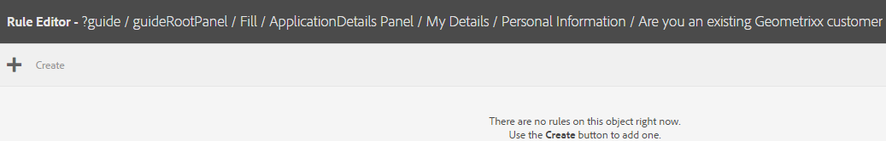
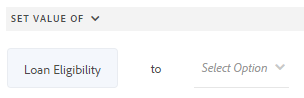

# Regels toevoegen aan een adaptief formulier {#adaptive-forms-rule-editor}

>[!NOTE]
>
> Adobe adviseert het gebruiken van de moderne en verlengbare gegevens vangt [&#x200B; Componenten van de Kern &#x200B;](https://experienceleague.adobe.com/docs/experience-manager-core-components/using/adaptive-forms/introduction.html?lang=nl-NL) voor [&#x200B; het creëren van nieuwe Aangepaste Forms &#x200B;](/help/forms/creating-adaptive-form-core-components.md) of [&#x200B; het toevoegen van Aangepaste Forms aan de pagina&#39;s van AEM Sites &#x200B;](/help/forms/create-or-add-an-adaptive-form-to-aem-sites-page.md). Deze componenten betekenen een aanzienlijke vooruitgang in de aanmaak van Adaptive Forms en zorgen voor indrukwekkende gebruikerservaring. In dit artikel wordt een oudere aanpak beschreven voor de auteur Adaptive Forms die gebruikmaakt van stichtingscomponenten.

| Versie | Artikelkoppeling |
| -------- | ---------------------------- |
| AEM as a Cloud Service (Foundation Components) | Dit artikel |
| AEM as a Cloud Service (Core Components) | [&#x200B; klik hier &#x200B;](/help/forms/rule-editor-core-components.md) |
| AEM 6.5 | [&#x200B; klik hier &#x200B;](https://experienceleague.adobe.com/docs/experience-manager-65/forms/adaptive-forms-advanced-authoring/rule-editor.html?lang=nl-NL) |

## Overzicht {#overview}

Met de functie voor regeleditors kunnen zakelijke gebruikers en ontwikkelaars regels schrijven voor adaptieve formulierobjecten. Met deze regels worden acties gedefinieerd die op formulierobjecten worden geactiveerd op basis van vooraf ingestelde voorwaarden, gebruikersinvoer en gebruikersacties op het formulier. Hierdoor wordt de ervaring met het invullen van formulieren verder gestroomlijnd, zodat u nauwkeurige en snelle informatie krijgt.

De regelredacteur verstrekt een intuïtieve en vereenvoudigde gebruikersinterface om regels te schrijven. De redacteur van de regel biedt een visuele redacteur voor alle gebruikers aan.<!-- In addition, only for forms power users, rule editor provides a code editor to write rules and scripts. --> Enkele belangrijke acties die u met behulp van regels kunt uitvoeren op Adaptief formulierobjecten zijn:

* Een object tonen of verbergen
* Een object in- of uitschakelen
* Een waarde instellen voor een object
* De waarde van een object valideren
* Functies uitvoeren om de waarde van een object te berekenen
* Een service van het formuliergegevensmodel aanroepen en een bewerking uitvoeren
* Eigenschap van een object instellen

<!-- Rule editor replaces the scripting capabilities in [!DNL Experience Manager 6.1 Forms] and earlier releases. However, your existing scripts are preserved in the new rule editor. For more information about working with existing scripts in the rule editor, see [Impact of rule editor on existing scripts](rule-editor.md#p-impact-of-rule-editor-on-existing-scripts-p). -->

Gebruikers die zijn toegevoegd aan de gebruikersgroep voor formulieren, kunnen scripts maken en bestaande scripts bewerken. Gebruikers in de groep [!DNL forms-users] kunnen de scripts gebruiken, maar maken of bewerken geen scripts.

## Verschil tussen de redacteur van de Regel in de Componenten van de Kern en de Redacteur van de Regel in de Componenten van de Stichting

{{rule-editor-diff}}

## Een regel begrijpen {#understanding-a-rule}

Een regel is een combinatie van handelingen en voorwaarden. In de regeleditor omvatten handelingen zoals verbergen, weergeven, inschakelen, uitschakelen of de waarde van een object in een formulier berekenen. Voorwaarden zijn Booleaanse expressies die worden geëvalueerd door controles en bewerkingen uit te voeren op de status, waarde of eigenschap van een formulierobject. Handelingen worden uitgevoerd op basis van de waarde ( `True` of `False` ) die wordt geretourneerd door een voorwaarde te evalueren.

De regelredacteur verstrekt een reeks vooraf bepaalde regeltypes, zoals wanneer, tonen, verbergen, toelaten, onbruikbaar maken, Vastgestelde Waarde van, en Valideren om u te helpen regels schrijven. Elk regeltype laat u voorwaarden en acties in een regel bepalen. Het document verklaart verder elk regeltype in detail.

Een regel volgt doorgaans een van de volgende constructies:

**voorwaarde-actie** In deze constructie, bepaalt een regel eerst een voorwaarde die door een actie wordt gevolgd om teweeg te brengen. De constructie is vergelijkbaar met if-then statement in programmeertalen.

In regelredacteur, **wanneer** regeltype de voorwaarde-actie constructie afdwingt.

**actie-Voorwaarde** in deze constructie, bepaalt een regel eerst een actie om te teweegbrengen die door voorwaarden voor evaluatie wordt gevolgd. Een andere variatie van deze constructie is actie-voorwaarde-afwisselende actie, die ook een afwisselende actie bepaalt om te teweegbrengen als de voorwaarde Vals terugkeert.

Toon, verberg, laat toe, maak onbruikbaar, plaats Waarde van, en bevestig regeltypes in regelredacteur om de actie-voorwaarde regelconstructie af te dwingen. Standaard is de alternatieve actie voor Tonen Verbergen en voor Inschakelen Uitgeschakeld en de tegenovergestelde manier. U kunt de alternatieve standaardhandeling niet wijzigen.

>[!NOTE]
>
>De beschikbare regeltypen, inclusief de voorwaarden en handelingen die u in de regeleditor definieert, zijn ook afhankelijk van het type formulierobject waarop u een regel maakt. In de regeleditor worden alleen geldige regeltypen en opties weergegeven voor het schrijven van voorwaarde- en handelingsinstructies voor een bepaald type formulierobject. U ziet bijvoorbeeld geen regeltypen Valideren, Waarde instellen van, Inschakelen en Uitschakelen voor een deelvensterobject.

Voor meer informatie over regeltypes beschikbaar in de regelredacteur, zie [&#x200B; Beschikbare regeltypes in regelredacteur &#x200B;](rule-editor.md#p-available-rule-types-in-rule-editor-p).

### Richtlijnen voor het kiezen van een regelconstructie {#guidelines-for-choosing-a-rule-construct}

Hoewel u de meeste gebruiksgevallen kunt bereiken door om het even welke regelconstructie te gebruiken, zijn hier sommige richtlijnen om één constructie over een andere te kiezen. Voor meer informatie over de beschikbare regels in regelredacteur, zie [&#x200B; Beschikbare regeltypes in regelredacteur &#x200B;](rule-editor.md#p-available-rule-types-in-rule-editor-p).

* Een typische regel van het duim wanneer het creëren van een regel is het denken over het in de context van het voorwerp waarop u een regel schrijft. Denk eraan dat u veld B wilt verbergen of weergeven op basis van de waarde die een gebruiker in veld A heeft opgegeven. In dit geval evalueert u een voorwaarde in veld A en activeert u een actie in veld B op basis van de waarde die de voorwaarde retourneert.

  Daarom als u een regel op gebied B (het voorwerp schrijft waarop u een voorwaarde) evalueert, gebruik de voorwaarde-actie constructie of het wanneer regeltype. Op dezelfde manier gebruikt u de handeling-voorwaarde constructie of toont of verbergt regeltype op gebied A.

* Soms moet u meerdere handelingen uitvoeren op basis van één voorwaarde. In dergelijke gevallen wordt aangeraden de voorwaarde-actieconstruct te gebruiken. In deze constructie, kunt u een voorwaarde eens evalueren en veelvoudige actieverklaringen specificeren.

  Als u bijvoorbeeld velden B, C en D wilt verbergen op basis van de voorwaarde die controleert of de waarde is opgegeven in veld A, schrijft u één regel met een construct voor voorwaarde-actie of wanneer-regeltype op veld A en geeft u handelingen op om de zichtbaarheid van velden B, C en D te bepalen. Anders hebt u drie aparte regels nodig voor de velden B, C en D, waar elke regel de voorwaarde controleert en het desbetreffende veld weergeeft of verbergt. In dit voorbeeld is het efficiënter om het Wanneer regeltype op één object te schrijven in plaats van Regeltype tonen of verbergen op drie objecten.

* Als u een actie wilt activeren op basis van meerdere voorwaarden, wordt aangeraden een handeling-voorwaardenconstructie te gebruiken. Als u bijvoorbeeld veld A wilt weergeven en verbergen door de voorwaarden in de velden B, C en D te evalueren, gebruikt u Regeltype tonen of verbergen in veld A.
* Gebruik een voorwaarde-handeling of handeling als de regel één handeling voor één voorwaarde bevat.
* Als een regel op een voorwaarde controleert en een actie onmiddellijk bij het verstrekken van een waarde op een gebied of het weggaan van een gebied uitvoert, wordt het geadviseerd om een regel met voorwaarde-actie constructie of het wanneer regeltype op het gebied te schrijven waarop de voorwaarde wordt geëvalueerd.
* De voorwaarde in wanneer regel wordt geëvalueerd wanneer een gebruiker de waarde van het voorwerp verandert waarop wanneer regel wordt toegepast. Als u echter wilt dat de actie wordt geactiveerd wanneer de waarde aan de serverzijde verandert, bijvoorbeeld bij het vooraf invullen van de waarde, kunt u het beste een When-regel schrijven die de actie activeert wanneer het veld wordt geïnitialiseerd.
* Wanneer u regels schrijft voor vervolgkeuzelijsten, keuzerondjes of selectievakjes, worden de opties of waarden van deze formulierobjecten in het formulier vooraf ingevuld in de regeleditor.

## Beschikbare operatortypen en gebeurtenissen in regeleditor {#available-operator-types-and-events-in-rule-editor}

De regeleditor biedt de volgende logische operatoren en gebeurtenissen waarmee u regels kunt maken.

* **is gelijk aan**
* **is niet gelijk aan**
* **begint met**
* **eindigt met**
* **bevat**
* **is Leeg**
* **is niet leeg**
* **heeft Geselecteerd:** keert waar terug wanneer de gebruiker een bepaalde optie voor een checkbox, drop-down, radioknoop selecteert.
* **wordt geïnitialiseerd (gebeurtenis):** keert waar terug wanneer een vormvoorwerp in browser teruggeeft.
* **wordt Gewijzigd (gebeurtenis):** keert waar terug wanneer de gebruiker de ingegane waarde of de geselecteerde optie voor een vormvoorwerp verandert.
* **Navigatie (gebeurtenis):** keert waar terug wanneer de gebruiker een navigatievoorwerp klikt. Navigatieobjecten worden gebruikt om tussen deelvensters te navigeren.
* **Voltooiing van de Stap (gebeurtenis):** keert waar terug wanneer een stap van een regel voltooit.
* **Succesvolle Verzending (gebeurtenis):** Keert waar op succesvolle voorlegging van gegevens aan een model van vormgegevens terug.
* **Fout in Verzending (gebeurtenis):** Keert waar op mislukte voorlegging van gegevens aan een model van vormgegevens terug.

## Beschikbare regeltypen in regeleditor {#available-rule-types-in-rule-editor}

De regelredacteur verstrekt een reeks vooraf bepaalde regeltypes die u kunt gebruiken om regels te schrijven. Laten we elk regeltype in detail bekijken. Voor meer informatie over het schrijven van regels in regelredacteur, zie [&#x200B; regels &#x200B;](rule-editor.md#p-write-rules-p) schrijven.

### [!UICONTROL When] {#whenruletype}

Het **[!UICONTROL When]** regeltype volgt de **voorwaarde-actie-afwisselende actie** regelconstructie, of soms, enkel de **voorwaarde-actie** constructie. In dit regeltype geeft u eerst een voorwaarde op voor evaluatie gevolgd door een actie die moet worden geactiveerd als aan de voorwaarde is voldaan ( `True`). Terwijl het gebruiken van wanneer regeltype, kunt u veelvoudige EN en OF exploitanten gebruiken om [&#x200B; genestelde uitdrukkingen &#x200B;](#nestedexpressions) tot stand te brengen.

Met het regeltype &#39;Wanneer&#39; kunt u een voorwaarde op een formulierobject evalueren en acties op een of meer objecten uitvoeren.

In duidelijke woorden, typisch wanneer de regel als volgt gestructureerd is:

`When on Object A:`

`(Condition 1 AND Condition 2 OR Condition 3) is TRUE;`

`Then, do the following:`

Actie 2 betreffende object B;
EN
Actie 3 betreffende object C;

_

Wanneer u een component met meerdere waarden hebt, zoals keuzerondjes of lijst, terwijl het creëren van een regel voor die component, worden de opties automatisch teruggewonnen en ter beschikking gesteld van de regelmaker. U hoeft de optiewaarden niet nogmaals te typen.

Een lijst heeft bijvoorbeeld vier opties: Rood, Blauw, Groen en Geel. Tijdens het creëren van de regel, worden de opties (radioknopen) automatisch teruggewonnen en ter beschikking gesteld van de regelschepper als volgt:


Tijdens het schrijven van een When-regel kunt u de Clear Value of action activeren. Met Waarde wissen wordt de waarde van het opgegeven object gewist. Met de instructie &#39;Wissen&#39; als optie kunt u complexe voorwaarden maken met meerdere velden.


**[!UICONTROL Hide]** Verbergt het opgegeven object.

**[!UICONTROL Show]** Hiermee wordt het opgegeven object weergegeven.

**[!UICONTROL Enable]** Schakelt het opgegeven object in.

**[!UICONTROL Disable]** Schakelt het opgegeven object uit.

**[!UICONTROL Invoke service]** Roept een dienst aan die in een model van vormgegevens (FDM) wordt gevormd. Wanneer u de Invoke-service kiest, wordt een veld weergegeven. Als op het veld wordt getikt, worden alle services weergegeven die in het gehele formuliergegevensmodel (FDM) zijn geconfigureerd op uw [!DNL Experience Manager] -instantie. Als u een FDM-service (Form Data Model) kiest, worden meer velden weergegeven waarin u formulierobjecten kunt toewijzen met invoer- en uitvoerparameters voor de opgegeven service. Zie voorbeeldregel voor het aanroepen van de diensten van het Model van de Gegevens van de Vorm.

Naast de service Formuliergegevensmodel kunt u een directe WSDL-URL opgeven om een webservice aan te roepen. Nochtans, heeft de modeldienst van de Gegevens van het Vorm vele voordelen en de geadviseerde benadering om de dienst aan te halen.

Voor meer informatie over het vormen van de diensten in het model van vormgegevens (FDM), zie {de Integratie van 0} Gegevens [[!DNL Experience Manager Forms] .](data-integration.md)

**[!UICONTROL Set value of]** Berekent en stelt de waarde van het opgegeven object in. U kunt de objectwaarde instellen op een tekenreeks, de waarde van een ander object, de berekende waarde met wiskundige expressie of functie, de waarde van een eigenschap van een object of de uitvoerwaarde van een geconfigureerde service Formuliergegevensmodel. Wanneer u de optie Webservice kiest, worden alle services weergegeven die in het gehele FDM-formuliergegevensmodel zijn geconfigureerd op uw [!DNL Experience Manager] -instantie. Als u een service Formuliergegevensmodel kiest, worden meer velden weergegeven waarin u formulierobjecten kunt toewijzen met invoer- en uitvoerparameters voor de opgegeven service.

Voor meer informatie over het vormen van de diensten in het model van vormgegevens (FDM), zie {de Integratie van 0} Gegevens [[!DNL Experience Manager Forms] .](data-integration.md)

Met het regeltype **[!UICONTROL Set Property]** kunt u de waarde van een eigenschap van het opgegeven object instellen op basis van een voorwaardenactie. U kunt eigenschap instellen op een van de volgende opties:

* visible (Boolean)
* dorExclusion (Boolean)
* chartType (String)
* title (String)
* enabled (Boolean)
* mandatory (Boolean)
* validationsDisabled (Boolean)
* validateExpMessage (String)
* value (Number, String, Date)
* items (lijst)
* valid (Boolean)
* errorMessage (String)

Zo kunt u bijvoorbeeld regels definiëren om selectievakjes dynamisch toe te voegen aan het adaptieve formulier. U kunt een regel definiëren met behulp van een aangepaste functie, een formulierobject of een objecteigenschap.


Als u een regel wilt definiëren die is gebaseerd op een aangepaste functie, selecteert u **[!UICONTROL Function Output]** in de vervolgkeuzelijst en sleept u een aangepaste functie naar het tabblad **[!UICONTROL Functions]** . Als aan de voorwaarde wordt voldaan, wordt het aantal selectievakjes dat in de aangepaste functie is gedefinieerd, toegevoegd aan het adaptieve formulier.

Als u een regel wilt definiëren die is gebaseerd op een formulierobject, selecteert u **[!UICONTROL Form Object]** in de vervolgkeuzelijst en sleept u een formulierobject van het tabblad **[!UICONTROL Form Objects]** . Als aan de voorwaarde is voldaan, wordt het aantal selectievakjes dat in het formulierobject is gedefinieerd, toegevoegd aan het adaptieve formulier.

Met de regel Eigenschap instellen die is gebaseerd op een objecteigenschap kunt u het aantal selectievakjes toevoegen in een adaptief formulier. Dit is gebaseerd op een andere objecteigenschap die is opgenomen in het adaptieve formulier.

In de volgende afbeelding ziet u een voorbeeld van het dynamisch toevoegen van selectievakjes op basis van het aantal vervolgkeuzelijsten in het adaptieve formulier:


**[!UICONTROL Clear Value Of]** Wist de waarde van het opgegeven object.

**[!UICONTROL Set Focus]** Hiermee wordt de focus op het opgegeven object ingesteld.

**[!UICONTROL Save Form]** Hiermee slaat u het formulier op.

**[!UICONTROL Submit Forms]** verzendt het formulier.

**[!UICONTROL Reset Form]** Hiermee herstelt u het formulier.

**[!UICONTROL Validate Form]** Hiermee valideert u het formulier.

**[!UICONTROL Add Instance]** Hiermee wordt een instantie van het opgegeven herhaalbare deelvenster of de opgegeven tabelrij toegevoegd.

**[!UICONTROL Remove Instance]** Hiermee verwijdert u een instantie van het opgegeven herhaalbare deelvenster of de opgegeven tabelrij.

**[!UICONTROL Navigate to]** Navigeert naar andere <!--Interactive Communications,--> Adaptieve Forms, andere elementen, zoals afbeeldingen of documentfragmenten, of een externe URL. <!-- For more information, see [Add button to the Interactive Communication](create-interactive-communication.md#addbuttontothewebchannel). -->

### [!UICONTROL Set Value of] {#set-value-of}

Met het **[!UICONTROL Set Value of]** -regeltype kunt u de waarde van een formulierobject instellen, afhankelijk van het feit of aan de opgegeven voorwaarde wordt voldaan of niet. De waarde kan worden ingesteld op een waarde van een ander object, een letterlijke tekenreeks, een waarde die is afgeleid van een wiskundige expressie of een functie, een waarde van een eigenschap van een ander object of de uitvoer van een service Form Data Model. Op dezelfde manier kunt u controleren op een voorwaarde voor een component, een tekenreeks, een eigenschap of waarden die zijn afgeleid van een functie of wiskundige expressie.

De **Vastgestelde Waarde van** regeltype is niet beschikbaar voor alle vormvoorwerpen, zoals panelen en toolbarknopen. Een standaardsetwaarde van regel heeft de volgende structuur:

Stel de waarde van Object A in op:

(tekenreeks ABC) OR
(objecteigenschap X van Object C) OR
(waarde van een functie) OR
(waarde van een wiskundige expressie) OF
(uitvoerwaarde van een gegevensmodeldienst of webdienst);

Indien (optioneel):

(Voorwaarde 1 EN Voorwaarde 2 EN Voorwaarde 3) is WAAR;

In het volgende voorbeeld wordt de waarde in het veld `dependentid` als invoer gebruikt en wordt de waarde van het veld `Relation` ingesteld op de uitvoer van het argument `Relation` van de service `getDependent` Formuliergegevensmodel.


Voorbeeld van waardenregel instellen met de service Formuliergegevensmodel

>[!NOTE]
>
>Bovendien kunt u de Vastgestelde Waarde van regel gebruiken om alle waarden in een drop-down lijstcomponent van de output van de modeldienst van de Gegevens van het Vorm of een Webdienst te bevolken. Zorg er echter voor dat het uitvoerargument dat u kiest van een arraytype is. Alle waarden die in een array worden geretourneerd, worden beschikbaar in de opgegeven vervolgkeuzelijst.

### [!UICONTROL Show] {#show}

Met het regeltype **[!UICONTROL Show]** kunt u een regel schrijven om een formulierobject weer te geven of te verbergen op basis van het feit of aan een voorwaarde is voldaan of niet. Het regeltype Tonen activeert ook de handeling Verbergen als de voorwaarde niet wordt vervuld of als `False` wordt geretourneerd.

Een typische Show regel is gestructureerd als volgt:

`Show Object A;`

`When:`

`(Condition 1 OR Condition 2 OR Condition 3) is TRUE;`

`Else:`

`Hide Object A;`

### [!UICONTROL Hide] {#hide}

Net als bij het regeltype Weergeven kunt u het regeltype **[!UICONTROL Hide]** gebruiken om een formulierobject weer te geven of te verbergen op basis van het feit of aan een voorwaarde is voldaan of niet. Het regeltype Verbergen activeert ook de handeling Tonen voor het geval dat niet aan de voorwaarde wordt voldaan of dat `False` wordt geretourneerd.

Een typische regel van de Huid is gestructureerd als volgt:

`Hide Object A;`

`When:`

`(Condition 1 AND Condition 2 AND Condition 3) is TRUE;`

`Else:`

`Show Object A;`

### [!UICONTROL Enable] {#enable}

Met het regeltype **[!UICONTROL Enable]** kunt u een formulierobject in- of uitschakelen op basis van het feit of aan een voorwaarde wordt voldaan of niet. Het regeltype Enable activeert ook de handeling Disable voor het geval dat niet aan de voorwaarde wordt voldaan of dat `False` wordt geretourneerd.

Een typisch laat regel toe is gestructureerd als volgt:

`Enable Object A;`

`When:`

`(Condition 1 AND Condition 2 AND Condition 3) is TRUE;`

`Else:`

`Disable Object A;`

### [!UICONTROL Disable] {#disable}

Net als bij het regeltype Enable kunt u met het **[!UICONTROL Disable]** -regeltype een formulierobject in- of uitschakelen op basis van het feit of aan een voorwaarde wordt voldaan of niet. Het regeltype Uitschakelen activeert ook de handeling Inschakelen als de voorwaarde niet wordt vervuld of als `False` wordt geretourneerd.

Een typisch onbruikbaar maken regel is gestructureerd als volgt:

`Disable Object A;`

`When:`

`(Condition 1 OR Condition 2 OR Condition 3) is TRUE;`

`Else:`

`Enable Object A;`

### [!UICONTROL Validate] {#validate}

Het regeltype **[!UICONTROL Validate]** valideert de waarde in een veld met behulp van een expressie. U kunt bijvoorbeeld een expressie schrijven om te controleren of het tekstvak voor het opgeven van de naam geen speciale tekens of getallen bevat.

Een typisch Validate regel is gestructureerd als volgt:

`Validate Object A;`

`Using:`

`(Expression 1 AND Expression 2 AND Expression 3) is TRUE;`

>[!NOTE]
>
>Als de opgegeven waarde niet voldoet aan de regel Valideren, kunt u een validatiebericht voor de gebruiker weergeven. U kunt het bericht in het veld **[!UICONTROL Script validation message]** opgeven in de componenteigenschappen op de zijbalk.


### [!UICONTROL Set Options Of] {#setoptionsof}

Met het regeltype **[!UICONTROL Set Options Of]** kunt u regels definiëren waarmee selectievakjes dynamisch aan het adaptieve formulier kunnen worden toegevoegd. U kunt de regel definiëren met behulp van een Form Data Model (FDM) of een aangepaste functie.

Als u een regel wilt definiëren die is gebaseerd op een aangepaste functie, selecteert u **[!UICONTROL Function Output]** in de vervolgkeuzelijst en sleept u een aangepaste functie naar het tabblad **[!UICONTROL Functions]** . Het aantal selectievakjes dat is gedefinieerd in de aangepaste functie, wordt toegevoegd aan het adaptieve formulier.


Om een douanefunctie tot stand te brengen, zie [&#x200B; douanefuncties in regelredacteur &#x200B;](#custom-functions).

Een regel definiëren op basis van een FDM (Form Data Model):

1. Selecteer **[!UICONTROL Service Output]** in de vervolgkeuzelijst.
1. Selecteer het gegevensmodelobject.
1. Selecteer een eigenschap voor een gegevensmodelobject in de vervolgkeuzelijst **[!UICONTROL Display Value]** . Het aantal selectievakjes in het adaptieve formulier wordt afgeleid van het aantal instanties dat voor die eigenschap is gedefinieerd in de database.
1. Selecteer een eigenschap voor een gegevensmodelobject in de vervolgkeuzelijst **[!UICONTROL Save Value]** .


## Het begrip van de regel redacteur gebruikersinterface {#understanding-the-rule-editor-user-interface}

De redacteur van de regel verstrekt een uitvoerige maar eenvoudige gebruikersinterface om regels te schrijven en te beheren. U kunt de gebruikersinterface van de regeleditor starten vanuit een adaptief formulier in de ontwerpmodus.

Om het gebruikersinterface van de regelredacteur te lanceren:

1. Open een adaptief formulier in de ontwerpmodus.
1. Selecteer het vormvoorwerp waarvoor u een regel wilt schrijven, en in Toolbar van de Component selecteren  uit. De gebruikersinterface van de regeleditor wordt weergegeven.

   

   Eventuele bestaande regels voor de geselecteerde formulierobjecten worden in deze weergave weergegeven. Voor informatie over het beheren van bestaande regels, zie [&#x200B; regels &#x200B;](rule-editor.md#p-manage-rules-p) leiden.

1. Selecteer **[!UICONTROL Create]** om een nieuwe regel te schrijven. De visuele redacteur van het gebruikersinterface van de regelredacteur opent door gebrek wanneer u de regelredacteur de eerste keer lanceert.

   

Laten wij elke component van de regelredacteur UI in detail bekijken.

### A. Component-rule display {#a-component-rule-display}

Hiermee geeft u de titel weer van het object Adaptief formulier waarmee u de regeleditor hebt gestart en het regeltype dat momenteel is geselecteerd. In het bovenstaande voorbeeld wordt de regeleditor gestart vanuit een adaptief formulierobject met de naam Salary en is het geselecteerde regeltype When.

### B. Formulierobjecten en -functies {#b-form-objects-and-functions-br}

Het deelvenster links in de gebruikersinterface van de regeleditor bevat twee tabbladen: **[!UICONTROL Forms Objects]** en **[!UICONTROL Functions]** .

Op het tabblad Formulierobjecten ziet u een hiërarchische weergave van alle objecten in het adaptieve formulier. De titel en het type van de objecten worden weergegeven. Bij het schrijven van een regel kunt u formulierobjecten naar de regeleditor slepen. Wanneer u een regel maakt of bewerkt en een object of functie naar een tijdelijke aanduiding sleept, neemt de tijdelijke aanduiding automatisch het juiste waardetype.

De formulierobjecten waarop een of meer geldige regels zijn toegepast, worden gemarkeerd met een groene stip. Als een van de regels die op een formulierobject zijn toegepast ongeldig is, wordt het formulierobject gemarkeerd met een gele stip.

Het tabblad Functies bevat een set ingebouwde functies, zoals som van, min of meer, max van, gemiddelde van, aantal en validerende vorm. U kunt deze functies gebruiken om waarden in herhaalbare deelvensters en tabelrijen te berekenen en deze tijdens het schrijven van regels te gebruiken in instructies voor handelingen en voorwaarden. U kunt, echter, [&#x200B; douanefuncties &#x200B;](#custom-functions) ook tot stand brengen.


>[!NOTE]
>
>U kunt tekstzoekopdrachten uitvoeren op namen en titels van objecten en functies op de tabbladen Objecten en Functies van Forms.

In de linkerstructuur van de formulierobjecten kunt u de formulierobjecten selecteren om de regels weer te geven die op elk object zijn toegepast. U kunt niet alleen door de regels van de verschillende formulierobjecten navigeren, u kunt ook regels kopiëren en plakken tussen de formulierobjecten. Voor meer informatie, zie [&#x200B; kopiëren-kleeft regels &#x200B;](rule-editor.md#p-copy-paste-rules-p).

### C. Schakelen tussen formulierobjecten en -functies {#c-form-objects-and-functions-toggle-br}

Met de schakelknop schakelt u, wanneer hierop wordt getikt, de formulierobjecten en het deelvenster met functies in of uit.

### D. Visuele regeleditor {#visual-rule-editor}

De visuele regelredacteur is het gebied op de visuele redacteurswijze van het gebruikersinterface van de regelredacteur waar u regels schrijft. Hiermee kunt u een regeltype selecteren en voorwaarden en handelingen definiëren. Wanneer u voorwaarden en handelingen in een regel definieert, kunt u formulierobjecten en -functies slepen en neerzetten vanuit het deelvenster Formulierobjecten en -functies.

Voor meer informatie over het gebruiken van visuele regelredacteur, zie [&#x200B; regels &#x200B;](rule-editor.md#p-write-rules-p) schrijven.
<!-- 
### E. Visual-code editors switcher {#e-visual-code-editors-switcher}

Users in the forms-power-users group can access code editor. For other users, code editor is not available. If you have the rights, you can switch from visual editor mode to code editor mode of the rule editor, and conversely, using the switcher right above the rule editor. When you launch rule editor the first time, it opens in the visual editor mode. You can write rules in the visual editor mode or switch to the code editor mode to write a rule script. However, note that if you modify a rule or write a rule in code editor, you cannot switch back to the visual editor for that rule unless you clear the code editor.

[!DNL Experience Manager Forms] tracks the rule editor mode you used last to write a rule. When you launch the rule editor next time, it opens in that mode. However, you can also configure a default mode to open the rule editor in the specified mode. To do so:

1. Go to [!DNL Experience Manager] web console at `https://[host]:[port]/system/console/configMgr`.
1. Click to edit **[!UICONTROL Adaptive Form Configuration Service]**.
1. choose **[!UICONTROL Visual Editor]** or **[!UICONTROL Code Editor]** from the **[!UICONTROL Default Mode for Rule Editor]** drop-down

1. Click **[!UICONTROL Save]**.
-->

### E. Gereed en annuleer knoppen {#done-and-cancel-buttons}

Met de knop **[!UICONTROL Done]** kunt u een regel opslaan. U kunt een onvolledige regel opslaan. Onvolledig zijn echter ongeldig en worden niet uitgevoerd. Opgeslagen regels voor een formulierobject worden weergegeven wanneer u de regeleditor de volgende keer start vanuit hetzelfde formulierobject. U kunt bestaande regels in die weergave beheren. Voor meer informatie, zie [&#x200B; regels &#x200B;](rule-editor.md#p-manage-rules-p) leiden.

Met de knop **[!UICONTROL Cancel]** verwijdert u alle wijzigingen die u in een regel hebt aangebracht en sluit u de regeleditor.

## Schrijfregels {#write-rules}

U kunt regels schrijven gebruikend de visuele regelredacteur.

Laten we eerst bekijken hoe u regels schrijft met een visuele editor.

### Visuele editor gebruiken {#using-visual-editor}

Laten we begrijpen hoe u een regel maakt in een visuele editor met behulp van het volgende voorbeeldformulier.


In het gedeelte met vereisten voor leningen in het voorbeeldformulier voor het aanvragen van leningen moeten aanvragers hun echtelijke staat, salaris en indien gehuwd, het salaris van hun echtgenoot vermelden. Op basis van de gebruikersinput wordt het bedrag dat voor de lening in aanmerking komt, berekend door de regel en wordt dit weergegeven in het veld Beleenbaarheid van de lening. Pas de volgende regels toe om het scenario uit te voeren:

* Het veld Salaris van de echtgenoot wordt alleen weergegeven wanneer de huwelijksstatus wordt gehuwd.
* De beleenbaarheid van de lening bedraagt 50% van het totale salaris.

Voer de volgende stappen uit om regels te schrijven:

1. Eerst schrijft u de regel om de zichtbaarheid van het veld Sjabloon bij echtgeno(o)t(e) in te stellen op basis van de optie die de gebruiker selecteert voor het keuzerondje Genderstatus.

   Open het aanvraagformulier voor de lening in de ontwerpmodus. Selecteer de **[!UICONTROL Marital Status]** component en selecteer  uit. Selecteer vervolgens **[!UICONTROL Create]** om de regeleditor te starten.

   

   Wanneer u de regelredacteur lanceert, wanneer de regel door gebrek wordt geselecteerd. Bovendien wordt het formulierobject (in dit geval de huwelijksstatus) waaruit u de regeleditor hebt gestart, opgegeven in de instructie When.

   U kunt het geselecteerde object niet wijzigen of wijzigen, maar u kunt een ander regeltype selecteren met de vervolgkeuzelijst Regel, zoals hieronder wordt weergegeven. Als u een regel voor een ander object wilt maken, selecteert u Annuleren om de regeleditor af te sluiten en opnieuw te starten vanuit het gewenste formulierobject.

1. Selecteer **[!UICONTROL Select State]** vervolgkeuzelijst en selecteer **[!UICONTROL is equal to]** . Het veld **[!UICONTROL Enter a String]** wordt weergegeven.

   

   In het radioknoop van de Burgerlijke Status, **[!UICONTROL Married]** en **[!UICONTROL Single]** worden de opties toegewezen **0** en **1** waarden, respectievelijk. U kunt toegewezen waarden verifiëren op het tabblad Titel van het dialoogvenster Keuzerondje bewerken, zoals hieronder wordt weergegeven.

   

1. Op het **[!UICONTROL Enter a String]** gebied in de regel, specificeer **0**.

   

   U hebt de voorwaarde gedefinieerd als `When Marital Status is equal to Married` . Definieer vervolgens de actie die moet worden uitgevoerd als deze voorwaarde Waar is.

1. Selecteer in de instructie Vervolgens **[!UICONTROL Show]** in de vervolgkeuzelijst **[!UICONTROL Select Action]** .

   

1. Sleep het veld **[!UICONTROL Spouse Salary]** naar het tabblad Formulierobjecten in het veld **[!UICONTROL Drop object or select here]** . U kunt ook het veld **[!UICONTROL Drop object or select here]** selecteren en het veld **[!UICONTROL Spouse Salary]** in het pop-upmenu selecteren, waarin alle formulierobjecten in het formulier worden vermeld.

   

   De regel wordt als volgt weergegeven in de regeleditor.

   

1. Selecteer **[!UICONTROL Done]** om de regel op te slaan.

1. Herhaal de stappen 1 tot en met 5 om een andere regel te definiëren waarmee het veld Echtloon wordt verborgen als de staat van het huwelijk een enkele regel is. De regel wordt als volgt weergegeven in de regeleditor.

   

   >[!NOTE]
   >
   >Alternatief, kunt u één Show regel op het gebied van de Salaris van de Echtgenote, in plaats van twee schrijven wanneer de regels op het gebied van de Burgerlijke Status, om het zelfde gedrag uit te voeren.

   

1. Vervolgens schrijft u een regel om het beleenbare bedrag van de lening te berekenen, dat 50% van het totale salaris is, en geeft u dit weer in het veld Beleenbaarheid van de lening. U bereikt dit resultaat door **[!UICONTROL Set value Of]** regels te maken voor het veld Beleenbaarheid van leningen.

   Op auteurswijze, selecteer het **[!UICONTROL Loan Eligibility]** gebied en selecteer  uit. Selecteer vervolgens **[!UICONTROL Create]** om de regeleditor te starten.

1. Selecteer **[!UICONTROL Set Value Of]** regel in de vervolgkeuzelijst met regels.

   

1. Selecteer **[!UICONTROL Select Option]** en selecteer **[!UICONTROL Mathematical Expression]** . Er wordt een veld voor het schrijven van wiskundige expressies geopend.

   

1. In het expressieveld:

   * Selecteer of sleep-daling van het lusje van de Objecten van Forms het **[!UICONTROL Salary]** gebied in het eerste **[!UICONTROL Drop object or select here]** gebied.

   * Selecteer **[!UICONTROL Plus]** in het veld **[!UICONTROL Select Operator]** .

   * Selecteer of sleep-daling van het lusje van de Objecten van Forms het **[!UICONTROL Spouse Salary]** gebied in het andere **[!UICONTROL Drop object or select here]** gebied.

   

1. Selecteer vervolgens in het gemarkeerde gebied rond het expressieveld en selecteer **[!UICONTROL Extend Expression]** .

   

   Selecteer in het veld Uitgebreide expressie **[!UICONTROL divided by]** in het **[!UICONTROL Select Operator]** veld en **[!UICONTROL Number]** in het **[!UICONTROL Select Option]** veld. Geef vervolgens **[!UICONTROL 2]** op in het nummerveld.

   

   >[!NOTE]
   >
   >U kunt complexe expressies maken met behulp van componenten, functies, wiskundige expressies en eigenschapwaarden in het veld Optie selecteren.

   Maak vervolgens een voorwaarde die, wanneer True wordt geretourneerd, de expressie uitvoert.

1. Selecteer **[!UICONTROL Add Condition]** om de instructie When toe te voegen.

   

   In de instructie When:

   * Selecteer of sleep-daling van het lusje van de Objecten van Forms het **[!UICONTROL Marital Status]** gebied in het eerste **[!UICONTROL Drop object or select here]** gebied.

   * Selecteer **[!UICONTROL is equal to]** in het veld **[!UICONTROL Select Operator]** .

   * Selecteer String in het andere veld **[!UICONTROL Drop object or select here]** en geef **[!UICONTROL Married]** op in het veld **[!UICONTROL Enter a String]** .

   De regel wordt uiteindelijk als volgt weergegeven in de regeleditor.  

1. Selecteer **[!UICONTROL Done]**. Het bespaart de regel.

1. Herhaal stap 7 tot en met 14 om een andere regel te definiëren om de beleenbaarheid van de lening te berekenen als de burgerlijke stand eenmalig is. De regel wordt als volgt weergegeven in de regeleditor.

   

>[!NOTE]
>
>U kunt ook de regel Waarde instellen van gebruiken om de beleenbaarheid van leningen te berekenen in de regel When die u hebt gemaakt om het veld Salaris van de echtgenoot weer te geven en te verbergen. De resulterende gecombineerde regel wanneer de Status van het Samenhang Enige is verschijnt als volgt in de regelredacteur.
>
>Op dezelfde manier kunt u een gecombineerde regel schrijven om de zichtbaarheid van het veld Echtgendag te bepalen en de beleenbaarheid van leningen berekenen wanneer de huwelijksstatus wordt gehuwd.


<!-- ### Using code editor {#using-code-editor}

Users added to the forms-power-users group can use code editor. The rule editor auto generates the JavaScript code for any rule you create using visual editor. You can switch from visual editor to the code editor to view the generated code. However, if you modify the rule code in the code editor, you cannot switch back to the visual editor. If you prefer writing rules in code editor rather than visual editor, you can write rules afresh in the code editor. The visual-code editors switcher helps you switch between the two modes.

The code editor JavaScript is the expression language of Adaptive Forms. All the expressions are valid JavaScript expressions and use Adaptive Forms scripting model APIs. These expressions return values of certain types. For the complete list of Adaptive Forms classes, events, objects, and public APIs, see [JavaScript Library API reference for Adaptive Forms](https://helpx.adobe.com/nl/experience-manager/6-5/forms/javascript-api/index.html).

For more information about guidelines to write rules in the code editor, see [Adaptive Form Expressions](adaptive-form-expressions.md).

While writing JavaScript code in the rule editor, the following visual cues help you with the structure and syntax:

* Syntax highlights

* Auto Indentation

* Hints and suggestions for Form objects, functions, and their properties

* Auto completion of form component names and common JavaScript functions


-->

#### Aangepaste functies in regeleditor {#custom-functions}

Naast uit-van-de-doos functies zoals *Som van* die onder de Output van Functies vermeld zijn, kunt u douanefuncties schrijven die u vaak nodig hebt. Zorg ervoor dat de functie die u schrijft, vergezeld gaat van de `jsdoc` hierboven.

Begeleidend `jsdoc` is vereist:

* Als u aangepaste configuratie en beschrijving wilt
* Omdat er meerdere manieren zijn om een functie in `JavaScript,` te declareren en opmerkingen u in staat stellen de functies bij te houden.

De redacteur van de regel steunt de syntaxis van JavaScript ES5 voor manuscripten en douanefuncties.
Voor meer informatie, zie [&#x200B; jsdoc.app &#x200B;](https://jsdoc.app/).

Ondersteunde `jsdoc` -tags:

* **Privé**
Syntaxis: `@private`
Een functie van het type private is niet opgenomen als een aangepaste functie.

* **Naam**
Syntaxis: `@name funcName <Function Name>`
Alternatief `,` kunt u gebruiken: `@function funcName <Function Name>` **of** `@func` `funcName <Function Name>`.
  `funcName` is de naam van de functie (geen spaties toegestaan).
  `<Function Name>` is de weergavenaam van de functie.

* **Lid**
Syntaxis: `@memberof namespace`
Koppelt een naamruimte aan de functie.

* **Parameter**
Syntaxis: `@param {type} name <Parameter Description>`
U kunt ook het volgende gebruiken: `@argument` `{type} name <Parameter Description>` **of** `@arg` `{type}` `name <Parameter Description>` .
Geeft parameters weer die door de functie worden gebruikt. Een functie kan meerdere parametertags hebben, één tag voor elke parameter in de volgorde waarin deze voorkomt.
  `{type}` staat voor het parametertype. Toegestane parametertypen zijn:

   1. string
   1. getal
   1. boolean
   1. bereik

  Bereik verwijst naar velden van een adaptief formulier. Wanneer een formulier wazig laden gebruikt, kunt u `scope` gebruiken om de bijbehorende velden te openen. U kunt velden openen wanneer de velden worden geladen of als de velden algemeen zijn gemarkeerd.

  Alle parametertypen worden in een van de bovenstaande categorieën ingedeeld. Geen wordt niet ondersteund. Selecteer een van de bovenstaande typen. Typen zijn niet hoofdlettergevoelig. Spaties zijn niet toegestaan in de parameter `name` . `<Parameter Descrption>` `<parameter>  can have multiple words. </parameter>`

* **Type van Terugkeer**
Syntaxis: `@return {type}`
U kunt ook `@returns {type}` gebruiken.
Voegt informatie over de functie toe, zoals zijn doel.
  {type} staat voor het retourneringstype van de functie. Toegestane retourtypen zijn:

   1. string
   1. getal
   1. boolean

  Alle andere retourneringstypen worden in een van de bovenstaande categorieën ingedeeld. Geen wordt niet ondersteund. Selecteer een van de bovenstaande typen. De types van terugkeer zijn niet case-sensitive.

   * **dit**
Syntaxis: `@this currentComponent`

  Gebruik @this om te verwijzen naar de component Adaptief formulier waarop de regel is geschreven.

  Het volgende voorbeeld is gebaseerd op de veldwaarde. In het volgende voorbeeld verbergt de regel een veld in het formulier. Het `this` gedeelte van `this.value` verwijst naar de onderliggende component Adaptief formulier waarop de regel is geschreven.

  ```
     /**
     * @function myTestFunction
     * @this currentComponent
     * @param {scope} scope in which code inside function is run.
     */
     myTestFunction = function (scope) {
        if(this.value == "O"){
              scope.age.visible = true;
        } else {
           scope.age.visible = false;
        }
     }
  ```

  >[!NOTE]
  >
  >Opmerkingen vóór aangepaste functie worden gebruikt voor overzicht. Samenvatting kan tot veelvoudige lijnen worden uitgebreid tot een markering wordt ontmoet. Beperk de grootte tot één voor een beknopte beschrijving in de regelbouwer.

**Toevoegend een douanefunctie**

U wilt bijvoorbeeld een aangepaste functie toevoegen die het gebied van een vierkant berekent. De zijlengte is de gebruikersinvoer naar de aangepaste functie, die wordt geaccepteerd met een numeriek vak in het formulier. De berekende uitvoer wordt weergegeven in een ander numeriek vak in het formulier. Als u een aangepaste functie wilt toevoegen, moet u eerst een clientbibliotheek maken en deze vervolgens toevoegen aan de CRX-opslagplaats.

Voer de volgende stappen uit om een clientbibliotheek te maken en deze toe te voegen in de CRX-opslagplaats:

1. Maak een clientbibliotheek. Voor meer informatie, zie [&#x200B; Gebruikend cliënt-Kant Bibliotheken &#x200B;](https://experienceleague.adobe.com/docs/experience-manager-cloud-service/implementing/developing/full-stack/clientlibs.html?lang=nl-NL#developing).
1. In CRXDE, voeg een bezit `categories` met koordtypewaarde als `customfunction` aan de `clientlib` omslag toe.

   >[!NOTE]
   >
   >`customfunction` is een voorbeeldcategorie. U kunt om het even welke naam voor de categorie kiezen u in de `clientlib` omslag creeert.

Nadat u de clientbibliotheek in de CRX-opslagplaats hebt toegevoegd, gebruikt u deze in uw adaptieve formulier. Hiermee kunt u uw aangepaste functie als regel in uw formulier gebruiken. Voer de volgende stappen uit om de clientbibliotheek toe te voegen aan uw adaptieve formulier:

1. Open het formulier in de bewerkingsmodus.
Als u een formulier wilt openen in de bewerkingsmodus, selecteert u een formulier en selecteert u **[!UICONTROL Open]** .
1. Op geef wijze uit, selecteer een component, dan uitgezocht  > **[!UICONTROL Adaptive Form Container]**, en selecteer dan .
1. Voeg in het zijpaneel, onder Naam van clientbibliotheek, uw clientbibliotheek toe. ( `customfunction` in het voorbeeld.)

   

1. Selecteer de input numerieke doos, en selecteer  uit om de regelredacteur te openen.
1. Selecteer **[!UICONTROL Create Rule]**. Maak met de opties hieronder een regel om de kwadratwaarde van de invoer op te slaan in het veld Uitvoer van het formulier.

   [](assets/add-custom-rule.png) te creëren

1. Selecteer **[!UICONTROL Done]**. Uw aangepaste functie wordt toegevoegd.

   >[!NOTE]
   >
   > Om een model van vormgegevens (FDM) van regelredacteur aan te halen gebruikend douanefuncties, [&#x200B; zie hier &#x200B;](/help/forms/using-form-data-model.md#invoke-services-in-adaptive-forms-using-rules-invoke-services).

#### Ondersteunde typen functiedeclaratie {#function-declaration-supported-types}

**Verklaring van de Functie**

```javascript
function area(len) {
    return len*len;
}
```

Deze functie wordt opgenomen zonder `jsdoc` opmerkingen.

**Uitdrukking van de Functie**

```javascript
var area;
//Some codes later
/** */
area = function(len) {
    return len*len;
};
```

**Uitdrukking en Verklaring van de Functie**

```javascript
var b={};
/** */
b.area = function(len) {
    return len*len;
}
```

**Verklaring van de Functie als Variabele**

```javascript
/** */
var x1,
    area = function(len) {
        return len*len;
    },
    x2 =5, x3 =true;
```

Beperking: een aangepaste functie kiest alleen de eerste functiedeclaratie uit de lijst met variabelen, indien bijeengevoegd. U kunt functie-expressie gebruiken voor elke gedeclareerde functie.

**de Verklaring van de Functie als Voorwerp**

```javascript
var c = {
    b : {
        /** */
        area : function(len) {
            return len*len;
        }
    }
};
```

>[!NOTE]
>
>Gebruik `jsdoc` voor elke aangepaste functie. Hoewel `jsdoc` commentaren worden aangemoedigd, omvat een lege `jsdoc` commentaar om uw functie als douanefunctie te merken. Het laat standaardbehandeling van uw douanefunctie toe.

### Aangepaste functies ondersteunen in validatie-expressies {#supporting-custom-functions-in-validation-expressions-br}

Soms, als er **complexe bevestigingsregels** zijn, verblijft het nauwkeurige bevestigingsmanuscript in douanefuncties en de auteur roept deze douanefuncties van de uitdrukking van de gebiedsbevestiging. Als u deze aangepaste functiebibliotheek bekend en beschikbaar wilt maken tijdens het uitvoeren van validaties op de server, kan de auteur van het formulier de naam van de AEM-clientbibliotheek configureren onder het tabblad **[!UICONTROL Basic]** Adaptief formuliercontainereigenschappen, zoals hieronder wordt weergegeven.


Aangepaste functies ondersteunen in validatie-expressies

Auteurs kunnen de aangepaste JavaScript-bibliotheek configureren per adaptief formulier. Houd in de bibliotheek alleen de herbruikbare functies die afhankelijk zijn van bibliotheken van derden jquery en underscore.js.

## Foutafhandeling bij verzenden van handeling {#error-handling-on-submit-action}

Als onderdeel van de beveiligingsrichtlijnen en de richtlijnen voor het verharden van AEM, configureert u aangepaste foutpagina&#39;s zoals 400.jsp, 404.jsp en 500.jsp. Deze handlers worden aangeroepen wanneer bij het verzenden van een formulier 400, 404 of 500 fouten worden weergegeven. De handlers worden ook geroepen wanneer deze foutencodes op de Publish knoop worden teweeggebracht. U kunt ook JSP-pagina&#39;s maken voor andere HTTP-foutcodes.

Als u een FDM-formulier (Form Data Model) of een op schema gebaseerd adaptief formulier met XML- of JSON-gegevensklacht vooraf instelt op een schema dat bestaat uit gegevens die geen `<afData>` -, `<afBoundData>` - en `</afUnboundData>` -tags bevatten, gaan de gegevens van niet-begrensde velden van het adaptieve formulier verloren. Het schema kan een XML-schema, JSON-schema of een formuliergegevensmodel (FDM) zijn. Niet-begrensde velden zijn adaptieve formuliervelden zonder de eigenschap `bindref` .

## Regels beheren {#manage-rules}

Om het even welke bestaande regels op een vormvoorwerp zijn vermeld wanneer u het voorwerp selecteert en . U kunt de titel en een voorvertoning van het regeloverzicht weergeven. Voorts laat UI u de volledige regelsamenvatting uitbreiden en bekijken, de orde van regels veranderen, regels uitgeven, en regels schrappen.


U kunt de volgende handelingen op regels uitvoeren:

* **breid/Vouw** samen: De kolom van de Inhoud in de regellijst toont de regelinhoud. Als de volledige regelinhoud niet zichtbaar in de standaardmening is, uitgezocht  om het uit te breiden.

* **opnieuw rangschikt**: Om het even welke nieuwe regel u creeert wordt gestapeld bij de bodem van de regellijst. De regels worden van boven naar beneden uitgevoerd. De regel bij de bovenkant voert eerst gevolgd door andere regels van het zelfde type uit. Bijvoorbeeld, als u hebt wanneer, tonen, toelaten, en wanneer de regels bij eerste, tweede, derde, en vierde posities van bovenkant, respectievelijk, wanneer de regel bij de bovenkant eerst wordt uitgevoerd gevolgd door wanneer de regel bij de vierde positie. Vervolgens worden de regels Tonen en Inschakelen uitgevoerd.
U kunt de orde van een regel veranderen door  tegen het te tikken of belemmering-daling het aan de gewenste orde in de lijst.

* **geeft** uit: Om een regel uit te geven, selecteer het controlevakje naast de regeltitel. Er worden opties weergegeven voor het bewerken en verwijderen van de regel. Selecteer **[!UICONTROL Edit]** om de geselecteerde regel te openen in de regeleditor <!-- in visual  or code editor mode depending on the mode used to create the rule --> .

* **Schrapping**: Om een regel te schrappen, selecteer de regel en selecteer **[!UICONTROL Delete]**.

* **toelaten/onbruikbaar maken**: Wanneer u gebruik van een regel tijdelijk moet onderbreken, kunt u één of meerdere regels selecteren en **[!UICONTROL Disable]** in de toolbar van Acties selecteren om hen onbruikbaar te maken. Als een regel is uitgeschakeld, wordt deze niet uitgevoerd tijdens de runtime. Als u een uitgeschakelde regel wilt inschakelen, selecteert u deze en selecteert u Inschakelen op de werkbalk Handelingen. De statuskolom van de regel geeft aan of de regel is ingeschakeld of uitgeschakeld.

 onbruikbaar

## Regels kopiëren en plakken {#copy-paste-rules}

U kunt een regel kopiëren-kleven van één gebied aan andere gelijkaardige gebieden om tijd te besparen.

Ga als volgt te werk om regels te kopiëren en te plakken:

1. Selecteer het vormvoorwerp waarvan u een regel wilt kopiëren, en in de componententoolbar uitgezocht  uit. De gebruikersinterface van de regeleditor wordt weergegeven terwijl het formulierobject is geselecteerd en de bestaande regels worden weergegeven.

   

   Voor informatie over het beheren van bestaande regels, zie [&#x200B; regels &#x200B;](rule-editor.md#p-manage-rules-p) leiden.

1. Schakel het selectievakje naast de titel van de regel in. Er worden opties voor het beheer van de regel weergegeven. Selecteer **[!UICONTROL Copy]** .

   

1. Selecteer een ander formulierobject waarop u de regel wilt plakken en selecteer **[!UICONTROL Paste]** . Bovendien kunt u de regel bewerken om er wijzigingen in aan te brengen.

   >[!NOTE]
   >
   >U kunt een regel alleen in een ander formulierobject plakken als dat formulierobject de gebeurtenis van de gekopieerde regel ondersteunt. Een knop ondersteunt bijvoorbeeld de gebeurtenis click. U kunt een regel met een klikgebeurtenis aan een knoop maar niet aan een controledoos kleven.

1. Selecteer **[!UICONTROL Done]** om de regel op te slaan.

## Geneste expressies {#nestedexpressions}

De redacteur van de regel laat u veelvoudige EN en OF exploitanten gebruiken om genestelde regels tot stand te brengen. U kunt veelvoudige EN en OF exploitanten in regels mengen.

Hieronder ziet u een voorbeeld van een geneste regel die een bericht weergeeft aan de gebruiker dat hij of zij in aanmerking komt voor de voogdij van een kind als aan de vereiste voorwaarden is voldaan.


U kunt ook voorwaarden slepen en neerzetten in een regel om deze te bewerken. Selecteer en beweegt over het handvat ( ) vóór een voorwaarde. Zodra de aanwijzer verandert in het handsymbool zoals hieronder wordt weergegeven, sleept u de voorwaarde en zet u deze neer op een willekeurige plaats binnen de lijn. De regelstructuur verandert.


## Datumexpressievoorwaarden {#dateexpression}

De redacteur van de regel laat u datumvergelijkingen gebruiken om voorwaarden tot stand te brengen.

Na is een voorbeeldvoorwaarde die een statisch tekstvoorwerp toont als de hypotheek op het huis reeds wordt genomen, dat de gebruiker door het datumgebied te vullen aangeeft.

Wanneer de hypotheekdatum van het onroerend goed, zoals door de gebruiker ingevuld, in het verleden ligt, geeft het Adaptief formulier een toelichting op de berekening van het inkomen. In de volgende regel wordt de datum die door de gebruiker is ingevuld, vergeleken met de huidige datum en als de datum die door de gebruiker is ingevuld eerder is dan de huidige datum, wordt in het formulier het tekstbericht (Income genoemd) weergegeven.


Wanneer de datum waarop deze is ingevuld, eerder is dan de huidige datum, wordt het tekstbericht (Inkomsten) als volgt weergegeven:


## Aantal vergelijkingsvoorwaarden {#number-comparison-conditions}

De redacteur van de regel laat u voorwaarden tot stand brengen die twee aantallen vergelijken.

Na is een voorbeeldvoorwaarde die een statisch tekstvoorwerp toont als het aantal maanden een aanvrager op huidige adres minder dan 36 blijft.


Wanneer de gebruiker aangeeft minder dan 36 maanden op het huidige woonadres te wonen, wordt in het formulier gemeld dat meer bewijs van verblijf kan worden aangevraagd.


<!-- ## Impact of rule editor on existing scripts {#impact-of-rule-editor-on-existing-scripts}

In [!DNL Experience Manager Forms] versions prior to [!DNL Experience Manager 6.1 Forms] feature pack 1, form authors and developers used to write expressions in the Scripts tab of the Edit component dialog to add dynamic behavior to Adaptive Forms. The Scripts tab is now replaced by the rule editor.

Any scripts or expressions that you must have written in the Scripts tab are available in the rule editor. While you cannot view or edit them in visual editor, if you are a part of the forms-power-users group you can edit scripts in code editor. -->

## Voorbeelden van regels {#example}

### Service Formuliergegevensmodel aanroepen {#invoke}

Bekijk een webservice `GetInterestRates` die het bedrag van de lening, de looptijd en de creditscore van de aanvrager als input gebruikt en een leningenplan retourneert met daarin het bedrag en de rentevoet van het EMI. U maakt een FDM (Form Data Model) met de webservice als gegevensbron. U voegt gegevensmodelobjecten en een `get` -service toe aan het formuliermodel. De service wordt weergegeven op het tabblad Services van het formuliergegevensmodel (FDM). Maak vervolgens een adaptief formulier dat velden van gegevensmodelobjecten bevat om de gebruikersinvoer voor het bedrag van de lening, de looptijd en de creditscore vast te leggen. Voeg een knop toe die de webservice activeert om plandetails op te halen. De uitvoer wordt ingevuld in de desbetreffende velden.

De volgende regel toont hoe u de Invoke de dienstactie vormt om het voorbeeldscenario te verwezenlijken.


>[!NOTE]
>
>Als de invoer van een arraytype is, zijn de velden die arrays ondersteunen zichtbaar onder de vervolgkeuzelijst Uitvoer.

### Meerdere handelingen triggeren met de regel Wanneer {#triggering-multiple-actions-using-the-when-rule}

In een aanvraagformulier voor een lening wilt u vastleggen of de aanvrager van de lening een bestaande klant is of niet. Op basis van de informatie die de gebruiker opgeeft, moet het veld met de klant-id worden weergegeven of verborgen. Ook, wilt u nadruk op het gebied van identiteitskaart van de klant plaatsen als de gebruiker een bestaande klant is. Het aanvraagformulier voor de lening bestaat uit de volgende onderdelen:

* Een keuzerondje, **[!UICONTROL Are you an existing Geometrixx customer?]** , dat opties [!UICONTROL Yes] en [!UICONTROL No] biedt. De waarde voor ja is **0** en Nr is **1**.

* Een tekstveld, **[!UICONTROL Geometrixx customer ID]** , om de klant-id op te geven.

Wanneer u wanneer regel op het radioknoop schrijft om dit gedrag uit te voeren, verschijnt de regel als volgt in de visuele regelredacteur.


Regel in de visuele editor

In de voorbeeldregel, is de verklaring in wanneer sectie de voorwaarde is, die wanneer Waar terugkeert, de acties uitvoert die in de Dan sectie worden gespecificeerd.

<!-- The rule appears as follows in the code editor.

 

Rule in the code editor -->

### Een functie-uitvoer in een regel gebruiken {#using-a-function-output-in-a-rule}

In een inkooporderformulier hebt u de volgende tabel waarin gebruikers hun bestellingen invullen. In deze tabel:

* De eerste rij is herhaalbaar, zodat kunnen de gebruikers tot veelvoudige producten opdracht geven en verschillende hoeveelheden specificeren. De elementnaam is `Row1` .
* De titel van de cel in de kolom Product Quantity van de herhaalbare rij is Quantity. De elementnaam voor deze cel is `productquantity` .
* De tweede rij in de tabel is niet-herhaalbaar en de titel van de cel in de kolom Hoeveelheid product in deze rij is Totale hoeveelheid.


**A.** Row1 **B.** Hoeveelheid **C.** Totale Hoeveelheid

Nu, wilt u gespecificeerde hoeveelheden in de kolom van de Hoeveelheid van het Product voor alle producten toevoegen en de som in de Totale cel van de Hoeveelheid tonen. U kunt deze som bereiken door een Set Waarde van regel op de Totale cel van de Hoeveelheid te schrijven zoals hieronder getoond.


Regel in de visuele editor

<!-- he rule appears as follows in the code editor.


Rule in the code editor -->

### Een veldwaarde valideren met expressie {#validating-a-field-value-using-expression}

In het inkooporderformulier dat in het vorige voorbeeld wordt beschreven, wilt u de gebruiker beperken om meer dan één hoeveelheid van een product te bestellen waarvan de prijs hoger is dan 10000. Voor deze validatie kunt u een validatieregel schrijven, zoals hieronder wordt weergegeven.


Regel in de visuele editor

<!-- The rule appears as follows in the code editor.


Rule in the code editor -->