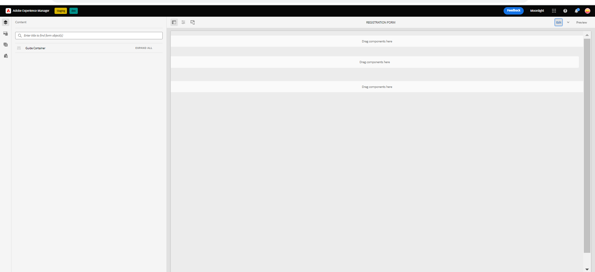

# Voorbeeldthema&#39;s, sjablonen en modellen formuliergegevens in kerncomponenten {#sample-themes-templates-and-data-models}

AEM Forms as a Cloud Service biedt verschillende voorbeeldreferentiethema&#39;s, sjablonen en formuliergegevensmodellen waarmee u snel Adaptive Forms with Core Components kunt maken. U kunt [Adaptieve Forms Core-componenten inschakelen](https://experienceleague.adobe.com/docs/experience-manager-cloud-service/content/forms/setup-configure-migrate/enable-adaptive-forms-core-components.html) over de as a Cloud Service en lokale ontwikkelomgeving van AEM Forms voor referentie-OTB-sjablonen en naar [thema&#39;s gebruiken en aanpassen](https://experienceleague.adobe.com/docs/experience-manager-cloud-service/content/forms/adaptive-forms-authoring/authoring-adaptive-forms-core-components/create-an-adaptive-form-on-forms-cs/using-themes-in-core-components.html) in [!DNL AEM Forms].

De voorbeeldthema&#39;s, sjablonen en modellen van formuliergegevens in het pakket met referentie-inhoud zijn:

| Sjablonen | Thema&#39;s | Formuliergegevensmodellen |
---------|----------|---------
| Basis | Canvas | Microsoft® Dynamics 365 |
| Leeg | WKND | Salesforce |
| Contact opnemen | Easel |  |
| Goedkeuringsformulier | |  |
| Klacht bij hogere voorziening | | |
| Aanvraag voor logservice |  |  |
| Feedback geven |  |  |
| Inschrijving voor voordelen |  |   |
| Overzicht van personeelsbeloningen |   |   |
| Verzoek om een rekeningafschrift |   |   |
| Update van contactgegevens |   |   |
| Veiligheidsinspectieformulier |   |   |
| Kwaliteitscontrole |   |   |
| Aankoopaanvraag |  |  |

## Voorbeeldthema&#39;s {#Sample-Themes}

Met behulp van referentiethema&#39;s kunt u stijlen definiëren voor uw formulieren zonder dat u ervaring hoeft te hebben met CSS, zelfs als u uw thema naar wens kunt aanpassen. U kunt [Adaptieve Forms Core-componenten inschakelen](https://experienceleague.adobe.com/docs/experience-manager-cloud-service/content/forms/setup-configure-migrate/enable-adaptive-forms-core-components.html) over de as a Cloud Service en lokale ontwikkelingsomgeving van AEM Forms om deze thema&#39;s als volgt te kunnen beschrijven:

### Canvas {#Canvas}

Canvas is het standaardthema voor Adaptief Forms en benadrukt het gebruik van basiskleuren, transparantie en platte pictogrammen. In de onderstaande schermafbeelding kunt u zien hoe het thema Canvas eruitziet.

### WKND {#WKND}

Het WKND-thema belichaamt een levendig, verbeeldend en boeiend ontwerp om een stijlvol uiterlijk in uw formulieren te laten zien. Het thema is gebaseerd op de vormgeving en opmaak van [WKND-site](https://wknd.site/us/en.html) de website voor reizen en avontuur is gebaseerd op [Adobe Experience Manager Core-componenten](https://experienceleague.adobe.com/docs/experience-manager-core-components/using/introduction).

### Easel {#Easel}

Het Easel-thema verwijst naar een specifiek type sjabloonontwerp dat eenvoudig kan worden ingesteld en dat is aangepast aan de eenvoud en gebruiksvriendelijkheid. Het Easel-thema is gebaseerd op het concept waar een draagbare standaard die kunstenaars gebruiken om een canvas te ondersteunen terwijl ze aan hun schilderijen werken.

## Voorbeeldsjablonen {#Sample-templates}

Sjablonen definiëren de initiële formulierstructuur, inhoud en handelingen die in het formulier moeten worden herhaald of gebruiken een vergelijkbare sjabloonstructuur als het formulier, zoals Goedkeuring, Voordelen, Inschrijvingsformulier en nog veel meer. U kunt de volgende sjablonen ophalen door [Aangepaste Forms Core-componenten inschakelen](https://experienceleague.adobe.com/docs/experience-manager-cloud-service/content/forms/setup-configure-migrate/enable-adaptive-forms-core-components.html) over de as a Cloud Service of lokale ontwikkelingsomgeving van AEM Forms. De voorbeeldsjablonen in Adaptive Forms Core Components zijn:

### Basis {#Basic}

Met de basissjabloon kunt u snel een formulier voor inschrijvingservaring maken. U kunt dit ook gebruiken om een voorvertoning weer te geven van de functionaliteit van adaptieve Forms core-componenten. Het verstrekt een tovenaar lay-out voor sectie-door-sectie presentatie van gegevens.

>[!BEGINTABS]

>[!TAB Desktop]

    

>[!TAB Telefoon]

    

>[!TAB Tablet]

    

>[!ENDTABS]

### Leeg {#Blank}

Een lege canvassjabloon wordt gebruikt om een adaptieve formulierstructuur, inhoud en helemaal nieuwe regels te maken. Er worden geen formuliercomponenten opgenomen.

### Verzoek om accountverklaring {#Request-for-Account-Statement}

Een verzoek om een formulier met een rekeningoverzicht om een transactieoverzicht te kunnen aanvragen. Deze verklaring bevat een gedetailleerd overzicht van financiële transacties, activiteiten of andere relevante informatie over een persoon. Door dit formulier in te vullen, kunt u het proces starten voor het verkrijgen van een nauwkeurige en actuele instructie voor uw records.

### Update contactgegevens {#Contact-Details-Update}

Het formulier voor het bijwerken van contactgegevens voor adres- en contactgegevens is ontworpen om u te helpen bij het bijwerken van uw persoonlijke gegevens met betrekking tot uw abonnement of voordelen. Zo hebt u een naadloze communicatie en ononderbroken toegang tot de services of voordelen die u ontvangt.

### Veiligheidscontrole {#Safety-Inspection}

Het veiligheidscontroleformulier is bedoeld om een veilige werkomgeving te handhaven. Door regelmatige inspecties uit te voeren met behulp van dit formulier kunnen mogelijke gevaren worden geïdentificeerd. Zij heeft betrekking op diverse aspecten, zoals nooduitgangen, brandveiligheid, elektrische veiligheid, gevaarlijke materialen, persoonlijke beschermingsmiddelen, ergonomische werkstations, enz. voor de veiligheid en het welzijn van werknemers, bezoekers en klanten en creëert een veilige omgeving voor iedereen.

### Aankoopaanvraag {#Purchase-Request}

Een inkoopaanvraagformulier waarmee het aanbestedingsproces kan worden gestart en waarmee werknemers formeel kunnen verzoeken om de aankoop van goederen of diensten die nodig zijn voor hun werk. In het formulier worden essentiële gegevens opgenomen, zoals de beschrijving van de artikelen, de hoeveelheid, de leverancier van de voorkeursleverancier (indien van toepassing), de toewijzing van het budget, de rechtvaardiging voor de aankoop, de leveringsinformatie en de vereiste goedkeuringen. Het formulier heeft tot doel het aankoopproces te stroomlijnen en te documenteren, zodat de gevraagde aankopen naar behoren worden geautoriseerd en bijgehouden.

### Overzicht personeelsbeloningen {#Employee-Benefits-Summary}

Het formulier Overzicht personeelsbeloningen wordt gebruikt om essentiële details over de prestaties van een individu te verzamelen. Het helpt om dekking snel en nauwkeurig te evalueren, die een uitvoerig overzicht voor efficiënte hulp en steun verstrekken.

### Inschrijving voordelen {#Benefits-Enrollment}

Een inschrijvingsformulier voor uitkeringen om essentiële informatie van hun werknemers te verzamelen over hun voorkeursvergoedingen en dekkingsopties. Het gaat doorgaans vergezeld van de jaarlijkse periode waarin uitkeringen worden ingeschreven.

### Kwaliteitscontrole {#Quality-Control-Inspection}

Een formulier voor kwaliteitscontrole waarmee de visuele weergave, afmetingen, functionaliteit, documentatie, testresultaten en de algemene kwaliteit van een product of item worden beoordeeld en gedocumenteerd. Het helpt gebreken, afwijkingen, en correctieve acties identificeren noodzakelijk om naleving van kwaliteitsnormen te verzekeren.

### Goedkeuringsformulier {#Consent-Form}

Een toestemmingsformulier is een juridisch document dat probeert vrijwillige en geïnformeerde toestemming te verkrijgen van een persoon of deelnemer voordat hij of zij deelneemt aan een specifieke activiteit, onderzoeksstudie, medische procedure of elke situatie waarin zijn of haar persoonlijke informatie of rechten kunnen worden betrokken. Het doel van een toestemmingsformulier is de transparantie te waarborgen, de rechten van de deelnemer te beschermen en een duidelijk inzicht te krijgen in wat het individu ermee instemt.

### Contact opnemen {#Contact-Us}

Het formulier voor het bijwerken van contactgegevens voor adres- en contactgegevens is ontworpen om u te helpen bij het bijwerken van uw persoonlijke gegevens met betrekking tot uw abonnement of voordelen. Zo hebt u een naadloze communicatie en ononderbroken toegang tot de services of voordelen die u ontvangt.

### Aanvraag voor logservice {#Log-Service-Request}

Een vorm van het de logboekdienstverzoek om de specifieke logboekdiensten van een dienstverlener te verzoeken. Het formulier fungeert als een formeel verzoek om een ticket te maken. Er zijn bepaalde gebeurtenissen, activiteiten of gegevens geregistreerd voor de controle of het bijhouden van de status.

### Feedback geven {#Give-Feedback}

Een &quot;geef-terugkoppel&quot;malplaatje om constructieve terugkoppelen aan een andere persoon of een team te verstrekken. Het malplaatje helpt ervoor zorgen dat terugkoppelen duidelijk, specifiek, en actionable is, bevorderend open mededeling en verbetering.

## Referentieformuliergegevensmodellen {#reference-models}

De Adaptive Forms kan vervolgens communiceren met Microsoft® Dynamics 365 en Salesforce-servers om bedrijfsworkflows mogelijk te maken. Bijvoorbeeld:

* Schrijf gegevens naar Microsoft® Dynamics 365 en Salesforce bij het verzenden van adaptieve formulieren.
* Schrijf gegevens in Microsoft® Dynamics 365 en Salesforce via aangepaste entiteiten die zijn gedefinieerd in het Form Data Model en vice versa.
* Vraag Microsoft® Dynamics 365 en Salesforce-server naar gegevens en vul Adaptive Forms vooraf in.
* Lees gegevens van Microsoft® Dynamics 365 en Salesforce-server.

U kunt de volgende modellen van de Gegevens van het Vorm krijgen door te installeren [Referentie-inhoudspakket](https://experience.adobe.com/#/downloads/content/software-distribution/en/aemcloud.html?package=/content/software-distribution/en/details.html/content/dam/aemcloud/public/aem-forms-reference-content.ui.content-2.1.0.zip):

* Microsoft® Dynamics 365
* Salesforce

Zie voor informatie over het gebruik van deze modellen [Microsoft® Dynamics 365 en Salesforce-cloudservices configureren](https://experienceleague.adobe.com/docs/experience-manager-cloud-service/content/forms/integrate/use-form-data-model/configure-msdynamics-salesforce.html?lang=en#configure-dynamics-cloud-service)
