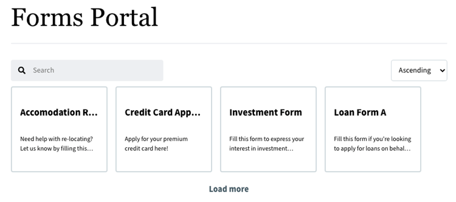

# Adaptief formulier op basis van kerncomponent opslaan als concept {#save-af-form}

Het opslaan van een adaptief formulier als concept is een essentiële functie die de efficiëntie en nauwkeurigheid van de gebruiker verbetert. Met deze functionaliteit kunnen gebruikers de voortgang opslaan en de taken later voltooien zonder dat ze ingevoerde informatie verliezen. Het bieden van een `save-as-draft` optie verzekert flexibiliteit in het beheren van tijd, vermindert het risico van gegevensverlies, en handhaaft de precisie van voorlegging. U kunt formulieren opslaan als concepten en deze later voltooien.

## Overwegingen

* [Aangepaste Forms-kerncomponenten voor uw omgeving inschakelen.](/help/forms/enable-adaptive-forms-core-components.md)

* Zorg ervoor dat de [ kerncomponent aan versie 3.0.24 of recenter ](https://github.com/adobe/aem-core-forms-components) wordt geplaatst om deze eigenschap te gebruiken.
* Zorg ervoor dat u een [ Azure opslagrekening en een toegangssleutel ](https://learn.microsoft.com/en-us/azure/storage/common/storage-account-keys-manage?tabs=azure-portal) hebt om toegang tot de Azure opslagrekening toe te staan.

## Een adaptief formulier opslaan als concept

[!DNL Experience Manager Forms] Gegevensintegratie (data-integration.md) biedt [!DNL Azure] opslagconfiguratie voor de integratie van formulieren met [!DNL Azure] -opslagservices. Met FDM (Form Data Model) kunt u Adaptive Forms maken die met de [!DNL Azure] -server werkt om bedrijfsworkflows in te schakelen.

Als u het formulier wilt opslaan als concept, moet u zorgen dat u een Azure-opslagaccount en een toegangstoets hebt om toegang tot het [!DNL Azure] -opslagaccount te autoriseren. Voer de volgende stappen uit om het formulier op te slaan als concept:

1. [Azure Storage Configuration maken](#create-azure-storage-configuration)
1. [Unified Storage-connector configureren voor Forms Portal](#configure-usc-forms-portal)
1. [Regel maken om een adaptief formulier op te slaan als concept](#rule-to-save-adaptive-form-as-draft)

### 1. Maak een Azure Storage Configuration {#create-azure-storage-configuration}

Zodra u beschikt over een Azure-opslagaccount en een toegangstoets om toegang tot de [!DNL Azure] -opslagaccount te verlenen, voert u de volgende stappen uit om een Azure-opslagconfiguratie te maken:

1. Navigeer naar **[!UICONTROL Tools]** > **[!UICONTROL Cloud Services]** > **[!UICONTROL Azure Storage]** .

   

1. Selecteer een configuratiemap om de configuratie te maken en selecteer **[!UICONTROL Create]** .

   

1. Geef een titel voor de configuratie op in het veld **[!UICONTROL Title]** .
1. Geef de naam van de [!DNL Azure] -opslagaccount op in de velden **[!UICONTROL Azure Storage Account]** en **[!UICONTROL Azure Access Key]** .

   

1. Klik **sparen**.

>[!NOTE]
>
> U kunt **[!UICONTROL Azure Storage Account]** en **[!UICONTROL Azure Access Key]** van [ Microsoft Azure Portal ](https://learn.microsoft.com/en-us/azure/storage/common/storage-account-keys-manage?tabs=azure-portal) terugwinnen.

### 2. Configureer Unified Storage Connector voor Forms Portal {#configure-usc-forms-portal}

Nadat u de Azure Storage Configuration hebt gemaakt, configureert u de Unified Storage Connector voor Forms Portal met de volgende stappen:

1. Navigeer naar **[!UICONTROL Tools]** > **[!UICONTROL Forms]** > **[!UICONTROL Unified Storage Connector]** .

   

1. Selecteer **[!UICONTROL Azure]** in de vervolgkeuzelijst **[!UICONTROL Storage]** in de sectie **[!UICONTROL Forms Portal]** .
1. Specificeer de [ configuratieweg voor de Azure opslagconfiguratie ](#create-azure-storage-configuration) op het **[!UICONTROL Storage Configuration Path]** gebied.

    plaatst

1. Selecteer **[!UICONTROL Save]** en selecteer vervolgens **[!UICONTROL Publish]** om de configuratie te publiceren.

### 3. Maak regels om een adaptief formulier op te slaan als concept {#rule-to-save-adaptive-form-as-draft}

Om een vorm als Ontwerp te bewaren, creeer a **sparen de regel van de Vorm** op een vormcomponent, zoals een knoop. Wanneer op de knop wordt geklikt, wordt de regel geactiveerd en wordt het formulier opgeslagen als concept. Voer de volgende stappen uit om **sparen de regel van de Vorm** op een knoopcomponent tot stand te brengen:

1. Open in de instantie Auteur een adaptief formulier in de bewerkingsmodus.
1. Van de linkerruit, uitgezochte  en sleep de **[!UICONTROL Button]** component aan de vorm.
1. Selecteer de **[!UICONTROL Button]** component en selecteer dan .
1. Selecteer het pictogram **[!UICONTROL Edit Rules]** om de Regeleditor te openen.
1. Selecteer **[!UICONTROL Create]** om de regel te configureren en te maken.
1. In de **[!UICONTROL When]** sectie, wordt de uitgezochte **geklikt** en in de **[!UICONTROL Then]** sectie, selecteert **sparen Vorm** optie.
1. Selecteer **[!UICONTROL Done]** om de regel op te slaan.

Wanneer u voorproef een Aangepast Vorm, vult het uit, en klikt **sparen Vorm** knoop, wordt de vorm bewaard als ontwerp voor later gebruik.

## Concepten en verzendingen om concepten op de AEM Sites-pagina weer te geven

AEM Forms verstrekt de **de portalcomponent van Concepten &amp; van Verzending** uit de doos aan vertoning bewaarde vormen op de pagina&#39;s van AEM Sites. De {**component 0} Concepten &amp; van Verzending toont vormen die als concepten voor recentere voltooiing, evenals voorgelegde vormen worden bewaard.** Deze component biedt een persoonlijke ervaring voor elke aangemelde gebruiker door concepten en verzendingen weer te geven die betrekking hebben op de Adaptive Forms die door de gebruiker is gemaakt.

U kunt de uit-van-de-doos componenten van het Portaal van Forms gebruiken om vormontwerpen op de pagina van AEM Sites weer te geven. Voer de volgende stappen uit om de **Concepten &amp; van Submissies** poortcomponent te gebruiken:

1. [Concepten en verzenden Forms Portal-component inschakelen](#enable-component)
2. [Concepten en verzendingen toevoegen aan AEM Sites-pagina](#Add-drafts-submissions-component)
3. [Concepten en verzendingen configureren](#configure-drafts-submissions-component)

### 1. Concepten en verzendingen inschakelen Forms Portal-component{#enable-component}

Voer de volgende stappen uit om de component **[!UICONTROL Drafts & Submissions]** in het sjabloonbeleid in te schakelen:

1. Open de pagina van AEM Sites op een **geeft** wijze uit.
1. Ga naar **[!UICONTROL Page Information]** > **[!UICONTROL Edit Template]**
    uit

1. Klik **[!UICONTROL Policy]** en selecteer **[!UICONTROL Drafts & Submissions]** checkbox onder **[AEM de Naam van het Project van Archetype ] - Forms en Communicatie Portaal**.

   

1. Klik op **[!UICONTROL Done]**.

Wanneer een portalcomponent is ingeschakeld, kunt u deze gebruiken in de auteurinstantie van uw AEM Sites-pagina.

### 2. Voeg concepten en verzendingen toe aan AEM Sites-pagina{#Add-drafts-submissions-component}

U kunt Forms Portal maken en aanpassen op websites die zijn gemaakt met AEM door de portalcomponenten toe te voegen en te configureren. Zorg ervoor dat de [ componenten van Concepten &amp; van Verzending ](#enable-component) wordt toegelaten alvorens hen in de pagina van AEM Sites te gebruiken.

Om een component toe te voegen, of sleep en laat vallen de component van **trekt &amp; de componentenruit van Verzending** aan de lay-outcontainer op de pagina, of selecteer het add pictogram op de lay-outcontainer en voeg de component van de **[!UICONTROL Insert New Component]** dialoog toe.

 toe

### 3. Concepten en verzendingen configureren {#configure-drafts-submissions-component}

De **componenten van Concepten &amp; van Verzending** toont vormen die als ontwerp voor de voltooiing later en voorgelegde vormen worden bewaard. Om **Concepten &amp; Submissions** te vormen, voer de volgende stappen uit:
1. Selecteer de **componenten van Concepten &amp; van Verzending**.
1. Klik  en de dialoogdoos verschijnt.
1. Geef in het dialoogvenster **[!UICONTROL Drafts and Submissions]** het volgende op:
   * **Titel** om een component in een pagina van Plaatsen en door gebrek te identificeren, verschijnt de titel bovenop de component.
   * **Type**: Om op de vormlijst als ontwerp of voorgelegde vormen te wijzen.
   * **Lay-out**: Om de vormen van het lijstontwerp of voorgelegde vormen in kaart of lijstformaat te tonen.

   ](/help/forms/assets/save-form-as-draft-dns-properties.png) eigenschappen van het Ontwerp en van de Component van de Verzending ![

1. Klik **Gedaan**.

Wanneer **[!UICONTROL Select Type]** als **Ontwerp Forms** wordt geselecteerd, verschijnen de vormen die als concepten worden bewaard:

Wanneer **[!UICONTROL Select Type]** als **Voorgelegde Forms** wordt geselecteerd, verschijnen de voorgelegde vormen:

U kunt het formulier openen door op het desbetreffende formulier te klikken.

<!--

### Configure Search & Lister Component {#configure-search-lister-component}

The Search & Lister component is used to list adaptive forms on a page and to implement search on the listed forms. 

To configure, select the component and then select the . The [!UICONTROL Search and Lister] dialog opens.

1. In the [!UICONTROL Display] tab, configure the following:
    * In **[!UICONTROL Title]**, specify the title for the Search & Lister component. An indicative title enables the users perform quick search across the list of forms.
    * From the **[!UICONTROL Layout]** list, select the layout to represent the forms in card or list format.
    * Select **[!UICONTROL Hide Search]** and **[!UICONTROL Hide Sorting]** to hide the search and sort by features.
    * In **[!UICONTROL Tooltip]**, provide the tooltip that appears when you hover over the component. 
1. In the [!UICONTROL Asset Folder] tab, specify the location from where the forms are pulled and listed on the page. You can configure multiple folder locations.
1. In the [!UICONTROL Results] tab, configure the maximum number of forms to display per page. The default is eight forms per page.

### Configure Link Component {#configure-link-component}

The link component enables you to provide links to an adaptive form on the page. To configure, select the component and then select the . The [!UICONTROL Edit Link Component] dialog opens.

1. In the [!UICONTROL Display] tab, provide the link caption and tooltip to ease identification of the forms represented by the link.
1. In the [!UICONTROL Asset Info] tab, specify the repository path where the asset is stored. 
1. In the [!UICONTROL Query Params] tab, specify the additional parameters in the key-value pair format. When the link is clicked, these additional parameters and passed along with the form.

## Configure Asynchronous Form Submission Using Adobe Sign {#configure-asynchronous-form-submission-using-adobe-sign}

You can configure to submit an adaptive form only when all the recipients have completed the signing ceremony. Follow the steps below to configure the setting using Adobe Sign.

1. In the author instance, open an Adaptive Form in the edit mode.
1. From the left pane, select the Properties icon and expand the **[!UICONTROL ELECTRONIC SIGNTATURE]** option.
1. Select **[!UICONTROL Enable Adobe Sign]**. Various configuration options display. 
1. In the [!UICONTROL Submit the form] section, select the **[!UICONTROL after every recipient completes signing ceremony]** option to configure the Submit Form action, where the form is first sent to all the recipients for signing. Once all the recipients have signed the form, only then the form is submitted. 

## Save Adaptive Forms As Drafts {#save-adaptive-forms-as-drafts}

You can save forms as Drafts for completing them later. There are two ways in which a form is saved as a draft:

* Create a "Save Form" rule on a form component, for example, a button. On clicking the button, the rule triggers and the form are saved a draft.
* Enable Auto-Save feature, which saves the form as per the specified event or after a configured interval of time.

### Create Rules to Save an Adaptive Form as Draft {#rule-to-save-adaptive-form-as-draft}

To create a "Save Form" rule on a form component, for example, a button, follow the steps below:

1. In the author instance, open an Adaptive Form in edit mode.
1. From the left pane, select  and drag the [!UICONTROL Button] component to the form.
1. Select the [!UICONTROL Button] component and then select the . 
1. Select the [!UICONTROL Edit Rules] icon to open the Rule Editor. 
1. Select **[!UICONTROL Create]** to configure and create the rule.
1. In the [!UICONTROL When] section, select "is clicked" and in the [!UICONTROL Then] section, select the "Save Form" options.
1. Select **[!UICONTROL Done]** to save the rule.

### Enable Auto-save {#enable-auto-save}

You can configure the auto-save feature for an adaptive form as follows:

1. In the author instance, open an Adaptive Form in edit mode.
1. From the left pane, select the  and expand the [!UICONTROL AUTO-SAVE] option.
1. Select the **[!UICONTROL Enable]** check box to enable auto-save of the form. You can configure the following:
* By default, the [!UICONTROL Adaptive Form Event] is set to "true", which implies that the form is auto-saved after every event.
* In [!UICONTROL Trigger], configure to trigger auto-save based on the occurrence of an event or after a specific interval of time.
-->

## Zie ook {#see-also}

{{see-also}}

<!--

>[!MORELIKETHIS]
>
>* [Configure data sources for AEM Forms](/help/forms/configure-data-sources.md)
>* [Configure Azure storage for AEM Forms](/help/forms/configure-azure-storage.md)
>* [Integrate Microsoft Dynamics 365 and Salesforce with Adaptive Forms](/help/forms/configure-msdynamics-salesforce.md)

-->
