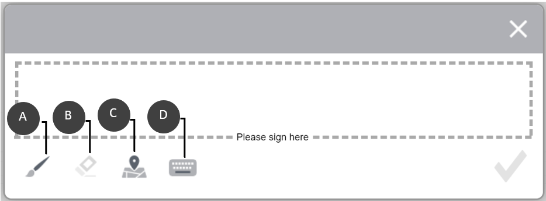
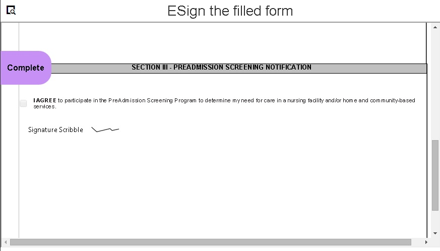

# Elektronische handtekeningen toepassen op een formulier met scripthandtekeningen{#apply-electronic-signatures-to-a-form-using-deprecated-scribble-signatures}

U kunt de **Krabbelhandtekening** en **Handtekeningstap** te tekenen (krabbelen) handtekening op een adaptief formulier. In de stapcomponent Handtekening wordt een PDF-versie van het adaptieve formulier weergegeven. Als u de stapcomponent Handtekening wilt gebruiken, hebt u een optie Document of Record ingeschakeld of een op een formuliersjabloon gebaseerde Adaptieve Forms nodig.

Beide componenten bieden een venster, zoals hieronder wordt weergegeven, om een formulier te ondertekenen. U kunt ook op het geolocatiepictogram klikken  om geolocatie toe te voegen aan de handtekening.

## Een adaptief formulier configureren voor het gebruik van een scripthandtekening {#configure-an-adaptive-form-to-use-scribble-signature}

1. Maak een optie Document of Record ingeschakeld of maak een op een formuliersjabloon gebaseerd adaptief formulier. Voor geleidelijke informatie, zie [Een adaptief formulier maken](creating-adaptive-form.md).
1. Sleep de **Krabbelhandtekening** van componentbrowser naar het adaptieve formulier.
1. Tik op de knop **Configureren**  pictogram. De eigenschappenbrowser wordt geopend en de eigenschappen van de component Krabbelen handtekening worden weergegeven. Configureer eigenschappen van de component Krabbelhandtekening.
1. Sleep de component Signature Step van de componentbrowser naar het Adaptieve formulier.

   >[!NOTE]
   >
   >De component voor de stap Handtekening gebruikt de volledige breedte die beschikbaar is voor het formulier. Het wordt aanbevolen geen andere component op te nemen in de sectie die de component voor de stap Handtekening bevat.

1. Tik in de Inhoudsbrowser op **Formuliercontainer** en tik op de knop **Configureren**  pictogram. De eigenschappenbrowser wordt geopend en de eigenschappen van de container Adaptief formulier worden weergegeven. Navigeren naar **Aangepaste formuliercontainer** > **Elektronische handtekening** en deselecteer de **Adobe Sign inschakelen** optie. Tik op Gereed  om de wijzigingen op te slaan.

   >[!NOTE]
   >
   >Wanneer u een component Handtekeningstap toevoegt aan een adaptief formulier, wordt de optie Adobe Sign inschakelen automatisch geselecteerd.

1. Tik op de knop **Configureren**  pictogram. De eigenschappenbrowser wordt geopend en de eigenschappen voor stap Handtekening worden weergegeven. Configureer de volgende eigenschappen:

   * **Elementnaam**: Geef de naam van de component op.

   * **Titel:** Geef een unieke titel van de component op.
   * **Sjabloonbericht:** Geef het bericht op dat moet worden weergegeven wanneer de PDF van de handtekening wordt geladen. Adobe Sign-services hebben enige tijd nodig om de PDF van de handtekening voor te bereiden en te laden.
   * **Ondertekeningsservice:** Selecteer **Krabbelhandtekening** optie.

   * **CSS-klasse**: Geef eventueel de CSS-klasse van de clientbibliotheek op. Het wordt aanbevolen [thema&#39;s](themes.md) en [inline stijlen](inline-style-adaptive-forms.md) in plaats van CSS-klasse.

   Tik op Gereed  om de wijzigingen op te slaan. De handtekening is geconfigureerd.

   Wanneer u nu een formulier invult, wordt een PDF-versie van het adaptieve formulier weergegeven en worden opties voor de ondertekening van het PDF-document weergegeven. Zie voor meer informatie [Een adaptief formulier ondertekenen met behulp van een scripthandtekening](signing-forms-using-scribble.md#sign-an-adaptive-form-using-scribble-signature).

## Een adaptief formulier ondertekenen met behulp van een scripthandtekening {#sign-an-adaptive-form-using-scribble-signature}

1. Nadat u een adaptief formulier hebt ingevuld en de pagina Stap handtekening hebt bereikt, wordt het handtekeningscherm weergegeven.

   

1. Klik op **[!UICONTROL Sign]**. Het dialoogvenster Scriptteken wordt weergegeven. Onderteken het formulier en klik op Gereed  pictogram om de handtekening op te slaan.

   

1. Klik op Voltooien om het ondertekeningsproces te voltooien.

   

De handtekeningen worden toegevoegd aan het formulier en het formulierbesturingselement gaat naar het volgende venster.

