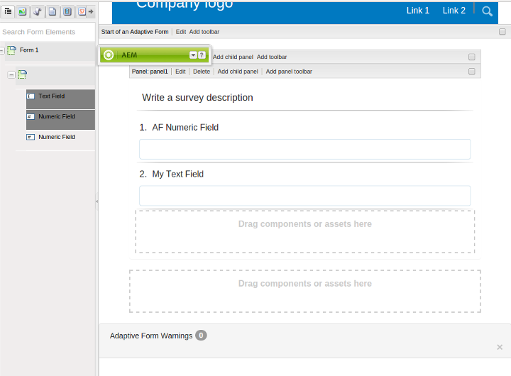

# Adaptieve Forms synchroniseren met XFA-formuliersjablonen{#synchronizing-adaptive-forms-with-xfa-form-templates}

## Inleiding {#introduction}

U kunt een adaptief formulier maken op basis van een XFA-formuliersjabloon ( `*.XDP` -bestand). Met dit hergebruik kunt u uw investering in bestaande XFA-formulieren behouden. Voor informatie over hoe te om een XFA vormmalplaatje te gebruiken voor het creëren van een Aangepaste Vorm, [ creeer een AanpassingsVorm die op een malplaatje ](creating-adaptive-form.md) wordt gebaseerd.

U kunt velden uit het XDP-bestand in het adaptieve formulier opnieuw gebruiken. Deze velden worden gebonden velden genoemd. De eigenschappen van de gebonden velden (zoals scripts, labels en weergave-indeling) worden uit het XDP-bestand gekopieerd. U kunt er ook voor kiezen de waarde van sommige van deze eigenschappen te overschrijven.

[!DNL AEM Forms] biedt een manier om u te helpen de velden van de adaptieve Forms gesynchroniseerd te houden met alle wijzigingen die later worden aangebracht in de corresponderende velden in het XDP-bestand. In dit artikel wordt uitgelegd hoe u deze synchronisatie kunt inschakelen.

In de [!DNL AEM Forms] -ontwerpomgeving kunt u velden van een XFA-formulier (links) naar een adaptief formulier slepen (rechts)

## Vereisten {#prerequisites}

Om de informatie in dit artikel te gebruiken, wordt een vertrouwdheid met de volgende gebieden geadviseerd:

* [Een adaptief formulier maken](creating-adaptive-form.md)

* XFA (XML Forms Architecture)

Om de activa te gebruiken verstrekt voor het voorbeeld in het artikel, download het steekproefpakket zoals die in de volgende sectie wordt verklaard, [ pakket van de Steekproef ](synchronizing-adaptive-forms-xfa.md#p-sample-package-p).

## Voorbeeldpakket {#sample-package}

In het artikel wordt een voorbeeld gebruikt om te tonen hoe u het adaptieve formulier synchroniseert met een bijgewerkte XFA-formuliersjabloon. De activa die in het voorbeeld worden gebruikt zijn beschikbaar in een pakket, dat van de [ sectie van Downloads ](synchronizing-adaptive-forms-xfa.md#p-downloads-p) in dit artikel kan worden gedownload.

Nadat u het pakket hebt geüpload, kunt u deze elementen weergeven in de gebruikersinterface van [!DNL AEM Forms] .

Installeer het pakket met behulp van pakketbeheer: `https://<server>:<port>/crx/packmgr/index.jsp`

Het pakket bevat de volgende elementen:

1. `sample-form.xdp`: De XFA-formuliersjabloon die als voorbeeld wordt gebruikt

1. `sample-xfa-af`: Het adaptieve formulier op basis van het bestand sample-form.xdp. Dit adaptieve formulier bevat echter geen velden. In de volgende stap voegen we inhoud toe aan dit adaptieve formulier.

### Inhoud toevoegen aan adaptief formulier {#add-content-to-adaptive-form-br}

1. Ga naar https://&lt;server>:&lt;port>/aem/forms.html. Voer uw referenties in als hierom wordt gevraagd.
1. Open de sample-af-xfa voor bewerking in de auteursmodus.
1. Kies Gegevensmodelobjecten op het tabblad Inhoud in de inhoudbrowser op de zijbalk. Sleep NumeriekVeld1 en TextField1 naar het adaptieve formulier.
1. Verander de Titel van NumericField1 van **Numeriek Gebied** aan **AF Numeriek Gebied.**

>[!NOTE]
>
>In de voorgaande stappen is een eigenschap van een veld in het XDP-bestand overschreven. Deze eigenschap wordt daarom niet gesynchroniseerd als de overeenkomende eigenschap in het XDP-bestand later wordt gewijzigd.

## Wijzigingen detecteren in XDP-bestand {#detecting-changes-in-xdp-file}

Telkens wanneer een wijziging optreedt in een XDP-bestand of een fragment, geeft de gebruikersinterface van [!DNL AEM Forms] alle adaptieve Forms weer die zijn gebaseerd op het XDP-bestand of het fragment.

Nadat u een XDP-bestand hebt bijgewerkt, moet u het opnieuw uploaden in de gebruikersinterface van [!DNL AEM Forms] om de wijzigingen te laten markeren.

Laten we het `sample-form.xdp` -bestand bijvoorbeeld als volgt bijwerken:

1. Navigeer naar `https://<server>:<port>/projects.html.` Voer uw gegevens in als u hierom wordt gevraagd.
1. Klik op het tabblad Forms aan de linkerkant.
1. Download het `sample-form.xdp` -bestand op uw lokale computer. Het XDP-bestand wordt gedownload als een `.zip` -bestand, dat kan worden uitgepakt met een willekeurig bestandsdecompressiehulpprogramma.

1. Open het `sample-form.xdp` dossier en verander de titel van het gebied TextField1 van **Gebied van de Tekst** aan **Mijn Gebied van de Tekst**.

1. Upload het `sample-form.xdp` -bestand weer naar de [!DNL AEM Forms] -gebruikersinterface.

Als een XDP-bestand wordt bijgewerkt, wordt in de editor een pictogram weergegeven wanneer u de Adaptieve Forms bewerkt op basis van het XDP-bestand. Dit pictogram geeft aan dat het adaptieve formulier niet meer synchroon is met het XDP-bestand. Zie het pictogram naast in het zijpaneel in de volgende afbeelding.

 is

## Adaptieve Forms synchroniseren met het nieuwste XDP-bestand {#synchronizing-adaptive-forms-with-the-latest-xdp-file}

Wanneer een Aangepast Vorm dat met het XDP dossier uit synchronisatie is voor ontwerp de volgende keer wordt geopend, wordt het volgende bericht getoond: **Schema/het Malplaatje van de Vorm voor de AanpassingsVorm is bijgewerkt. `Click Here` om deze opnieuw te baseren met de nieuwe versie.**

Wanneer u op het bericht klikt, worden de velden in het adaptieve formulier gesynchroniseerd met de bijbehorende velden in het XDP-bestand.

Open `sample-xfa-af` in de ontwerpmodus voor het voorbeeld dat in dit artikel wordt gebruikt. Het bericht wordt onder aan het adaptieve formulier weergegeven.

### De eigenschappen bijwerken {#updating-the-properties}

Alle eigenschappen die van het XDP-bestand naar het adaptieve formulier zijn gekopieerd, worden bijgewerkt, behalve de eigenschappen die expliciet door de auteur in het adaptieve formulier (vanuit het dialoogvenster Component) zijn overschreven. De lijst met eigenschappen die zijn bijgewerkt, is beschikbaar in de serverlogboeken.

Als u de eigenschappen in het voorbeeld Adaptief formulier wilt bijwerken, klikt u op de koppeling (met het label `"Click Here"` ) in het bericht. De titel van TextField1 verandert van **Gebied van de Tekst** in **Mijn Gebied van de Tekst**.

>[!NOTE]
>
>Het etiketAF Numeriek Gebied werd niet veranderd omdat u dit bezit van de dialoog van componenteneigenschappen met voeten had getreden, zoals die in [ wordt beschreven voeg inhoud aan Aanpassings Forms ](synchronizing-adaptive-forms-xfa.md#p-add-content-to-adaptive-form-br-p) toe.

### Nieuwe velden van XDP-bestand toevoegen aan adaptief formulier   {#adding-new-fields-from-xdp-file-to-adaptive-form-nbsp}

Alle velden die later aan het oorspronkelijke XDP-bestand worden toegevoegd, worden weergegeven op het tabblad Formulierhiërarchie en u kunt deze nieuwe velden naar het adaptieve formulier slepen.

U hoeft niet op de koppeling in het foutbericht te klikken om de velden op het tabblad Formulierhiërarchie bij te werken.

### Verwijderde velden in XDP-bestand {#deleted-fields-in-xdp-file}

Als een veld dat eerder naar een adaptief formulier is gekopieerd, uit een XDP-bestand wordt verwijderd, wordt in de ontwerpmodus een foutbericht weergegeven met de mededeling dat het veld niet bestaat in het XDP-bestand. Verwijder in dergelijke gevallen het veld handmatig uit Adaptief formulier of wis de eigenschap `bindRef` in het dialoogvenster met componenten.

De volgende stappen illustreren deze gebruiksstroom voor de elementen in het voorbeeld dat in dit artikel wordt gebruikt:

1. Werk het `sample-form.xdp` -bestand bij en verwijder NumericField1.
1. Upload het `sample-form.xdp` -bestand in de [!DNL AEM Forms] -gebruikersinterface
1. Open het `sample-xfa-af` adaptieve formulier voor ontwerpen. Het volgende foutbericht wordt weergegeven: Het schema/formuliersjabloon voor het adaptieve formulier is bijgewerkt. `Click Here` gebruiken om de toepassing opnieuw te baseren op de nieuwe versie.

1. Klik op de koppeling (met het label &quot; `Click Here`&quot;) in het bericht. Er wordt een foutbericht weergegeven met de mededeling dat het veld niet meer bestaat in het XDP-bestand.

 schrapt

Het veld dat is verwijderd, wordt ook gemarkeerd met een pictogram om een fout in het veld aan te geven.

>[!NOTE]
>
>De velden in het adaptieve formulier met een onjuiste binding (een ongeldige `bindRef` -waarde in het dialoogvenster Bewerken) worden ook beschouwd als verwijderde velden. Als de auteur deze fouten niet herstelt en het adaptieve formulier publiceert, wordt het veld beschouwd als een normaal, niet-gebonden adaptief formulierveld en wordt het veld opgenomen in de niet-gebonden sectie van het XML-uitvoerbestand.

## Downloads {#downloads}

Inhoudspakket voor het voorbeeld in dit artikel

[Bestand ophalen](assets/sample-xfa-af-sync-1.0.zip)
